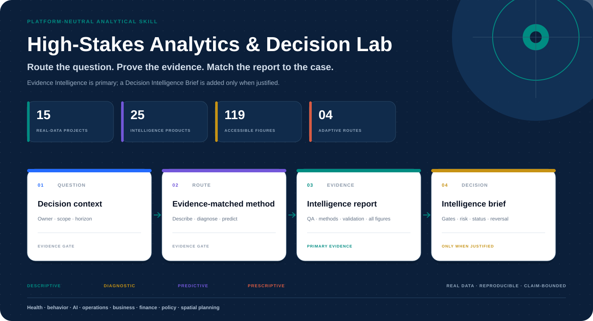
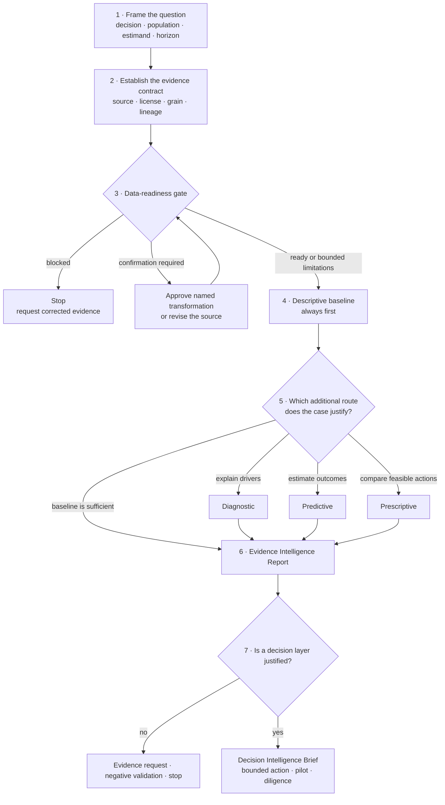
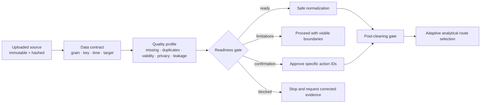
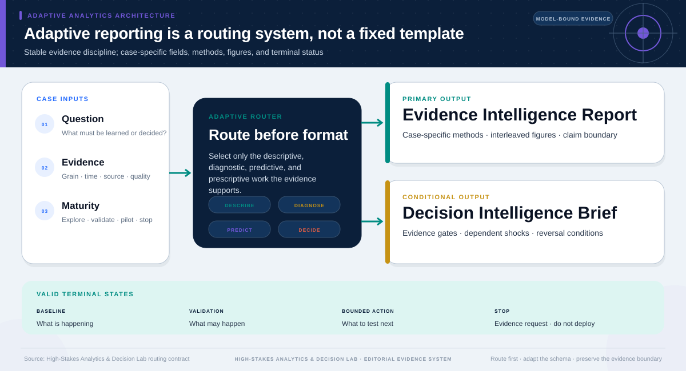
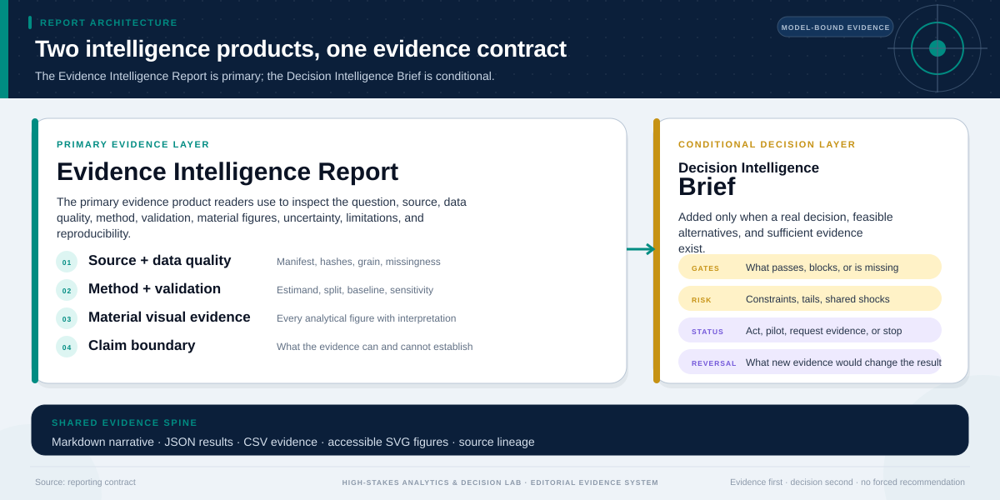
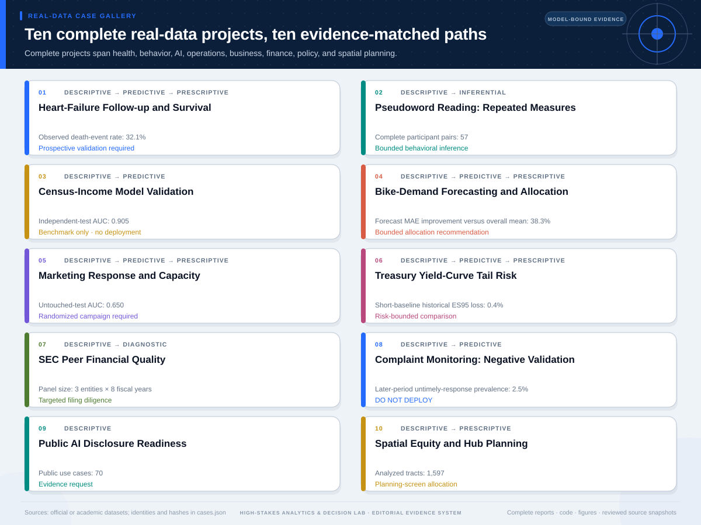

<p align="center">
  
</p>


# High-Stakes Analytics & Decision Lab

A platform-neutral, evidence-constrained Skill for moving from an ambiguous
question to a defensible analysis—and only then, when justified, to action.

## What the Skill does

This Skill turns an ambiguous, consequential question into a reproducible
evidence product and, only when justified, a bounded decision product. It can
start from a question alone or from uploaded row-level data. Instead of
assuming the data are clean, the model is useful, or a recommendation must be
produced, it makes each transition conditional on visible evidence.

| Highlight | Instead of… | The Skill… |
|---|---|---|
| **Evidence first** | Starting with a favorite method | Declares the question, estimand, population, grain, horizon, lineage, and claim boundary |
| **Data readiness** | Silently cleaning until a model runs | Preserves the source, profiles quality and privacy, and pauses on material choices |
| **Adaptive analysis** | Filling one fixed report template | Selects only the descriptive, diagnostic, predictive, or prescriptive work supported |
| **Honest endpoints** | Treating a recommendation as mandatory | Accepts an evidence request, negative validation, `do_not_deploy`, or bounded action |
| **Shared uncertainty** | Disturbing alternatives independently | Retains common time, market, participant, operational, campaign, or spatial shocks |
| **Reproducible evidence** | Separating prose from analysis | Links claims and accessible figures to JSON, CSV, hashes, and rerunnable code |

The contribution is not a newly invented statistical estimator. It is an
adaptive orchestration system for evidence gating, method selection, claim
control, dependent-risk handling, and case-specific analytical communication.

## Quick install

```bash
npx skills add limingrui679-design/high-stakes-analytics-decision-lab -g
```

[See runtime-specific, manual, and no-install options](#install).

<p align="center">
  <a href="#what-the-skill-does"><strong>Overview</strong></a> ·
  <a href="#one-complete-evidence-to-decision-workflow"><strong>Complete workflow</strong></a> ·
  <a href="#messy-data-does-not-go-straight-into-a-model"><strong>Data gate</strong></a> ·
  <a href="#four-adaptive-analytical-routes"><strong>Four routes</strong></a> ·
  <a href="#two-intelligence-products-one-evidence-contract"><strong>Outputs</strong></a> ·
  <a href="#real-projects-ten-complete-evidence-paths"><strong>Real projects</strong></a> ·
  <a href="#use"><strong>Use</strong></a>
</p>

## One complete evidence-to-decision workflow



Routes may be composed rather than chosen exclusively. Across every path, the
fixed evidence spine remains the same:

| Fixed evidence spine | Adaptive case layer |
|---|---|
| Question, population, unit, estimand, and horizon | Route, fields, methods, and validation |
| Source lineage, data-quality status, and reproducibility | Figures, report sections, and decision criteria |
| Uncertainty, limitations, and claim boundary | Bounded action, evidence request, or stopping status |

## Messy data does not go straight into a model



The Skill distinguishes four outcomes instead of silently forcing every file
through cleaning:

| Gate | Meaning | Next step |
|---|---|---|
| `ready` | No material quality failure under the declared contract | Continue |
| `ready_with_documented_limitations` | Localized issues remain | Continue with visible limits |
| `needs_user_confirmation` | A substantive cleaning or privacy choice remains | Pause for named action approval |
| `blocked` | Grain, key, schema, leakage, or another critical failure invalidates the evidence | Stop and request corrected data |

- **Safe automation:** trim surrounding whitespace, normalize declared missing
  sentinels, and canonicalize fully parseable contract-declared numbers or dates.
- **Explicit approval:** deduplication, imputation, deletion, outlier treatment,
  category merging, unit conversion, target correction, or grain changes.
- **Hard stop or pause:** ambiguous headers, ragged records, broken keys,
  invalid types or ranges, unreliable time fields, missing predictive fields,
  leakage, source/plan mismatches, or an undeclared intended use and grain.

[Open the complete Data Quality Gate contract](references/data-quality-gate.md).

## Four adaptive analytical routes

After the evidence passes the readiness gate, the Skill chooses the analytical
path **before** it chooses the report format. Descriptive analysis establishes
the baseline; diagnostic, predictive, and prescriptive modules appear only
when the question, data, and validation boundary justify them.



| Route | Question it answers | Selected fields and methods | Valid endpoint |
|---|---|---|---|
| **Descriptive** | What is happening? | Cohort, denominator, missingness, trend, distribution, segment, and comparison | Baseline report or evidence request |
| **Diagnostic** | Why might it be happening? | Contribution, process, competing explanation, and testable hypothesis | Prioritized explanations with a non-causal boundary |
| **Predictive** | What is likely next? | Target, horizon, split, baseline, discrimination, calibration, error, drift, and uncertainty | Validated prediction, negative validation, or `do_not_deploy` |
| **Prescriptive** | What should be done, if justified? | Decision owner, alternatives, criteria, constraints, dependence, tail risk, sensitivity, and reversal conditions | Bounded recommendation or no decision-ready recommendation |

The routes may stop early or combine. The Skill never fills inapplicable
sections with generic prose.

<details>
<summary><strong>Open the executable method inventory</strong></summary>

- descriptive baselines, trends, cohorts, distributions, and segments;
- diagnostic decomposition and hypothesis generation;
- two-group binary, continuous, and basic survival evidence;
- held-out prediction validation, calibration, subgroup error, and drift;
- rare-event capacity lift and negative model validation;
- small discrete resource-allocation problems;
- multi-criteria decisions under shared shocks and tail risk;
- financial or operational panel diagnostics;
- disclosure and measurement-readiness analysis;
- spatial need and facility-allocation framing.

See [method-routing.md](references/method-routing.md) for selection rules and
[method-modules.md](references/method-modules.md) for executable boundaries.

</details>

## Two intelligence products, one evidence contract

**The Evidence Intelligence Report is the primary evidence product.** It contains
the source and data-quality contract, methods, validation, every material
figure, uncertainty, limitations, and reproducibility.

**The Decision Intelligence Brief is a conditional downstream product.** It
explains what the evidence means for a real decision, including evidence
gates, feasible alternatives, constraints, tail risk, terminal status, and
reversal conditions. It never replaces the Evidence Intelligence Report.



| Report layer | Main question | What the reader receives | When it exists |
|---|---|---|---|
| **Evidence Intelligence Report — primary** | What does the evidence establish? | Data contract, QA, methods, validation, material visual evidence, uncertainty, limitations, source lineage, reproducibility | Every real-data project |
| **Decision Intelligence Brief — conditional** | What action, pilot, diligence, evidence request, or stop follows? | Decision status, evidence gates, alternatives, constraints, dependent shocks, tail risk, sensitivity, reversal conditions | When a decision layer is requested; it may correctly end in non-deployment or no recommendation |

## Real projects: ten complete evidence paths

Every project ships a reviewed real-data snapshot, source manifest and hashes,
download receipt, prepared-data quality report, configuration, runnable code,
machine-readable results, an Evidence Intelligence Report, every analytical
figure, and an independent Decision Intelligence Brief. The single landscape
below shows the portfolio; the table opens each full report.

<p align="center">
  
</p>

| Project | Evidence | Adaptive route | Open artifacts |
|---|---:|---|---|
| Heart-Failure Follow-up Risk and Survival | 299 patient records | descriptive → predictive → prescriptive | [Evidence](examples/real-data-cases/projects/population-health-survival/outputs/report.md) · [Figures](examples/real-data-cases/projects/population-health-survival/outputs/chart-map.json) · [Decision](examples/real-data-cases/projects/population-health-survival/outputs/decision/report/decision-report.md) |
| Pseudoword Reading: Repeated-Measures Inference | 57 paired participants | descriptive → inferential | [Evidence](examples/real-data-cases/projects/behavioral-reading-experiment/outputs/report.md) · [Figures](examples/real-data-cases/projects/behavioral-reading-experiment/outputs/chart-map.json) · [Decision](examples/real-data-cases/projects/behavioral-reading-experiment/outputs/decision/report/decision-report.md) |
| End-to-End Census-Income Model Validation | 48,842 records | descriptive → predictive | [Evidence](examples/real-data-cases/projects/census-income-ai/outputs/report.md) · [Figures](examples/real-data-cases/projects/census-income-ai/outputs/chart-map.json) · [Decision](examples/real-data-cases/projects/census-income-ai/outputs/decision/report/decision-report.md) |
| Bike-Demand Forecasting and Robust Allocation | 17,379 system-hours | descriptive → predictive → prescriptive | [Evidence](examples/real-data-cases/projects/bike-demand-operations/outputs/report.md) · [Figures](examples/real-data-cases/projects/bike-demand-operations/outputs/chart-map.json) · [Decision](examples/real-data-cases/projects/bike-demand-operations/outputs/decision/report/decision-report.md) |
| Marketing Response and Capacity Planning | 41,188 contacts | descriptive → predictive → prescriptive | [Evidence](examples/real-data-cases/projects/bank-marketing-response/outputs/report.md) · [Figures](examples/real-data-cases/projects/bank-marketing-response/outputs/chart-map.json) · [Decision](examples/real-data-cases/projects/bank-marketing-response/outputs/decision/report/decision-report.md) |
| Treasury Yield-Curve Tail-Risk Engineering | 1,500 daily curves | descriptive → predictive → prescriptive | [Evidence](examples/real-data-cases/projects/treasury-risk-engineering/outputs/report.md) · [Figures](examples/real-data-cases/projects/treasury-risk-engineering/outputs/chart-map.json) · [Decision](examples/real-data-cases/projects/treasury-risk-engineering/outputs/decision/report/decision-report.md) |
| Regime-Aware Multi-Asset Portfolio Construction | 5 assets × 2,766 common trading dates | descriptive → diagnostic → predictive → prescriptive | [Evidence](examples/real-data-cases/projects/regime-aware-multi-asset-portfolio/outputs/report.md) · [Figures](examples/real-data-cases/projects/regime-aware-multi-asset-portfolio/outputs/chart-map.json) · [Decision](examples/real-data-cases/projects/regime-aware-multi-asset-portfolio/outputs/decision/report/decision-report.md) |
| Complaint Monitoring and Negative Validation | 13,534 complaints | descriptive → predictive | [Evidence](examples/real-data-cases/projects/cfpb-fintech-complaint-operations/outputs/report.md) · [Figures](examples/real-data-cases/projects/cfpb-fintech-complaint-operations/outputs/chart-map.json) · [`do_not_deploy`](examples/real-data-cases/projects/cfpb-fintech-complaint-operations/outputs/decision/report/decision-report.md) |
| Commercial Real Estate Transactions and Regeneration Risk | 12,399 filtered transactions | descriptive → diagnostic → prescriptive | [Evidence](examples/real-data-cases/projects/commercial-real-estate-risk/outputs/report.md) · [Figures](examples/real-data-cases/projects/commercial-real-estate-risk/outputs/chart-map.json) · [Decision](examples/real-data-cases/projects/commercial-real-estate-risk/outputs/decision/report/decision-report.md) |
| Spatial Equity and Service-Hub Planning | 1,597 analyzed tracts | descriptive → prescriptive | [Evidence](examples/real-data-cases/projects/spatial-equity-planning/outputs/report.md) · [Figures](examples/real-data-cases/projects/spatial-equity-planning/outputs/chart-map.json) · [Decision](examples/real-data-cases/projects/spatial-equity-planning/outputs/decision/report/decision-report.md) |

[Open the complete visual gallery, case cards, and report index](examples/real-data-cases/README.md).

## Editorial evidence system

| Figure layer | Reader-facing rule |
|---|---|
| **Question** | Descriptive title plus a contextual subtitle |
| **Evidence** | Direct values, intervals, benchmarks, or decision boundaries |
| **Reading aid** | Restrained marks, hierarchy, and non-color labels |
| **Boundary** | Adjacent interpretation, limitation, and visible source |
| **Access** | SVG title and description metadata |

[Open the full Editorial Evidence System](references/editorial-visual-system.md)
for palette, chart families, report composition, prohibited shortcuts, and QA.

## Install

High-Stakes Analytics & Decision Lab follows the open `SKILL.md` +
YAML-frontmatter format used by the Agent Skills ecosystem. Install it across
supported runtimes with:

```bash
npx skills add limingrui679-design/high-stakes-analytics-decision-lab -g
```

The installer detects supported agents and places the Skill in the appropriate
global directory. The current CLI package declares Node.js 18 or later; direct
Python workflows target Python 3.10 or later.

<details>
<summary><strong>Runtime targeting, manual installation, and no-install use</strong></summary>

### Target one runtime

```bash
npx skills add limingrui679-design/high-stakes-analytics-decision-lab -g -a codex -y
```

Replace `codex` with `claude-code`, `cursor`, `gemini-cli`, `opencode`,
`openclaw`, `codebuddy`, `hermes-agent`, or another
[supported agent identifier](https://github.com/vercel-labs/skills#supported-agents).

To inspect what the repository exposes before installing:

```bash
npx skills add limingrui679-design/high-stakes-analytics-decision-lab --list
```

### Install manually

Download the
[latest repository ZIP](https://github.com/limingrui679-design/high-stakes-analytics-decision-lab/archive/refs/heads/main.zip)
or clone it:

```bash
git clone https://github.com/limingrui679-design/high-stakes-analytics-decision-lab.git
```

Then place the complete cloned `high-stakes-analytics-decision-lab` directory
in your runtime's global skills directory. The runtime registers the
frontmatter Skill name `high-stakes-analytics-decision-lab`.

| Runtime | Global directory |
|---|---|
| Claude Code | `~/.claude/skills/` |
| Codex | `~/.codex/skills/` |
| Cursor | `~/.cursor/skills/` |
| Gemini CLI | `~/.gemini/skills/` |
| OpenCode | `~/.config/opencode/skills/` |
| OpenClaw | `~/.openclaw/skills/` |
| CodeBuddy | `~/.codebuddy/skills/` |
| Hermes Agent | `~/.hermes/skills/` |

### Use without installing

Generate a temporary prompt with the CLI:

```bash
npx skills use limingrui679-design/high-stakes-analytics-decision-lab@high-stakes-analytics-decision-lab
```

If a runtime cannot load Agent Skills, open
[`SKILL.md`](SKILL.md), paste its contents into the conversation, and provide
the `references/`, `scripts/`, and relevant example files when the agent needs
them. The core bundle remains platform-neutral: Markdown instructions,
standard-library Python, JSON contracts, CSV inputs, and SVG outputs.

</details>

## Use

After installation, ask your agent:

| Need | Example prompt |
|---|---|
| **Analyze a dataset** | “Run the data-readiness gate, propose only safe or explicitly approved preprocessing, and select only methods the evidence supports.” |
| **Build an evidence product** | “Generate an Evidence Intelligence Report. Add a Decision Intelligence Brief only if the evidence and decision context justify one.” |
| **Compare actions** | “Compare these alternatives under shared shocks, tail risk, and explicit constraints. Stop with an evidence request if the case is not decision-ready.” |

<details>
<summary><strong>Named Skill invocation and direct repository commands</strong></summary>

### Named Skill invocation

```text
$high-stakes-analytics-decision-lab
Using a real, redistributable source, turn this question into a complete
descriptive, diagnostic, predictive, and—only if justified—prescriptive
analysis. Gate uploaded data before analysis; preserve source lineage,
validation boundaries, dependent uncertainty, complete visual evidence, and
claim limits.
```

### Run directly from the repository

When only a question is available:

```bash
python3 scripts/route_question.py \
  "How should limited review capacity be allocated?" \
  --scope full \
  --output-dir /absolute/path/to/blueprint
```

When a question and row-level data are available, initialize a reviewable
workspace in one command:

```bash
python3 scripts/init_case.py /absolute/path/to/input.csv \
  --question "Which customers are likely to respond next month?" \
  --output-dir /absolute/path/to/customer-response-workspace
```

This preserves and hash-checks the source, creates a draft data contract, runs
the quality gate, suggests an analytical route, and writes a short workspace
guide. It does not apply cleaning, fit a model, or generate a recommendation.
Add `--contract /absolute/path/to/data-contract.json` when a reviewed contract
already exists.

To run the same stages separately, copy and complete
[`assets/data-contract-template.json`](assets/data-contract-template.json),
then profile a CSV, TSV, JSON, JSONL, or NDJSON source:

```bash
python3 scripts/profile_dataset.py /absolute/path/to/input.csv \
  --contract /absolute/path/to/data-contract.json \
  --output-dir /absolute/path/to/readiness
```

For XLSX, Parquet, database, or multi-table inputs, preserve and hash the
original and create a traceable tabular extract with a conversion receipt,
declared relationships, join checks, and separate original/extract hashes.

Apply safe normalization and only the confirmation-required action IDs the user
has explicitly approved:

```bash
python3 scripts/prepare_dataset.py /absolute/path/to/input.csv \
  --quality-report /absolute/path/to/readiness/data-quality-report.json \
  --cleaning-plan /absolute/path/to/readiness/cleaning-plan.json \
  --approve clean-003 \
  --output-dir /absolute/path/to/prepared
```

Validate and run a decision case:

```bash
python3 scripts/validate_case.py /absolute/path/to/case.json

python3 scripts/run_case.py /absolute/path/to/case.json \
  --output-dir /absolute/path/to/output \
  --samples 10000 \
  --seed 20260726
```

</details>

## Output contract

| Stage | Reader-facing product | Machine-readable evidence | Valid stopping point |
|---|---|---|---|
| **Data readiness** | Quality report and overview figure | Contract, findings, and cleaning plan | `blocked` or confirmation required |
| **Evidence analysis** | Evidence Intelligence Report and material figures | Results and chart map | Evidence request or negative validation |
| **Decision layer** | Conditional Decision Intelligence Brief | Decision results, sensitivity, and risk artifacts | Bounded action, pilot, diligence, or no recommendation |

<details>
<summary><strong>Open the complete file and rebuild contract</strong></summary>

Uploaded row-level data first produce:

```text
data-quality-report.md                   # answer-first readiness decision
data-quality-report.json                 # findings, severity, and gate
data-contract.json                       # grain, key, time, target, privacy
cleaning-plan.json                       # safe vs confirmation-required actions
figures/data-quality-overview.svg        # accessible visual summary

processed/analysis.csv                   # never overwrites the source
transformation-log.json                  # exact actions and affected rows/cells
post-cleaning/                           # complete second quality gate
```

`blocked` and unresolved `needs_user_confirmation` are valid terminal outputs.
The Skill must not generate a downstream analysis that hides either status.

A complete source-backed analytical project produces:

```text
report.md                    # primary Evidence Intelligence Report
results.json                 # machine-readable analytical result
chart-map.json               # figure-to-question and source contract
figures/*.svg                # every material analytical visual
```

When a decision layer is justified, it additionally produces:

```text
decision-report.md
decision-results.json
figures/chart-map.json
figures/*.svg
```

The exact content is case-dependent. A descriptive case will not contain empty
model-validation sections; a weak model may terminate with a deployment
rejection; a disclosure case may request evidence rather than score unobserved
capability.

Rebuild the visual assets, terminal reports, and ten-project gallery:

```bash
python3 scripts/build_readme_visuals.py
python3 scripts/build_terminal_decision_reports.py
python3 scripts/build_case_examples.py
```

</details>

### Verification

Run the complete standalone verification suite:

```bash
python3 -m unittest discover -s tests -v
```

The 67 public tests cover data-readiness safety, custom-workspace
initialization, the command-line round-trip,
routing, the decision engine, ten-project source hashes, the evidence
contract, independent numerical benchmarks, properties, extreme inputs,
package naming, links, and SVG accessibility.
Synthetic files under `tests/fixtures/` are engineering fixtures only; they are
not presented as real-data projects.

## Skill contents

```text
high-stakes-analytics-decision-lab/
├── SKILL.md
├── README.md
├── LICENSE.txt
├── agents/
├── assets/                         # data/case contracts + README visuals
├── examples/real-data-cases/       # ten complete reproducible projects
├── references/                     # quality, methods, evidence, reporting, visuals
├── scripts/                        # profiling, preparation, analysis, decision
└── tests/                          # complete 67-test standalone regression suite
```

Start with [SKILL.md](SKILL.md). It defines the complete workflow, evidence
gates, output contract, and responsible-use boundary.

## Responsible-use boundary

These projects demonstrate analytical and decision-research discipline. They
are not medical advice, investment advice, an assurance opinion, a regulatory
finding, a deployment authorization, or a real operating recommendation.
Each report states what the evidence cannot establish and what would reverse a
provisional conclusion.

Licensed under [MIT](LICENSE.txt). Dataset licenses and source terms remain
their own and are recorded project by project.
