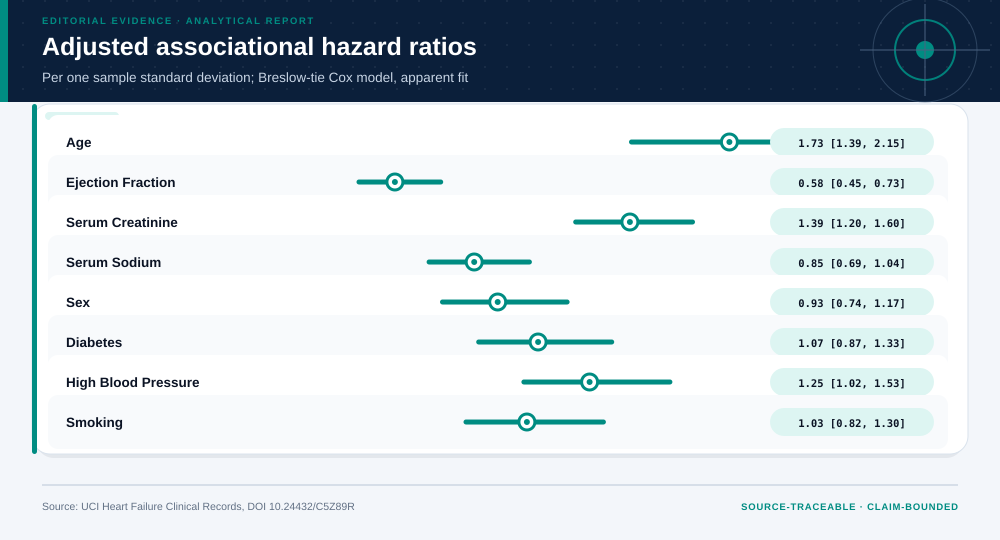
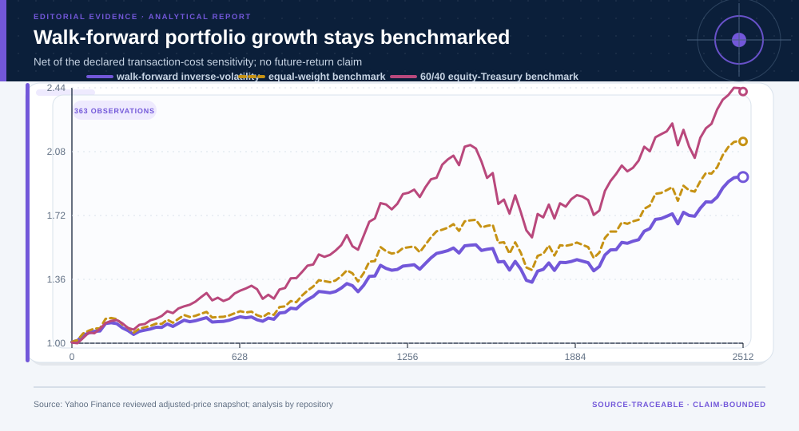
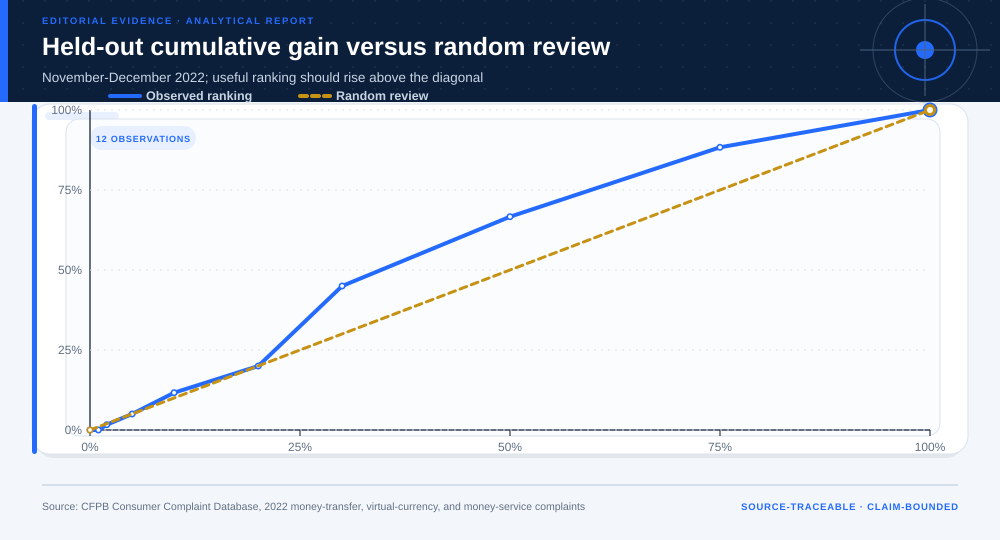

# Ten Complete Real-Data Projects

## Technical summary

The ten projects share one evidence spine but do not share one report template.
Each route changes the methods, validation, figures, and valid endpoint.

| Fixed across projects | Adapted to the case | Valid endpoints |
|---|---|---|
| Source lineage, data quality, uncertainty, limitations, and reproducibility | Descriptive, inferential, diagnostic, predictive, or prescriptive modules | Bounded action, non-deployment, diligence request, evidence request, or no decision |

The **Evidence Intelligence Report** remains the primary product. A separate
Decision Intelligence Brief appears only when a decision layer is justified.

<p align="center">
  
</p>

The overview should be read as a routing map. It shows why some cases end in a
bounded recommendation while others end in negative validation, a diligence
request, or an evidence request.

<details>
<summary><strong>What every complete project bundles</strong></summary>

```text
projects/
├── _shared/                 # shared standard-library analytical runtime
├── project-catalog.json     # ten-project machine-readable index
└── <project-id>/
    ├── PROJECT.md
    ├── source-manifest.json
    ├── config.json
    ├── download_data.py
    ├── prepare_data.py
    ├── analyze.py
    ├── build_decision_case.py
    ├── data/                # reviewed raw snapshot, prepared data, dictionary, quality
    └── outputs/             # evidence report, decision brief, figures, results
```

</details>

## Evidence Intelligence index

| Project | Domain and headline evidence | Adaptive route | Open artifacts |
|---|---|---|---|
| 01 · Heart-Failure Follow-up Risk and Survival | Population health<br>Observed death-event rate: 32.1% | descriptive → predictive → prescriptive | [Evidence](projects/population-health-survival/outputs/report.md) · [Card](cases/01-health-survival.md) · [Decision](projects/population-health-survival/outputs/decision/report/decision-report.md) |
| 02 · Pseudoword Reading: Repeated-Measures Inference | Behavioral science<br>Complete participant pairs: 57 | descriptive → inferential | [Evidence](projects/behavioral-reading-experiment/outputs/report.md) · [Card](cases/02-behavioral-repeated-measures.md) · [Decision](projects/behavioral-reading-experiment/outputs/decision/report/decision-report.md) |
| 03 · End-to-End Census-Income Model Validation | Responsible AI<br>Independent-test AUC: 0.905 | descriptive → predictive | [Evidence](projects/census-income-ai/outputs/report.md) · [Card](cases/03-responsible-model-validation.md) · [Decision](projects/census-income-ai/outputs/decision/report/decision-report.md) |
| 04 · Bike-Demand Forecasting and Robust Allocation | Operations research<br>Forecast MAE improvement versus overall mean: 38.3% | descriptive → predictive → prescriptive | [Evidence](projects/bike-demand-operations/outputs/report.md) · [Card](cases/04-forecast-allocation.md) · [Decision](projects/bike-demand-operations/outputs/decision/report/decision-report.md) |
| 05 · Marketing Response and Capacity Planning | Business analytics<br>Untouched-test AUC: 0.650 | descriptive → predictive → prescriptive | [Evidence](projects/bank-marketing-response/outputs/report.md) · [Card](cases/05-marketing-capacity.md) · [Decision](projects/bank-marketing-response/outputs/decision/report/decision-report.md) |
| 06 · Treasury Yield-Curve Tail-Risk Engineering | Financial risk<br>Short-baseline historical ES95 loss: 0.4% | descriptive → predictive → prescriptive | [Evidence](projects/treasury-risk-engineering/outputs/report.md) · [Card](cases/06-treasury-tail-risk.md) · [Decision](projects/treasury-risk-engineering/outputs/decision/report/decision-report.md) |
| 07 · Regime-Aware Multi-Asset Portfolio Construction | Asset allocation and financial risk<br>Walk-forward evaluation: 2,513 trading days | descriptive → diagnostic → predictive → prescriptive | [Evidence](projects/regime-aware-multi-asset-portfolio/outputs/report.md) · [Card](cases/07-multi-asset-portfolio.md) · [Decision](projects/regime-aware-multi-asset-portfolio/outputs/decision/report/decision-report.md) |
| 08 · Privacy-Preserving Complaint Monitoring and Negative Validation | Financial technology<br>Later-period untimely-response prevalence: 2.5% | descriptive → predictive | [Evidence](projects/cfpb-fintech-complaint-operations/outputs/report.md) · [Card](cases/08-fintech-negative-validation.md) · [Decision](projects/cfpb-fintech-complaint-operations/outputs/decision/report/decision-report.md) |
| 09 · Commercial Real Estate Transactions and Regeneration Risk | Real-estate finance and planning<br>Filtered transactions: 12,399 | descriptive → diagnostic → prescriptive | [Evidence](projects/commercial-real-estate-risk/outputs/report.md) · [Card](cases/09-commercial-real-estate-risk.md) · [Decision](projects/commercial-real-estate-risk/outputs/decision/report/decision-report.md) |
| 10 · Spatial Equity and Service-Hub Planning | Urban planning<br>Analyzed tracts: 1,597 | descriptive → prescriptive | [Evidence](projects/spatial-equity-planning/outputs/report.md) · [Card](cases/10-spatial-service-planning.md) · [Decision](projects/spatial-equity-planning/outputs/decision/report/decision-report.md) |

## Optional visual gallery

The index above is the default reading path. Open the gallery only when a
visual comparison across all ten projects is useful.

<details>
<summary><strong>Open ten representative visuals and claim boundaries</strong></summary>

<table>
<tr>
<td width="50%">
  <a href="projects/population-health-survival/outputs/report.md">
    
  </a>
  <br><strong>01 · Heart-Failure Follow-up Risk and Survival</strong>
  <br>Low ejection fraction is associated with higher observed risk; censoring-aware analysis supports external triage validation, not a treatment recommendation.
  <br><em>Boundary:</em> Small observational cohort, incomplete treatment information, analyst-defined thresholds, and no causal treatment estimand.
  <br><a href="cases/01-health-survival.md">Case card</a> · <a href="projects/population-health-survival/outputs/report.md">Evidence Intelligence Report</a>
  · <a href="projects/population-health-survival/outputs/decision/report/decision-report.md">Decision Intelligence Brief</a>
</td>
<td width="50%">
  <a href="projects/behavioral-reading-experiment/outputs/report.md">
    
  </a>
  <br><strong>02 · Pseudoword Reading: Repeated-Measures Inference</strong>
  <br>Pseudoword passages increase fixation-duration burden; paired analysis preserves the repeated-measures design and exposes group heterogeneity.
  <br><em>Boundary:</em> The public sample is small and does not establish downstream educational outcomes or an intervention effect.
  <br><a href="cases/02-behavioral-repeated-measures.md">Case card</a> · <a href="projects/behavioral-reading-experiment/outputs/report.md">Evidence Intelligence Report</a>
  · <a href="projects/behavioral-reading-experiment/outputs/decision/report/decision-report.md">Decision Intelligence Brief</a>
</td>
</tr>
<tr>
<td width="50%">
  <a href="projects/census-income-ai/outputs/report.md">
    
  </a>
  <br><strong>03 · End-to-End Census-Income Model Validation</strong>
  <br>The sparse logistic model improves on the baselines, but calibration and subgroup errors prevent consequential reuse.
  <br><em>Boundary:</em> Historical 1994 data, missing categories, social-structure shift, and no validation for a real eligibility decision.
  <br><a href="cases/03-responsible-model-validation.md">Case card</a> · <a href="projects/census-income-ai/outputs/report.md">Evidence Intelligence Report</a>
  · <a href="projects/census-income-ai/outputs/decision/report/decision-report.md">Decision Intelligence Brief</a>
</td>
<td width="50%">
  <a href="projects/bike-demand-operations/outputs/report.md">
    
  </a>
  <br><strong>04 · Bike-Demand Forecasting and Robust Allocation</strong>
  <br>A robust time-block allocation reduces modeled unmet demand out of time, while the perfect-information bound limits the value of further forecast improvement.
  <br><em>Boundary:</em> System totals omit station imbalance, routing, labor, service time, and causal effects; resource units are illustrative scalers.
  <br><a href="cases/04-forecast-allocation.md">Case card</a> · <a href="projects/bike-demand-operations/outputs/report.md">Evidence Intelligence Report</a>
  · <a href="projects/bike-demand-operations/outputs/decision/report/decision-report.md">Decision Intelligence Brief</a>
</td>
</tr>
<tr>
<td width="50%">
  <a href="projects/bank-marketing-response/outputs/report.md">
    
  </a>
  <br><strong>05 · Marketing Response and Capacity Planning</strong>
  <br>Pre-contact features weakly concentrate observed responses; common campaign shocks are preserved across capacity options.
  <br><em>Boundary:</em> Observed response concentration is not incremental lift, causal treatment effect, profit, or return on outreach.
  <br><a href="cases/05-marketing-capacity.md">Case card</a> · <a href="projects/bank-marketing-response/outputs/report.md">Evidence Intelligence Report</a>
  · <a href="projects/bank-marketing-response/outputs/decision/report/decision-report.md">Decision Intelligence Brief</a>
</td>
<td width="50%">
  <a href="projects/treasury-risk-engineering/outputs/report.md">
    
  </a>
  <br><strong>06 · Treasury Yield-Curve Tail-Risk Engineering</strong>
  <br>Longer-duration allocations show materially larger historical tail losses; the short allocation remains the risk reference.
  <br><em>Boundary:</em> First-order duration omits convexity, security selection, costs, financing, taxes, liquidity, and future-regime uncertainty.
  <br><a href="cases/06-treasury-tail-risk.md">Case card</a> · <a href="projects/treasury-risk-engineering/outputs/report.md">Evidence Intelligence Report</a>
  · <a href="projects/treasury-risk-engineering/outputs/decision/report/decision-report.md">Decision Intelligence Brief</a>
</td>
</tr>
<tr>
<td width="50%">
  <a href="projects/regime-aware-multi-asset-portfolio/outputs/report.md">
    
  </a>
  <br><strong>07 · Regime-Aware Multi-Asset Portfolio Construction</strong>
  <br>The bounded adaptive rule reduced historical drawdown and tail loss relative to both benchmarks and had the highest return-to-volatility ratio, but it did not maximize sampled mean return.
  <br><em>Boundary:</em> Provider terms apply; ETF histories omit future regimes, taxes, bid-ask spreads, impact, investor liabilities, capacity, and suitability.
  <br><a href="cases/07-multi-asset-portfolio.md">Case card</a> · <a href="projects/regime-aware-multi-asset-portfolio/outputs/report.md">Evidence Intelligence Report</a>
  · <a href="projects/regime-aware-multi-asset-portfolio/outputs/decision/report/decision-report.md">Decision Intelligence Brief</a>
</td>
<td width="50%">
  <a href="projects/cfpb-fintech-complaint-operations/outputs/report.md">
    
  </a>
  <br><strong>08 · Privacy-Preserving Complaint Monitoring and Negative Validation</strong>
  <br>The model contains weak statistical signal but no reliable operational ranking gain at tested review capacities.
  <br><em>Boundary:</em> The timely flag is not complaint merit, harm, resolution quality, company quality, or compliance; the 2022 model may not transport.
  <br><a href="cases/08-fintech-negative-validation.md">Case card</a> · <a href="projects/cfpb-fintech-complaint-operations/outputs/report.md">Evidence Intelligence Report</a>
  · <a href="projects/cfpb-fintech-complaint-operations/outputs/decision/report/decision-report.md">Decision Intelligence Brief</a>
</td>
</tr>
<tr>
<td width="50%">
  <a href="projects/commercial-real-estate-risk/outputs/report.md">
    
  </a>
  <br><strong>09 · Commercial Real Estate Transactions and Regeneration Risk</strong>
  <br>Public transactions support a market-depth screen and financing evidence request, not property valuation or acquisition.
  <br><em>Boundary:</em> The source does not establish arm's-length status, NOI, expenses, occupancy, condition, appraisal value, debt terms, or causal regeneration effects.
  <br><a href="cases/09-commercial-real-estate-risk.md">Case card</a> · <a href="projects/commercial-real-estate-risk/outputs/report.md">Evidence Intelligence Report</a>
  · <a href="projects/commercial-real-estate-risk/outputs/decision/report/decision-report.md">Decision Intelligence Brief</a>
</td>
<td width="50%">
  <a href="projects/spatial-equity-planning/outputs/report.md">
    
  </a>
  <br><strong>10 · Spatial Equity and Service-Hub Planning</strong>
  <br>Need is spatially clustered, and a composite allocation balances poverty, transit dependence, and housing pressure better than a single-indicator rule.
  <br><em>Boundary:</em> Straight-line centroid distance and tract aggregates are screening approximations; travel time, site feasibility, capacity, and ACS uncertainty require local review.
  <br><a href="cases/10-spatial-service-planning.md">Case card</a> · <a href="projects/spatial-equity-planning/outputs/report.md">Evidence Intelligence Report</a>
  · <a href="projects/spatial-equity-planning/outputs/decision/report/decision-report.md">Decision Intelligence Brief</a>
</td>
</tr>
</table>

</details>

## Machine-readable evidence

[`cases.json`](cases.json) is the canonical case index. It records the sources,
reviewed snapshot hashes, data grain, methods, metrics, result, terminal
output, interpretation boundary, and representative figure for every case.
The generator checks the bundled raw files against those hashes and each
project's source manifest before rebuilding the navigation layer.

<details>
<summary><strong>Regenerate the cards, landscape, and index</strong></summary>

Regenerate the individual cards and overview:

```bash
python3 ../../scripts/build_case_examples.py
```

</details>

## Reuse rule

Reuse the method contract, not a saved result. A different source, population,
time window, objective, constraint, or decision owner requires new evidence
and a new validation path.
