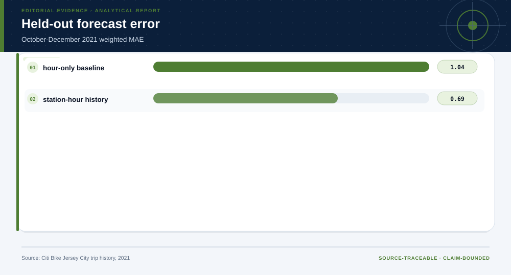
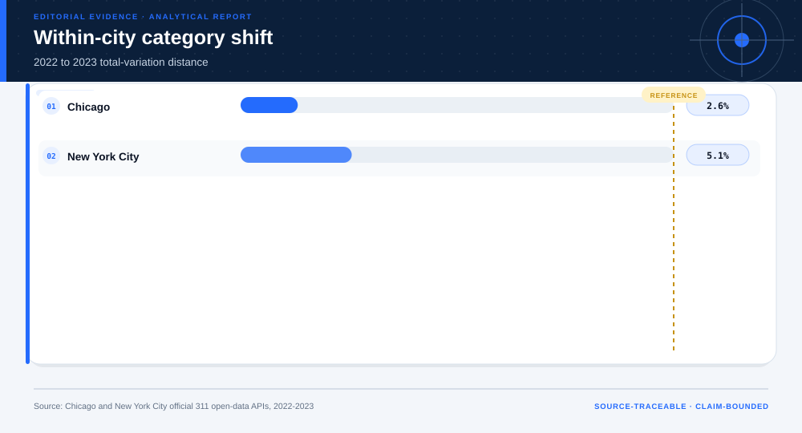
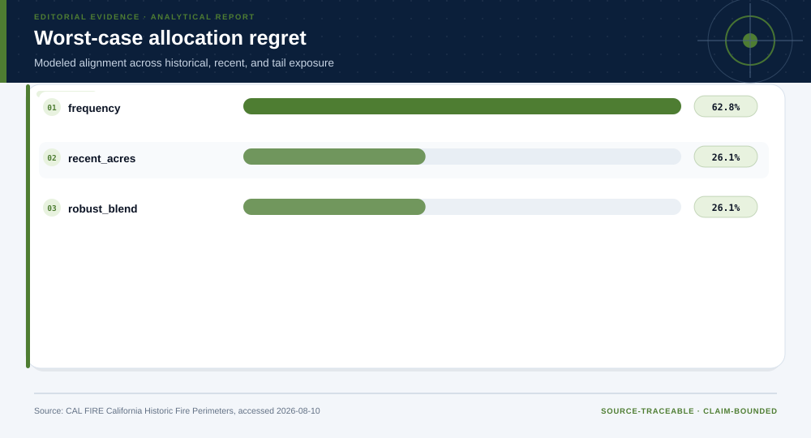
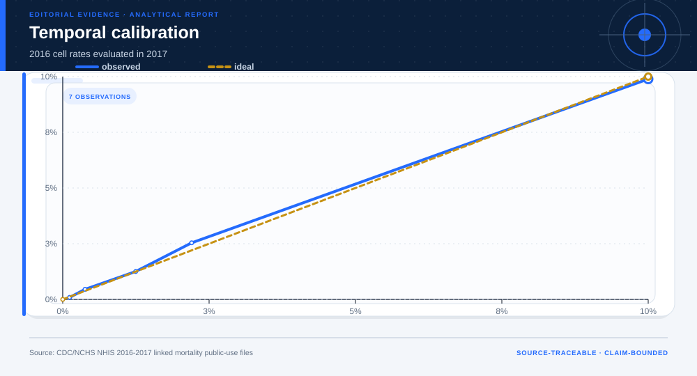
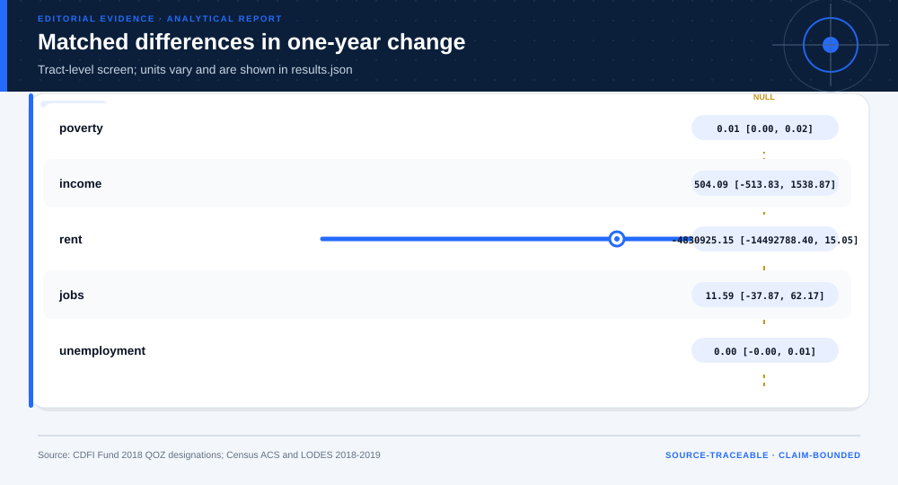
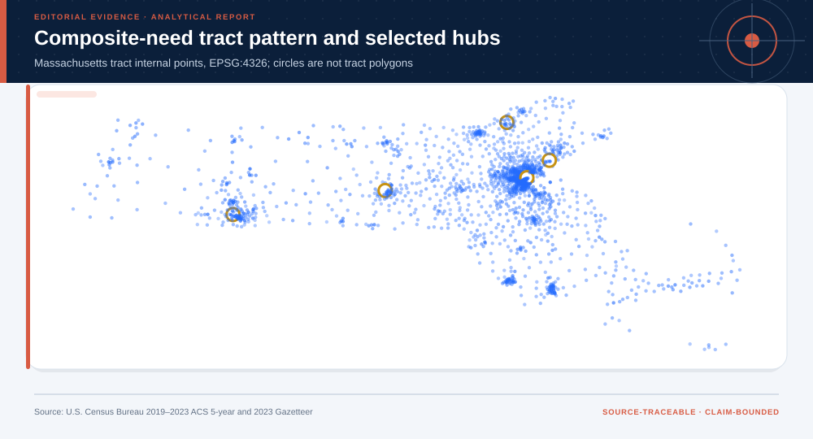

# Fifteen Complete Real-Data Projects

## Technical summary

The fifteen projects share one evidence spine but do not share one report template.
Each route changes the methods, validation, figures, and valid endpoint.

| Fixed across projects | Adapted to the case | Valid endpoints |
|---|---|---|
| Source lineage, data quality, uncertainty, limitations, and reproducibility | Descriptive, inferential, diagnostic, predictive, or prescriptive modules | Bounded action, non-deployment, diligence request, evidence request, or no decision |

The **Evidence Intelligence Report** remains the primary product. A separate
Decision Intelligence Brief appears only when a decision layer is justified.

<p align="center">
  
</p>

The overview should be read as a routing map. It shows why some cases end in a
bounded recommendation while others end in negative validation, a diligence
request, or an evidence request.

<details>
<summary><strong>What every complete project bundles</strong></summary>

```text
projects/
├── _shared/                 # shared standard-library analytical runtime
├── project-catalog.json     # fifteen-project machine-readable index
└── <project-id>/
    ├── PROJECT.md
    ├── source-manifest.json
    ├── config.json
    ├── download_data.py
    ├── prepare_data.py
    ├── analyze.py
    ├── build_decision_case.py
    ├── data/                # reviewed raw snapshot, prepared data, dictionary, quality
    └── outputs/             # evidence report, decision brief, figures, results
```

</details>

## Evidence Intelligence index

| Project | Domain and headline evidence | Adaptive route | Open artifacts |
|---|---|---|---|
| 01 · Jersey City Bike Demand and Rebalancing Evidence | Operations Research<br>Held-out station-hour MAE: 0.69 pickups/day | descriptive → predictive → prescriptive | [Evidence](projects/bike-demand-operations/outputs/report.md) · [Card](cases/01-bike-demand-operations.md) · [Decision](projects/bike-demand-operations/outputs/decision/report/decision-report.md) |
| 02 · Cross-City 311 Distribution Shift and Transfer Gate | Urban Analytics<br>Cross-city 2023 total-variation distance: 58.1% | descriptive → diagnostic → decision | [Evidence](projects/cross-city-311-shift/outputs/report.md) · [Card](cases/02-cross-city-311-shift.md) · [Terminal result](projects/cross-city-311-shift/outputs/results.json) |
| 03 · Capacity-Constrained Marketing Pilot | Business Analytics<br>Untouched-test AUC: 0.650 | descriptive → predictive → prescriptive | [Evidence](projects/bank-marketing-response/outputs/report.md) · [Card](cases/03-bank-marketing-response.md) · [Decision](projects/bank-marketing-response/outputs/decision/report/decision-report.md) |
| 04 · ACS Employment AI Temporal Transport and Audit | Artificial Intelligence<br>2023 temporal-test AUC: 0.640 | descriptive → predictive | [Evidence](projects/census-income-ai/outputs/report.md) · [Card](cases/04-census-income-ai.md) · [Decision](projects/census-income-ai/outputs/decision/report/decision-report.md) |
| 05 · Treasury Curve and Tail-Risk Decision Engine | Financial Risk Engineering<br>Short-baseline historical ES95 loss: 0.4% | descriptive → predictive → prescriptive | [Evidence](projects/treasury-risk-engineering/outputs/report.md) · [Card](cases/05-treasury-risk-engineering.md) · [Decision](projects/treasury-risk-engineering/outputs/decision/report/decision-report.md) |
| 06 · Human-in-the-Loop Complaint Triage Information System | Financial Technology<br>Later-period untimely-response prevalence: 2.5% | descriptive → predictive | [Evidence](projects/cfpb-fintech-complaint-operations/outputs/report.md) · [Card](cases/06-cfpb-fintech-complaint-operations.md) · [Decision](projects/cfpb-fintech-complaint-operations/outputs/decision/report/decision-report.md) |
| 07 · Commercial Real Estate Diligence Decision Product | Real-Estate Finance<br>Filtered transactions: 12,399 | descriptive → diagnostic → prescriptive | [Evidence](projects/commercial-real-estate-risk/outputs/report.md) · [Card](cases/07-commercial-real-estate-risk.md) · [Decision](projects/commercial-real-estate-risk/outputs/decision/report/decision-report.md) |
| 08 · Wildfire Mitigation Evidence Allocation Under Uncertainty | Decision Analysis<br>Valid mapped perimeters: 8,892 | descriptive → diagnostic → decision | [Evidence](projects/wildfire-mitigation-under-uncertainty/outputs/report.md) · [Card](cases/08-wildfire-mitigation-under-uncertainty.md) · [Terminal result](projects/wildfire-mitigation-under-uncertainty/outputs/results.json) |
| 09 · SEC N-PORT Liquidity and Crowding Filing Review | Regulatory Filings<br>Reviewed fund filings: 11,747 | descriptive → diagnostic → predictive → prescriptive | [Evidence](projects/sec-nport-filing-review/outputs/report.md) · [Card](cases/09-sec-nport-filing-review.md) · [Decision](projects/sec-nport-filing-review/outputs/decision/report/decision-report.md) |
| 10 · Social-Norm Field Experiment with Household-Clustered Inference | Field Experiments<br>Source individuals analyzed: 344,084 | descriptive → diagnostic → decision | [Evidence](projects/social-norm-field-experiment/outputs/report.md) · [Card](cases/10-social-norm-field-experiment.md) · [Terminal result](projects/social-norm-field-experiment/outputs/results.json) |
| 11 · Population Health Risk Transport Across NHIS Cohorts | Population Health<br>2017 temporal-test AUC: 0.846 | descriptive → predictive → prescriptive | [Evidence](projects/population-health-survival/outputs/report.md) · [Card](cases/11-population-health-survival.md) · [Decision](projects/population-health-survival/outputs/decision/report/decision-report.md) |
| 12 · Opportunity Zone One-Year Policy Evidence Screen | Public Policy<br>Complete tract panels: 1,460 | descriptive → diagnostic → decision | [Evidence](projects/opportunity-zone-policy-evaluation/outputs/report.md) · [Card](cases/12-opportunity-zone-policy-evaluation.md) · [Terminal result](projects/opportunity-zone-policy-evaluation/outputs/results.json) |
| 13 · Small-Sample Repeated-Measures Inference | Statistics<br>Complete participant pairs: 57 | descriptive → inferential | [Evidence](projects/behavioral-reading-experiment/outputs/report.md) · [Card](cases/13-behavioral-reading-experiment.md) · [Decision](projects/behavioral-reading-experiment/outputs/decision/report/decision-report.md) |
| 14 · NHANES Mortality Transportability and Population Inequality | Biostatistics<br>External-cohort AUC: 0.804 | descriptive → diagnostic → decision | [Evidence](projects/nhanes-population-transportability/outputs/report.md) · [Card](cases/14-nhanes-population-transportability.md) · [Terminal result](projects/nhanes-population-transportability/outputs/results.json) |
| 15 · Spatial Equity Planning with Transit and Site-Evidence Gates | Urban Planning<br>Analyzed Massachusetts tracts: 1,597 | descriptive → prescriptive | [Evidence](projects/spatial-equity-planning/outputs/report.md) · [Card](cases/15-spatial-equity-planning.md) · [Decision](projects/spatial-equity-planning/outputs/decision/report/decision-report.md) |

## Optional visual gallery

The index above is the default reading path. Open the gallery only when a
visual comparison across all fifteen projects is useful.

<details>
<summary><strong>Open fifteen representative visuals and claim boundaries</strong></summary>

<table>
<tr>
<td width="50%">
  <a href="projects/bike-demand-operations/outputs/report.md">
    
  </a>
  <br><strong>01 · Jersey City Bike Demand and Rebalancing Evidence</strong>
  <br>Held-out station-hour MAE is 0.69 pickups/day, a 33.1% improvement over the hour-only baseline.
  <br><em>Boundary:</em> Rebalancing outcomes are modeled; no stockout, routing, labor, or achieved-service claim.
  <br><a href="cases/01-bike-demand-operations.md">Case card</a> · <a href="projects/bike-demand-operations/outputs/report.md">Evidence Intelligence Report</a>
  · <a href="projects/bike-demand-operations/outputs/decision/report/decision-report.md">Decision Intelligence Brief</a>
</td>
<td width="50%">
  <a href="projects/cross-city-311-shift/outputs/report.md">
    
  </a>
  <br><strong>02 · Cross-City 311 Distribution Shift and Transfer Gate</strong>
  <br>The 2023 cross-city total-variation distance is 58.1%, and the transfer gate is refused.
  <br><em>Boundary:</em> Administrative shift audit only; requests are not latent need or service quality.
  <br><a href="cases/02-cross-city-311-shift.md">Case card</a> · <a href="projects/cross-city-311-shift/outputs/report.md">Evidence Intelligence Report</a>
  · <a href="projects/cross-city-311-shift/outputs/results.json">Terminal result</a>
</td>
</tr>
<tr>
<td width="50%">
  <a href="projects/bank-marketing-response/outputs/report.md">
    
  </a>
  <br><strong>03 · Capacity-Constrained Marketing Pilot</strong>
  <br>The untouched test yields an AUC of 0.650 and a Brier score of 0.210; the top 5% captures 7.4% of observed responses.
  <br><em>Boundary:</em> Observed response concentration is not incremental lift, causal treatment effect, profit, or return on outreach.
  <br><a href="cases/03-bank-marketing-response.md">Case card</a> · <a href="projects/bank-marketing-response/outputs/report.md">Evidence Intelligence Report</a>
  · <a href="projects/bank-marketing-response/outputs/decision/report/decision-report.md">Decision Intelligence Brief</a>
</td>
<td width="50%">
  <a href="projects/census-income-ai/outputs/report.md">
    
  </a>
  <br><strong>04 · ACS Employment AI Temporal Transport and Audit</strong>
  <br>The untouched 2023 temporal test yields an AUC of 0.640 and a weighted Brier score of 0.158.
  <br><em>Boundary:</em> No eligibility, hiring, credit, benefits, or other consequential action.
  <br><a href="cases/04-census-income-ai.md">Case card</a> · <a href="projects/census-income-ai/outputs/report.md">Evidence Intelligence Report</a>
  · <a href="projects/census-income-ai/outputs/decision/report/decision-report.md">Decision Intelligence Brief</a>
</td>
</tr>
<tr>
<td width="50%">
  <a href="projects/treasury-risk-engineering/outputs/report.md">
    
  </a>
  <br><strong>05 · Treasury Curve and Tail-Risk Decision Engine</strong>
  <br>Historical ES95 loss rises from 0.4% for the short baseline to 0.9% for the long-duration portfolio; the short-baseline rolling VaR exceedance rate is 6.0%.
  <br><em>Boundary:</em> First-order duration omits convexity, security selection, costs, financing, taxes, liquidity, and future-regime uncertainty.
  <br><a href="cases/05-treasury-risk-engineering.md">Case card</a> · <a href="projects/treasury-risk-engineering/outputs/report.md">Evidence Intelligence Report</a>
  · <a href="projects/treasury-risk-engineering/outputs/decision/report/decision-report.md">Decision Intelligence Brief</a>
</td>
<td width="50%">
  <a href="projects/cfpb-fintech-complaint-operations/outputs/report.md">
    
  </a>
  <br><strong>06 · Human-in-the-Loop Complaint Triage Information System</strong>
  <br>The later-period AUC is 0.611 (block-bootstrap 95% interval 0.539 to 0.697), while top-5% lift is 1.00 (95% interval 0.33 to 2.46); the ranking model fails the deployment gate.
  <br><em>Boundary:</em> The timely flag is not complaint merit, harm, resolution quality, company quality, or compliance; the 2022 model may not transport.
  <br><a href="cases/06-cfpb-fintech-complaint-operations.md">Case card</a> · <a href="projects/cfpb-fintech-complaint-operations/outputs/report.md">Evidence Intelligence Report</a>
  · <a href="projects/cfpb-fintech-complaint-operations/outputs/decision/report/decision-report.md">Decision Intelligence Brief</a>
</td>
</tr>
<tr>
<td width="50%">
  <a href="projects/commercial-real-estate-risk/outputs/report.md">
    
  </a>
  <br><strong>07 · Commercial Real Estate Diligence Decision Product</strong>
  <br>Across 12,399 filtered commercial transactions, Manhattan has the highest borough median price per square foot at $743; the break-even cap rate at 8.5% debt is 7.5%.
  <br><em>Boundary:</em> The source does not establish arm's-length status, NOI, expenses, occupancy, condition, appraisal value, debt terms, or causal regeneration effects.
  <br><a href="cases/07-commercial-real-estate-risk.md">Case card</a> · <a href="projects/commercial-real-estate-risk/outputs/report.md">Evidence Intelligence Report</a>
  · <a href="projects/commercial-real-estate-risk/outputs/decision/report/decision-report.md">Decision Intelligence Brief</a>
</td>
<td width="50%">
  <a href="projects/wildfire-mitigation-under-uncertainty/outputs/report.md">
    
  </a>
  <br><strong>08 · Wildfire Mitigation Evidence Allocation Under Uncertainty</strong>
  <br>Across 8,892 valid mapped perimeters, recent observed acres is the lowest-regret proxy allocation under the tested scenarios.
  <br><em>Boundary:</em> No fires-prevented or acres-prevented estimate; mitigation action blocked pending effectiveness and feasibility evidence.
  <br><a href="cases/08-wildfire-mitigation-under-uncertainty.md">Case card</a> · <a href="projects/wildfire-mitigation-under-uncertainty/outputs/report.md">Evidence Intelligence Report</a>
  · <a href="projects/wildfire-mitigation-under-uncertainty/outputs/results.json">Terminal result</a>
</td>
</tr>
<tr>
<td width="50%">
  <a href="projects/sec-nport-filing-review/outputs/report.md">
    
  </a>
  <br><strong>09 · SEC N-PORT Liquidity and Crowding Filing Review</strong>
  <br>Across 11,747 reviewed filings, median top-10 holding concentration is 34.5% and the 90th-percentile Level-3 share is 0.2%.
  <br><em>Boundary:</em> Filing review only; no expected-return, suitability, fund-quality, or investment recommendation.
  <br><a href="cases/09-sec-nport-filing-review.md">Case card</a> · <a href="projects/sec-nport-filing-review/outputs/report.md">Evidence Intelligence Report</a>
  · <a href="projects/sec-nport-filing-review/outputs/decision/report/decision-report.md">Decision Intelligence Brief</a>
</td>
<td width="50%">
  <a href="projects/social-norm-field-experiment/outputs/report.md">
    
  </a>
  <br><strong>10 · Social-Norm Field Experiment with Household-Clustered Inference</strong>
  <br>The Neighbors arm has the largest observed intent-to-treat effect at 8.1%, with a household-clustered 95% interval of 7.5% to 8.8%.
  <br><em>Boundary:</em> Causal scope is the historical randomized experiment; no new campaign authorization.
  <br><a href="cases/10-social-norm-field-experiment.md">Case card</a> · <a href="projects/social-norm-field-experiment/outputs/report.md">Evidence Intelligence Report</a>
  · <a href="projects/social-norm-field-experiment/outputs/results.json">Terminal result</a>
</td>
</tr>
<tr>
<td width="50%">
  <a href="projects/population-health-survival/outputs/report.md">
    
  </a>
  <br><strong>11 · Population Health Risk Transport Across NHIS Cohorts</strong>
  <br>The 2017 temporal test yields an AUC of 0.846 and weighted two-year mortality of 2.32% across 58,754 linked adults.
  <br><em>Boundary:</em> Population-risk validation only; no individual diagnosis, treatment, or clinical deployment.
  <br><a href="cases/11-population-health-survival.md">Case card</a> · <a href="projects/population-health-survival/outputs/report.md">Evidence Intelligence Report</a>
  · <a href="projects/population-health-survival/outputs/decision/report/decision-report.md">Decision Intelligence Brief</a>
</td>
<td width="50%">
  <a href="projects/opportunity-zone-policy-evaluation/outputs/report.md">
    
  </a>
  <br><strong>12 · Opportunity Zone One-Year Policy Evidence Screen</strong>
  <br>The matched one-year screen contains 1,460 complete tract panels, including 138 designated QOZ tracts and 121 unique matched controls.
  <br><em>Boundary:</em> Associational one-year screen; no causal effect because parallel trends are unavailable.
  <br><a href="cases/12-opportunity-zone-policy-evaluation.md">Case card</a> · <a href="projects/opportunity-zone-policy-evaluation/outputs/report.md">Evidence Intelligence Report</a>
  · <a href="projects/opportunity-zone-policy-evaluation/outputs/results.json">Terminal result</a>
</td>
</tr>
<tr>
<td width="50%">
  <a href="projects/behavioral-reading-experiment/outputs/report.md">
    
  </a>
  <br><strong>13 · Small-Sample Repeated-Measures Inference</strong>
  <br>Across 57 complete participant pairs, the mean pseudoword-minus-meaningful fixation-duration difference is 34.25 (bootstrap 95% interval 25.87 to 43.35), with a Holm-adjusted sign-flip p-value of 0.0003.
  <br><em>Boundary:</em> The public sample is small and does not establish downstream educational outcomes or an intervention effect.
  <br><a href="cases/13-behavioral-reading-experiment.md">Case card</a> · <a href="projects/behavioral-reading-experiment/outputs/report.md">Evidence Intelligence Report</a>
  · <a href="projects/behavioral-reading-experiment/outputs/decision/report/decision-report.md">Decision Intelligence Brief</a>
</td>
<td width="50%">
  <a href="projects/nhanes-population-transportability/outputs/report.md">
    
  </a>
  <br><strong>14 · NHANES Mortality Transportability and Population Inequality</strong>
  <br>The external-cohort check yields an AUC of 0.804 and a Brier score of 0.022 across 11,820 linked adults.
  <br><em>Boundary:</em> Population research only; no individual diagnosis or treatment.
  <br><a href="cases/14-nhanes-population-transportability.md">Case card</a> · <a href="projects/nhanes-population-transportability/outputs/report.md">Evidence Intelligence Report</a>
  · <a href="projects/nhanes-population-transportability/outputs/results.json">Terminal result</a>
</td>
</tr>
<tr>
<td width="50%">
  <a href="projects/spatial-equity-planning/outputs/report.md">
    
  </a>
  <br><strong>15 · Spatial Equity Planning with Transit and Site-Evidence Gates</strong>
  <br>Across 1,597 analyzed tracts and 265 rapid-transit stop records, the high-poverty weighted nearest-stop distance is 40.65 km.
  <br><em>Boundary:</em> No site recommendation until parcel, zoning, network, cost, and community evidence is supplied.
  <br><a href="cases/15-spatial-equity-planning.md">Case card</a> · <a href="projects/spatial-equity-planning/outputs/report.md">Evidence Intelligence Report</a>
  · <a href="projects/spatial-equity-planning/outputs/decision/report/decision-report.md">Decision Intelligence Brief</a>
</td>
</tr>
</table>

</details>

## Machine-readable evidence

[`cases.json`](cases.json) is the canonical case index. It records the sources,
reviewed snapshot hashes, data grain, methods, metrics, result, terminal
output, interpretation boundary, and representative figure for every case.
The generator checks the bundled raw files against those hashes and each
project's source manifest before rebuilding the navigation layer.

<details>
<summary><strong>Regenerate the cards, landscape, and index</strong></summary>

Regenerate the individual cards and overview:

```bash
python3 ../../scripts/build_case_examples.py
```

</details>

## Reuse rule

Reuse the method contract, not a saved result. A different source, population,
time window, objective, constraint, or decision owner requires new evidence
and a new validation path.
