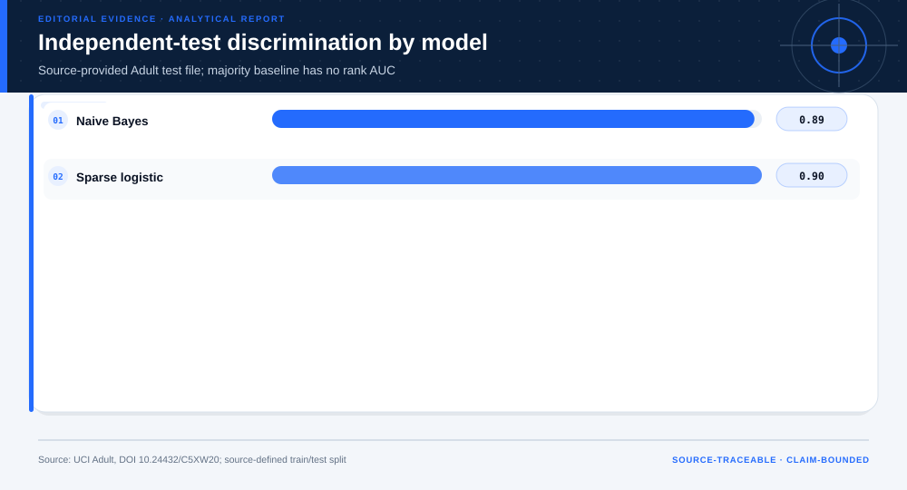

# 03 · End-to-End Census-Income Model Validation

**Technical summary.** The sparse logistic model improves on the baselines, but calibration and subgroup errors prevent consequential reuse.

## Evidence products

- [Open the Evidence Intelligence Report](../projects/census-income-ai/outputs/report.md)
- [Review the project design](../projects/census-income-ai/PROJECT.md)
- [Inspect the source manifest](../projects/census-income-ai/source-manifest.json)
- [Inspect the machine-readable results](../projects/census-income-ai/outputs/results.json)
- [Open the Decision Intelligence Brief](../projects/census-income-ai/outputs/decision/report/decision-report.md)

The figure is the representative visual for this case. Its interpretation is
limited by the evidence boundary stated below.

## Case route

| Field | Case-specific value |
|---|---|
| Domain | Responsible AI |
| Adaptive route | descriptive → predictive |
| Analytical question | Does a benchmark classifier improve on simple baselines while remaining calibrated and acceptably stable across groups? |
| Prepared rows | 48,842 |
| Valid terminal output | Validated benchmark with an explicit non-deployment boundary |

## Evidence-backed findings

- **Independent-test AUC:** 0.905
- **Independent-test Brier score:** 0.102
- **Naive Bayes versus sparse-logistic AUC:** 0.891 versus 0.905
- **Prepared records:** 48,842

## Methods selected for this case

- majority and mixed-naive-Bayes baselines
- sparse one-hot logistic regression
- independent source test
- calibration
- subgroup error analysis
- drift and abnormal-input diagnostics

These methods were selected from the question, data grain, and evidence
maturity. Other cases in this gallery use different fields, checks, figures,
and endpoints.

## Interpretation boundary

Historical 1994 data, missing categories, social-structure shift, and no validation for a real eligibility decision.

## Source identity

- **Dataset:** [Adult / Census Income](https://doi.org/10.24432/C5XW20)
- **Publisher:** UCI Machine Learning Repository
- **Version:** UCI static archive snapshot; files timestamped 2023-05-22
- **Accessed:** 2026-07-27
- **License:** CC BY 4.0
- **Analytical grain:** one Census-derived person record meeting the dataset extraction rules

### Reviewed source-snapshot hashes

- `uci-adult.zip` — `7537312dd56c2b98035880805ce99e68183a30ee468aa5329d6df0fbb3cc21bb`

The reviewed raw source files are bundled inside the complete project directory.
The build script verifies each file against both this case index and the
project source manifest.

## Reuse boundary

Reuse the analytical pattern, not the empirical conclusion. A new population,
time window, source version, objective, or decision owner requires a new
evidence contract and validation path.
