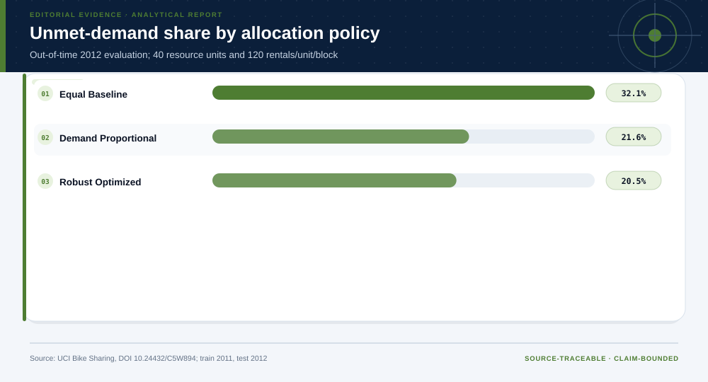

# 04 · Bike-Demand Forecasting and Robust Allocation

**Technical summary.** A robust time-block allocation reduces modeled unmet demand out of time, while the perfect-information bound limits the value of further forecast improvement.

## Evidence products

- [Open the Evidence Intelligence Report](../projects/bike-demand-operations/outputs/report.md)
- [Review the project design](../projects/bike-demand-operations/PROJECT.md)
- [Inspect the source manifest](../projects/bike-demand-operations/source-manifest.json)
- [Inspect the machine-readable results](../projects/bike-demand-operations/outputs/results.json)
- [Open the Decision Intelligence Brief](../projects/bike-demand-operations/outputs/decision/report/decision-report.md)

The figure is the representative visual for this case. Its interpretation is
limited by the evidence boundary stated below.

## Case route

| Field | Case-specific value |
|---|---|
| Domain | Operations research |
| Adaptive route | descriptive → predictive → prescriptive |
| Analytical question | How should a fixed service resource be distributed across time blocks when demand is forecast out of time? |
| Prepared rows | 17,379 |
| Valid terminal output | Bounded allocation recommendation with reversal conditions |

## Evidence-backed findings

- **Forecast MAE improvement versus overall mean:** 38.3%
- **Held-out robust-policy unmet share:** 20.5%
- **Perfect-foresight upper-bound improvement:** 1.6%
- **Feasible allocations evaluated:** 6,545

## Methods selected for this case

- 2011-to-2012 out-of-time forecast
- exhaustive integer allocation
- hard feasibility constraints
- Pareto analysis
- resource shadow value
- perfect-information upper bound

These methods were selected from the question, data grain, and evidence
maturity. Other cases in this gallery use different fields, checks, figures,
and endpoints.

## Interpretation boundary

System totals omit station imbalance, routing, labor, service time, and causal effects; resource units are illustrative scalers.

## Source identity

- **Dataset:** [Bike Sharing](https://doi.org/10.24432/C5W894)
- **Publisher:** UCI Machine Learning Repository
- **Version:** 2011–2012 Capital Bikeshare hourly snapshot
- **Accessed:** 2026-07-27
- **License:** CC BY 4.0
- **Analytical grain:** one observed hour in the Capital Bikeshare system

### Reviewed source-snapshot hashes

- `uci-bike-sharing.zip` — `b70182d0d0508e9abbb79306ce5c0cec34869000f8220175ac83d11dbe845401`

The reviewed raw source files are bundled inside the complete project directory.
The build script verifies each file against both this case index and the
project source manifest.

## Reuse boundary

Reuse the analytical pattern, not the empirical conclusion. A new population,
time window, source version, objective, or decision owner requires a new
evidence contract and validation path.
