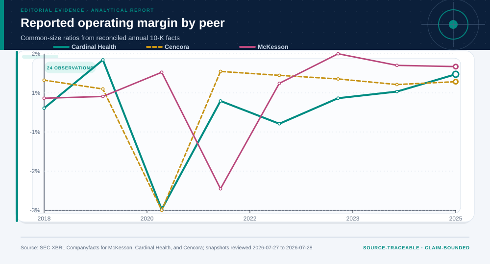

# 07 · SEC Peer Financial Quality and Cash Conversion

**Technical summary.** All three firms combine large scale with thin operating margins; recurring cash-conversion differences prioritize deeper filing reconciliation.

## Evidence products

- [Open the Evidence Intelligence Report](../projects/mckesson-financial-quality/outputs/report.md)
- [Review the project design](../projects/mckesson-financial-quality/PROJECT.md)
- [Inspect the source manifest](../projects/mckesson-financial-quality/source-manifest.json)
- [Inspect the machine-readable results](../projects/mckesson-financial-quality/outputs/results.json)
- [Open the Decision Intelligence Brief](../projects/mckesson-financial-quality/outputs/decision/report/decision-report.md)

The figure is the representative visual for this case. Its interpretation is
limited by the evidence boundary stated below.

## Case route

| Field | Case-specific value |
|---|---|
| Domain | Finance and accounting |
| Adaptive route | descriptive → diagnostic |
| Analytical question | Which recurring peer differences deserve filing and footnote reconciliation across a low-margin distribution industry? |
| Prepared rows | 24 |
| Valid terminal output | Targeted diligence request rather than a security ranking |

## Evidence-backed findings

- **Panel size:** 3 entities × 8 fiscal years
- **FY2025 operating-margin range:** 0.4%
- **FY2025 working-capital-cycle range:** 4.3 days
- **Fact lineage:** entity + CIK + tag + accession + fiscal period

## Methods selected for this case

- XBRL fact reconciliation
- common-size ratios
- within-year peer medians and ranks
- dispersion and persistence
- cash-conversion diagnostics
- operating-margin stress

These methods were selected from the question, data grain, and evidence
maturity. Other cases in this gallery use different fields, checks, figures,
and endpoints.

## Interpretation boundary

Common SIC and XBRL taxonomy do not guarantee economic comparability; consolidated facts omit segment and footnote detail.

## Source identity

- **Dataset:** [SEC Companyfacts Drug-Distributor Peer Panel](https://www.sec.gov/edgar/search/)
- **Publisher:** U.S. Securities and Exchange Commission
- **Version:** McKesson reviewed 2026-07-27; Cardinal Health and Cencora reviewed 2026-07-28
- **Accessed:** 2026-07-28
- **License:** U.S. federal government public data; SEC fair-access terms apply
- **Analytical grain:** one company fiscal year for three SEC SIC 5122 peers

### Reviewed source-snapshot hashes

- `sec-mckesson-companyfacts.json` — `bdce70c079cc574834bd9d54df23c3ec82f99fea05774e89dfc1700573ccf172`
- `sec-cardinal-companyfacts.json` — `871e1330231f7a84945660e4182b2027f34596574000c8209159d06904144769`
- `sec-cencora-companyfacts.json` — `7c5ef663912bb6276a1cd6ede1f693ab32ec99d97efe179f2923c0a35876f9dc`

The reviewed raw source files are bundled inside the complete project directory.
The build script verifies each file against both this case index and the
project source manifest.

## Reuse boundary

Reuse the analytical pattern, not the empirical conclusion. A new population,
time window, source version, objective, or decision owner requires a new
evidence contract and validation path.
