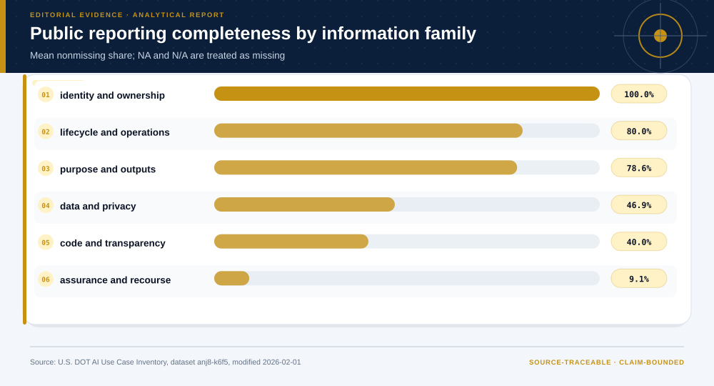

# 09 · Public AI Inventory Disclosure and Measurement Readiness

**Technical summary.** The inventory supports disclosure-readiness measurement and a targeted evidence request, not a governance-capability score.

## Evidence products

- [Open the Evidence Intelligence Report](../projects/federal-ai-governance/outputs/report.md)
- [Review the project design](../projects/federal-ai-governance/PROJECT.md)
- [Inspect the source manifest](../projects/federal-ai-governance/source-manifest.json)
- [Inspect the machine-readable results](../projects/federal-ai-governance/outputs/results.json)
- [Open the Decision Intelligence Brief](../projects/federal-ai-governance/outputs/decision/report/decision-report.md)

The figure is the representative visual for this case. Its interpretation is
limited by the evidence boundary stated below.

## Case route

| Field | Case-specific value |
|---|---|
| Domain | Technology policy |
| Adaptive route | descriptive |
| Analytical question | What can an external reviewer measure from a public AI inventory, and what evidence is still required before capability evaluation? |
| Prepared rows | 70 |
| Valid terminal output | Evidence request before any capability assessment |

## Evidence-backed findings

- **Public use cases:** 70
- **Public fields analyzed:** 34
- **Fields unavailable in the snapshot:** 14
- **Mean disclosure readiness:** 41.6% (observability only)

## Methods selected for this case

- complete public-schema inventory
- six-family disclosure taxonomy
- field availability classification
- stage-by-family completeness
- measurement-readiness distribution
- evidence-request schema

These methods were selected from the question, data grain, and evidence
maturity. Other cases in this gallery use different fields, checks, figures,
and endpoints.

## Interpretation boundary

Blank or missing-coded fields are disclosure signals; they do not prove control absence, ineffectiveness, unethical behavior, safety failure, or noncompliance.

## Source identity

- **Dataset:** [Department of Transportation Inventory of Artificial Intelligence Use Cases](https://catalog.data.gov/dataset/department-of-transportation-inventory-of-artificial-intelligence-use-cases)
- **Publisher:** U.S. Department of Transportation
- **Version:** Dataset modified 2026-02-01; temporal coverage 2022-03-18/2026-01-28
- **Accessed:** 2026-07-27
- **License:** U.S. Government work
- **Analytical grain:** one publicly reported DOT AI use case

### Reviewed source-snapshot hashes

- `dot-ai-use-cases.csv` — `fbbd292ddd62d016b6a4128597c1144e9474180173507b9a5f1d83088ac85de4`

The reviewed raw source files are bundled inside the complete project directory.
The build script verifies each file against both this case index and the
project source manifest.

## Reuse boundary

Reuse the analytical pattern, not the empirical conclusion. A new population,
time window, source version, objective, or decision owner requires a new
evidence contract and validation path.
