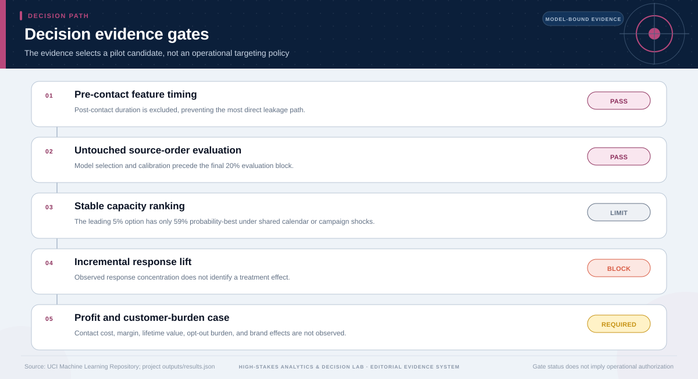

# Prospective-Test Decision: Marketing Capacity

## Technical summary

**Decision: Advance the 5% review-capacity rule only to a randomized campaign pilot; do not treat observational response concentration as causal lift.**

The untouched source-order test yields AUC 0.650. The 5% tier captures 7.4% of observed responders and has P(best) 59.0% under shared block resampling. That comparison is exploratory because incremental response, cost, burden, profit, and lifetime value are unobserved.

The project supports choosing the next experiment, not choosing an operational campaign policy. The 5% tier is a resource-bounded pilot candidate whose ranking can reverse once causal lift and cost are measured.

## The 5% tier is the leading pilot candidate, but the ranking is not decisive

All three capacity options are evaluated on the same final block and the same block-resampled replicates. This preserves shared campaign shocks instead of making the alternatives look artificially independent.

Higher capacity captures more observed responders, but also consumes more review effort. The exploratory utility ranking favors 5%; its 59% probability-best is too weak for an irreversible operating decision.

| Review tier | Observed capture | Precision | Lift vs random | P(best) |
|---|---|---|---|---|
| 5% | 7.4% | 45.9% | 1.49 | 59.0% |
| 10% | 13.7% | 42.4% | 1.37 | 28.4% |
| 20% | 33.5% | 51.6% | 1.67 | 12.6% |

## Calibration instability reinforces the need for an experiment

The held-out score distribution has repeated score values and uneven calibration across bins. Capacity capture can still describe ranking, but the scores should not be read as reliable individual response probabilities.

The chart is a probability-quality diagnostic, not evidence of campaign impact. A randomized pilot must estimate incremental response and burden directly.

## The evidence gates determine the terminal decision

The gate sequence distinguishes useful analytical evidence from the additional
evidence required for the requested decision. A pass on one gate does not
override a block or missing requirement on another.

The terminal status is **randomized_pilot_required**. This status follows from the
case-specific evidence contract; it is not a generic caution added after the
analysis.

## The next decision is an experiment with explicit business guardrails

The pilot design should be set before launch so that weak commercial outcomes cannot be reinterpreted after the fact.

| Design element | Required specification | Decision role |
|---|---|---|
| Assignment | Randomized eligible contacts or approved clusters | Identifies incremental effect |
| Primary outcome | Incremental term-deposit response | Tests whether outreach changes behavior |
| Economics | Contact cost, margin, and capacity use | Converts lift into net value |
| Guardrails | Opt-out, complaints, burden, and segment effects | Constrains harmful scaling |
| Analysis | Pre-registered estimand, horizon, exclusions, and stop rule | Prevents post-hoc selection |

## What is permitted now—and what is not

### Supported uses

- Use the 5% tier as the leading candidate in a randomized pilot.
- Use observed capture to plan review workload and power scenarios.
- Monitor calibration, capacity capture, and segment burden during the pilot.

### Unsupported uses

- Claim incremental lift, profit, or customer value from observational responses.
- Roll out the ranking as an operating policy before the randomized result.
- Treat P(best) as institutional approval or decision certainty.

## Scope, source, and metric boundary

- **Source:** [Bank Marketing](https://archive.ics.uci.edu/dataset/222/bank+marketing)
- **Publisher:** UCI Machine Learning Repository
- **Version:** UCI archive retrieved 2026-07-27; bank-additional-full.csv
- **Accessed:** 2026-07-27
- **Analytical grain:** one direct-marketing contact outcome
- **Prepared rows:** 41,188
- **Adaptive route:** descriptive → predictive → prospective-test decision
- **Main analytical report:** [Open report](../../report.md)
- **Machine-readable analytical results:** [Open results](../../results.json)

## Decision method and validation logic

- Preserve pre-contact feature timing and a 60/20/20 source-order split.
- Select and calibrate the model before the untouched final evaluation block.
- Compare capacity capture, precision, workload, lift, and probability-best.
- Use shared block resampling so every capacity option experiences the same campaign and calendar shocks.

The terminal decision is produced after the analytical evidence is reviewed
against case-specific gates. A missing capability, treatment effect, approval,
or operating input is recorded as missing evidence rather than assigned a
favorable value.

## Limitations, uncertainty, and reversal conditions

**Claim boundary.** Response prediction on observational campaign records is not an estimate of causal lift, profit, or customer lifetime value.

The decision should be reconsidered only if new evidence changes one of these
conditions:

- A randomized test shows no incremental response lift.
- Contact costs or customer-burden constraints dominate observed response concentration.
- Performance degrades on a true dated out-of-period sample.

## Recommended next steps

1. Define eligibility, randomization unit, contact treatment, non-contact baseline, and follow-up horizon.
2. Add cost, margin, opt-out, complaint, and segment-burden outcomes to the data contract.
3. Pre-register scaling and stopping rules before exposing the first randomized unit.

## Further questions

- What minimum incremental response would cover contact and review costs?
- Which customer-burden metric can veto a positive response result?
- Does the capacity ranking persist in a genuinely dated future campaign?

## Reproducibility

- Decision result: [`decision-results.json`](decision-results.json)
- Decision chart map: [`figures/chart-map.json`](figures/chart-map.json)
- Source manifest: [`../../../source-manifest.json`](../../../source-manifest.json)
- Analytical result SHA-256: `08475be795f8e3ba33dd6824e06eefc0a2ba4e29a9ddc235a57c4eb8927b1320`

The report is generated from the committed analytical result and source
manifest. It does not upgrade the permitted use of the underlying evidence.
