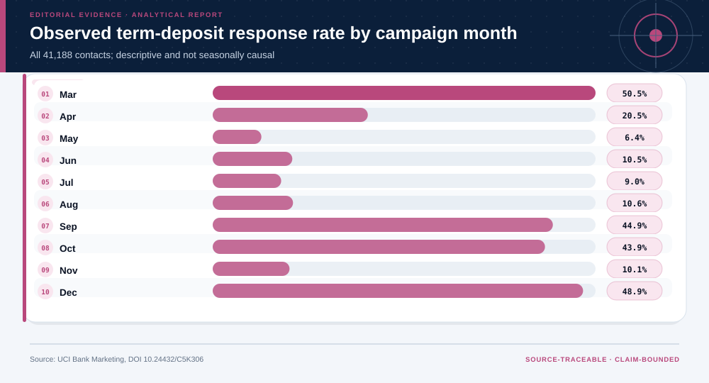
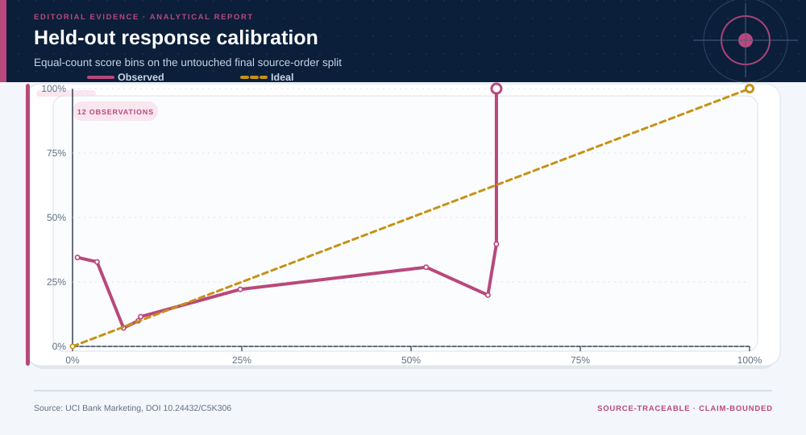
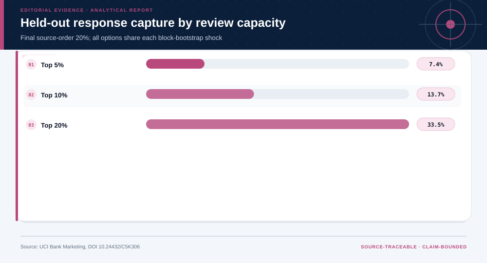
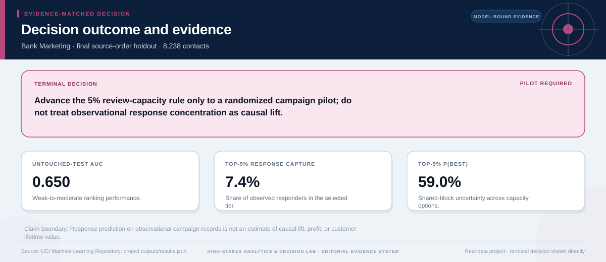

# Capacity-Constrained Marketing Pilot: analytical project

> **Bottom line:** Pre-contact features concentrate observed term-deposit responses on the untouched final split, but only a randomized campaign can establish incremental lift or ROI.

## Executive Summary

This source-backed project connects the decision question to its data, validation design, visual evidence, and explicit claim boundary. The report structure follows this case rather than a fixed universal template.

### Evidence at a glance

| Signal | Observed result |
|---|---|
| Untouched-test AUC | 0.650 |
| Untouched-test Brier score | 0.210 |
| Recommended exploratory capacity | top 5%; observed response capture 7.4% |
| Shared-block P(best) | 59.0% |

## Key findings with visual evidence

The visual sequence is interleaved with source, design, and limitation notes so each result stays adjacent to the evidence that supports it.

### Observed response varies across the campaign sequence

The descriptive view preserves source order and reveals why random row splitting would overstate independence.

> **Interpretation boundary:** Monthly response is observational and may reflect targeting, seasonality, or campaign composition.

## Scope, source, and metric definitions

| Evidence contract | Recorded value |
|---|---|
| Source | Moro, S., Rita, P., & Cortez, P. (2014). Bank Marketing [Dataset]. UCI Machine Learning Repository. https://doi.org/10.24432/C5K306 |
| Version | UCI archive retrieved 2026-07-27; bank-additional-full.csv |
| Accessed | 2026-07-27 |
| License | [CC BY 4.0](https://creativecommons.org/licenses/by/4.0/) |
| Analytical grain | one direct-marketing contact outcome |
| Expected rows | 41,188 |
| Results | [`results.json`](results.json) |
| Definitions | [`../data/data-dictionary.json`](../data/data-dictionary.json) |
| Quality | [`../data/quality-report.json`](../data/quality-report.json) |

### Untouched-test probabilities are checked, not assumed

Model and calibration choices are fixed before the final source-order split is evaluated.

> **Interpretation boundary:** Predicting response is not the same as estimating incremental lift, customer value, or profit.

## Research design and data quality

### Design and estimand

| Design element | Project definition |
|---|---|
| Claim class | Unit, time split, target, constraints, and claim class are defined in `results.json`; no causal estimand is claimed unless the design explicitly supports one. |

### Data-quality gate

| Check | Result |
|---|---|
| Prepared shape | 41,188 rows × 22 columns |
| Duplicate primary keys | 0 |
| Missing values under declared tokens | 0 |
| Privacy review | approved_for_public_aggregate_analysis |
| Quality disposition | **usable_with_documented_limitations** |

### Capacity planning preserves common campaign shocks

Every capacity option shares adjacent-row block-bootstrap replicates, so probability-best reflects the same campaign perturbations.

> **Interpretation boundary:** Only a randomized campaign can establish incremental effect and ROI.

## Methodology

Source-order train/validation/test design, leakage-controlled mixed naive Bayes, AUC/Brier/calibration, capacity lift, subgroup checks, shared block bootstrap, and decision sensitivity.

All shipped metrics are regenerated by `prepare_data.py` and `analyze.py`. Random procedures use fixed seeds, and committed raw files are checked against the SHA-256 values in `source-manifest.json`.

## Parameter provenance and review

6 configured or derived parameters are recorded with their source, uncertainty class, provisional approval, reviewer status, and use boundary.

<strong>Open the complete parameter-level source and review register</strong>

| Parameter path | Value or distribution | Uncertainty | Source | Approval | Reviewer | Boundary |
|---|---|---|---|---|---|---|
| config.analysis_seed | 20260727 | none | analysis-protocol | provisional_self_review | not_assigned | Computational setting; it does not increase evidence quality. |
| config.parameters.split_fractions | [0.6, 0.2, 0.2] | none | uci-source-order-and-author-method | provisional_self_review | not_assigned | The UCI archive states rows are ordered by date, but supplies no full observation date; row order is therefore a temporal proxy. |
| config.parameters.contact_capacity_shares | [0.05, 0.1, 0.2] | scenario | analyst-capacity-scenarios | provisional_self_review | not_assigned | Illustrative contact-capacity choices, not a bank operating constraint. |
| config.parameters.bootstrap_samples | 500 | none | analysis-protocol | provisional_self_review | not_assigned | Computational setting; it does not increase evidence quality. |
| config.parameters.bootstrap_block_rows | 50 | none | dependence-preserving-resampling-rule | provisional_self_review | not_assigned | Adjacent-row blocks partially preserve campaign-period dependence; block length is sensitivity-tested. |
| config.parameters.forbidden_predictor | duration | none | uci-variable-definition | provisional_self_review | not_assigned | Call duration is known only after contact and is excluded from all pre-contact prediction and targeting. |

## Limitations, uncertainty, and robustness

The source supplies order but not full dates, comes from one bank and campaign system, and is observational; response is not causal lift, value, or profit.

Bootstrap or scenario stability remains conditional on the observed sample and declared assumptions; it does not upgrade exploratory evidence into operational authorization.

## What this study cannot establish

| Boundary | Not established by this project |
|---|---|
| Causality | A causal effect unless the stated design and identification assumptions support it |
| Transport | Performance or effects in an unobserved population, institution, or future regime |
| Authorization | Permission for a clinical, policy, financial, engineering, marketing, or automated action |

## Decision implications and reversal conditions

The analysis can prioritize validation, diligence, or a bounded pilot; it is not itself permission to act. Reconsider the interpretation when:

- A randomized test shows no incremental response lift.
- Contact costs or customer-burden constraints dominate observed response concentration.
- Performance degrades on a true dated out-of-period sample.

## Conditional downstream decision layer

The Evidence Intelligence Report remains the primary record. The separate Decision Intelligence Brief applies case-specific gates and may end in a pilot, evidence request, non-deployment, or stop.

[Open the complete Decision Intelligence Brief](decision/report/decision-report.md).

## Recommended next steps

| Step | Action |
|---:|---|
| 1 | Re-run on a newly reviewed source version and compare the source hash, schema, and headline metrics. |
| 2 | Obtain domain-owner review of definitions, thresholds, exclusions, and action constraints. |
| 3 | Pre-register the next prospective or experimental validation before using any decision rule. |

## Further questions

- Which missing local variable could reverse the current ranking or interpretation?
- What prospective evidence would be required before operational use?
- Which subgroup, period, or spatial unit is least well represented?

<strong>Reproducibility receipt</strong>

- Project ID: `bank-marketing-response`
- Source manifest: [`../source-manifest.json`](../source-manifest.json)
- Result SHA-256: `08475be795f8e3ba33dd6824e06eefc0a2ba4e29a9ddc235a57c4eb8927b1320`

