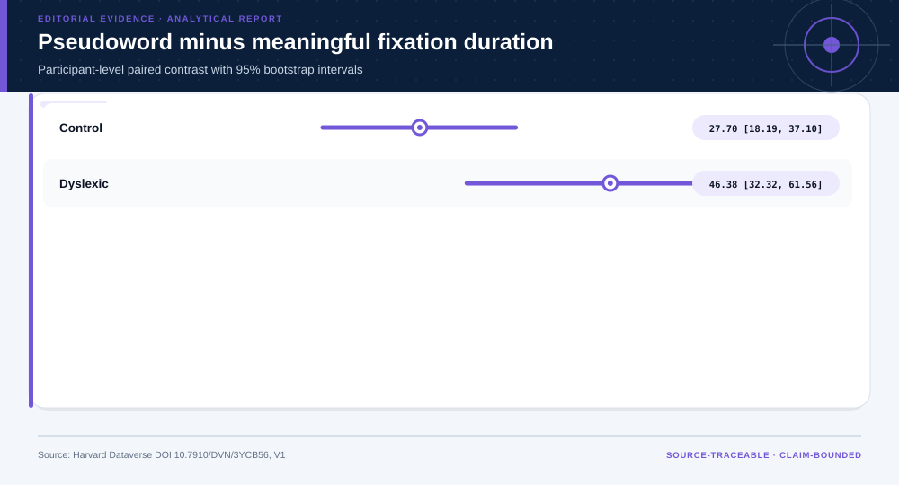
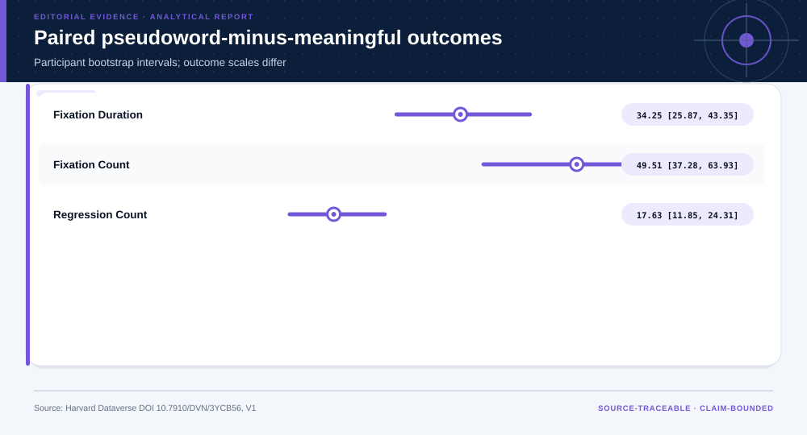
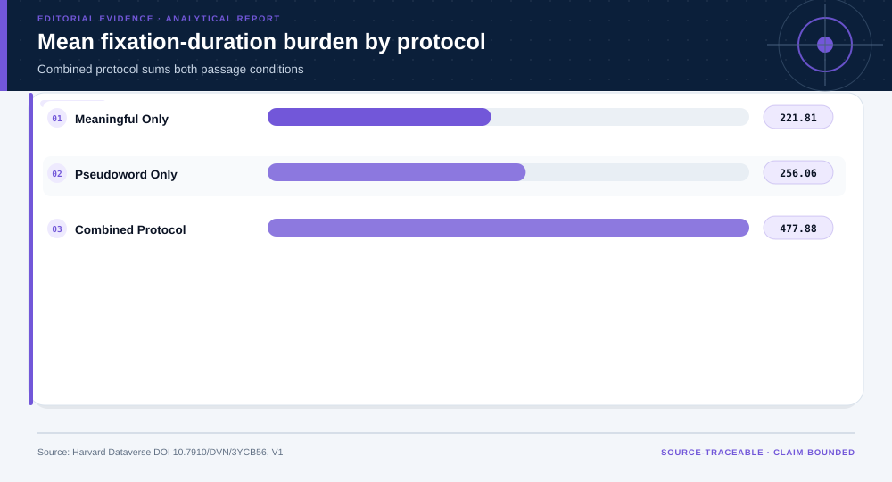
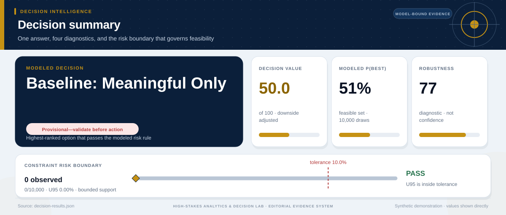

# Small-Sample Repeated-Measures Inference: analytical project

> **Bottom line:** Pseudoword passages increase fixation-duration burden, and the paired effect differs by reader group; a combined protocol gains contrast at the cost of time.

## Executive Summary

This source-backed project connects the decision question to its data, validation design, visual evidence, and explicit claim boundary. The report structure follows this case rather than a fixed universal template.

### Evidence at a glance

| Signal | Observed result |
|---|---|
| Complete participant pairs | 57 |
| Mean paired fixation-duration difference | 34.25 (bootstrap 95% interval 25.87 to 43.35) |
| Holm-adjusted sign-flip p-value | 0.0003 |
| 80% power design-sensitivity MDE | 12.22 |

## Key findings with visual evidence

The visual sequence is interleaved with source, design, and limitation notes so each result stays adjacent to the evidence that supports it.

### The primary effect is estimated within participant

Paired fixation-duration differences preserve the repeated-measures design and display participant-bootstrap uncertainty.

> **Interpretation boundary:** The contrast is specific to this sample, task, and measurement protocol.

## Scope, source, and metric definitions

| Evidence contract | Recorded value |
|---|---|
| Source | Al Dahhan, N. Z. et al. (2019). Eye movements of dyslexic and average readers in meaningful and pseudoword passage reading. Harvard Dataverse, V1. https://doi.org/10.7910/DVN/3YCB56 |
| Version | V1; file UNF:6:XJRpAtIOiQJZWyv7L3uj3A== |
| Accessed | 2026-07-27 |
| License | [CC0 1.0](https://creativecommons.org/publicdomain/zero/1.0/) |
| Analytical grain | one de-identified study participant with repeated passage measures |
| Expected rows | 57 |
| Results | [`results.json`](results.json) |
| Definitions | [`../data/data-dictionary.json`](../data/data-dictionary.json) |
| Quality | [`../data/quality-report.json`](../data/quality-report.json) |

### Multiplicity changes how the outcome family is read

Primary and secondary outcomes are shown together after sign-flip inference and Holm adjustment.

> **Interpretation boundary:** Statistical separation does not establish a downstream educational or policy benefit.

## Research design and data quality

### Design and estimand

| Design element | Project definition |
|---|---|
| Analysis Unit | participant |
| Within Participant Conditions | meaningful passage, pseudoword passage |
| Primary Estimand | mean within-participant difference in fixation duration, pseudoword minus meaningful |
| Primary Hypothesis | mean paired duration difference equals zero |
| Secondary Outcomes | fixation count, regression count |
| Group Role | reader group is an observed status used for heterogeneity, not a randomized treatment |

### Data-quality gate

| Check | Result |
|---|---|
| Prepared shape | 57 rows × 77 columns |
| Duplicate primary keys | 0 |
| Missing values under declared tokens | 1,380 |
| Privacy review | approved_for_public_aggregate_analysis |
| Quality disposition | **usable_with_documented_limitations** |

### Additional contrast carries an assessment-time cost

The protocol comparison places group separation beside measurement burden so neither outcome is optimized in isolation.

> **Interpretation boundary:** The value placed on burden versus separation is a stakeholder judgment, not a property of the dataset.

## Methodology

Paired differences, participant bootstrap intervals, sign-flip inference, Holm multiplicity control, order sensitivity, MDE design sensitivity, standardized group separation, and label permutation.

All shipped metrics are regenerated by `prepare_data.py` and `analyze.py`. Random procedures use fixed seeds, and committed raw files are checked against the SHA-256 values in `source-manifest.json`.

## Parameter provenance and review

4 configured or derived parameters are recorded with their source, uncertainty class, provisional approval, reviewer status, and use boundary.

<strong>Open the complete parameter-level source and review register</strong>

| Parameter path | Value or distribution | Uncertainty | Source | Approval | Reviewer | Boundary |
|---|---|---|---|---|---|---|
| config.analysis_seed | 20260727 | none | analysis-protocol | provisional_self_review | not_assigned | Computational setting; it does not increase evidence quality. |
| config.parameters.paired_bootstrap_repetitions | 1500 | none | analysis-protocol | provisional_self_review | not_assigned | Participant is the resampling unit. |
| config.parameters.permutation_repetitions | 5000 | none | analysis-protocol | provisional_self_review | not_assigned | Monte Carlo randomization-style p-value. |
| config.parameters.primary_contrast | Vd - Td | none | source-study-design | provisional_self_review | not_assigned | Within-study behavioral contrast only. |

## Limitations, uncertainty, and robustness

The public file contains 57 participants and does not establish downstream educational or policy outcomes.

Bootstrap or scenario stability remains conditional on the observed sample and declared assumptions; it does not upgrade exploratory evidence into operational authorization.

## What this study cannot establish

| Boundary | Not established by this project |
|---|---|
| Causality | A causal effect unless the stated design and identification assumptions support it |
| Transport | Performance or effects in an unobserved population, institution, or future regime |
| Authorization | Permission for a clinical, policy, financial, engineering, marketing, or automated action |

## Decision implications and reversal conditions

The analysis can prioritize validation, diligence, or a bounded pilot; it is not itself permission to act. Reconsider the interpretation when:

- A prospective or external validation reverses the observed ranking.
- A missing local constraint changes feasibility or the outcome definition.
- A domain owner rejects the analyst-defined threshold, scale, or trade-off.

## Conditional downstream decision layer

The Evidence Intelligence Report remains the primary record. The separate Decision Intelligence Brief applies case-specific gates and may end in a pilot, evidence request, non-deployment, or stop.

[Open the complete Decision Intelligence Brief](decision/report/decision-report.md).

## Recommended next steps

| Step | Action |
|---:|---|
| 1 | Re-run on a newly reviewed source version and compare the source hash, schema, and headline metrics. |
| 2 | Obtain domain-owner review of definitions, thresholds, exclusions, and action constraints. |
| 3 | Pre-register the next prospective or experimental validation before using any decision rule. |

## Further questions

- Which missing local variable could reverse the current ranking or interpretation?
- What prospective evidence would be required before operational use?
- Which subgroup, period, or spatial unit is least well represented?

<strong>Reproducibility receipt</strong>

- Project ID: `behavioral-reading-experiment`
- Source manifest: [`../source-manifest.json`](../source-manifest.json)
- Result SHA-256: `7b0f5ebb4e2f9ea5300b733ce14fbc67d2dc5ad957683bbe866b26dc6f1b1c8b`

