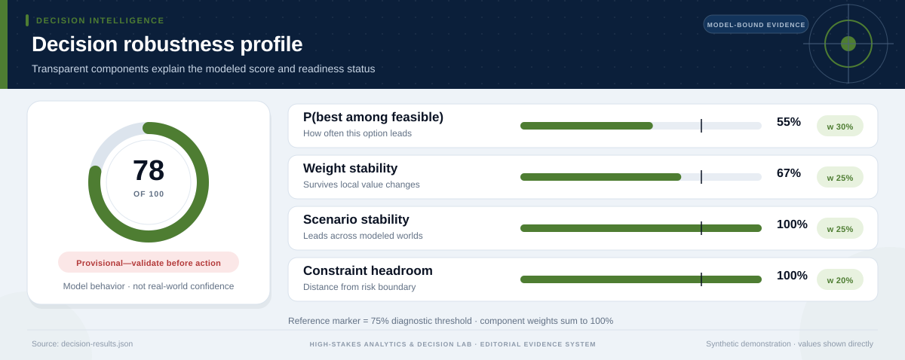
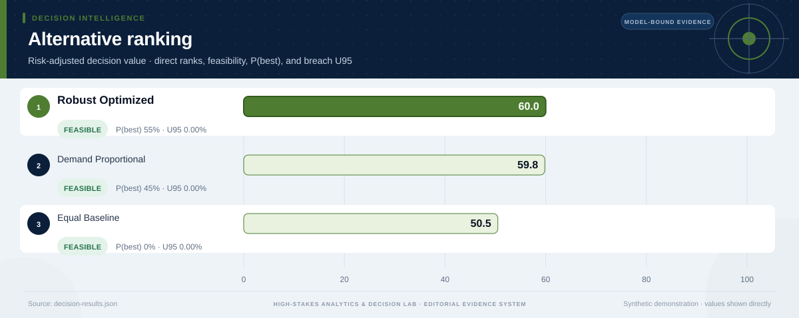
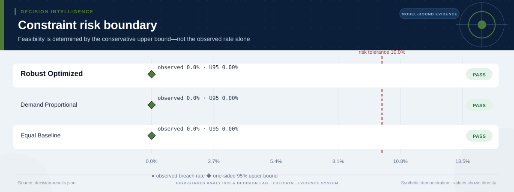
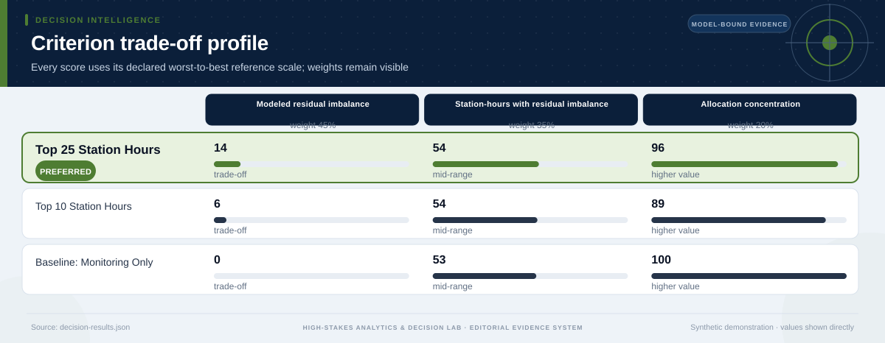
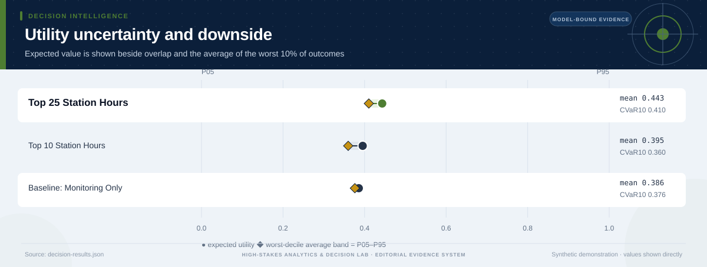
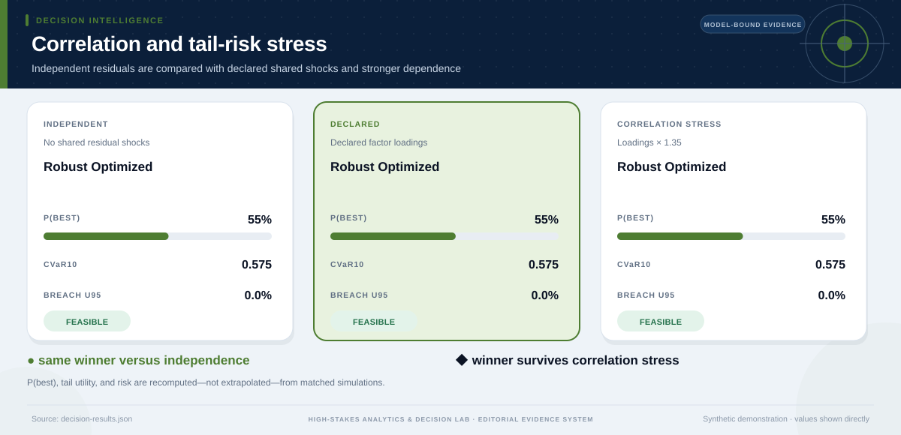
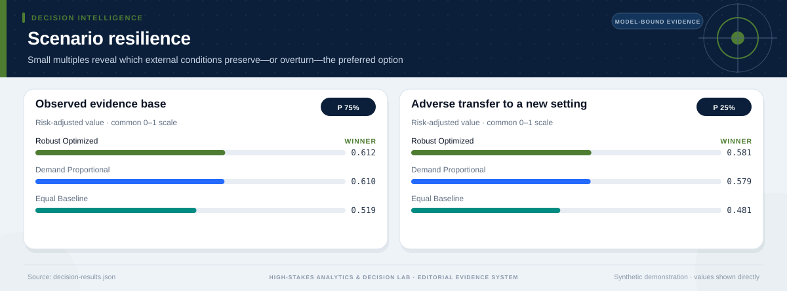
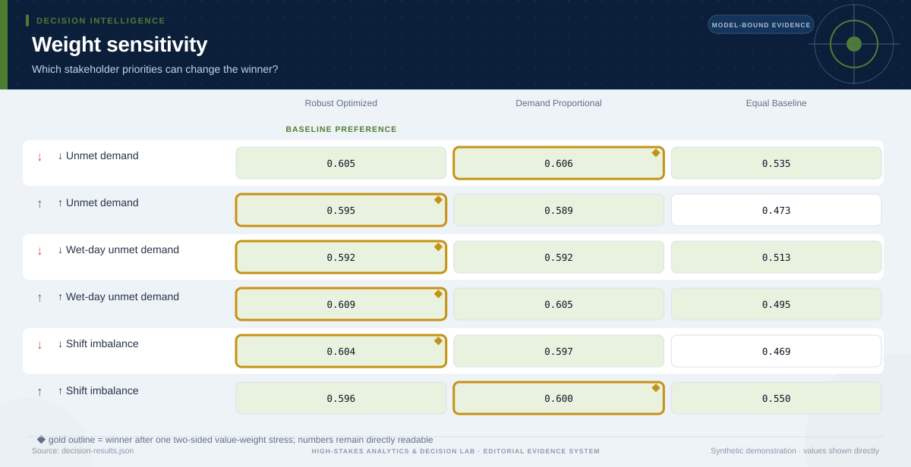

# Which time-block resource allocation should be piloted for system-level service planning

*Operations research and systems engineering · One planning year · 10,000 modeled simulations*

## Executive Summary

- **Provisional preference — Robust Optimized.** It is the highest-ranked feasible option, with decision value score **60.0/100** and a modeled **55% probability of being best among decision-feasible alternatives**.
- **The lead is narrow rather than absolute.** It leads the next feasible option, Demand Proportional, by **0.002 utility points**.
- **Modeled robustness is 78/100.** The option remains preferred in **67%** of two-sided weight stresses and **100%** of probability-weighted scenario comparisons.
- **Shared-shock sensitivity is explicit.** Relative to independent residuals, the declared factor model changes this option's P(best) by **+0.1%** and CVaR10 by **-0.000**; the ×1.35 loading stress does not change the modeled winner.
- **Constraint-breach evidence — 0/10,000 observed; U95 0.00%; declared support excludes breach.** Feasibility uses the one-sided 95% upper bound against the **10.0% tolerance**; a zero event count is never presented as proof of zero real-world risk.
- **Decision status — Provisional—validate before action.** The current blockers are: the winner is sensitive to criterion weights; evidence is not labeled for operational use.
- **Evidence boundary.** No causal claim unless explicitly identified in the source design; the decision comparison is exploratory.
- **Parameter lineage.** 48/48 governed parameters have a resolved source and approval-chain reference.

**Decision owner:** Hypothetical domain review panel; no real owner authorization  
**Decision question:** Which time-block resource allocation should be piloted for system-level service planning?

## Decision status and modeled robustness

**Status: Provisional—validate before action.** 6 of 8 configured readiness checks pass. The robustness score summarizes model behavior; it is not a posterior probability that the real-world decision is correct and cannot upgrade illustrative evidence into operational evidence.

## Robust Optimized leads on balanced value, not every dimension

**The preferred option earns its position through Unmet demand, Wet-day unmet demand.** The comparison still exposes a trade-off on **Shift imbalance**, so the decision should be presented as a transparent compromise rather than a universal optimum.

The ranking combines expected value with downside performance and excludes options whose one-sided 95% breach-frequency upper bound exceeds **10%**. Probability-best remains visible because a lower-ranked option may still win in a material share of simulations.

## The conservative risk boundary determines feasibility

**The decision rule compares the one-sided 95% breach-frequency upper bound—not only the observed simulation rate—with the 10.0% tolerance.** This makes finite-sample uncertainty visible and prevents a zero event count from being presented as proof of zero risk.

The dark circle is the observed breach rate; the diamond is its conservative upper bound. An option fails the modeled feasibility rule when that diamond crosses the red tolerance line. The test is conditional on the declared distributions and cannot cover omitted real-world hazards.

## The criterion profile reveals where the preferred option earns—and gives up—value

Each cell below places an outcome on its declared worst-to-best reference scale. This avoids recalibrating the chart around whichever alternatives happen to be present.

**The decision is therefore driven by an explicit value model.** A stakeholder who places substantially more weight on Shift imbalance may reasonably prefer another option; the two-sided weight-sensitivity section tests that possibility directly. The preferred option clips **0.0%** of criterion draws at the declared reference-scale bounds.

## Downside risk remains visible behind the average

**Robust Optimized has expected utility 0.608, but its worst-decile average falls to 0.575.** The widest criterion-level uncertainty for this option is associated with **Wet-day unmet demand**, making it a priority for further evidence collection.

The interval chart prevents a precise-looking average from obscuring overlap among alternatives. A close overlap means the practical decision may depend more on constraints, reversibility, and the cost of learning than on a small utility difference.

## Shared shocks change the uncertainty question

**The declared factor model gives Robust Optimized P(best) 55%, versus 55% under independent residuals and 55% under the stronger correlation stress.** Its CVaR10 moves from 0.575 independently to 0.575 under declared dependence and 0.575 under stress.

The three states use matched seeds, stratified scenario counts, and the same marginal distributions. Differences therefore isolate the declared dependence structure as closely as this simulation design allows. The Gaussian copula remains an approximation: factor definitions, signs, and loadings must be replaced or approved using domain evidence.

## Scenario tests show when the preferred option is most exposed

**The weakest modeled environment is Adverse transfer to a new setting, where the preferred option's risk-adjusted utility is 0.581.** The same feasible alternative remains ahead in every modeled scenario.

The preferred option leads in **100%** of the probability-weighted scenario comparison. Scenario probabilities are assumptions, not forecasts with guaranteed calibration. They are useful because they reveal which external conditions deserve monitoring and which contingency plans should be prepared before implementation.

## Distributional effects remain an evidence gap

**No group-level outcomes were supplied for this case.** Before operational use, the analysis should add affected groups, absolute outcomes, disparity measures, and a qualitative review of harms that cannot be reduced to a numeric parity ratio.

## The result is sensitive to stakeholder priorities

**The baseline choice survives 67% of local weight stresses.** The following weight perturbation changes the winner: ↓ Unmet demand → Demand Proportional; ↑ Shift imbalance → Demand Proportional.

This test both increases and decreases each criterion weight while preserving risk adjustment. It remains a local stress test rather than a substitute for formal stakeholder elicitation. If the winner changes under a plausible emphasis, the next step is deliberation and better evidence—not hiding the sensitivity.

## Recommended next steps

1. **Resolve the failed readiness checks before acting.** the winner is sensitive to criterion weights; evidence is not labeled for operational use.
2. **Reduce uncertainty in Wet-day unmet demand.** Validate or replace the widest uncertainty input using experimental, quasi-experimental, observational, or engineering evidence appropriate to the domain.
3. **Monitor the Adverse transfer to a new setting trigger.** Specify leading indicators and a contingency response before rollout.
4. **Review distributional impacts with affected stakeholders.** Examine absolute group outcomes alongside disparity measures and document unresolved normative choices.

## Further questions

- Which empirical or elicited evidence would best validate the declared factor loadings?
- Which omitted externality or stakeholder could materially alter the criterion set?
- What evidence would justify replacing the current scenario probabilities?
- Is the preferred option reversible if early monitoring contradicts the model?

## Caveats and assumptions

- **Evidence type:** source-backed exploratory project evidence
- **Evidence as of:** 2026-07-27
- **Permitted decision use:** exploratory
- **Causal status:** No causal claim unless explicitly identified in the source design; the decision comparison is exploratory.
- **Dependence model:** latent_factor_gaussian_copula with 1 declared shared factor(s); the loading stress is ×1.35. Copula choice and loadings remain assumptions.
- **Parameter provenance:** 100% source coverage and 100% approval coverage for the declared decision use. Approval for exploratory use is not operational approval.
- **Zero-breach interpretation:** zero simulated events means either no event was observed in the finite run or the declared bounded input support excludes a breach. Neither statement establishes zero real-world risk.
- System totals do not include station imbalances, travel times, labor rules, or causal service effects.
- Weights, scales, scenarios, and correlation loadings are analyst judgments without external approval.

<strong>Detailed numerical appendix and reproducibility</strong>

### Ranked alternatives

| Rank | Alternative | Feasible | Value score | Expected utility | CVaR10 | P(best feasible) | P(best all) | Breach evidence | Feasible Pareto |
|---:|---|:---:|---:|---:|---:|---:|---:|---|:---:|
| 1 | Robust Optimized | Yes | 60.0 | 0.608 | 0.575 | 54.9% | 54.9% | 0/10,000 observed; U95 0.00%; declared support excludes breach | Yes |
| 2 | Demand Proportional | Yes | 59.8 | 0.607 | 0.573 | 45.1% | 45.1% | 0/10,000 observed; U95 0.00%; declared support excludes breach | Yes |
| 3 | Equal Baseline | Yes | 50.5 | 0.515 | 0.473 | 0.0% | 0.0% | 0/10,000 observed; U95 0.00%; declared support excludes breach | Yes |

### Readiness checks

| Check | Result |
|---|:---:|
| Feasible Alternative | Pass |
| Probability Best | Pass |
| Weight Stability | Fail |
| Scenario Stability | Pass |
| Scale Clipping | Pass |
| Parameter Provenance | Pass |
| Approval Scope | Pass |
| Operational Evidence | Fail |

### Constraint diagnostics

No hard constraints were supplied.

### Criterion outcomes

#### Robust Optimized

| Criterion | Weight | Mean | P05–P95 | Normalized score | Scale clipping |
|---|---:|---:|---:|---:|---:|
| Unmet demand | 45.0% | 0.209 share | 0.195 share–0.229 share | 0.581 | 0.0% |
| Wet-day unmet demand | 35.0% | 0.164 share | 0.146 share–0.184 share | 0.672 | 0.0% |
| Shift imbalance | 20.0% | 0.331 allocation range/total | 0.325 allocation range/total–0.351 allocation range/total | 0.558 | 0.0% |

#### Demand Proportional

| Criterion | Weight | Mean | P05–P95 | Normalized score | Scale clipping |
|---|---:|---:|---:|---:|---:|
| Unmet demand | 45.0% | 0.22 share | 0.202 share–0.24 share | 0.560 | 0.0% |
| Wet-day unmet demand | 35.0% | 0.172 share | 0.153 share–0.194 share | 0.656 | 0.0% |
| Shift imbalance | 20.0% | 0.281 allocation range/total | 0.275 allocation range/total–0.297 allocation range/total | 0.626 | 0.0% |

#### Equal Baseline

| Criterion | Weight | Mean | P05–P95 | Normalized score | Scale clipping |
|---|---:|---:|---:|---:|---:|
| Unmet demand | 45.0% | 0.327 share | 0.308 share–0.355 share | 0.346 | 0.0% |
| Wet-day unmet demand | 35.0% | 0.272 share | 0.248 share–0.3 share | 0.455 | 0.0% |
| Shift imbalance | 20.0% | 0 allocation range/total | 0 allocation range/total–0 allocation range/total | 1.000 | 0.0% |

### Correlation sensitivity

| Dependence state | Modeled winner | Recommended option P(best) | CVaR10 | Breach U95 |
|---|---|---:|---:|---:|
| Independent residuals | Robust Optimized | 54.8% | 0.575 | 0.00% |
| Declared factor model | Robust Optimized | 54.9% | 0.575 | 0.00% |
| Loading stress ×1.35 | Robust Optimized | 55.1% | 0.575 | 0.00% |

### Parameter provenance and approval

Coverage: **48/48 parameters sourced** and **48/48 approved for the declared use**. Every expanded JSON path is recorded in `decision-results.json` under `parameter_provenance.records`.

| Source ID | Source type | Owner | Approved uses | Approval chain |
|---|---|---|---|---|
| `bike-demand-operations-analysis-output` | reproducible_project_output | Original publisher and repository analysis author | exploratory | 1. model_author (approved) |
| `portfolio-author-governance-assumptions` | analyst_judgment_not_externally_approved | Repository analysis author | exploratory | 1. self_review (approved) |
### Sources and reproducibility

- Fanaee-T, H. (2013). Bike Sharing [Dataset]. UCI Machine Learning Repository. https://doi.org/10.24432/C5W894
- projects/bike-demand-operations/outputs/results.json
- Engine version: `7.0.0`
- Samples: `10000`
- Random seed: `20260726`
- Sampling design: Stratified scenario allocation with a declared latent-factor Gaussian copula, shared shocks across alternatives, marginal-preserving inverse transforms, and matched independent/correlation-stress counterfactuals.
- Case SHA-256: `0c41a2b9ae0ac2f54d721052a168fd265d4acfb894b484490fab765bf31e8a3f`

### Decision notes

- The comparison selects a candidate for further review, not an operational action.
- No institutional, clinical, financial, engineering, or policy approval is represented.

> Source-backed exploratory analysis, not an authorization to act. Domain review and current local evidence remain required.
