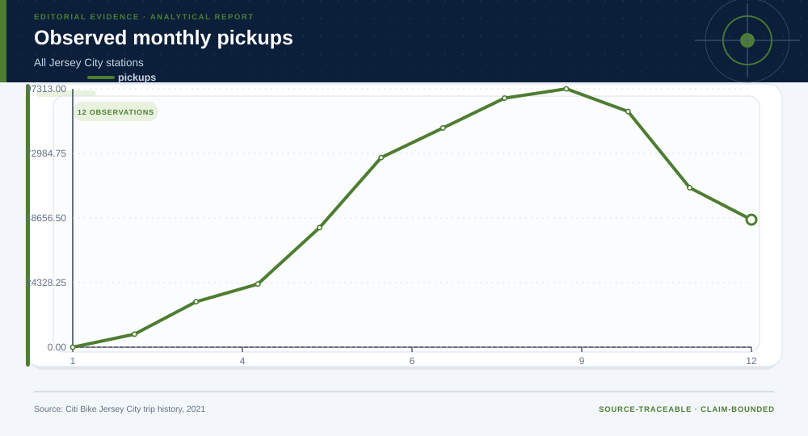
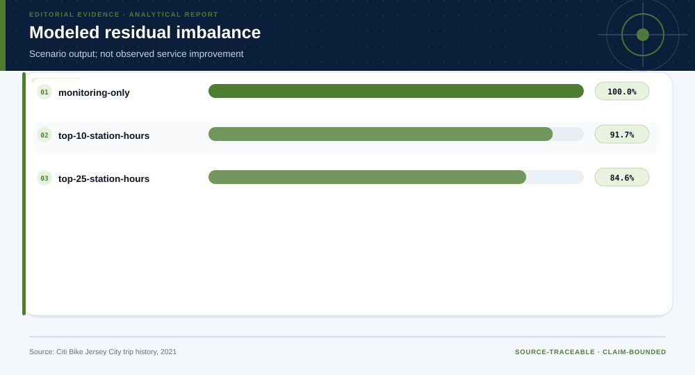
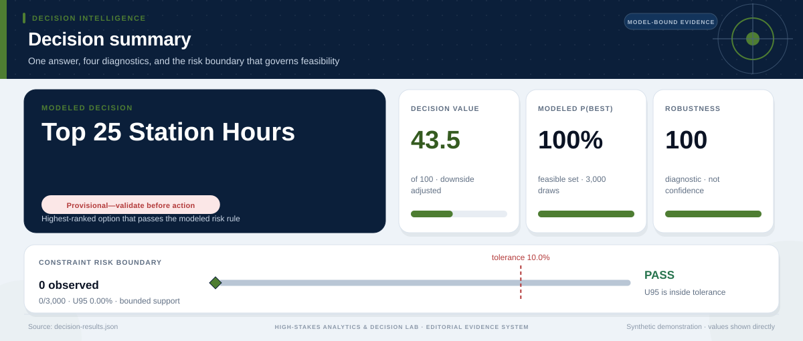

# Jersey City Bike Demand and Rebalancing Evidence: analytical project

> **Bottom line:** Station-hour history improves held-out pickup forecasts, while rebalancing outputs remain explicitly modeled scenarios because inventory, routing, labor, and dock-capacity data are absent.

## Executive Summary

This source-backed project connects the decision question to its data, validation design, visual evidence, and explicit claim boundary. The report structure follows this case rather than a fixed universal template.

### Evidence at a glance

| Signal | Observed result |
|---|---|
| Held-out station-hour MAE | 0.69 pickups/day |
| Improvement vs hour-only baseline | 33.1% |
| Observed station-hour-month rows | 17,906 |
| Rebalancing results | modeled scenario only |

## Key findings with visual evidence

The visual sequence is interleaved with source, design, and limitation notes so each result stays adjacent to the evidence that supports it.

### Held-out forecast error

Station-hour history is compared with an hour-only baseline.

> **Interpretation boundary:** Forecast accuracy is not service impact.

## Scope, source, and metric definitions

| Evidence contract | Recorded value |
|---|---|
| Source | Citi Bike. Jersey City trip history, January-December 2021; derived station-hour aggregate. |
| Version | Jersey City trip history, January-December 2021; derived station-hour aggregate |
| Accessed | 2026-08-10 |
| License | [Citi Bike Data Sharing Policy](https://citibikenyc.com/data-sharing-policy) |
| Analytical grain | one station-hour-month aggregate |
| Expected rows | 17,906 |
| Results | [`results.json`](results.json) |
| Definitions | [`../data/data-dictionary.json`](../data/data-dictionary.json) |
| Quality | [`../data/quality-report.json`](../data/quality-report.json) |

### Monthly observed demand

Seasonality is visible before the holdout assessment.

> **Interpretation boundary:** Trip records omit unmet demand.

## Research design and data quality

### Design and estimand

| Design element | Project definition |
|---|---|
| Design | station-hour temporal holdout |
| Development Period | January-September 2021 |
| Test Period | October-December 2021 |
| Modeled Scenario | fixed daily rebalancing-unit budget |

### Data-quality gate

| Check | Result |
|---|---|
| Prepared shape | 17,906 rows × 9 columns |
| Duplicate primary keys | 0 |
| Missing values under declared tokens | 0 |
| Privacy review | approved_for_public_minimized_analysis |
| Quality disposition | **usable_with_documented_limitations** |

### Modeled imbalance scenarios

All options use one declared daily budget.

> **Interpretation boundary:** These are modeled, not observed, outcomes.

## Methodology

Station-hour-month aggregation, January-September development, October-December holdout, weighted MAE, observed pickup-return imbalance, and fixed-budget allocation scenarios.

All shipped metrics are regenerated by `prepare_data.py` and `analyze.py`. Random procedures use fixed seeds, and committed raw files are checked against the SHA-256 values in `source-manifest.json`.

## Parameter provenance and review

5 configured or derived parameters are recorded with their source, uncertainty class, provisional approval, reviewer status, and use boundary.

<strong>Open the complete parameter-level source and review register</strong>

| Parameter path | Value or distribution | Uncertainty | Source | Approval | Reviewer | Boundary |
|---|---|---|---|---|---|---|
| config.analysis_seed | 20260810 | none | analysis-protocol | provisional_self_review | not_assigned | Computational setting; it does not increase evidence quality. |
| config.parameters.development_end | 2021-09 | none | case-specific-analysis-protocol | provisional_self_review | not_assigned | Rebalancing outcomes are modeled; no stockout, routing, labor, or achieved-service claim. |
| config.parameters.test_start | 2021-10 | none | case-specific-analysis-protocol | provisional_self_review | not_assigned | Rebalancing outcomes are modeled; no stockout, routing, labor, or achieved-service claim. |
| config.parameters.modeled_daily_rebalancing_units | 250 | none | case-specific-analysis-protocol | provisional_self_review | not_assigned | Rebalancing outcomes are modeled; no stockout, routing, labor, or achieved-service claim. |
| config.parameters.review_station_hour_counts | [0, 10, 25] | none | case-specific-analysis-protocol | provisional_self_review | not_assigned | Rebalancing outcomes are modeled; no stockout, routing, labor, or achieved-service claim. |

## Limitations, uncertainty, and robustness

Pickups minus returns is an imbalance proxy, not observed stockout demand; modeled residual imbalance is not an achieved service result.

Bootstrap or scenario stability remains conditional on the observed sample and declared assumptions; it does not upgrade exploratory evidence into operational authorization.

## What this study cannot establish

| Boundary | Not established by this project |
|---|---|
| Causality | A causal effect unless the stated design and identification assumptions support it |
| Transport | Performance or effects in an unobserved population, institution, or future regime |
| Authorization | Permission for a clinical, policy, financial, engineering, marketing, or automated action |

## Decision implications and reversal conditions

The analysis can prioritize validation, diligence, or a bounded pilot; it is not itself permission to act. Reconsider the interpretation when:

- Travel-time or truck-capacity constraints make the allocation infeasible.
- A later seasonal holdout reverses the station-hour ranking.
- Observed dock inventory invalidates pickups-minus-returns as an imbalance proxy.

## Conditional downstream decision layer

The Evidence Intelligence Report remains the primary record. The separate Decision Intelligence Brief applies case-specific gates and may end in a pilot, evidence request, non-deployment, or stop.

[Open the complete Decision Intelligence Brief](decision/report/decision-report.md).

## Recommended next steps

| Step | Action |
|---:|---|
| 1 | Re-run on a newly reviewed source version and compare the source hash, schema, and headline metrics. |
| 2 | Obtain domain-owner review of definitions, thresholds, exclusions, and action constraints. |
| 3 | Pre-register the next prospective or experimental validation before using any decision rule. |

## Further questions

- Which missing local variable could reverse the current ranking or interpretation?
- What prospective evidence would be required before operational use?
- Which subgroup, period, or spatial unit is least well represented?

<strong>Reproducibility receipt</strong>

- Project ID: `bike-demand-operations`
- Source manifest: [`../source-manifest.json`](../source-manifest.json)
- Result SHA-256: `1e00988cfd67db48ccb84cb2b8afcb22124138212caa143add3ffe63c9b50833`

