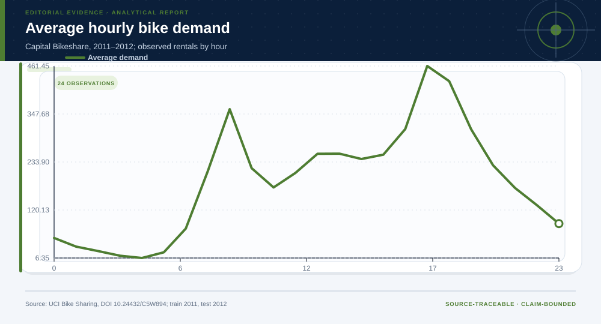
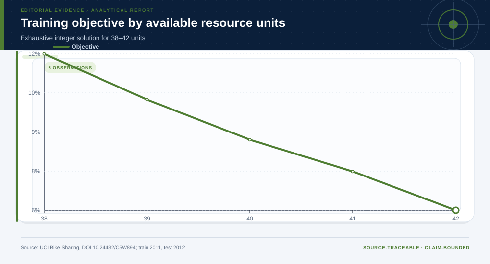

# Bike Sharing: analytical project

> **Bottom line:** A robust time-block allocation reduces modeled unmet demand out of time, while the forecast benchmark quantifies how much predictable structure exists.

## Executive Summary

This source-backed project connects the decision question to its data, validation design, visual evidence, and explicit claim boundary. The report structure follows this case rather than a fixed universal template.

### Evidence at a glance

| Signal | Observed result |
|---|---|
| Forecast MAE improvement versus overall-mean baseline | 38.3% |
| Held-out robust-policy unmet share | 20.5% |
| Perfect-foresight upper-bound improvement | 1.6% |
| Feasible integer allocations checked | 6,545 |

## Key findings with visual evidence

The visual sequence is interleaved with source, design, and limitation notes so each result stays adjacent to the evidence that supports it.

### Demand structure is evaluated out of time

The forecast learns from 2011 and is evaluated on 2012, preserving the direction of operational time.

> **Interpretation boundary:** System totals omit station imbalance, travel time, labor rules, and causal service response.

## Scope, source, and metric definitions

| Evidence contract | Recorded value |
|---|---|
| Source | Fanaee-T, H. (2013). Bike Sharing [Dataset]. UCI Machine Learning Repository. https://doi.org/10.24432/C5W894 |
| Version | 2011-2012 Capital Bikeshare hourly snapshot |
| Accessed | 2026-07-27 |
| License | [CC BY 4.0](https://creativecommons.org/licenses/by/4.0/) |
| Analytical grain | one observed hour in the Capital Bikeshare system |
| Expected rows | 17,379 |
| Results | [`results.json`](results.json) |
| Definitions | [`../data/data-dictionary.json`](../data/data-dictionary.json) |
| Quality | [`../data/quality-report.json`](../data/quality-report.json) |

### Feasible allocations reveal an explicit service trade-off

Every candidate respects the same resource total and minimum block coverage before unmet demand is compared.

> **Interpretation boundary:** Modeled unmet demand is a planning quantity, not a measured service outcome under rollout.

## Research design and data quality

### Design and estimand

| Design element | Project definition |
|---|---|
| Claim class | Unit, time split, target, constraints, and claim class are defined in `results.json`; no causal estimand is claimed unless the design explicitly supports one. |

### Data-quality gate

| Check | Result |
|---|---|
| Prepared shape | 17,379 rows × 17 columns |
| Duplicate primary keys | 0 |
| Missing values under declared tokens | 0 |
| Privacy review | approved_for_public_analysis |
| Quality disposition | **usable_with_documented_limitations** |

### The value of additional capacity is not constant

Resource shadow values and the perfect-information upper bound show where learning or added capacity could matter.

> **Interpretation boundary:** The curve is conditional on the simplified demand and allocation model.

## Methodology

Segmented demand benchmark, out-of-time MAE, exhaustive integer allocation, binding-constraint checks, Pareto frontier, resource shadow values, perfect-information upper bound, weather stress, and shared day bootstrap.

All shipped metrics are regenerated by `prepare_data.py` and `analyze.py`. Random procedures use fixed seeds, and committed raw files are checked against the SHA-256 values in `source-manifest.json`.

## Parameter provenance and review

6 configured or derived parameters are recorded with their source, uncertainty class, provisional approval, reviewer status, and use boundary.

<strong>Open the complete parameter-level source and review register</strong>

| Parameter path | Value or distribution | Uncertainty | Source | Approval | Reviewer | Boundary |
|---|---|---|---|---|---|---|
| config.analysis_seed | 20260727 | none | analysis-protocol | provisional_self_review | not_assigned | Computational setting; it does not increase evidence quality. |
| config.parameters.training_year | 2011 | none | time-split-protocol | provisional_self_review | not_assigned | Prevents random future-to-past leakage. |
| config.parameters.test_year | 2012 | none | time-split-protocol | provisional_self_review | not_assigned | Prevents random future-to-past leakage. |
| config.parameters.resource_units | 40 | scenario | analyst-capacity-scenario | provisional_self_review | not_assigned | Demonstration resource budget, not a Capital Bikeshare constraint. |
| config.parameters.rentals_per_unit_per_block | 120 | scenario | analyst-capacity-scenario | provisional_self_review | not_assigned | Scaling assumption for policy comparison. |
| config.parameters.minimum_units_per_six_hour_block | 2 | scenario | analyst-fairness-constraint | provisional_self_review | not_assigned | Coverage guardrail for demonstration. |

## Limitations, uncertainty, and robustness

System totals do not include station imbalances, travel times, labor rules, or causal service effects.

Bootstrap or scenario stability remains conditional on the observed sample and declared assumptions; it does not upgrade exploratory evidence into operational authorization.

## What this study cannot establish

| Boundary | Not established by this project |
|---|---|
| Causality | A causal effect unless the stated design and identification assumptions support it |
| Transport | Performance or effects in an unobserved population, institution, or future regime |
| Authorization | Permission for a clinical, policy, financial, engineering, marketing, or automated action |

## Decision implications and reversal conditions

The analysis can prioritize validation, diligence, or a bounded pilot; it is not itself permission to act. Reconsider the interpretation when:

- Station-level imbalance dominates system-block demand.
- Unit capacity differs materially by block.
- Labor, travel-time, or maintenance constraints invalidate feasibility.

## Conditional downstream decision layer

The Evidence Intelligence Report remains the primary record. The separate Decision Intelligence Brief applies case-specific gates and may end in a pilot, evidence request, non-deployment, or stop.

[Open the complete Decision Intelligence Brief](decision/report/decision-report.md).

## Recommended next steps

| Step | Action |
|---:|---|
| 1 | Re-run on a newly reviewed source version and compare the source hash, schema, and headline metrics. |
| 2 | Obtain domain-owner review of definitions, thresholds, exclusions, and action constraints. |
| 3 | Pre-register the next prospective or experimental validation before using any decision rule. |

## Further questions

- Which missing local variable could reverse the current ranking or interpretation?
- What prospective evidence would be required before operational use?
- Which subgroup, period, or spatial unit is least well represented?

<strong>Reproducibility receipt</strong>

- Project ID: `bike-demand-operations`
- Source manifest: [`../source-manifest.json`](../source-manifest.json)
- Result SHA-256: `19a23e81e8221e22afc1f86e1570546a95a5300bcb7cd6242ab9f4d46a37c78d`

