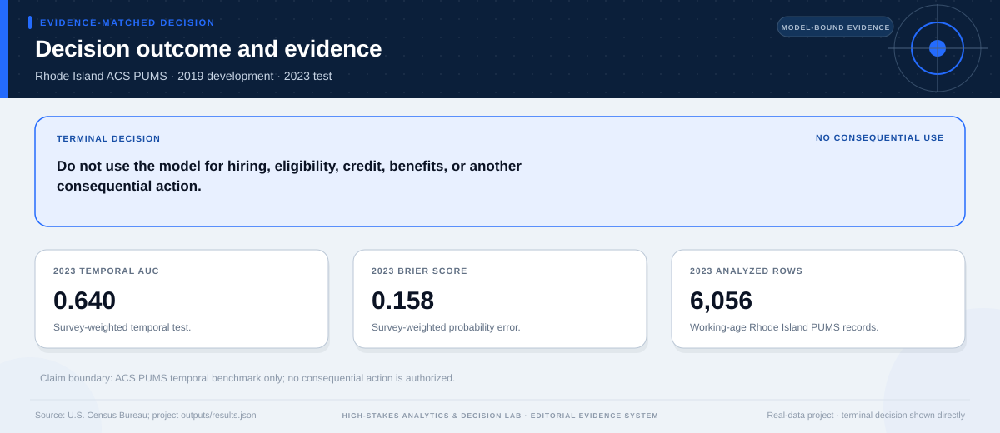
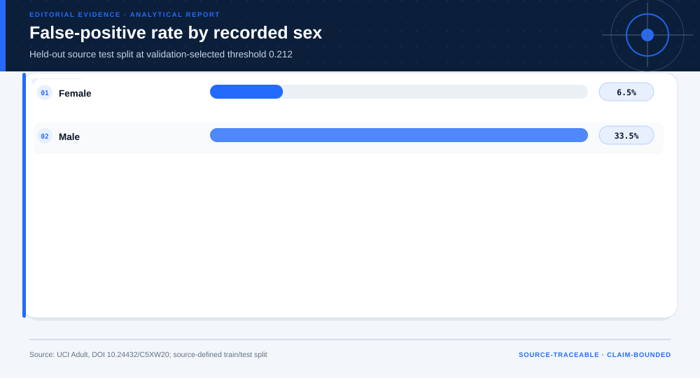
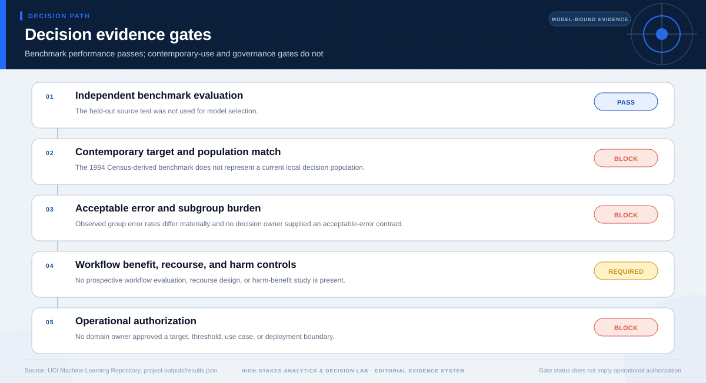

# Consequential-Use Decision: Census-Income Benchmark

## Technical summary

**Decision: Do not deploy this model for eligibility, credit, employment, or another consequential decision; retain it as a historical benchmark.**

The sparse logistic benchmark separates the historical independent test set well (AUC 0.905) and has a Brier score of 0.102. Those metrics do not establish transport, acceptable group error, a valid local target, recourse, or benefit in a real workflow.

The decision separates model benchmarking from deployment authority. A strong historical test result is useful evidence about the code path, not evidence that a contemporary institution should act on the scores.

## The independent benchmark is strong enough for method comparison—not use

The sparse logistic model improves AUC and probability error relative to the mixed naive-Bayes baseline. The chart is a model-comparison result on the independent source test; it is not a benefit estimate.

The comparison supports retaining the model as a reproducible benchmark. It does not resolve target validity, contemporary transport, intervention effects, or the cost of errors.

| Model or baseline | Metric | Independent-test result |
|---|---|---|
| Majority baseline | Accuracy | 0.764 |
| Mixed naive Bayes | AUC | 0.891 |
| Mixed naive Bayes | Brier score | 0.141 |
| Sparse logistic | AUC | 0.905 |
| Sparse logistic | Brier score | 0.102 |

## Calibration and subgroup errors prevent a single aggregate score from carrying the decision

Calibration is broadly informative at the benchmark level, while subgroup false-positive rates vary sharply. The group comparison is descriptive because the benchmark does not define a legitimate institutional action or acceptable-error policy.

The figure shows why aggregate AUC cannot substitute for an impact assessment. Small groups also carry wider sampling uncertainty, and the historical labels embed a social and economic context that may not transport.

## The evidence gates determine the terminal decision

The gate sequence distinguishes useful analytical evidence from the additional
evidence required for the requested decision. A pass on one gate does not
override a block or missing requirement on another.

The terminal status is **not_authorized_for_consequential_use**. This status follows from the
case-specific evidence contract; it is not a generic caution added after the
analysis.

## A real deployment would require a new validation contract

The next study must begin from a specific decision and population, not from the availability of this benchmark label.

| Required element | Current status | Evidence needed |
|---|---|---|
| Current local population | Absent | Representative, dated local sample |
| Decision-valid target | Absent | Owner-approved outcome and exclusion rules |
| Threshold and error costs | Absent | Pre-registered utility and harm contract |
| Prospective performance | Absent | Locked future-period or external validation |
| Recourse and monitoring | Absent | Human review, appeal, drift, and incident plan |

## What is permitted now—and what is not

### Supported uses

- Reproduce the historical benchmark and compare transparent methods.
- Study calibration, subgroup errors, drift checks, and abnormal-input behavior.
- Use the project as a template for a newly scoped validation study.

### Unsupported uses

- Use scores for eligibility, credit, employment, or resource access.
- Treat historical income labels as a causal or normative target.
- Represent AUC or accuracy as evidence of institutional benefit or fairness.

## Scope, source, and metric boundary

- **Source:** [Adult / Census Income](https://archive.ics.uci.edu/dataset/2/adult)
- **Publisher:** UCI Machine Learning Repository
- **Version:** UCI static archive snapshot; files timestamped 2023-05-22
- **Accessed:** 2026-07-27
- **Analytical grain:** one Census-derived person record meeting the dataset extraction rules
- **Prepared rows:** 48,842
- **Adaptive route:** descriptive → predictive → deployment decision
- **Main analytical report:** [Open report](../../report.md)
- **Machine-readable analytical results:** [Open results](../../results.json)

## Decision method and validation logic

- Select model and threshold without using the independent source test.
- Compare majority, mixed naive-Bayes, and sparse logistic benchmarks.
- Review discrimination, Brier score, calibration, subgroup errors, drift, and abnormal-input behavior separately.
- Apply contemporary-use, impact, recourse, and authorization gates after predictive validation.

The terminal decision is produced after the analytical evidence is reviewed
against case-specific gates. A missing capability, treatment effect, approval,
or operating input is recorded as missing evidence rather than assigned a
favorable value.

## Limitations, uncertainty, and reversal conditions

**Claim boundary.** Benchmark classification only; not validated for eligibility, credit, employment, or other consequential decisions.

The decision should be reconsidered only if new evidence changes one of these
conditions:

- A newly scoped, contemporary and representative dataset supports the exact decision target.
- A locked prospective evaluation meets owner-approved performance and subgroup-error gates.
- A reviewed workflow supplies recourse, monitoring, human authority, and incident controls.

## Recommended next steps

1. Define the proposed decision, affected population, target, exclusions, and non-model baseline.
2. Pre-register discrimination, calibration, subgroup-error, and abstention gates before fitting.
3. Validate on a dated external or prospective cohort and document recourse and monitoring.

## Further questions

- What real decision—if any—would justify predicting this target?
- Which errors create the greatest burden, and who has authority to set the trade-off?
- What evidence would demonstrate benefit over a non-model workflow?

## Reproducibility

- Decision result: [`decision-results.json`](decision-results.json)
- Decision chart map: [`figures/chart-map.json`](figures/chart-map.json)
- Source manifest: [`../../../source-manifest.json`](../../../source-manifest.json)
- Analytical result SHA-256: `a171a55231988fb6d5d2a518c093168e7fed4fea28603c2db39de870f2f4f23f`

The report is generated from the committed analytical result and source
manifest. It does not upgrade the permitted use of the underlying evidence.
