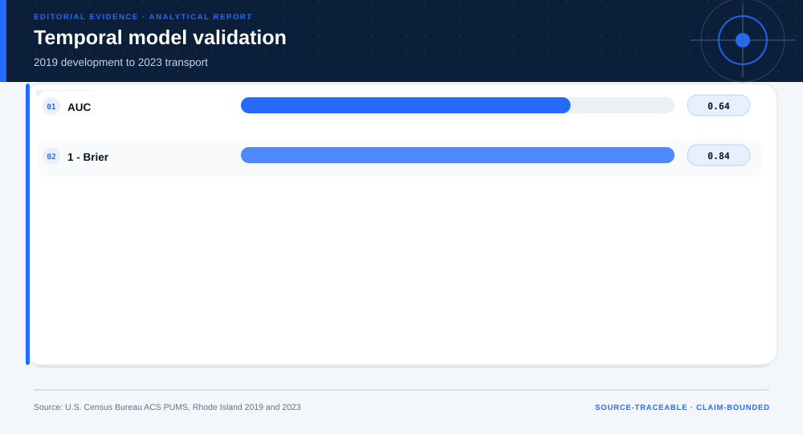

# Consequential-Use Decision: ACS Employment Transport Audit

## Technical summary

**Decision: Do not use the model for hiring, eligibility, credit, benefits, or another consequential action.**

The 2019 grouped-rate model reaches a 2023 survey-weighted AUC of 0.640 and Brier score of 0.158. These results document temporal transport behavior; they do not establish a valid decision target, individual benefit, recourse, or operational authorization.

A temporal test and protected-attribute audit are evidence about model limits, not permission to act on person-level scores.

## Temporal performance is documented without upgrading the use claim

The performance view reports the held-out 2023 result and keeps probability error visible beside ranking discrimination.

The metrics support model auditing only.

| Metric | 2023 result | Permitted interpretation |
|---|---|---|
| AUC | 0.640 | Temporal ranking discrimination |
| Brier score | 0.158 | Temporal probability error |
| Employment rate | 75.9% | Survey-weighted descriptive outcome |

## Calibration and audit slices control the boundary

Calibration compares predicted and observed rates in the later cohort; protected fields remain outside model inputs.

Population-period calibration does not establish person-level decision validity.

## The evidence gates determine the terminal decision

The gate sequence distinguishes useful analytical evidence from the additional
evidence required for the requested decision. A pass on one gate does not
override a block or missing requirement on another.

The terminal status is **do_not_use_for_consequential_action**. This status follows from the
case-specific evidence contract; it is not a generic caution added after the
analysis.

## The case terminates in non-deployment

Passing an engineering validation step is necessary but insufficient for a consequential system.

| Gate family | Observed state | Decision effect |
|---|---|---|
| Temporal test | Completed | Supports auditing |
| Valid target and benefit | Absent | Blocks use |
| Authorization | Absent | Blocks use |

## What is permitted now—and what is not

### Supported uses

- Reproduce the survey-weighted benchmark.
- Audit temporal calibration and subgroup performance.
- Use the case to demonstrate a negative deployment decision.

### Unsupported uses

- Rank people for hiring, benefits, credit, or eligibility.
- Interpret employment prediction as merit or suitability.
- Use aggregate audit results to infer individual causation.

## Scope, source, and metric boundary

- **Source:** [ACS Employment AI Temporal Transport and Audit](https://www.census.gov/programs-surveys/acs/microdata.html)
- **Publisher:** U.S. Census Bureau
- **Version:** Rhode Island ACS 1-year PUMS person files, 2019 and 2023
- **Accessed:** 2026-08-10
- **Analytical grain:** one working-age ACS PUMS person record
- **Prepared rows:** 12,469
- **Adaptive route:** survey-weighted modeling → temporal validation → non-deployment
- **Main analytical report:** [Open report](../../report.md)
- **Machine-readable analytical results:** [Open results](../../results.json)

## Decision method and validation logic

- Use 2019 only for model construction.
- Evaluate on survey-weighted 2023 records.
- Reserve protected attributes for audit slices.
- Terminate at non-deployment when use-validity evidence is absent.

The terminal decision is produced after the analytical evidence is reviewed
against case-specific gates. A missing capability, treatment effect, approval,
or operating input is recorded as missing evidence rather than assigned a
favorable value.

## Limitations, uncertainty, and reversal conditions

**Claim boundary.** ACS PUMS temporal benchmark only; no consequential action is authorized.

The decision should be reconsidered only if new evidence changes one of these
conditions:

- A current external population reproduces calibration and subgroup performance.
- A real decision owner supplies a lawful, valid target and governance review.
- Protected-class audit and error-cost review support a bounded use.

## Recommended next steps

1. Validate only against a lawful, decision-specific target.
2. Pre-register benefit, harm, calibration, and subgroup gates.
3. Obtain independent governance and domain review before any pilot.

## Further questions

- What real decision outcome would be valid and lawful?
- What recourse would a person have?
- Which subgroup errors would be unacceptable?

## Reproducibility

- Decision result: [`decision-results.json`](decision-results.json)
- Decision chart map: [`figures/chart-map.json`](figures/chart-map.json)
- Source manifest: [`../../../source-manifest.json`](../../../source-manifest.json)
- Analytical result SHA-256: `d3483a2ad3a7c1bfc68c03c0c1b3484cc07b7b1d6ec59d894722e23691be5ee4`

The report is generated from the committed analytical result and source
manifest. It does not upgrade the permitted use of the underlying evidence.
