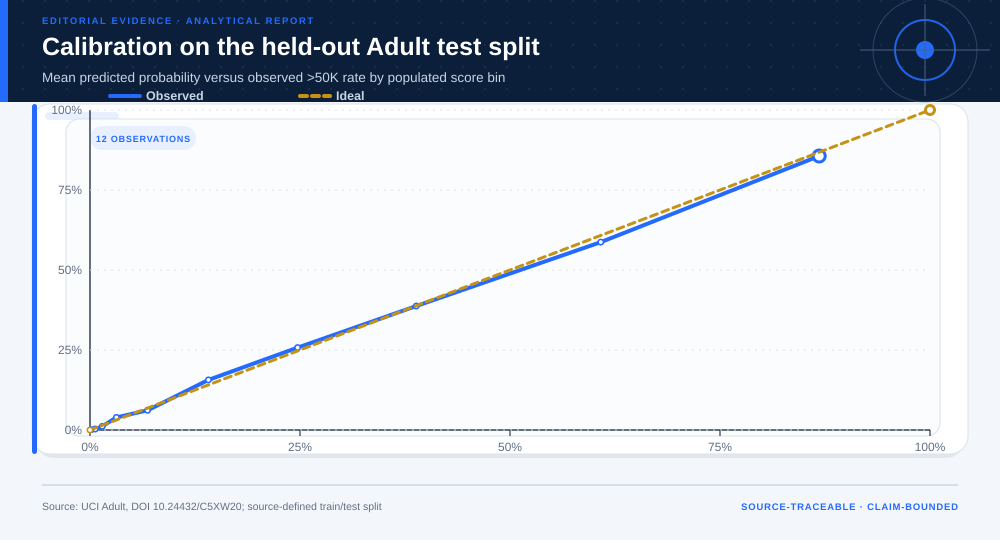

# Adult / Census Income: analytical project

> **Bottom line:** The benchmark classifier improves on the majority baseline, but subgroup error rates and imperfect calibration make consequential reuse indefensible.

## Executive Summary

This source-backed project connects the decision question to its data, validation design, visual evidence, and explicit claim boundary. The report structure follows this case rather than a fixed universal template.

### Evidence at a glance

| Signal | Observed result |
|---|---|
| Independent-test AUC | 0.905 |
| Independent-test Brier score | 0.102 |
| Naive Bayes versus sparse-logistic AUC | 0.891 versus 0.905 |
| Selected L2 | 0.0 |

## Key findings with visual evidence

The visual sequence is interleaved with source, design, and limitation notes so each result stays adjacent to the evidence that supports it.

### The independent test supports benchmarking, not deployment

Sparse logistic performance is compared with majority and mixed-naive-Bayes baselines on the untouched source test.

> **Interpretation boundary:** Historical test performance does not establish contemporary validity or institutional benefit.

## Scope, source, and metric definitions

| Evidence contract | Recorded value |
|---|---|
| Source | Becker, B. & Kohavi, R. (1996). Adult [Dataset]. UCI Machine Learning Repository. https://doi.org/10.24432/C5XW20 |
| Version | UCI static archive snapshot; files timestamped 2023-05-22 |
| Accessed | 2026-07-27 |
| License | [CC BY 4.0](https://creativecommons.org/licenses/by/4.0/) |
| Analytical grain | one Census-derived person record meeting the dataset extraction rules |
| Expected rows | 48,842 |
| Results | [`results.json`](results.json) |
| Definitions | [`../data/data-dictionary.json`](../data/data-dictionary.json) |
| Quality | [`../data/quality-report.json`](../data/quality-report.json) |

### Aggregate discrimination does not describe subgroup error

Sex- and race-stratified false-positive rates expose heterogeneity hidden by a single AUC.

> **Interpretation boundary:** These are descriptive error diagnostics; they are not a complete fairness or impact assessment.

## Research design and data quality

### Design and estimand

| Design element | Project definition |
|---|---|
| Claim class | Unit, time split, target, constraints, and claim class are defined in `results.json`; no causal estimand is claimed unless the design explicitly supports one. |

### Data-quality gate

| Check | Result |
|---|---|
| Prepared shape | 48,842 rows × 16 columns |
| Duplicate primary keys | 0 |
| Missing values under declared tokens | 6,465 |
| Privacy review | approved_for_public_benchmark_analysis |
| Quality disposition | **usable_with_documented_limitations** |

### Probability quality is evaluated separately from ranking

Calibration shows whether predicted probabilities align with observed frequencies across the historical test sample.

> **Interpretation boundary:** Calibration in this archive cannot validate a future population, target, threshold, or workflow.

## Methodology

Majority and mixed-naive-Bayes baselines, sparse one-hot logistic regression, internal hyperparameter selection, independent source test, validation-only cost threshold, calibration, drift, subgroup, and abnormal-input diagnostics.

All shipped metrics are regenerated by `prepare_data.py` and `analyze.py`. Random procedures use fixed seeds, and committed raw files are checked against the SHA-256 values in `source-manifest.json`.

## Parameter provenance and review

5 configured or derived parameters are recorded with their source, uncertainty class, provisional approval, reviewer status, and use boundary.

<strong>Open the complete parameter-level source and review register</strong>

| Parameter path | Value or distribution | Uncertainty | Source | Approval | Reviewer | Boundary |
|---|---|---|---|---|---|---|
| config.analysis_seed | 20260727 | none | analysis-protocol | provisional_self_review | not_assigned | Computational setting; it does not increase evidence quality. |
| config.parameters.decision_threshold | 0.5 | none | analysis-protocol | provisional_self_review | not_assigned | Not optimized for or authorized in any real decision. |
| config.parameters.calibration_bins | 10 | none | analysis-protocol | provisional_self_review | not_assigned | Bins with no observations are omitted. |
| config.parameters.train_split | adult.data | none | uci-source-split | provisional_self_review | not_assigned | Final metrics use only the held-out test split. |
| config.parameters.test_split | adult.test | none | uci-source-split | provisional_self_review | not_assigned | Final metrics use only the held-out test split. |

## Limitations, uncertainty, and robustness

1994 Census-derived data, missing categories, historical social structure, and no validation for any real eligibility decision.

Bootstrap or scenario stability remains conditional on the observed sample and declared assumptions; it does not upgrade exploratory evidence into operational authorization.

## What this study cannot establish

| Boundary | Not established by this project |
|---|---|
| Causality | A causal effect unless the stated design and identification assumptions support it |
| Transport | Performance or effects in an unobserved population, institution, or future regime |
| Authorization | Permission for a clinical, policy, financial, engineering, marketing, or automated action |

## Decision implications and reversal conditions

The analysis can prioritize validation, diligence, or a bounded pilot; it is not itself permission to act. Reconsider the interpretation when:

- A prospective or external validation reverses the observed ranking.
- A missing local constraint changes feasibility or the outcome definition.
- A domain owner rejects the analyst-defined threshold, scale, or trade-off.

## Conditional downstream decision layer

The Evidence Intelligence Report remains the primary record. The separate Decision Intelligence Brief applies case-specific gates and may end in a pilot, evidence request, non-deployment, or stop.

[Open the complete Decision Intelligence Brief](decision/report/decision-report.md).

## Recommended next steps

| Step | Action |
|---:|---|
| 1 | Re-run on a newly reviewed source version and compare the source hash, schema, and headline metrics. |
| 2 | Obtain domain-owner review of definitions, thresholds, exclusions, and action constraints. |
| 3 | Pre-register the next prospective or experimental validation before using any decision rule. |

## Further questions

- Which missing local variable could reverse the current ranking or interpretation?
- What prospective evidence would be required before operational use?
- Which subgroup, period, or spatial unit is least well represented?

<strong>Reproducibility receipt</strong>

- Project ID: `census-income-ai`
- Source manifest: [`../source-manifest.json`](../source-manifest.json)
- Result SHA-256: `a171a55231988fb6d5d2a518c093168e7fed4fea28603c2db39de870f2f4f23f`

