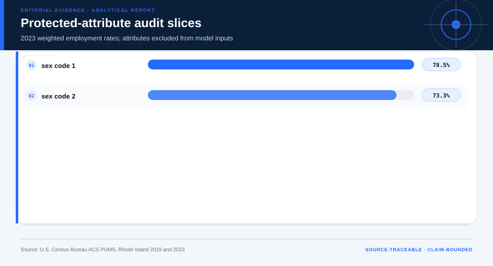

# ACS Employment AI Temporal Transport and Audit: analytical project

> **Bottom line:** A 2019 ACS PUMS employment model is tested on 2023 Rhode Island records with protected attributes reserved for audit; it is not authorized for eligibility, hiring, or other consequential use.

## Executive Summary

This source-backed project connects the decision question to its data, validation design, visual evidence, and explicit claim boundary. The report structure follows this case rather than a fixed universal template.

### Evidence at a glance

| Signal | Observed result |
|---|---|
| 2023 temporal-test AUC | 0.640 |
| 2023 weighted Brier score | 0.158 |
| 2019/2023 analyzed people | 6,413 / 6,056 |
| Decision status | no consequential use |

## Key findings with visual evidence

The visual sequence is interleaved with source, design, and limitation notes so each result stays adjacent to the evidence that supports it.

### Temporal performance

The 2023 cohort is untouched during model construction.

> **Interpretation boundary:** No consequential use is authorized.

## Scope, source, and metric definitions

| Evidence contract | Recorded value |
|---|---|
| Source | U.S. Census Bureau. Rhode Island ACS 1-year PUMS person files, 2019 and 2023. |
| Version | Rhode Island ACS 1-year PUMS person files, 2019 and 2023 |
| Accessed | 2026-08-10 |
| License | [U.S. Government open data](https://www.census.gov/about/policies/open-gov/open-data.html) |
| Analytical grain | one working-age ACS PUMS person record |
| Expected rows | 12,469 |
| Results | [`results.json`](results.json) |
| Definitions | [`../data/data-dictionary.json`](../data/data-dictionary.json) |
| Quality | [`../data/quality-report.json`](../data/quality-report.json) |

### 2023 calibration

Predicted and survey-weighted observed rates are compared.

> **Interpretation boundary:** Calibration is population- and period-specific.

## Research design and data quality

### Design and estimand

| Design element | Project definition |
|---|---|
| Design | survey-weighted temporal transport test |
| Model Inputs | age band, education band, worker class, PUMA |
| Audit Only Fields | sex, race, Hispanic origin |
| Target | current employment status |

### Data-quality gate

| Check | Result |
|---|---|
| Prepared shape | 12,469 rows × 12 columns |
| Duplicate primary keys | 0 |
| Missing values under declared tokens | 0 |
| Privacy review | approved_for_public_minimized_analysis |
| Quality disposition | **ready** |

### Protected-attribute audit

Audit fields remain outside model inputs.

> **Interpretation boundary:** Displayed differences are not causal explanations.

## Methodology

Survey-weighted grouped-rate model, temporal AUC/Brier/calibration, cohort drift, and sex/race audit slices excluded from model inputs.

All shipped metrics are regenerated by `prepare_data.py` and `analyze.py`. Random procedures use fixed seeds, and committed raw files are checked against the SHA-256 values in `source-manifest.json`.

## Parameter provenance and review

5 configured or derived parameters are recorded with their source, uncertainty class, provisional approval, reviewer status, and use boundary.

<strong>Open the complete parameter-level source and review register</strong>

| Parameter path | Value or distribution | Uncertainty | Source | Approval | Reviewer | Boundary |
|---|---|---|---|---|---|---|
| config.analysis_seed | 20260810 | none | analysis-protocol | provisional_self_review | not_assigned | Computational setting; it does not increase evidence quality. |
| config.parameters.development_year | 2019 | none | case-specific-analysis-protocol | provisional_self_review | not_assigned | No eligibility, hiring, credit, benefits, or other consequential action. |
| config.parameters.test_year | 2023 | none | case-specific-analysis-protocol | provisional_self_review | not_assigned | No eligibility, hiring, credit, benefits, or other consequential action. |
| config.parameters.model_fields | ['age_band', 'education_band', 'worker_class', 'puma'] | none | case-specific-analysis-protocol | provisional_self_review | not_assigned | No eligibility, hiring, credit, benefits, or other consequential action. |
| config.parameters.audit_only_fields | ['sex', 'race', 'hispanic_origin'] | none | case-specific-analysis-protocol | provisional_self_review | not_assigned | No eligibility, hiring, credit, benefits, or other consequential action. |

## Limitations, uncertainty, and robustness

Employment status is not suitability or merit; PUMS is a survey sample, the model is deliberately simple, and no real decision owner or lawful use has validated it.

Bootstrap or scenario stability remains conditional on the observed sample and declared assumptions; it does not upgrade exploratory evidence into operational authorization.

## What this study cannot establish

| Boundary | Not established by this project |
|---|---|
| Causality | A causal effect unless the stated design and identification assumptions support it |
| Transport | Performance or effects in an unobserved population, institution, or future regime |
| Authorization | Permission for a clinical, policy, financial, engineering, marketing, or automated action |

## Decision implications and reversal conditions

The analysis can prioritize validation, diligence, or a bounded pilot; it is not itself permission to act. Reconsider the interpretation when:

- A current external population reproduces calibration and subgroup performance.
- A real decision owner supplies a lawful, valid target and governance review.
- Protected-class audit and error-cost review support a bounded use.

## Conditional downstream decision layer

The Evidence Intelligence Report remains the primary record. The separate Decision Intelligence Brief applies case-specific gates and may end in a pilot, evidence request, non-deployment, or stop.

[Open the complete Decision Intelligence Brief](decision/report/decision-report.md).

## Recommended next steps

| Step | Action |
|---:|---|
| 1 | Re-run on a newly reviewed source version and compare the source hash, schema, and headline metrics. |
| 2 | Obtain domain-owner review of definitions, thresholds, exclusions, and action constraints. |
| 3 | Pre-register the next prospective or experimental validation before using any decision rule. |

## Further questions

- Which missing local variable could reverse the current ranking or interpretation?
- What prospective evidence would be required before operational use?
- Which subgroup, period, or spatial unit is least well represented?

<strong>Reproducibility receipt</strong>

- Project ID: `census-income-ai`
- Source manifest: [`../source-manifest.json`](../source-manifest.json)
- Result SHA-256: `d3483a2ad3a7c1bfc68c03c0c1b3484cc07b7b1d6ec59d894722e23691be5ee4`

