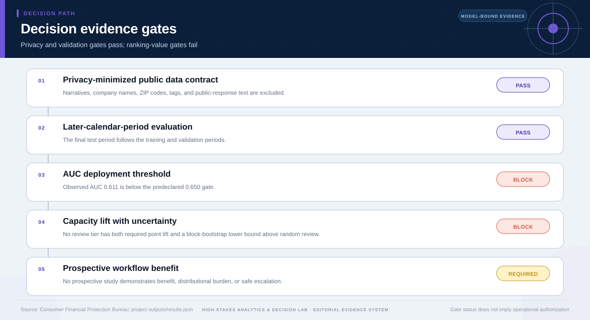

# Deployment Decision: Complaint Ranking Model

## Technical summary

**Decision: Do not deploy the individual complaint-ranking model; retain the privacy-minimized data contract, aggregate monitoring, and negative-validation evidence.**

The later-period test AUC is 0.611 with a block interval of 0.539–0.697. At 5% review capacity the model captures 5.0% of positives—effectively the random-review share—and no tested capacity passes the lift gate with uncertainty.

The negative result is the decision. Privacy minimization and honest time validation are valuable design properties, but neither can turn weak operational ranking gain into a deployable model.

## The cumulative-gain curve shows no reliable review advantage

At 5%, 10%, and 20% review capacities, observed capture remains close to random review and uncertainty intervals include no improvement. This is the operational comparison the deployment decision requires.

A statistically non-random AUC does not guarantee useful ranking at the actual operating capacity. Here, capacity performance does not create a reliable review advantage.

| Review tier | Positive capture | Lift vs random | 95% lift interval | Gate |
|---|---|---|---|---|
| 5% | 5.0% | 1.00 | 0.33–2.46 | Fail |
| 10% | 11.7% | 1.16 | 0.40–1.86 | Fail |
| 20% | 20.0% | 1.00 | 0.57–1.75 | Fail |

## The AUC exceeds the permutation center but still misses the deployment gate

The permutation benchmark shows that the model contains some statistical signal. The deployment question is stricter: whether that signal produces stable operational gain in the later period.

This distinction prevents a low p-value from being mistaken for decision value. The model fails both the predeclared AUC threshold and the capacity-lift requirement.

## The evidence gates determine the terminal decision

The gate sequence distinguishes useful analytical evidence from the additional
evidence required for the requested decision. A pass on one gate does not
override a block or missing requirement on another.

The terminal status is **do_not_deploy**. This status follows from the
case-specific evidence contract; it is not a generic caution added after the
analysis.

## Re-entry requires prospective evidence, not threshold shopping

A future model should return to review only after a pre-registered later-period evaluation meets all gates.

| Re-entry gate | Minimum evidence | Why it matters |
|---|---|---|
| Discrimination | Later-period AUC at or above 0.650 | Prevents deployment of weak rankers |
| Capacity value | Point lift at or above 1.20 and 95% lower bound above 1.00 | Requires gain beyond random review |
| Privacy | No expansion beyond approved operational fields without review | Preserves minimization boundary |
| Workflow | Prospective benefit and burden evaluation | Tests real operational consequences |
| Monitoring | Drift, capacity, subgroup, and incident triggers | Constrains post-launch degradation |

## What is permitted now—and what is not

### Supported uses

- Retain aggregate complaint-volume and timeliness monitoring.
- Reuse the privacy-minimized extraction and calendar validation design.
- Document the negative result as evidence against deployment.

### Unsupported uses

- Rank individual complaints with the tested model.
- Interpret the timely indicator as merit, harm, resolution quality, or compliance.
- Use statistical significance to override failed operational gates.

## Scope, source, and metric boundary

- **Source:** [Consumer Complaint Database: Money Transfer, Virtual Currency, or Money Service](https://www.consumerfinance.gov/data-research/consumer-complaints/)
- **Publisher:** Consumer Financial Protection Bureau
- **Version:** Closed 2022 UTC date window; privacy-minimized extract created 2026-07-27
- **Accessed:** 2026-07-27
- **Analytical grain:** one CFPB complaint received in 2022 for a money-transfer, virtual-currency, or money-service product
- **Prepared rows:** 13,534
- **Adaptive route:** descriptive → predictive → deployment decision
- **Main analytical report:** [Open report](../../report.md)
- **Machine-readable analytical results:** [Open results](../../results.json)

## Decision method and validation logic

- Minimize the stored administrative fields before analysis.
- Use ordered calendar train, validation, and later-period test windows.
- Validate calibration, AUC, cumulative gain, and capacity lift on the held-out period.
- Use day-block resampling and a 500-permutation null benchmark before applying deployment gates.

The terminal decision is produced after the analytical evidence is reviewed
against case-specific gates. A missing capability, treatment effect, approval,
or operating input is recorded as missing evidence rather than assigned a
favorable value.

## Limitations, uncertainty, and reversal conditions

**Claim boundary.** The timely indicator is not complaint merit, consumer harm, resolution quality, company quality, or regulatory compliance. Weak ranking performance cannot be rescued by privacy or validation discipline; those are separate contributions.

The decision should be reconsidered only if new evidence changes one of these
conditions:

- A pre-registered future-period evaluation exceeds the AUC gate and reproduces material lift above random review.
- Operationally available features add stable signal without violating the privacy and use boundary.
- A prospective workflow study demonstrates benefit and checks distributional burden before any ranking use.

## Recommended next steps

1. Define a future-period protocol and freeze AUC, capacity-lift, privacy, and burden gates before fitting.
2. Evaluate whether newly available operational features add stable signal without expanding sensitive data use.
3. Run a prospective workflow study before any return to individual ranking.

## Further questions

- Which operationally available feature could improve ranking without increasing privacy risk?
- Would aggregate staffing forecasts provide more value than individual ranking?
- Which groups or complaint types could bear disproportionate review delay?

## Reproducibility

- Decision result: [`decision-results.json`](decision-results.json)
- Decision chart map: [`figures/chart-map.json`](figures/chart-map.json)
- Source manifest: [`../../../source-manifest.json`](../../../source-manifest.json)
- Analytical result SHA-256: `aa0ecb2076431be2f9b9da5223e24cb87e1eba1f9324e8d2cedfc61cac8e9cdd`

The report is generated from the committed analytical result and source
manifest. It does not upgrade the permitted use of the underlying evidence.
