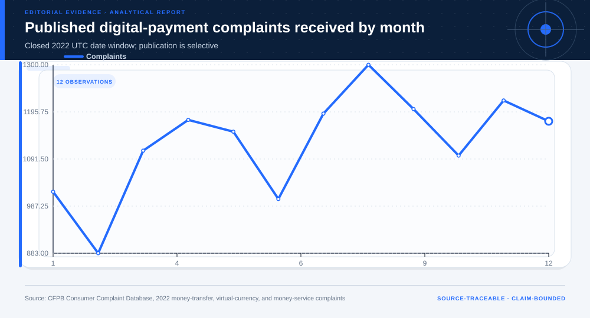
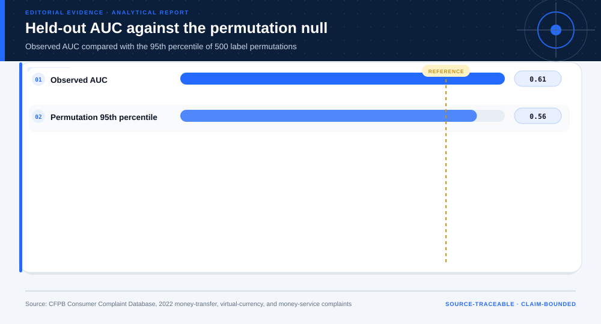
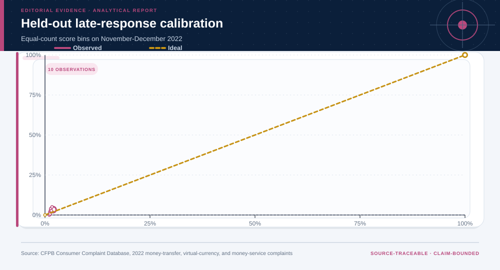
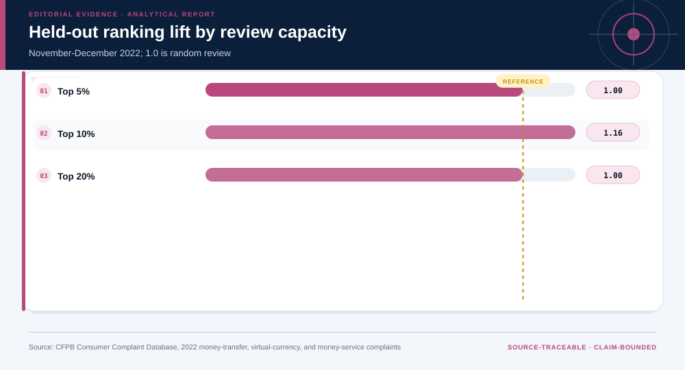
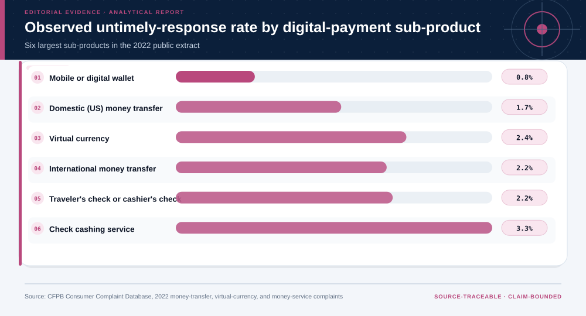
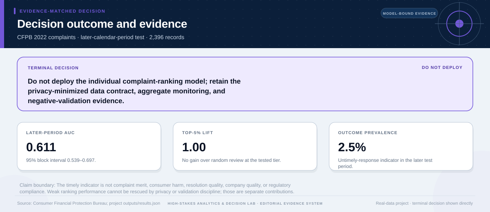

# Human-in-the-Loop Complaint Triage Information System: analytical project

> **Bottom line:** The later-period ranking model fails the deployment gate: AUC is weak and top-capacity lift is not reliably above random review. The defensible contribution is the privacy-preserving data contract, calendar validation, and explicit negative result.

## Executive Summary

This source-backed project connects the decision question to its data, validation design, visual evidence, and explicit claim boundary. The report structure follows this case rather than a fixed universal template.

### Evidence at a glance

| Signal | Observed result |
|---|---|
| Model decision | do not deploy ranking model |
| Later-period untimely-response prevalence | 2.5% |
| Later-period AUC | 0.611 (block-bootstrap 95% interval 0.539 to 0.697) |
| Top-5% lift versus random | 1.00 (95% interval 0.33 to 2.46) |

## Key findings with visual evidence

The visual sequence is interleaved with source, design, and limitation notes so each result stays adjacent to the evidence that supports it.

### Calendar structure defines the validation contract

Complaint volume is shown over time because later-period validation—not a random split—matches the monitoring question.

> **Interpretation boundary:** Published complaints are selective and do not measure the underlying incidence of consumer harm.

## Scope, source, and metric definitions

| Evidence contract | Recorded value |
|---|---|
| Source | Consumer Financial Protection Bureau. Consumer Complaint Database, money transfer, virtual currency, or money service complaints received in 2022. Privacy-minimized API extract accessed 2026-07-27. |
| Version | Closed 2022 UTC date window; privacy-minimized extract created 2026-07-27 |
| Accessed | 2026-07-27 |
| License | [CC0](https://github.com/cfpb/ccdb5-api/blob/main/LICENSE) |
| Analytical grain | one CFPB complaint received in 2022 for a money-transfer, virtual-currency, or money-service product |
| Expected rows | 13,534 |
| Results | [`results.json`](results.json) |
| Definitions | [`../data/data-dictionary.json`](../data/data-dictionary.json) |
| Quality | [`../data/quality-report.json`](../data/quality-report.json) |

### The observed AUC is weak against a label-permutation null

A day-block interval and 500-permutation benchmark make the limited discrimination explicit.

> **Interpretation boundary:** A weak ranking result should terminate deployment rather than be rescued by narrative.

## Research design and data quality

### Design and estimand

| Design element | Project definition |
|---|---|
| Claim class | Unit, time split, target, constraints, and claim class are defined in `results.json`; no causal estimand is claimed unless the design explicitly supports one. |

### Data-quality gate

| Check | Result |
|---|---|
| Prepared shape | 13,534 rows × 10 columns |
| Duplicate primary keys | 0 |
| Missing values under declared tokens | 0 |
| Privacy review | approved_for_public_aggregate_analysis |
| Quality disposition | **ready** |

### Calibration is tested only after model selection

The November–December period remains separate from model and calibrator choice.

> **Interpretation boundary:** Probability calibration cannot compensate for weak ranking or an outcome with limited decision meaning.

## Human-in-the-loop system contract

The validated analytical endpoint is translated into an auditable workflow without overriding the negative model result.

| System element | Recorded design |
|---|---|
| Decision owner | human complaint-operations reviewer |
| Automation status | `aggregate_monitoring_only` |
| Individual model signal | available only as retained validation evidence; suppressed from the review queue because the deployment gate failed |

### Review lanes from observed workflow fields

| Review lane | Records | Rule |
|---|---:|---|
| `aggregate_trend_monitoring` | 12,180 | no individual escalation; retain only in aggregate issue and volume monitoring |
| `workflow_delay_review` | 1,354 | CFPB intake-to-company transmission exceeds the illustrative 24-hour monitoring marker |

The lane counts are workflow observations. They are not findings about complaint merit, consumer harm, company quality, or compliance. The complete machine-readable contract is in [`system-contract.json`](system-contract.json).

## Methodology

Privacy-minimized administrative data, calendar train/validation/test split, rare-outcome AUC/Brier/calibration, cumulative gain, capacity lift versus random review, day-block bootstrap, label-permutation null benchmark, subgroup diagnostics, and explicit non-deployment gates.

All shipped metrics are regenerated by `prepare_data.py` and `analyze.py`. Random procedures use fixed seeds, and committed raw files are checked against the SHA-256 values in `source-manifest.json`.

### The gain curve stays close to random review

Useful operational ranking should visibly separate from the diagonal; this model does not.

> **Interpretation boundary:** The chart supports a negative validation result, not a claim that all future models will fail.

## Additional validation and robustness views

These views test a separate diagnostic, sensitivity, or evidence boundary; they do not create a new causal or operational claim.

### No tested review capacity delivers reliable lift

Every capacity is compared with random review and paired with day-block uncertainty.

> **Interpretation boundary:** No artificial utility score is introduced to force a preferred operating point.

### Subproduct differences remain descriptive context

Observed late-response rates identify where definitions and process review may be most useful.

> **Interpretation boundary:** The timely-response flag does not establish complaint merit, resolution quality, compliance, or company quality.

## Parameter provenance and review

12 configured or derived parameters are recorded with their source, uncertainty class, provisional approval, reviewer status, and use boundary.

<strong>Open the complete parameter-level source and review register</strong>

| Parameter path | Value or distribution | Uncertainty | Source | Approval | Reviewer | Boundary |
|---|---|---|---|---|---|---|
| config.analysis_seed | 20260727 | none | analysis-protocol | provisional_self_review | not_assigned | Computational setting; it does not increase evidence quality. |
| config.parameters.train_end | 2022-08-31 | none | closed-period-time-split | provisional_self_review | not_assigned | Calendar split tests later-period transport within 2022, not post-2022 generalization. |
| config.parameters.validation_end | 2022-10-31 | none | closed-period-time-split | provisional_self_review | not_assigned | Calendar split tests later-period transport within 2022, not post-2022 generalization. |
| config.parameters.test_end | 2022-12-31 | none | closed-period-time-split | provisional_self_review | not_assigned | Calendar split tests later-period transport within 2022, not post-2022 generalization. |
| config.parameters.triage_capacity_shares | [0.05, 0.1, 0.2] | scenario | analyst-capacity-scenarios | provisional_self_review | not_assigned | Illustrative review capacity, not a CFPB or company service-level target. |
| config.parameters.bootstrap_samples | 500 | none | analysis-protocol | provisional_self_review | not_assigned | Computational setting; it does not increase evidence quality. |
| config.parameters.bootstrap_block_days | 7 | none | dependence-preserving-resampling-rule | provisional_self_review | not_assigned | Week blocks preserve shared calendar shocks better than independent complaint resampling; block length is sensitivity-tested. |
| config.parameters.permutation_samples | 500 | none | negative-validation-protocol | provisional_self_review | not_assigned | Permutation inference benchmarks ranking signal against label exchangeability; it does not establish transport. |
| config.parameters.minimum_deployment_auc | 0.65 | none | analyst-deployment-gate | provisional_self_review | not_assigned | These are repository demonstration gates, not CFPB, regulatory, or company standards; passing them would still require prospective validation. |
| config.parameters.minimum_deployment_lift | 1.2 | none | analyst-deployment-gate | provisional_self_review | not_assigned | These are repository demonstration gates, not CFPB, regulatory, or company standards; passing them would still require prospective validation. |
| config.parameters.workflow_delay_hours | 24 | scenario | analyst-workflow-monitoring-scenario | provisional_self_review | not_assigned | The 24-hour marker is an illustrative monitoring lane, not a CFPB service-level requirement or evidence of untimely company response. |
| derived.timely | derived or source-defined field | none | cfpb-field-definition | provisional_self_review | not_assigned | A timely-response flag is not a measure of complaint merit, consumer harm, resolution quality, or regulatory compliance. |

## Limitations, uncertainty, and robustness

Published complaints are selective; the timely flag does not measure complaint merit, harm, resolution quality, company quality, or compliance. The 2022 model is weak and may not transport.

Bootstrap or scenario stability remains conditional on the observed sample and declared assumptions; it does not upgrade exploratory evidence into operational authorization.

## What this study cannot establish

| Boundary | Not established by this project |
|---|---|
| Causality | A causal effect unless the stated design and identification assumptions support it |
| Transport | Performance or effects in an unobserved population, institution, or future regime |
| Authorization | Permission for a clinical, policy, financial, engineering, marketing, or automated action |

## Decision implications and reversal conditions

The analysis can prioritize validation, diligence, or a bounded pilot; it is not itself permission to act. Reconsider the interpretation when:

- A pre-registered future-period evaluation exceeds the AUC gate and reproduces material lift above random review.
- Operationally available features add stable signal without violating the privacy and use boundary.
- A prospective workflow study demonstrates benefit and checks distributional burden before any ranking use.

## Conditional downstream decision layer

The Evidence Intelligence Report remains the primary record. The separate Decision Intelligence Brief applies case-specific gates and may end in a pilot, evidence request, non-deployment, or stop.

[Open the complete Decision Intelligence Brief](decision/report/decision-report.md).

## Recommended next steps

| Step | Action |
|---:|---|
| 1 | Re-run on a newly reviewed source version and compare the source hash, schema, and headline metrics. |
| 2 | Obtain domain-owner review of definitions, thresholds, exclusions, and action constraints. |
| 3 | Pre-register the next prospective or experimental validation before using any decision rule. |

## Further questions

- Which missing local variable could reverse the current ranking or interpretation?
- What prospective evidence would be required before operational use?
- Which subgroup, period, or spatial unit is least well represented?

<strong>Reproducibility receipt</strong>

- Project ID: `cfpb-fintech-complaint-operations`
- Source manifest: [`../source-manifest.json`](../source-manifest.json)
- Result SHA-256: `47e78a758ae96efa49fb02cb1574a464e0ef6622cfcd9435c9bf4de5ed2aa7da`

