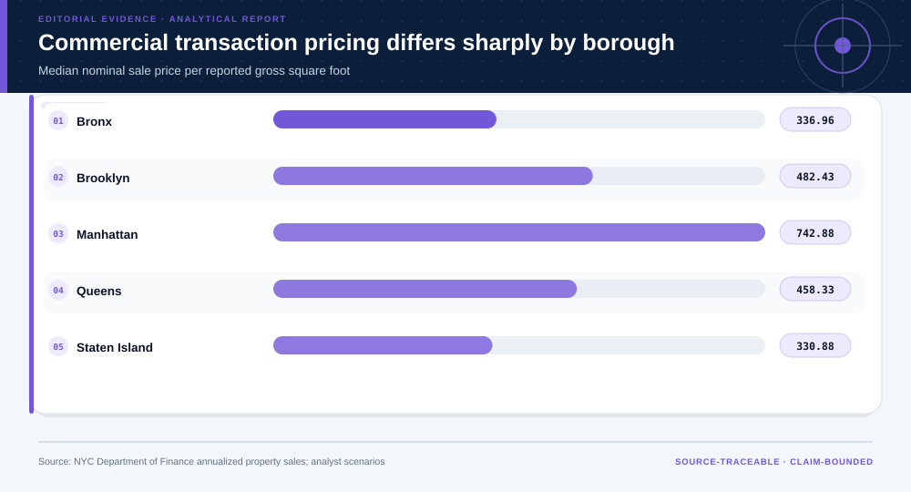
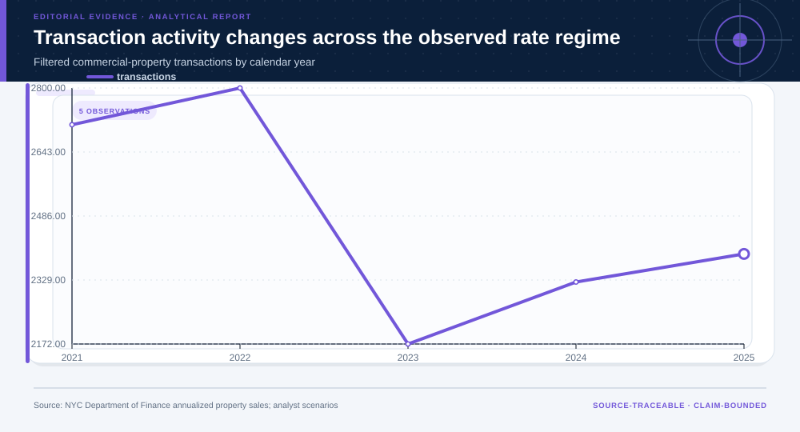
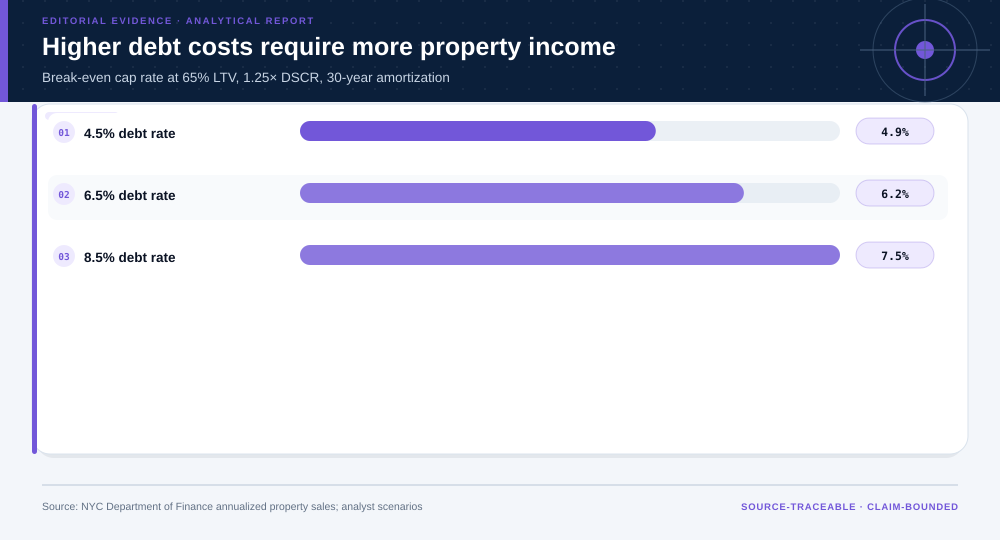
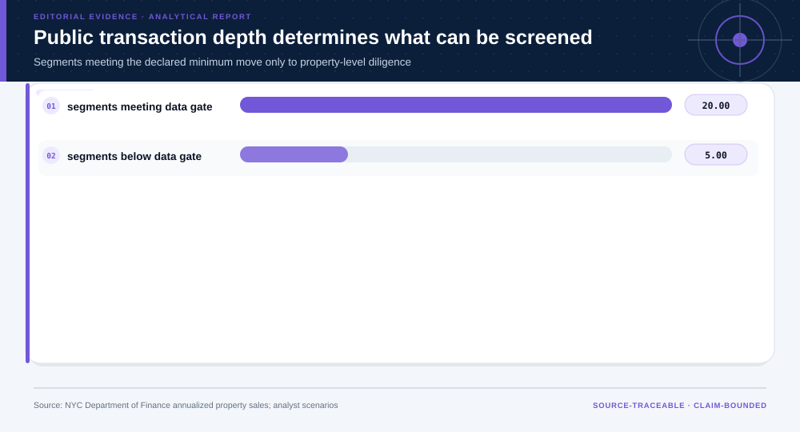
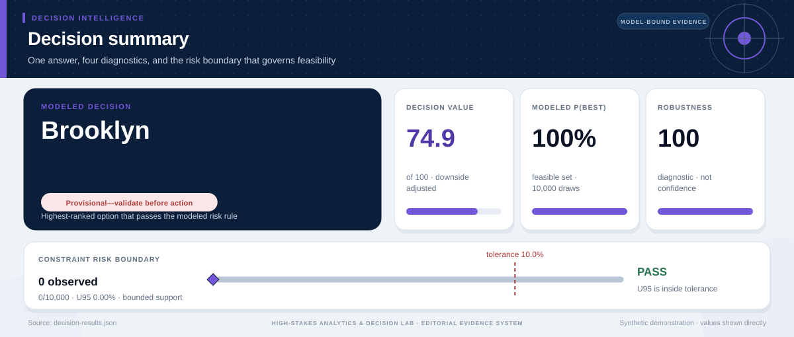

# Commercial Real Estate Transactions and Regeneration Risk: analytical project

> **Bottom line:** Public sales records support a transaction-liquidity and price screen; financing scenarios can identify evidence needs, but property-level income, condition, leases, title, and loan terms are required before valuation or investment.

## Executive Summary

This source-backed project connects the decision question to its data, validation design, visual evidence, and explicit claim boundary. The report structure follows this case rather than a fixed universal template.

### Evidence at a glance

| Signal | Observed result |
|---|---|
| Filtered commercial transactions | 12,399 |
| Observed borough/property-type segments | 25 |
| Highest borough median price per square foot | Manhattan at $743 |
| Break-even cap rate at 8.5% debt | 7.5% |

## Key findings with visual evidence

The visual sequence is interleaved with source, design, and limitation notes so each result stays adjacent to the evidence that supports it.

### Transaction pricing differs across boroughs

Median nominal price per reported gross square foot is paired with count, dispersion, and bootstrap uncertainty.

> **Interpretation boundary:** Administrative sale price is not appraisal value and the source does not establish arm's-length status or condition.

## Scope, source, and metric definitions

| Evidence contract | Recorded value |
|---|---|
| Source | New York City Department of Finance, NYC Citywide Annualized Calendar Sales Update |
| Version | filtered 2021-2025 commercial-unit snapshot from dataset w2pb-icbu |
| Accessed | 2026-07-30 |
| License | [NYC Open Data Terms of Use](https://opendata.cityofnewyork.us/overview/#termsofuse) |
| Analytical grain | one public NYC property-sale record before robust analytical filtering |
| Expected rows | 12,399 |
| Results | [`results.json`](results.json) |
| Definitions | [`../data/data-dictionary.json`](../data/data-dictionary.json) |
| Quality | [`../data/quality-report.json`](../data/quality-report.json) |

### Observed liquidity changes across calendar years

Filtered transaction counts show the market activity available to the public-data screen.

> **Interpretation boundary:** Recorded sales do not measure unsold inventory, financing availability, demand, or causal rate effects.

## Research design and data quality

### Design and estimand

| Design element | Project definition |
|---|---|
| Unit | filtered NYC commercial-property sale record |
| Observed Outcomes | transaction count, nominal sale value, price per gross square foot |
| Financing Layer | analyst break-even cap-rate scenario, not observed NOI or loan terms |
| Claim Class | market-screen and diligence-prioritization evidence |

### Data-quality gate

| Check | Result |
|---|---|
| Prepared shape | 12,399 rows × 16 columns |
| Duplicate primary keys | 0 |
| Missing values under declared tokens | 390 |
| Privacy review | pass_with_minimization |
| Quality disposition | **usable_with_documented_limitations** |

### Debt cost changes the income hurdle

Break-even cap rates expose the NOI required by declared LTV, rate, amortization, and DSCR assumptions.

> **Interpretation boundary:** The source contains no lease-level NOI, expenses, occupancy, or property-specific loan terms.

## Methodology

Administrative transaction filtering, privacy minimization, robust price-per-square-foot summaries, median bootstrap intervals, borough/property-type segment depth, annual liquidity trends, and amortizing-debt break-even cap-rate scenarios.

All shipped metrics are regenerated by `prepare_data.py` and `analyze.py`. Random procedures use fixed seeds, and committed raw files are checked against the SHA-256 values in `source-manifest.json`.

### Public-data depth gates the next diligence step

Only sufficiently observed borough/property-type segments advance to property-level evidence collection.

> **Interpretation boundary:** Passing the observation gate is not a valuation, planning approval, financing decision, or acquisition recommendation.

## Parameter provenance and review

7 configured or derived parameters are recorded with their source, uncertainty class, provisional approval, reviewer status, and use boundary.

<strong>Open the complete parameter-level source and review register</strong>

| Parameter path | Value or distribution | Uncertainty | Source | Approval | Reviewer | Boundary |
|---|---|---|---|---|---|---|
| config.analysis_seed | 20260730 | none | analysis-protocol | provisional_self_review | not_assigned | Computational setting; it does not increase evidence quality. |
| config.parameters.minimum_segment_transactions | 50 | none | analyst-data-sufficiency-gate | provisional_self_review | not_assigned | Passing the count gate allows only property-level diligence. |
| config.parameters.loan_to_value | 0.65 | scenario | analyst-financing-scenario | provisional_self_review | not_assigned | Not an observed or recommended loan term. |
| config.parameters.amortization_years | 30 | scenario | analyst-financing-scenario | provisional_self_review | not_assigned | Used only to expose debt-service sensitivity. |
| config.parameters.dscr_target | 1.25 | scenario | analyst-financing-scenario | provisional_self_review | not_assigned | Not a lender covenant or underwriting approval. |
| config.parameters.interest_rates | [0.045, 0.065, 0.085] | scenario | analyst-rate-stress-grid | provisional_self_review | not_assigned | Illustrative fixed-rate grid, not a market quote or forecast. |
| config.parameters.bootstrap_samples | 500 | none | analysis-reproducibility-protocol | provisional_self_review | not_assigned | Transaction resampling does not correct administrative selection or measurement error. |

## Limitations, uncertainty, and robustness

The source does not establish arm's-length status, lease income, operating expenses, occupancy, property condition, appraisal value, zoning feasibility, financing availability, or causal regeneration effects.

Bootstrap or scenario stability remains conditional on the observed sample and declared assumptions; it does not upgrade exploratory evidence into operational authorization.

## What this study cannot establish

| Boundary | Not established by this project |
|---|---|
| Causality | A causal effect unless the stated design and identification assumptions support it |
| Transport | Performance or effects in an unobserved population, institution, or future regime |
| Authorization | Permission for a clinical, policy, financial, engineering, marketing, or automated action |

## Decision implications and reversal conditions

The analysis can prioritize validation, diligence, or a bounded pilot; it is not itself permission to act. Reconsider the interpretation when:

- Arm's-length review removes a material share of transactions.
- Property-level NOI or condition evidence reverses segment comparisons.
- Alternative financing terms change the required cap-rate threshold.
- A planning or community review rejects the screen's geography or regeneration assumptions.

## Conditional downstream decision layer

The Evidence Intelligence Report remains the primary record. The separate Decision Intelligence Brief applies case-specific gates and may end in a pilot, evidence request, non-deployment, or stop.

[Open the complete Decision Intelligence Brief](decision/report/decision-report.md).

## Recommended next steps

| Step | Action |
|---:|---|
| 1 | Re-run on a newly reviewed source version and compare the source hash, schema, and headline metrics. |
| 2 | Obtain domain-owner review of definitions, thresholds, exclusions, and action constraints. |
| 3 | Pre-register the next prospective or experimental validation before using any decision rule. |

## Further questions

- Which missing local variable could reverse the current ranking or interpretation?
- What prospective evidence would be required before operational use?
- Which subgroup, period, or spatial unit is least well represented?

<strong>Reproducibility receipt</strong>

- Project ID: `commercial-real-estate-risk`
- Source manifest: [`../source-manifest.json`](../source-manifest.json)
- Result SHA-256: `a77ce226aca8a11c4e2961a65c7631c79a623f7c5e5c304796720e0d75c396de`

