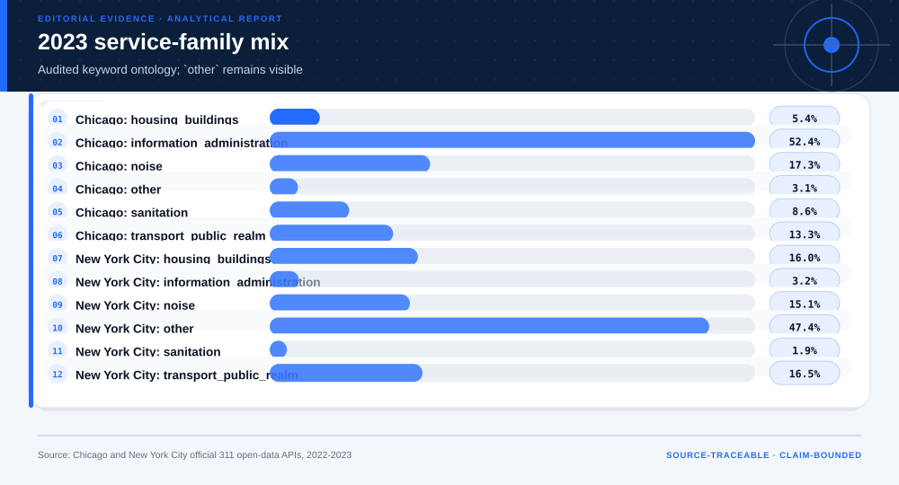
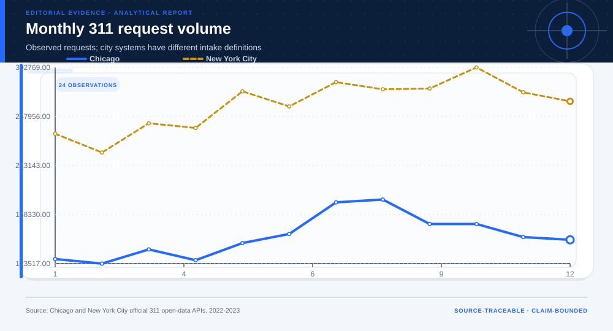

# Cross-City 311 Distribution Shift and Transfer Gate: analytical project

> **Bottom line:** Chicago and New York 311 systems show material taxonomy and distribution differences, so the cross-city transfer gate can refuse reuse rather than disguise incompatible service definitions.

## Executive Summary

This source-backed project connects the decision question to its data, validation design, visual evidence, and explicit claim boundary. The report structure follows this case rather than a fixed universal template.

### Evidence at a glance

| Signal | Observed result |
|---|---|
| Cross-city 2023 total-variation distance | 58.1% |
| Chicago mapped share | 96.9% |
| New York mapped share | 52.6% |
| Transfer gate | refused |

## Key findings with visual evidence

The visual sequence is interleaved with source, design, and limitation notes so each result stays adjacent to the evidence that supports it.

### Cross-city service mix

Unmatched categories stay visible as other.

> **Interpretation boundary:** Local taxonomies are not equivalent.

## Scope, source, and metric definitions

| Evidence contract | Recorded value |
|---|---|
| Source | City of Chicago and City of New York. Daily source-category aggregates, 2022-2023. |
| Version | Daily source-category aggregates, 2022-2023 |
| Accessed | 2026-08-10 |
| License | [Municipal open-data terms](https://www.chicago.gov/city/en/narr/foia/data_disclaimer.html) |
| Analytical grain | one city-day-audited service-family aggregate |
| Expected rows | 8,760 |
| Results | [`results.json`](results.json) |
| Definitions | [`../data/data-dictionary.json`](../data/data-dictionary.json) |
| Quality | [`../data/quality-report.json`](../data/quality-report.json) |

### Within-city shift

Each city is first compared with itself over time.

> **Interpretation boundary:** Administrative shift is not latent-need change.

## Research design and data quality

### Design and estimand

| Design element | Project definition |
|---|---|
| Design | cross-city administrative distribution-shift audit |
| Ontology | versioned keyword mapping with unmatched `other` |
| Claim Class | descriptive transportability diagnostic |

### Data-quality gate

| Check | Result |
|---|---|
| Prepared shape | 8,760 rows × 4 columns |
| Duplicate primary keys | 0 |
| Missing values under declared tokens | 0 |
| Privacy review | approved_for_public_minimized_analysis |
| Quality disposition | **ready** |

### Monthly request volumes

Observed intake patterns preserve city labels.

> **Interpretation boundary:** Counts do not measure service quality.

## Methodology

Versioned keyword ontology, unmatched-category retention, within-city year shift, total variation, Jensen-Shannon divergence, and a predeclared transfer gate.

All shipped metrics are regenerated by `prepare_data.py` and `analyze.py`. Random procedures use fixed seeds, and committed raw files are checked against the SHA-256 values in `source-manifest.json`.

## Parameter provenance and review

4 configured or derived parameters are recorded with their source, uncertainty class, provisional approval, reviewer status, and use boundary.

<strong>Open the complete parameter-level source and review register</strong>

| Parameter path | Value or distribution | Uncertainty | Source | Approval | Reviewer | Boundary |
|---|---|---|---|---|---|---|
| config.analysis_seed | 20260810 | none | analysis-protocol | provisional_self_review | not_assigned | Computational setting; it does not increase evidence quality. |
| config.parameters.baseline_year | 2022 | none | case-specific-analysis-protocol | provisional_self_review | not_assigned | Administrative shift audit only; requests are not latent need or service quality. |
| config.parameters.comparison_year | 2023 | none | case-specific-analysis-protocol | provisional_self_review | not_assigned | Administrative shift audit only; requests are not latent need or service quality. |
| config.parameters.maximum_transfer_total_variation | 0.2 | none | case-specific-analysis-protocol | provisional_self_review | not_assigned | Administrative shift audit only; requests are not latent need or service quality. |

## Limitations, uncertainty, and robustness

311 use reflects access, awareness, intake policy, and local taxonomy; request counts do not equal latent service need or agency performance.

Bootstrap or scenario stability remains conditional on the observed sample and declared assumptions; it does not upgrade exploratory evidence into operational authorization.

## What this study cannot establish

| Boundary | Not established by this project |
|---|---|
| Causality | A causal effect unless the stated design and identification assumptions support it |
| Transport | Performance or effects in an unobserved population, institution, or future regime |
| Authorization | Permission for a clinical, policy, financial, engineering, marketing, or automated action |

## Decision implications and reversal conditions

The analysis can prioritize validation, diligence, or a bounded pilot; it is not itself permission to act. Reconsider the interpretation when:

- A prospective or external validation reverses the observed ranking.
- A missing local constraint changes feasibility or the outcome definition.
- A domain owner rejects the analyst-defined threshold, scale, or trade-off.

## Recommended next steps

| Step | Action |
|---:|---|
| 1 | Re-run on a newly reviewed source version and compare the source hash, schema, and headline metrics. |
| 2 | Obtain domain-owner review of definitions, thresholds, exclusions, and action constraints. |
| 3 | Pre-register the next prospective or experimental validation before using any decision rule. |

## Further questions

- Which missing local variable could reverse the current ranking or interpretation?
- What prospective evidence would be required before operational use?
- Which subgroup, period, or spatial unit is least well represented?

<strong>Reproducibility receipt</strong>

- Project ID: `cross-city-311-shift`
- Source manifest: [`../source-manifest.json`](../source-manifest.json)
- Result SHA-256: `e49fbd09103d4aae338e17b2cd604fec4eebb5bfbff2d0da858aa3f4f8bb58cb`

