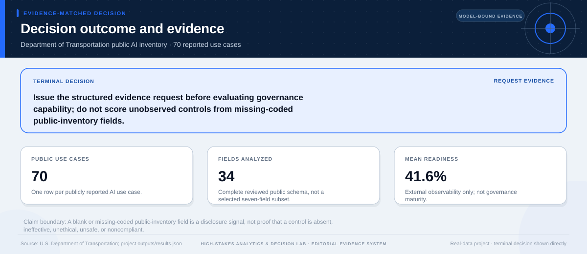
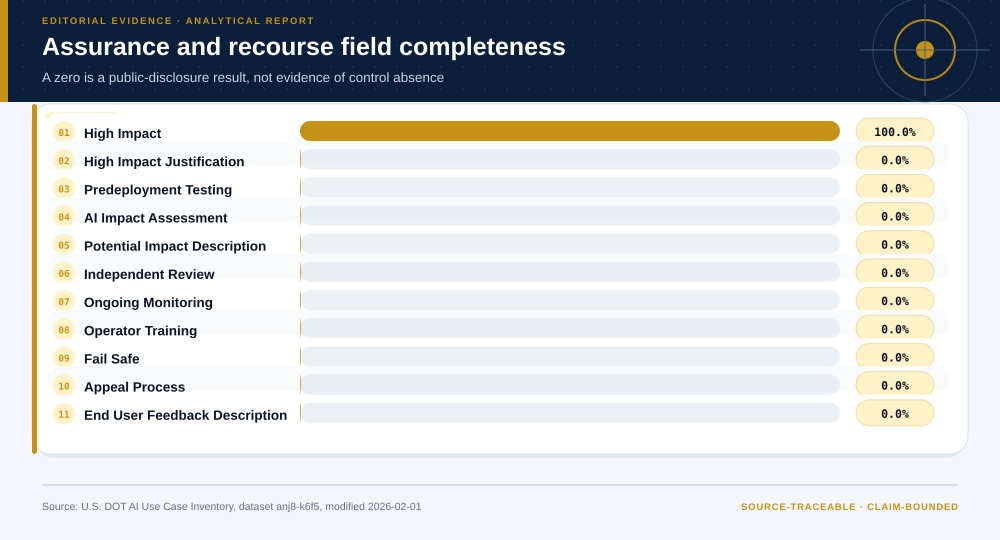
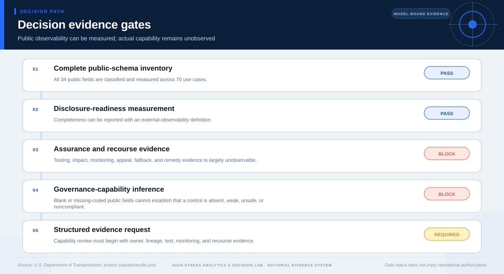

# Evidence Decision: Public AI Disclosure

## Technical summary

**Decision: Issue the structured evidence request before evaluating governance capability; do not score unobserved controls from missing-coded public-inventory fields.**

The reviewed inventory contains 70 use cases and 34 analyzed public fields. Mean disclosure readiness is 41.6%; 14 fields are unavailable in the snapshot. These are observability findings, not measures of control presence or effectiveness.

The correct terminal decision is to request the missing evidence. The public inventory can measure disclosure readiness and define the next information request, but it cannot support a capability score.

## Disclosure is strongest for identity and weakest for assurance and recourse

The six-family taxonomy uses all reviewed public fields. Identity, lifecycle, and purpose information are more visible than data, code, assurance, and recourse evidence.

The family comparison locates disclosure gaps. It does not determine whether an internal control exists or whether that control is effective.

| Information family | Reporting completeness | Supported interpretation |
|---|---|---|
| Identity And Ownership | 100.0% | Public observability |
| Lifecycle And Operations | 80.0% | Public observability |
| Purpose And Outputs | 78.6% | Public observability |
| Data And Privacy | 46.9% | Public observability |
| Code And Transparency | 40.0% | Public observability |
| Assurance And Recourse | 9.1% | Public observability |

## Assurance fields define the evidence request rather than a zero score

Public visibility is lowest for predeployment testing, impact assessment, independent review, monitoring, operator training, fail-safe behavior, appeal, and feedback. Their absence from the snapshot is a request trigger.

The chart should be read as an observability map. A capability conclusion requires reviewed internal artifacts and a separately scoped evaluation.

## The evidence gates determine the terminal decision

The gate sequence distinguishes useful analytical evidence from the additional
evidence required for the requested decision. A pass on one gate does not
override a block or missing requirement on another.

The terminal status is **evidence_request_required**. This status follows from the
case-specific evidence contract; it is not a generic caution added after the
analysis.

## The evidence request is the decision-ready output

Each request below states why the evidence is needed and whether the public inventory currently offers partial support.

| Information request | Why needed | Inventory support |
|---|---|---|
| system purpose, owner, users, and decision role | defines the unit and responsibility boundary | partially observable |
| training and evaluation data lineage | supports validity, privacy, and representativeness review | partially observable |
| predeployment test design and results | supports performance and failure-mode evaluation | not observable in reviewed fields |
| impact assessment, monitoring, and incident triggers | supports lifecycle assurance and escalation review | not observable in reviewed fields |
| notice, appeal, fallback, and remedy process | supports contestability and recourse review | not observable in reviewed fields |

## What is permitted now—and what is not

### Supported uses

- Measure field availability and public reporting completeness.
- Compare disclosure families and development-stage reporting patterns.
- Use the missing-evidence schema to scope the next review.

### Unsupported uses

- Score actual governance capability from public-field completeness.
- Treat a blank or missing-coded field as proof that a control is absent or ineffective.
- Infer safety, ethics, legality, or compliance from observability alone.

## Scope, source, and metric boundary

- **Source:** [Department of Transportation Inventory of Artificial Intelligence Use Cases](https://catalog.data.gov/dataset/department-of-transportation-inventory-of-artificial-intelligence-use-cases)
- **Publisher:** U.S. Department of Transportation
- **Version:** Dataset modified 2026-02-01; temporal coverage 2022-03-18/2026-01-28
- **Accessed:** 2026-07-27
- **Analytical grain:** one publicly reported DOT AI use case
- **Prepared rows:** 70
- **Adaptive route:** descriptive → measurement-readiness → evidence decision
- **Main analytical report:** [Open report](../../report.md)
- **Machine-readable analytical results:** [Open results](../../results.json)

## Decision method and validation logic

- Classify all 34 reviewed public fields rather than selecting a favorable subset.
- Group fields into six information families and measure public reporting completeness.
- Separate field availability, reporting completeness, and measurement readiness from governance capability.
- Translate unobservable assurance and recourse evidence into a structured information request.

The terminal decision is produced after the analytical evidence is reviewed
against case-specific gates. A missing capability, treatment effect, approval,
or operating input is recorded as missing evidence rather than assigned a
favorable value.

## Limitations, uncertainty, and reversal conditions

**Claim boundary.** A blank or missing-coded public-inventory field is a disclosure signal, not proof that a control is absent, ineffective, unethical, unsafe, or noncompliant.

The decision should be reconsidered only if new evidence changes one of these
conditions:

- Publisher documentation establishes that missing-coded fields are not part of the public reporting contract.
- A revised inventory materially changes field availability or definitions.
- Reviewed internal evidence supports a separately scoped capability evaluation.

## Recommended next steps

1. Send the structured request for ownership, data lineage, testing, impact, monitoring, and recourse artifacts.
2. Confirm the publisher's reporting contract and distinguish optional, withheld, and unavailable fields.
3. Create a separately scoped capability evaluation only after reviewed evidence is available.

## Further questions

- Which fields are optional, withheld, unpublished, or genuinely not collected?
- What evidence demonstrates that stated controls operate in practice?
- Which high-impact use cases require a deeper, case-specific review first?

## Reproducibility

- Decision result: [`decision-results.json`](decision-results.json)
- Decision chart map: [`figures/chart-map.json`](figures/chart-map.json)
- Source manifest: [`../../../source-manifest.json`](../../../source-manifest.json)
- Analytical result SHA-256: `9857e21083824124bdb70c0c13c9cca7541b04b7a063e397098b77f13d063316`

The report is generated from the committed analytical result and source
manifest. It does not upgrade the permitted use of the underlying evidence.
