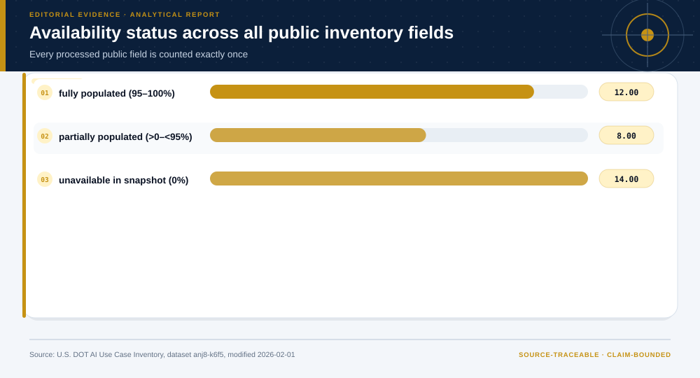
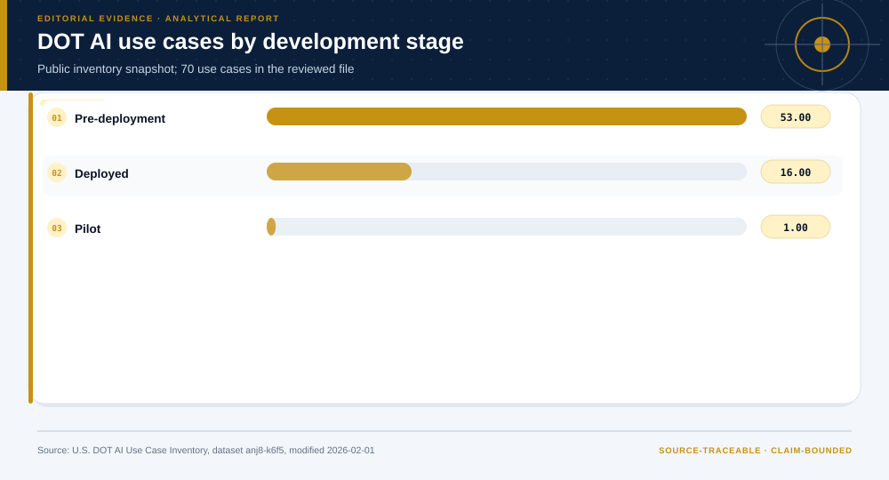
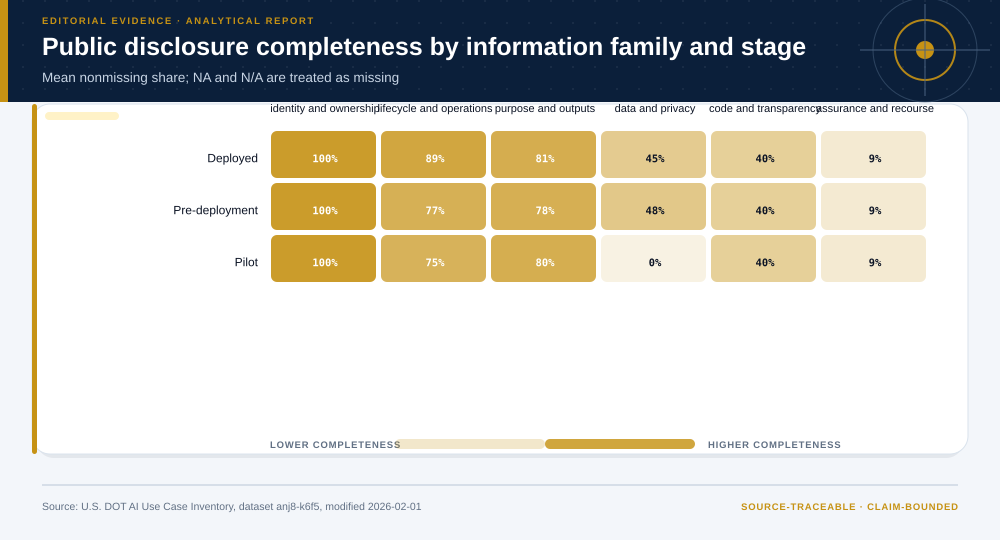

# Department of Transportation Inventory of Artificial Intelligence Use Cases: analytical project

> **Bottom line:** The public DOT inventory supports a disclosure-readiness analysis, not a governance-capability assessment: several operational fields are informative, while an entire set of assurance and recourse questions remains unmeasurable from this snapshot.

## Executive Summary

This source-backed project connects the decision question to its data, validation design, visual evidence, and explicit claim boundary. The report structure follows this case rather than a fixed universal template.

### Evidence at a glance

| Signal | Observed result |
|---|---|
| Publicly reported use cases | 70 |
| Public fields analyzed | 34 |
| Fields unavailable in the snapshot | 14 |
| Mean disclosure-readiness score | 41.6% (observability only) |

## Key findings with visual evidence

The visual sequence is interleaved with source, design, and limitation notes so each result stays adjacent to the evidence that supports it.

### Public reporting coverage varies by information family

The complete public schema shows what an external reader can observe across inventory fields.

> **Interpretation boundary:** Disclosure coverage measures observability, never control quality or governance capability.

## Scope, source, and metric definitions

| Evidence contract | Recorded value |
|---|---|
| Source | U.S. Department of Transportation. Department of Transportation Inventory of Artificial Intelligence Use Cases. Dataset anj8-k6f5. |
| Version | Dataset modified 2026-02-01; temporal coverage 2022-03-18/2026-01-28 |
| Accessed | 2026-07-27 |
| License | [U.S. Government work](https://www.usa.gov/government-works) |
| Analytical grain | one publicly reported DOT AI use case |
| Expected rows | 70 |
| Results | [`results.json`](results.json) |
| Definitions | [`../data/data-dictionary.json`](../data/data-dictionary.json) |
| Quality | [`../data/quality-report.json`](../data/quality-report.json) |

### Every public field is classified exactly once

Fully populated, partially populated, and unavailable fields use one missing-value rule, including NA tokens.

> **Interpretation boundary:** A missing public field may reflect publication design, exemption, or non-disclosure rather than an absent internal control.

## Research design and data quality

### Design and estimand

| Design element | Project definition |
|---|---|
| Claim class | Unit, time split, target, constraints, and claim class are defined in `results.json`; no causal estimand is claimed unless the design explicitly supports one. |

### Data-quality gate

| Check | Result |
|---|---|
| Prepared shape | 70 rows × 34 columns |
| Duplicate primary keys | 0 |
| Missing values under declared tokens | 1,227 |
| Privacy review | approved_after_column_suppression |
| Quality disposition | **usable_with_documented_limitations** |

### Lifecycle-stage patterns provide descriptive context

Use cases are grouped by reported stage without converting stage labels into maturity scores.

> **Interpretation boundary:** Self-reported stages are not independently verified operating states.

## Methodology

Complete public-schema inventory, six-family disclosure taxonomy, field availability classification, stage-by-family completeness, measurement-readiness distribution, privacy suppression, and an explicit evidence-request schema.

All shipped metrics are regenerated by `prepare_data.py` and `analyze.py`. Random procedures use fixed seeds, and committed raw files are checked against the SHA-256 values in `source-manifest.json`.

### Assurance and recourse evidence remains largely unobservable

Populated classification fields are separated from control-evidence questions unavailable in the snapshot.

> **Interpretation boundary:** The result is an evidence request, not an adverse assurance conclusion.

## Additional validation and robustness views

These views test a separate diagnostic, sensitivity, or evidence boundary; they do not create a new causal or operational claim.

### Measurement readiness defines the next evidence request

Information-family completeness identifies which materials must precede governance, safety, ethics, or compliance evaluation.

> **Interpretation boundary:** No system ranking or actual-capability score is supported by the public inventory.

## Parameter provenance and review

5 configured or derived parameters are recorded with their source, uncertainty class, provisional approval, reviewer status, and use boundary.

<strong>Open the complete parameter-level source and review register</strong>

| Parameter path | Value or distribution | Uncertainty | Source | Approval | Reviewer | Boundary |
|---|---|---|---|---|---|---|
| config.analysis_seed | 20260727 | none | analysis-protocol | provisional_self_review | not_assigned | Computational setting; it does not increase evidence quality. |
| config.parameters.missing_value_interpretation | null, empty, ?, N/A, and NA are unreported; Not Applicable remains a substantive response | none | responsible-reporting-rule | provisional_self_review | not_assigned | Blank or missing-coded reporting does not mean absent or noncompliant. |
| config.parameters.field_family_scheme | six analyst-defined information families covering all public inventory columns | none | analyst-disclosure-taxonomy | provisional_self_review | not_assigned | Families organize public columns for measurement; they are not a governance maturity model. |
| config.parameters.disclosure_readiness_interpretation | share of review-relevant public fields populated; measurement readiness only | none | responsible-reporting-rule | provisional_self_review | not_assigned | A completeness score measures external observability only and must never be interpreted as control presence, quality, ethics, safety, or compliance. |
| config.parameters.contact_field_suppression | Email Address | none | privacy-minimization-rule | provisional_self_review | not_assigned | Official contact address excluded from processed data and outputs. |

## Limitations, uncertainty, and robustness

Public self-reported inventory only. Missing fields may reflect publication rules or snapshot design; internal evidence, control effectiveness, safety, ethics, compliance, and exempt use cases are not observed.

Bootstrap or scenario stability remains conditional on the observed sample and declared assumptions; it does not upgrade exploratory evidence into operational authorization.

## What this study cannot establish

| Boundary | Not established by this project |
|---|---|
| Causality | A causal effect unless the stated design and identification assumptions support it |
| Transport | Performance or effects in an unobserved population, institution, or future regime |
| Authorization | Permission for a clinical, policy, financial, engineering, marketing, or automated action |

## Decision implications and reversal conditions

The analysis can prioritize validation, diligence, or a bounded pilot; it is not itself permission to act. Reconsider the interpretation when:

- Publisher documentation establishes that missing-coded fields are not part of the public reporting contract.
- A revised inventory materially changes field availability or definitions.
- Reviewed internal evidence supports a separately scoped capability evaluation.

## Conditional downstream decision layer

The Evidence Intelligence Report remains the primary record. The separate Decision Intelligence Brief applies case-specific gates and may end in a pilot, evidence request, non-deployment, or stop.

[Open the complete Decision Intelligence Brief](decision/report/decision-report.md).

## Recommended next steps

| Step | Action |
|---:|---|
| 1 | Re-run on a newly reviewed source version and compare the source hash, schema, and headline metrics. |
| 2 | Obtain domain-owner review of definitions, thresholds, exclusions, and action constraints. |
| 3 | Pre-register the next prospective or experimental validation before using any decision rule. |

## Further questions

- Which missing local variable could reverse the current ranking or interpretation?
- What prospective evidence would be required before operational use?
- Which subgroup, period, or spatial unit is least well represented?

<strong>Reproducibility receipt</strong>

- Project ID: `federal-ai-governance`
- Source manifest: [`../source-manifest.json`](../source-manifest.json)
- Result SHA-256: `9857e21083824124bdb70c0c13c9cca7541b04b7a063e397098b77f13d063316`

