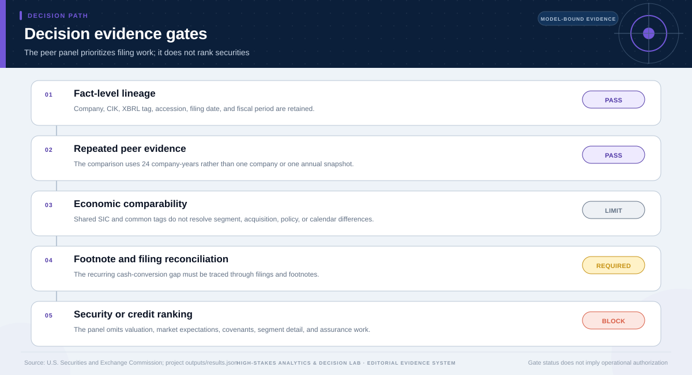

# Diligence Decision: SEC Peer Financial Quality

## Technical summary

**Decision: Prioritize cash-conversion persistence and working-capital-cycle reconciliation across filings; do not convert the peer panel into a security ranking.**

The panel covers three SEC SIC 5122 peers over eight fiscal years. FY2025 operating margins span 0.4% and net working-capital cycles span 4.3 days. Repeated differences are useful for prioritizing filing work, but taxonomy, segment mix, acquisitions, and fiscal timing remain unresolved.

The terminal decision is a diligence sequence. It directs attention to recurring cash-conversion differences while explicitly withholding valuation, assurance, credit, and investment conclusions.

## Thin margins make recurring operating differences worth reconciling

All three distributors operate at large revenue scale with low operating margins. The multi-year view reduces reliance on a single fiscal year, but it cannot by itself explain the accounting or operating cause.

Small percentage-point differences can be economically material at this scale. The figure identifies persistence and exceptions for review; it does not establish superior quality or value.

| Entity | FY2025 revenue | Operating margin | Operating cash-flow margin | Net working-capital cycle |
|---|---|---|---|---|
| Cardinal Health | $222.6B | 1.0% | 1.1% | -8.8 days |
| Cencora | $321.3B | 0.8% | 1.2% | -11.1 days |
| McKesson | $359.1B | 1.2% | 1.7% | -6.7 days |

## The working-capital pattern determines the next filing questions

Net working-capital cycles remain a compact diagnostic of inventory, receivables, and payables, but negative or improving values can arise from operating structure, timing, acquisitions, or classification choices.

The chart supports tracing persistent gaps into the cash-flow statement, balance-sheet notes, acquisition disclosures, and supplier-payment terms.

## The evidence gates determine the terminal decision

The gate sequence distinguishes useful analytical evidence from the additional
evidence required for the requested decision. A pass on one gate does not
override a block or missing requirement on another.

The terminal status is **targeted_diligence_required**. This status follows from the
case-specific evidence contract; it is not a generic caution added after the
analysis.

## Diligence should proceed from facts to explanations

The sequence below preserves comparability checks before any broader conclusion.

| Priority | Evidence to reconcile | Possible reversal |
|---|---|---|
| 1. Cash conversion | Operating cash flow, working-capital bridge, non-cash items | Timing explains the apparent gap |
| 2. Working-capital cycle | Inventory, receivables, payables, supplier programs | Definitions or supplier terms differ |
| 3. Segment and acquisitions | Segment mix, acquired operations, integration effects | Business mix explains persistence |
| 4. Taxonomy and periods | Tags, accession, restatements, fiscal calendars | Reclassification removes the difference |
| 5. Peer definition | Broader and narrower peer sets | Median and rank materially change |

## What is permitted now—and what is not

### Supported uses

- Prioritize specific filings, tags, footnotes, and periods for reconciliation.
- Use margin stress to understand why small changes matter in a low-margin industry.
- Expand the peer set and repeat the same lineage-preserving diagnostics.

### Unsupported uses

- Rank securities, issuers, or credit quality from the ratio panel.
- Treat common XBRL tags as proof of full economic comparability.
- Represent the analysis as valuation, assurance, or investment advice.

## Scope, source, and metric boundary

- **Source:** [SEC Companyfacts Drug-Distributor Peer Panel](https://www.sec.gov/edgar/search/)
- **Publisher:** U.S. Securities and Exchange Commission
- **Version:** McKesson snapshot reviewed 2026-07-27; Cardinal Health and Cencora snapshots reviewed 2026-07-28
- **Accessed:** 2026-07-28
- **Analytical grain:** one company fiscal year for three SEC SIC 5122 peers, most recently presented annual 10-K fact
- **Prepared rows:** 24
- **Adaptive route:** descriptive → diagnostic → diligence decision
- **Main analytical report:** [Open report](../../report.md)
- **Machine-readable analytical results:** [Open results](../../results.json)

## Decision method and validation logic

- Reconcile SEC Companyfacts to entity, CIK, tag, accession, filing date, and fiscal period.
- Construct a three-entity, eight-year panel with common-size and cash-conversion measures.
- Compare within-year peer medians, ranks, dispersion, and persistence.
- Use operating-margin stress only to size sensitivity, not to value or rank securities.

The terminal decision is produced after the analytical evidence is reviewed
against case-specific gates. A missing capability, treatment effect, approval,
or operating input is recorded as missing evidence rather than assigned a
favorable value.

## Limitations, uncertainty, and reversal conditions

**Claim boundary.** Peer ratio analysis of SEC facts is not valuation, assurance, a credit conclusion, or an investment recommendation; full filings and footnotes remain necessary.

The decision should be reconsidered only if new evidence changes one of these
conditions:

- Footnotes or taxonomy changes explain an apparent peer gap.
- Segment mix, acquisitions, or fiscal timing make a ratio non-comparable.
- A broader peer definition materially changes the cross-sectional median.

## Recommended next steps

1. Reconcile recurring cash-conversion gaps to cash-flow statements and working-capital footnotes.
2. Document segment mix, material acquisitions, supplier programs, and fiscal-calendar differences.
3. Repeat the peer medians and persistence checks under at least one broader peer definition.

## Further questions

- Which recurring gap survives tag, period, and segment reconciliation?
- How much of the cash-conversion difference is structural versus timing-related?
- Does a broader peer set preserve the same diligence priority?

## Reproducibility

- Decision result: [`decision-results.json`](decision-results.json)
- Decision chart map: [`figures/chart-map.json`](figures/chart-map.json)
- Source manifest: [`../../../source-manifest.json`](../../../source-manifest.json)
- Analytical result SHA-256: `46efc4686e8bd7d8d346a8ac5b62fc0ad975d9527c803ea331b00e5fd647d7ba`

The report is generated from the committed analytical result and source
manifest. It does not upgrade the permitted use of the underlying evidence.
