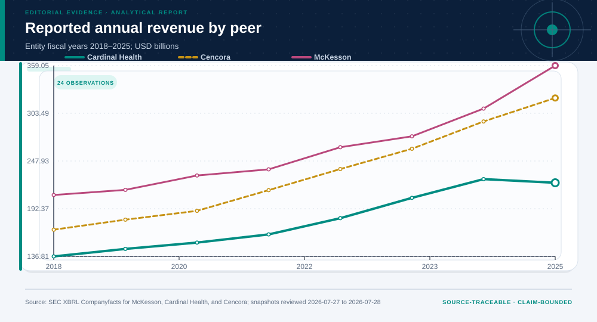
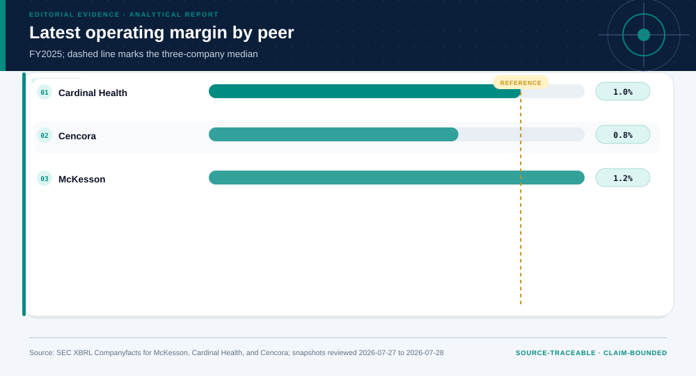
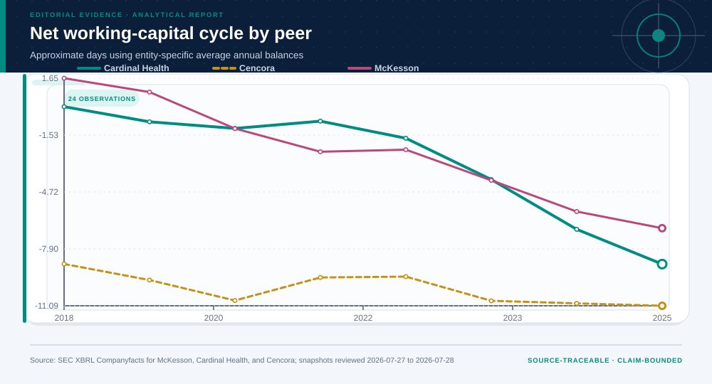
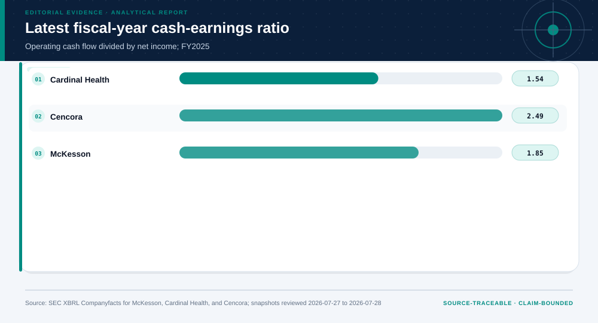
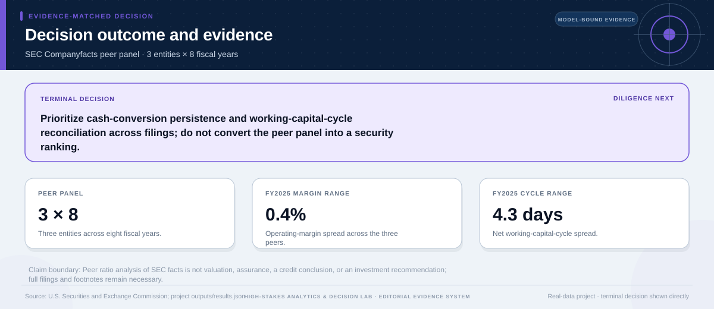

# SEC Companyfacts Drug-Distributor Peer Panel: analytical project

> **Bottom line:** Across 24 company-years, all three drug distributors combine large scale with thin operating margins; recurring cash-conversion and working-capital gaps warrant filing-level reconciliation, not a security ranking.

## Executive Summary

This source-backed project connects the decision question to its data, validation design, visual evidence, and explicit claim boundary. The report structure follows this case rather than a fixed universal template.

### Evidence at a glance

| Signal | Observed result |
|---|---|
| Panel size | 3 entities × 8 fiscal years |
| FY2025 operating-margin range | 0.4% |
| FY2025 working-capital-cycle range | 4.3 days |
| Fact lineage | entity + CIK + tag + accession + fiscal period |

## Key findings with visual evidence

The visual sequence is interleaved with source, design, and limitation notes so each result stays adjacent to the evidence that supports it.

### Scale is compared on a reconciled peer-year panel

Revenue trajectories establish the denominator context for interpreting thin margins and cash conversion.

> **Interpretation boundary:** Common industry classification and XBRL tags do not guarantee economic comparability.

## Scope, source, and metric definitions

| Evidence contract | Recorded value |
|---|---|
| Source | U.S. Securities and Exchange Commission. XBRL Companyfacts API snapshots for McKesson Corporation (CIK 0000927653), Cardinal Health, Inc. (CIK 0000721371), and Cencora, Inc. (CIK 0001140859), accessed 2026-07-27 to 2026-07-28. |
| Version | McKesson snapshot reviewed 2026-07-27; Cardinal Health and Cencora snapshots reviewed 2026-07-28 |
| Accessed | 2026-07-28 |
| License | [U.S. federal government public data; SEC fair-access terms apply](https://www.sec.gov/about/privacy-information) |
| Analytical grain | one company fiscal year for three SEC SIC 5122 peers, most recently presented annual 10-K fact |
| Expected rows | 24 |
| Results | [`results.json`](results.json) |
| Definitions | [`../data/data-dictionary.json`](../data/data-dictionary.json) |
| Quality | [`../data/quality-report.json`](../data/quality-report.json) |

### Thin operating margins persist across the peer set

Eight common fiscal years separate company-specific movement from a one-period snapshot.

> **Interpretation boundary:** Consolidated filing facts omit segment mix, acquisition effects, and non-GAAP reconciliations.

## Research design and data quality

### Design and estimand

| Design element | Project definition |
|---|---|
| Claim class | Unit, time split, target, constraints, and claim class are defined in `results.json`; no causal estimand is claimed unless the design explicitly supports one. |

### Data-quality gate

| Check | Result |
|---|---|
| Prepared shape | 24 rows × 17 columns |
| Duplicate primary keys | 0 |
| Missing values under declared tokens | 0 |
| Privacy review | approved_for_public_analysis |
| Quality disposition | **usable_with_documented_limitations** |

### Within-year peer gaps distinguish cross-section from trend

Peer medians and ranks show relative positioning without converting the panel into a security recommendation.

> **Interpretation boundary:** The comparison is an accounting diagnostic, not a valuation or investment ranking.

## Methodology

Multi-entity SEC Companyfacts reconciliation, entity-specific fiscal calendars, common-size statements, cash-earnings quality, free-cash-flow proxy, working-capital cycles, peer medians and ranks, dispersion, persistence flags, and explicit margin stress.

All shipped metrics are regenerated by `prepare_data.py` and `analyze.py`. Random procedures use fixed seeds, and committed raw files are checked against the SHA-256 values in `source-manifest.json`.

### Working-capital cycles identify where diligence should deepen

Receivables, inventory, and payables timing are combined into a comparable operating-cycle view.

> **Interpretation boundary:** Alerts prioritize filing and footnote review; they do not prove earnings-management or liquidity stress.

## Additional validation and robustness views

These views test a separate diagnostic, sensitivity, or evidence boundary; they do not create a new causal or operational claim.

### Cash conversion is interpreted beside reported earnings

Operating cash flow and earnings relationships reveal recurring reconciliation questions across company-years.

> **Interpretation boundary:** Cash-to-earnings variation can reflect legitimate business timing and requires filing-level explanation.

## Parameter provenance and review

8 configured or derived parameters are recorded with their source, uncertainty class, provisional approval, reviewer status, and use boundary.

<strong>Open the complete parameter-level source and review register</strong>

| Parameter path | Value or distribution | Uncertainty | Source | Approval | Reviewer | Boundary |
|---|---|---|---|---|---|---|
| config.analysis_seed | 20260727 | none | analysis-protocol | provisional_self_review | not_assigned | Computational setting; it does not increase evidence quality. |
| config.parameters.fiscal_year_start | 2018 | none | portfolio-observation-window | provisional_self_review | not_assigned | Eight fiscal years per entity improve cross-sectional depth but still do not span every business regime. |
| config.parameters.fiscal_year_end | 2025 | none | portfolio-observation-window | provisional_self_review | not_assigned | Eight fiscal years per entity improve cross-sectional depth but still do not span every business regime. |
| config.parameters.peer_set | [{'label': 'McKesson', 'cik': '0000927653', 'fiscal_year_end': '03-31', 'raw_file': 'data/raw/sec-mckesson-companyfacts.json'}, {'label': 'Cardinal Health', 'cik': '0000721371', 'fiscal_year_end': '06-30', 'raw_file': 'data/raw/sec-cardinal-companyfacts.json'}, {'label': 'Cencora', 'cik': '0001140859', 'fiscal_year_end': '09-30', 'raw_file': 'data/raw/sec-cencora-companyfacts.json'}] | none | sec-sic-5122-peer-rule | provisional_self_review | not_assigned | Shared industry classification improves relevance but does not make business mix, accounting policy, fiscal timing, or acquisitions identical. |
| config.parameters.peer_selection | three U.S. public drug distributors sharing SEC SIC 5122 and standard annual XBRL coverage | none | sec-sic-5122-peer-rule | provisional_self_review | not_assigned | Shared industry classification improves relevance but does not make business mix, accounting policy, fiscal timing, or acquisitions identical. |
| config.parameters.fact_selection | latest-filed annual 10-K fact at each entity-specific fiscal year end | none | sec-companyfacts-reconciliation-rule | provisional_self_review | not_assigned | The latest 10-K presentation is used when comparative facts repeat; original filing values can differ after reclassification, and entity fiscal year ends differ. |
| config.parameters.margin_stress_basis_points | [0, -50, -100] | scenario | analyst-stress-register | provisional_self_review | not_assigned | Illustrative sensitivity, not management guidance or a forecast. |
| config.parameters.cash_conversion_alert_ratio | 0.8 | none | analyst-monitoring-threshold | provisional_self_review | not_assigned | A ratio below 0.8 is a review flag only; it is not an accounting conclusion, credit threshold, or investment signal. |

## Limitations, uncertainty, and robustness

A common SIC and XBRL taxonomy do not equal economic comparability. Consolidated facts omit footnote detail, segment economics, acquisition effects, non-GAAP reconciliations, market prices, and valuation.

Bootstrap or scenario stability remains conditional on the observed sample and declared assumptions; it does not upgrade exploratory evidence into operational authorization.

## What this study cannot establish

| Boundary | Not established by this project |
|---|---|
| Causality | A causal effect unless the stated design and identification assumptions support it |
| Transport | Performance or effects in an unobserved population, institution, or future regime |
| Authorization | Permission for a clinical, policy, financial, engineering, marketing, or automated action |

## Decision implications and reversal conditions

The analysis can prioritize validation, diligence, or a bounded pilot; it is not itself permission to act. Reconsider the interpretation when:

- Footnotes or taxonomy changes explain an apparent peer gap.
- Segment mix, acquisitions, or fiscal timing make a ratio non-comparable.
- A broader peer definition materially changes the cross-sectional median.

## Conditional downstream decision layer

The Evidence Intelligence Report remains the primary record. The separate Decision Intelligence Brief applies case-specific gates and may end in a pilot, evidence request, non-deployment, or stop.

[Open the complete Decision Intelligence Brief](decision/report/decision-report.md).

## Recommended next steps

| Step | Action |
|---:|---|
| 1 | Re-run on a newly reviewed source version and compare the source hash, schema, and headline metrics. |
| 2 | Obtain domain-owner review of definitions, thresholds, exclusions, and action constraints. |
| 3 | Pre-register the next prospective or experimental validation before using any decision rule. |

## Further questions

- Which missing local variable could reverse the current ranking or interpretation?
- What prospective evidence would be required before operational use?
- Which subgroup, period, or spatial unit is least well represented?

<strong>Reproducibility receipt</strong>

- Project ID: `mckesson-financial-quality`
- Source manifest: [`../source-manifest.json`](../source-manifest.json)
- Result SHA-256: `46efc4686e8bd7d8d346a8ac5b62fc0ad975d9527c803ea331b00e5fd647d7ba`

