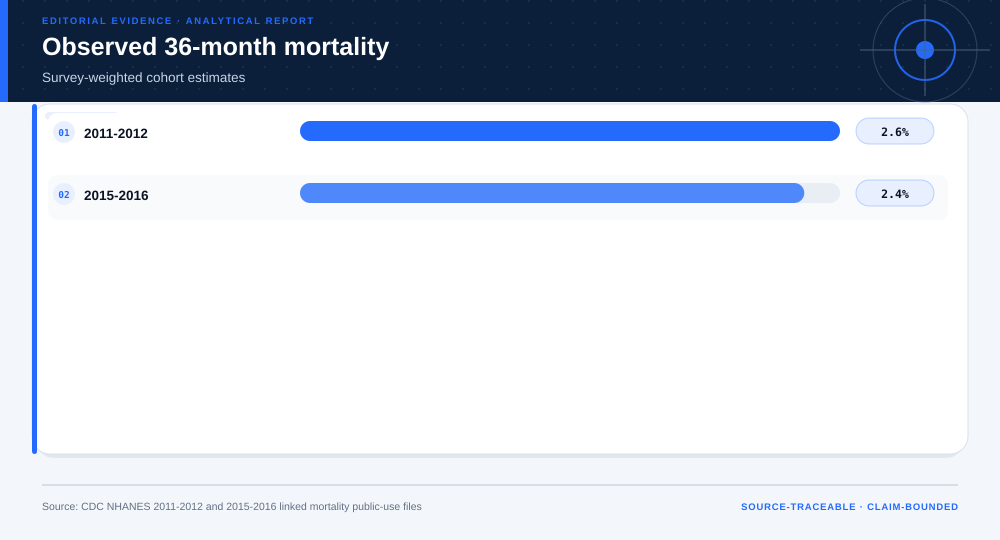
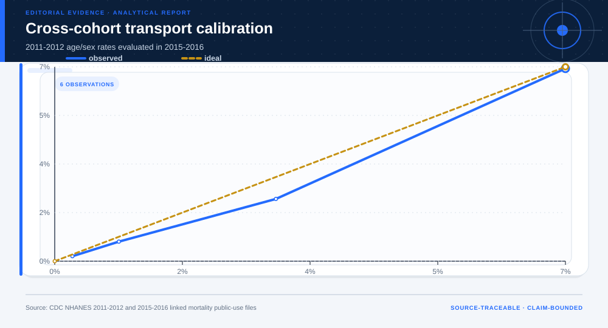
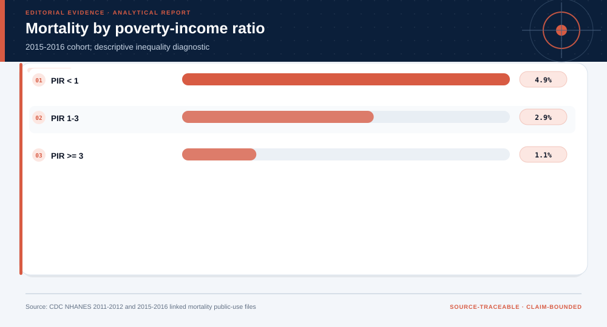

# NHANES Mortality Transportability and Population Inequality: analytical project

> **Bottom line:** Age/sex risk cells trained in NHANES 2011-2012 are externally checked in 2015-2016 linked mortality, with income gradients reported as population inequality evidence rather than clinical prediction.

## Executive Summary

This source-backed project connects the decision question to its data, validation design, visual evidence, and explicit claim boundary. The report structure follows this case rather than a fixed universal template.

### Evidence at a glance

| Signal | Observed result |
|---|---|
| External-cohort AUC | 0.804 |
| External-cohort Brier score | 0.022 |
| Linked adults | 11,820 |
| Terminal use | population research only |

## Key findings with visual evidence

The visual sequence is interleaved with source, design, and limitation notes so each result stays adjacent to the evidence that supports it.

### Cross-cohort mortality

Both cohorts use the same 36-month horizon.

> **Interpretation boundary:** Cohort differences are not causal.

## Scope, source, and metric definitions

| Evidence contract | Recorded value |
|---|---|
| Source | U.S. Centers for Disease Control and Prevention, National Center for Health Statistics. NHANES 2011-2012 and 2015-2016 demographics linked to 2019 mortality. |
| Version | NHANES 2011-2012 and 2015-2016 demographics linked to 2019 mortality |
| Accessed | 2026-08-10 |
| License | [U.S. Government public-use data](https://www.cdc.gov/nchs/data-linkage/mortality-public.htm) |
| Analytical grain | one NHANES adult linked to 36-month mortality |
| Expected rows | 11,820 |
| Results | [`results.json`](results.json) |
| Definitions | [`../data/data-dictionary.json`](../data/data-dictionary.json) |
| Quality | [`../data/quality-report.json`](../data/quality-report.json) |

### Transport calibration

Earlier age/sex cells are tested later.

> **Interpretation boundary:** This is not a clinical model.

## Research design and data quality

### Design and estimand

| Design element | Project definition |
|---|---|
| Design | survey-weighted cross-cohort transportability audit |
| Development | NHANES 2011-2012 |
| Validation | NHANES 2015-2016 |
| Horizon | 36-month linked mortality |

### Data-quality gate

| Check | Result |
|---|---|
| Prepared shape | 11,820 rows × 11 columns |
| Duplicate primary keys | 0 |
| Missing values under declared tokens | 0 |
| Privacy review | approved_for_public_minimized_analysis |
| Quality disposition | **usable_with_documented_limitations** |

### Income gradient

Survey-weighted mortality is stratified by PIR.

> **Interpretation boundary:** The gradient is descriptive inequality evidence.

## Methodology

Survey-weighted cohort mortality, cross-cohort AUC/Brier/calibration, and poverty-income-ratio mortality gradients.

All shipped metrics are regenerated by `prepare_data.py` and `analyze.py`. Random procedures use fixed seeds, and committed raw files are checked against the SHA-256 values in `source-manifest.json`.

## Parameter provenance and review

4 configured or derived parameters are recorded with their source, uncertainty class, provisional approval, reviewer status, and use boundary.

<strong>Open the complete parameter-level source and review register</strong>

| Parameter path | Value or distribution | Uncertainty | Source | Approval | Reviewer | Boundary |
|---|---|---|---|---|---|---|
| config.analysis_seed | 20260810 | none | analysis-protocol | provisional_self_review | not_assigned | Computational setting; it does not increase evidence quality. |
| config.parameters.development_cohort | 2011-2012 | none | case-specific-analysis-protocol | provisional_self_review | not_assigned | Population research only; no individual diagnosis or treatment. |
| config.parameters.validation_cohort | 2015-2016 | none | case-specific-analysis-protocol | provisional_self_review | not_assigned | Population research only; no individual diagnosis or treatment. |
| config.parameters.mortality_horizon_months | 36 | none | case-specific-analysis-protocol | provisional_self_review | not_assigned | Population research only; no individual diagnosis or treatment. |

## Limitations, uncertainty, and robustness

This compact audit does not implement the full NHANES complex-survey variance design and cannot support individual diagnosis or treatment.

Bootstrap or scenario stability remains conditional on the observed sample and declared assumptions; it does not upgrade exploratory evidence into operational authorization.

## What this study cannot establish

| Boundary | Not established by this project |
|---|---|
| Causality | A causal effect unless the stated design and identification assumptions support it |
| Transport | Performance or effects in an unobserved population, institution, or future regime |
| Authorization | Permission for a clinical, policy, financial, engineering, marketing, or automated action |

## Decision implications and reversal conditions

The analysis can prioritize validation, diligence, or a bounded pilot; it is not itself permission to act. Reconsider the interpretation when:

- A newer linked cohort changes transport calibration.
- Complex-survey variance estimation changes uncertainty conclusions.
- The intended population differs materially from NHANES coverage.

## Recommended next steps

| Step | Action |
|---:|---|
| 1 | Re-run on a newly reviewed source version and compare the source hash, schema, and headline metrics. |
| 2 | Obtain domain-owner review of definitions, thresholds, exclusions, and action constraints. |
| 3 | Pre-register the next prospective or experimental validation before using any decision rule. |

## Further questions

- Which missing local variable could reverse the current ranking or interpretation?
- What prospective evidence would be required before operational use?
- Which subgroup, period, or spatial unit is least well represented?

<strong>Reproducibility receipt</strong>

- Project ID: `nhanes-population-transportability`
- Source manifest: [`../source-manifest.json`](../source-manifest.json)
- Result SHA-256: `ec593b1a2a77c0c7a1ad2fe0f4ab468fc8e7b944d60bd560ef12cca07e6a47be`

