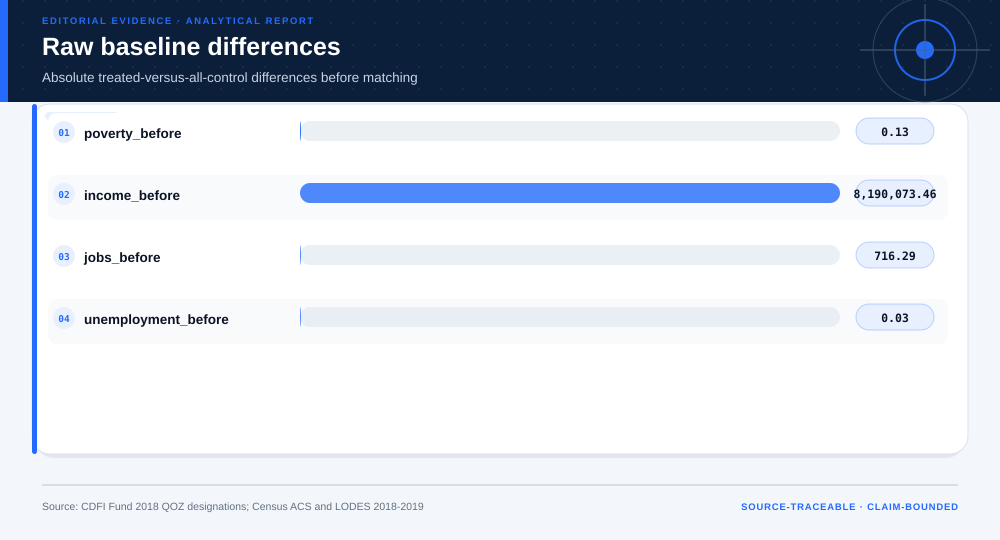
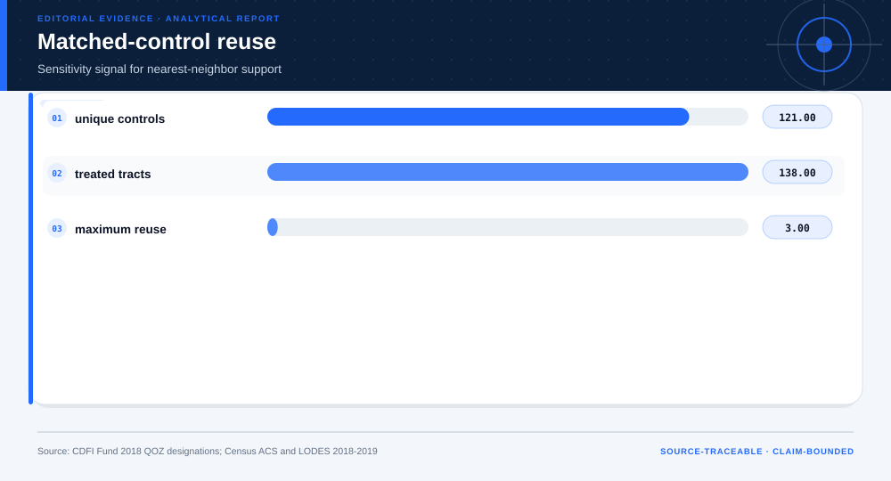

# Opportunity Zone One-Year Policy Evidence Screen: analytical project

> **Bottom line:** The Massachusetts panel provides a matched one-year change screen, but no parallel-trends evidence; every result remains associational rather than a causal QOZ effect.

## Executive Summary

This source-backed project connects the decision question to its data, validation design, visual evidence, and explicit claim boundary. The report structure follows this case rather than a fixed universal template.

### Evidence at a glance

| Signal | Observed result |
|---|---|
| Complete tract panels | 1,394 |
| Designated QOZ tracts analyzed | 136 |
| Unique matched controls | 111 |
| Causal status | not identified |

## Key findings with visual evidence

The visual sequence is interleaved with source, design, and limitation notes so each result stays adjacent to the evidence that supports it.

### Matched change contrasts

One-year changes are compared within matched pairs.

> **Interpretation boundary:** Causality is not identified.

## Scope, source, and metric definitions

| Evidence contract | Recorded value |
|---|---|
| Source | CDFI Fund and U.S. Census Bureau. 2018 designated QOZ list with 2018-2019 ACS and LODES Massachusetts tract panel. |
| Version | 2018 designated QOZ list with 2018-2019 ACS and LODES Massachusetts tract panel |
| Accessed | 2026-08-10 |
| License | [U.S. Government public data](https://www.cdfifund.gov/opportunity-zones) |
| Analytical grain | one Massachusetts tract-year row |
| Expected rows | 2,956 |
| Results | [`results.json`](results.json) |
| Definitions | [`../data/data-dictionary.json`](../data/data-dictionary.json) |
| Quality | [`../data/quality-report.json`](../data/quality-report.json) |

### Baseline support

Raw baseline differences motivate matching.

> **Interpretation boundary:** Balance on observed fields does not remove hidden confounding.

## Research design and data quality

### Design and estimand

| Design element | Project definition |
|---|---|
| Design | one-year matched pre/post association screen |
| Treatment | 2018 QOZ designation |
| Period | 2018 to 2019 |
| Complete Case Rule | Both panel years must contain finite, positive median estimates and valid count/universe relationships. |
| Uncertainty | Rademacher wild-cluster interval by reused control tract |
| Causal Status | not identified; no parallel-trends evidence |

### Data-quality gate

| Check | Result |
|---|---|
| Prepared shape | 2,956 rows × 18 columns |
| Duplicate primary keys | 0 |
| Missing values under declared tokens | 175 |
| Privacy review | approved_for_public_minimized_analysis |
| Quality disposition | **ready_with_documented_limitations** |

### Control reuse

Reuse is exposed as a support diagnostic.

> **Interpretation boundary:** Effective comparison diversity is limited.

## Methodology

Official designation linkage, ACS special-value normalization, complete-case tract screening, baseline nearest-neighbor matching, change contrasts, reuse-aware wild-cluster intervals, and support diagnostics.

All shipped metrics are regenerated by `prepare_data.py` and `analyze.py`. Random procedures use fixed seeds, and committed raw files are checked against the SHA-256 values in `source-manifest.json`.

## Parameter provenance and review

5 configured or derived parameters are recorded with their source, uncertainty class, provisional approval, reviewer status, and use boundary.

<strong>Open the complete parameter-level source and review register</strong>

| Parameter path | Value or distribution | Uncertainty | Source | Approval | Reviewer | Boundary |
|---|---|---|---|---|---|---|
| config.analysis_seed | 20260810 | none | analysis-protocol | provisional_self_review | not_assigned | Computational setting; it does not increase evidence quality. |
| config.parameters.pre_year | 2018 | none | case-specific-analysis-protocol | provisional_self_review | not_assigned | Associational one-year screen; no causal effect because parallel trends are unavailable. |
| config.parameters.post_year | 2019 | none | case-specific-analysis-protocol | provisional_self_review | not_assigned | Associational one-year screen; no causal effect because parallel trends are unavailable. |
| config.parameters.bootstrap_samples | 500 | none | case-specific-analysis-protocol | provisional_self_review | not_assigned | Associational one-year screen; no causal effect because parallel trends are unavailable. |
| config.parameters.matching_fields | ['poverty', 'income', 'jobs', 'unemployment'] | none | case-specific-analysis-protocol | provisional_self_review | not_assigned | Associational one-year screen; no causal effect because parallel trends are unavailable. |

## Limitations, uncertainty, and robustness

Only one pre/post interval is used, controls are reused, ACS estimates overlap in time, and selection into designation is not eliminated.

Bootstrap or scenario stability remains conditional on the observed sample and declared assumptions; it does not upgrade exploratory evidence into operational authorization.

## What this study cannot establish

| Boundary | Not established by this project |
|---|---|
| Causality | A causal effect unless the stated design and identification assumptions support it |
| Transport | Performance or effects in an unobserved population, institution, or future regime |
| Authorization | Permission for a clinical, policy, financial, engineering, marketing, or automated action |

## Decision implications and reversal conditions

The analysis can prioritize validation, diligence, or a bounded pilot; it is not itself permission to act. Reconsider the interpretation when:

- A multi-year pre-period fails a parallel-trends diagnostic.
- Alternative comparison groups reverse the change contrast.
- Updated ACS or LODES vintages materially change tract outcomes.

## Recommended next steps

| Step | Action |
|---:|---|
| 1 | Re-run on a newly reviewed source version and compare the source hash, schema, and headline metrics. |
| 2 | Obtain domain-owner review of definitions, thresholds, exclusions, and action constraints. |
| 3 | Pre-register the next prospective or experimental validation before using any decision rule. |

## Further questions

- Which missing local variable could reverse the current ranking or interpretation?
- What prospective evidence would be required before operational use?
- Which subgroup, period, or spatial unit is least well represented?

<strong>Reproducibility receipt</strong>

- Project ID: `opportunity-zone-policy-evaluation`
- Source manifest: [`../source-manifest.json`](../source-manifest.json)
- Result SHA-256: `1a2c64d33a5e0dfbc3366415988a624b050bcc76517d17545850debbd1ce2bf0`

