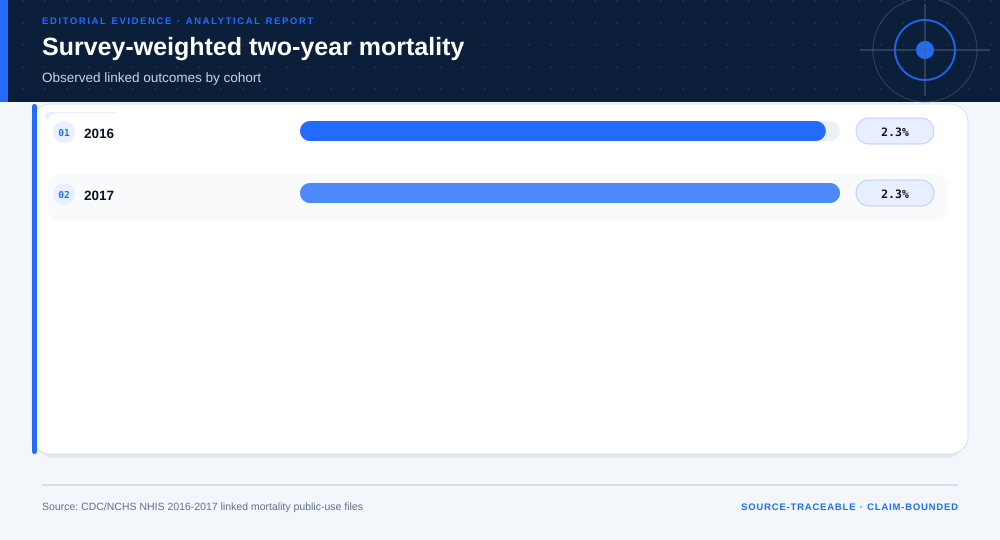
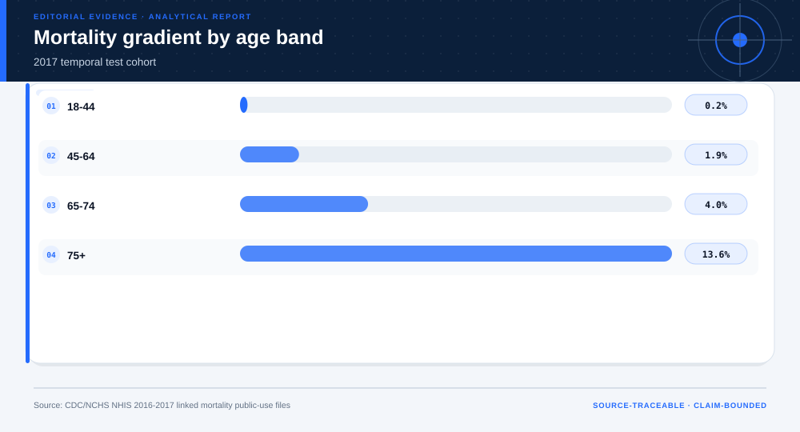
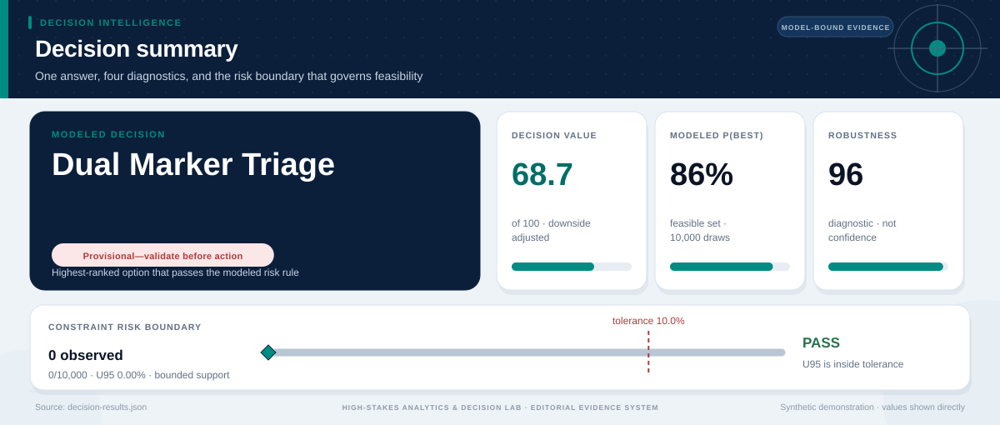

# Population Health Risk Transport Across NHIS Cohorts: analytical project

> **Bottom line:** The 2016 NHIS risk cells show measurable but imperfect transport to 2017 linked mortality; the output supports population-risk validation, not individual clinical action.

## Executive Summary

This source-backed project connects the decision question to its data, validation design, visual evidence, and explicit claim boundary. The report structure follows this case rather than a fixed universal template.

### Evidence at a glance

| Signal | Observed result |
|---|---|
| 2017 temporal-test AUC | 0.846 |
| 2017 weighted two-year mortality | 2.32% |
| Linked adult records | 58,754 |
| Terminal use | research triage validation only |

## Key findings with visual evidence

The visual sequence is interleaved with source, design, and limitation notes so each result stays adjacent to the evidence that supports it.

### Linked mortality by cohort

Survey weights preserve the population-estimation target.

> **Interpretation boundary:** Observed association only.

## Scope, source, and metric definitions

| Evidence contract | Recorded value |
|---|---|
| Source | U.S. Centers for Disease Control and Prevention, National Center for Health Statistics. NHIS 2016 and 2017 Sample Adult files linked to 2019 public-use mortality. |
| Version | NHIS 2016 and 2017 Sample Adult files linked to 2019 public-use mortality |
| Accessed | 2026-08-10 |
| License | [U.S. Government public-use data](https://www.cdc.gov/nchs/data-linkage/mortality-public.htm) |
| Analytical grain | one NHIS sampled adult linked to mortality status |
| Expected rows | 58,754 |
| Results | [`results.json`](results.json) |
| Definitions | [`../data/data-dictionary.json`](../data/data-dictionary.json) |
| Quality | [`../data/quality-report.json`](../data/quality-report.json) |

### Age risk gradient

The later cohort shows the expected age pattern.

> **Interpretation boundary:** Age bands do not authorize individual triage.

## Research design and data quality

### Design and estimand

| Design element | Project definition |
|---|---|
| Design | survey-linked observational temporal validation |
| Development Cohort | NHIS 2016 |
| Test Cohort | NHIS 2017 |
| Estimand | survey-weighted two-year mortality association |

### Data-quality gate

| Check | Result |
|---|---|
| Prepared shape | 58,754 rows × 11 columns |
| Duplicate primary keys | 0 |
| Missing values under declared tokens | 0 |
| Privacy review | approved_for_public_minimized_analysis |
| Quality disposition | **ready** |

### Temporal calibration

2016 risk cells are evaluated in 2017.

> **Interpretation boundary:** Apparent transport does not establish clinical validity.

## Methodology

Survey-weighted cohort rates, pre-specified age/condition cells, temporal AUC, Brier score, calibration, and workload/capture protocol screens.

All shipped metrics are regenerated by `prepare_data.py` and `analyze.py`. Random procedures use fixed seeds, and committed raw files are checked against the SHA-256 values in `source-manifest.json`.

## Parameter provenance and review

4 configured or derived parameters are recorded with their source, uncertainty class, provisional approval, reviewer status, and use boundary.

<strong>Open the complete parameter-level source and review register</strong>

| Parameter path | Value or distribution | Uncertainty | Source | Approval | Reviewer | Boundary |
|---|---|---|---|---|---|---|
| config.analysis_seed | 20260810 | none | analysis-protocol | provisional_self_review | not_assigned | Computational setting; it does not increase evidence quality. |
| config.parameters.development_cohort | 2016 | none | case-specific-analysis-protocol | provisional_self_review | not_assigned | Population-risk validation only; no individual diagnosis, treatment, or clinical deployment. |
| config.parameters.validation_cohort | 2017 | none | case-specific-analysis-protocol | provisional_self_review | not_assigned | Population-risk validation only; no individual diagnosis, treatment, or clinical deployment. |
| config.parameters.review_shares | [0.1, 0.2, 0.3] | none | case-specific-analysis-protocol | provisional_self_review | not_assigned | Population-risk validation only; no individual diagnosis, treatment, or clinical deployment. |

## Limitations, uncertainty, and robustness

Public linked mortality is observational and uses public-use linkage fields; the simple score is not a diagnostic model and variance estimates do not replace a full complex-survey analysis.

Bootstrap or scenario stability remains conditional on the observed sample and declared assumptions; it does not upgrade exploratory evidence into operational authorization.

## What this study cannot establish

| Boundary | Not established by this project |
|---|---|
| Causality | A causal effect unless the stated design and identification assumptions support it |
| Transport | Performance or effects in an unobserved population, institution, or future regime |
| Authorization | Permission for a clinical, policy, financial, engineering, marketing, or automated action |

## Decision implications and reversal conditions

The analysis can prioritize validation, diligence, or a bounded pilot; it is not itself permission to act. Reconsider the interpretation when:

- A later linked cohort materially changes calibration.
- Survey design review changes the weighting or variance treatment.
- Clinical stakeholders reject the non-diagnostic triage endpoint.

## Conditional downstream decision layer

The Evidence Intelligence Report remains the primary record. The separate Decision Intelligence Brief applies case-specific gates and may end in a pilot, evidence request, non-deployment, or stop.

[Open the complete Decision Intelligence Brief](decision/report/decision-report.md).

## Recommended next steps

| Step | Action |
|---:|---|
| 1 | Re-run on a newly reviewed source version and compare the source hash, schema, and headline metrics. |
| 2 | Obtain domain-owner review of definitions, thresholds, exclusions, and action constraints. |
| 3 | Pre-register the next prospective or experimental validation before using any decision rule. |

## Further questions

- Which missing local variable could reverse the current ranking or interpretation?
- What prospective evidence would be required before operational use?
- Which subgroup, period, or spatial unit is least well represented?

<strong>Reproducibility receipt</strong>

- Project ID: `population-health-survival`
- Source manifest: [`../source-manifest.json`](../source-manifest.json)
- Result SHA-256: `de875143c72fa14b85c45be853765fc1aaed0e5d1651aa5c34d1e79e82744164`

