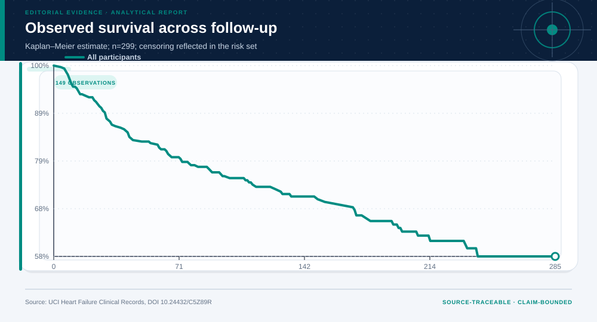
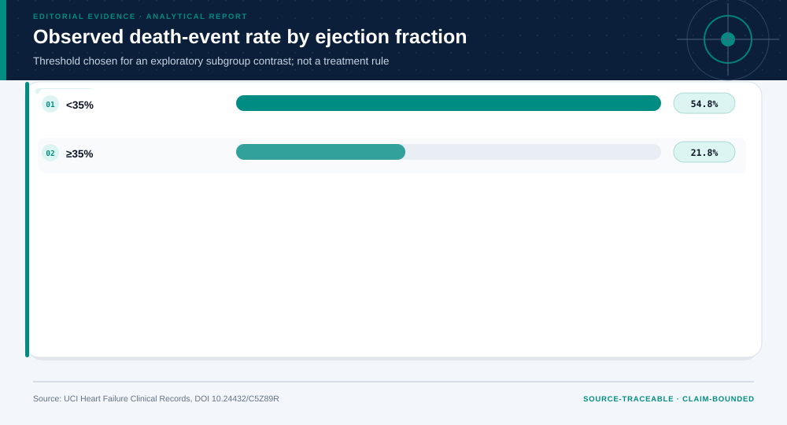
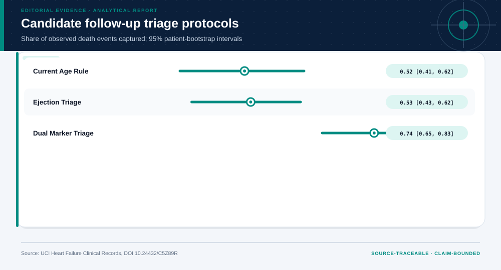

# Heart Failure Clinical Records: analytical project

> **Bottom line:** Low ejection fraction is associated with a higher observed death-event rate, but the dataset supports triage-rule validation—not a treatment recommendation.

## Executive Summary

This source-backed project connects the decision question to its data, validation design, visual evidence, and explicit claim boundary. The report structure follows this case rather than a fixed universal template.

### Evidence at a glance

| Signal | Observed result |
|---|---|
| Observed death-event rate | 32.1% |
| Observed 180-day survival | 65.4% |
| Low-versus-higher ejection-fraction risk difference | 33.0% (bootstrap 95% interval 20.9% to 44.7%) |
| Apparent Cox Harrell C-index | 0.731 |

## Key findings with visual evidence

The visual sequence is interleaved with source, design, and limitation notes so each result stays adjacent to the evidence that supports it.

### Survival estimates retain censoring and the changing risk set

The Kaplan–Meier view shows the observed follow-up experience without treating every patient window as complete.

> **Interpretation boundary:** Descriptive survival contrast; it does not identify a treatment effect.

## Scope, source, and metric definitions

| Evidence contract | Recorded value |
|---|---|
| Source | Heart Failure Clinical Records [Dataset]. (2020). UCI Machine Learning Repository. https://doi.org/10.24432/C5Z89R |
| Version | UCI static archive snapshot; source file timestamp 2023-05-22 |
| Accessed | 2026-07-27 |
| License | [CC BY 4.0](https://creativecommons.org/licenses/by/4.0/) |
| Analytical grain | one de-identified patient follow-up record |
| Expected rows | 299 |
| Results | [`results.json`](results.json) |
| Definitions | [`../data/data-dictionary.json`](../data/data-dictionary.json) |
| Quality | [`../data/quality-report.json`](../data/quality-report.json) |

### Adjusted associations remain estimates, not intervention effects

The multivariable Cox model reports hazard-ratio direction and interval width alongside apparent discrimination.

> **Interpretation boundary:** Observed associations remain vulnerable to omitted variables, treatment selection, and cohort transport.

## Research design and data quality

### Design and estimand

| Design element | Project definition |
|---|---|
| Target Population | Patients represented by the source hospital cohort with heart failure and recorded follow-up |
| Time Zero | source-defined start of follow-up |
| Outcome | recorded death event during follow-up |
| Estimand | association between baseline predictors and all-cause event hazard, plus absolute observed event risk by 180 days |
| Inclusion | all 299 source records with nonmissing time and event |
| Exclusion | none |
| Causal Status | observational association; no treatment estimand |

### Data-quality gate

| Check | Result |
|---|---|
| Prepared shape | 299 rows × 13 columns |
| Duplicate primary keys | 0 |
| Missing values under declared tokens | 0 |
| Privacy review | approved_for_public_aggregate_analysis |
| Quality disposition | **usable_with_documented_limitations** |

### The absolute risk contrast is paired with resampling uncertainty

Low ejection fraction is associated with a higher observed event rate, and the patient bootstrap shows how much that contrast moves.

> **Interpretation boundary:** The threshold was not prospectively registered and must not be interpreted as a treatment rule.

## Methodology

Kaplan–Meier survival estimation, multivariable Breslow-tie Cox regression, Schoenfeld-time diagnostics, apparent 180-day calibration, subgroup risk differences, patient bootstrap, and protocol capture/workload analysis.

All shipped metrics are regenerated by `prepare_data.py` and `analyze.py`. Random procedures use fixed seeds, and committed raw files are checked against the SHA-256 values in `source-manifest.json`.

### Candidate follow-up protocols expose capture–workload trade-offs

Protocol comparisons make the operational trade-off visible instead of presenting risk separation as a complete decision.

> **Interpretation boundary:** Prospective validation and clinical ownership are required before any protocol use.

## Parameter provenance and review

5 configured or derived parameters are recorded with their source, uncertainty class, provisional approval, reviewer status, and use boundary.

<strong>Open the complete parameter-level source and review register</strong>

| Parameter path | Value or distribution | Uncertainty | Source | Approval | Reviewer | Boundary |
|---|---|---|---|---|---|---|
| config.analysis_seed | 20260727 | none | analysis-protocol | provisional_self_review | not_assigned | Computational setting; it does not increase evidence quality. |
| config.parameters.ejection_fraction_threshold | 35 | none | analyst-protocol | provisional_self_review | not_assigned | Subgroup and candidate-rule definition; not a clinical threshold endorsement. |
| config.parameters.age_triage_threshold | 65 | none | analyst-protocol | provisional_self_review | not_assigned | Comparator only. |
| config.parameters.creatinine_triage_threshold | 1.5 | none | analyst-protocol | provisional_self_review | not_assigned | Candidate-rule definition only. |
| config.parameters.bootstrap_repetitions | 2000 | none | analysis-protocol | provisional_self_review | not_assigned | Controls Monte Carlo precision, not evidence quality. |

## Limitations, uncertainty, and robustness

Small observational cohort; selection and treatment information are incomplete; thresholds were not prospectively registered.

Bootstrap or scenario stability remains conditional on the observed sample and declared assumptions; it does not upgrade exploratory evidence into operational authorization.

## What this study cannot establish

| Boundary | Not established by this project |
|---|---|
| Causality | A causal effect unless the stated design and identification assumptions support it |
| Transport | Performance or effects in an unobserved population, institution, or future regime |
| Authorization | Permission for a clinical, policy, financial, engineering, marketing, or automated action |

## Decision implications and reversal conditions

The analysis can prioritize validation, diligence, or a bounded pilot; it is not itself permission to act. Reconsider the interpretation when:

- A prospective or external validation reverses the observed ranking.
- A missing local constraint changes feasibility or the outcome definition.
- A domain owner rejects the analyst-defined threshold, scale, or trade-off.

## Conditional downstream decision layer

The Evidence Intelligence Report remains the primary record. The separate Decision Intelligence Brief applies case-specific gates and may end in a pilot, evidence request, non-deployment, or stop.

[Open the complete Decision Intelligence Brief](decision/report/decision-report.md).

## Recommended next steps

| Step | Action |
|---:|---|
| 1 | Re-run on a newly reviewed source version and compare the source hash, schema, and headline metrics. |
| 2 | Obtain domain-owner review of definitions, thresholds, exclusions, and action constraints. |
| 3 | Pre-register the next prospective or experimental validation before using any decision rule. |

## Further questions

- Which missing local variable could reverse the current ranking or interpretation?
- What prospective evidence would be required before operational use?
- Which subgroup, period, or spatial unit is least well represented?

<strong>Reproducibility receipt</strong>

- Project ID: `population-health-survival`
- Source manifest: [`../source-manifest.json`](../source-manifest.json)
- Result SHA-256: `f3938193edb8041c492554bfff055ff562ed50176c42c0959e48441d44dbab2f`

