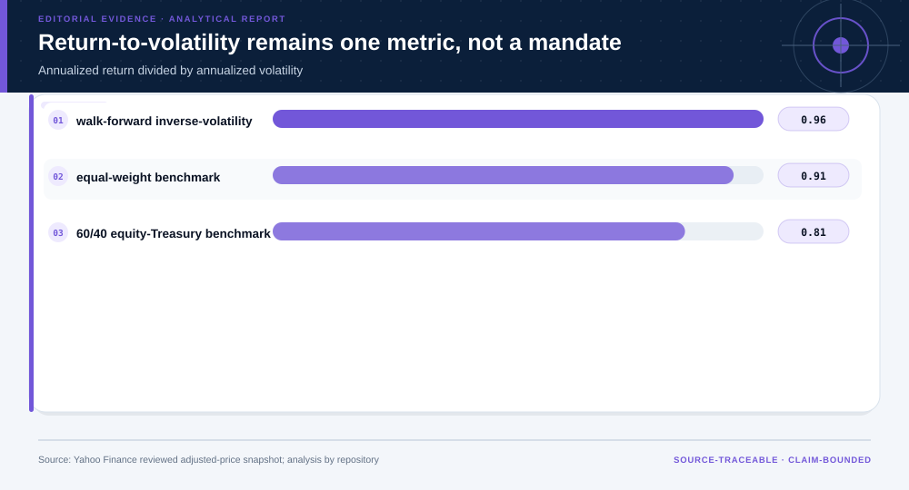
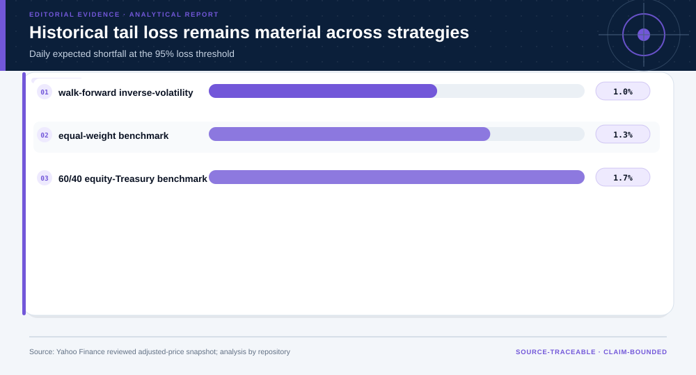
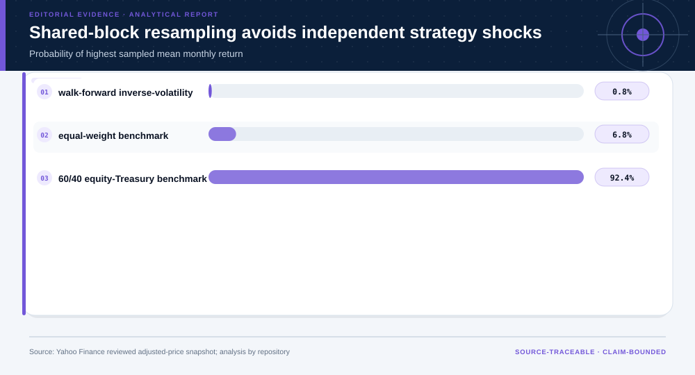
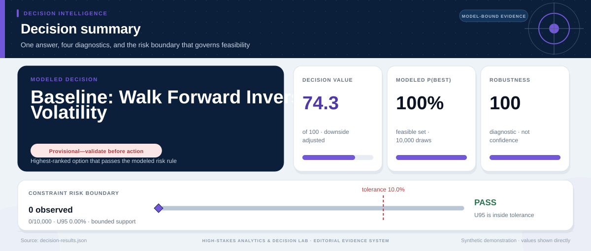

# Regime-Aware Multi-Asset Portfolio Construction: analytical project

> **Bottom line:** The walk-forward allocation is evaluated against equal-weight and 60/40 benchmarks under shared market histories, costs, drawdowns, and correlated stress; it is research evidence, not an investment mandate.

## Executive Summary

This source-backed project connects the decision question to its data, validation design, visual evidence, and explicit claim boundary. The report structure follows this case rather than a fixed universal template.

### Evidence at a glance

| Signal | Observed result |
|---|---|
| Walk-forward evaluation | 2,513 common trading days |
| Adaptive annualized return / volatility | 6.9% / 7.1% |
| Adaptive maximum drawdown | -16.6% |
| Adaptive shared-block P(best) | 0.8% |

## Key findings with visual evidence

The visual sequence is interleaved with source, design, and limitation notes so each result stays adjacent to the evidence that supports it.

### Walk-forward growth remains benchmarked through time

The adaptive allocation uses only trailing information and remains beside equal-weight and 60/40 references.

> **Interpretation boundary:** Historical adjusted-price performance does not establish future returns, suitability, or executable prices.

## Scope, source, and metric definitions

| Evidence contract | Recorded value |
|---|---|
| Source | Yahoo Finance Chart API adjusted-price histories for SPY, TLT, VNQ, GLD, and BIL; reviewed fixed-period snapshot |
| Version | 2015-01-01 through 2025-12-31 request window |
| Accessed | 2026-07-30 |
| License | [Yahoo terms of service; upstream market-data rights remain separate](https://legal.yahoo.com/us/en/yahoo/terms/product-atos/apiforydn/index.html) |
| Analytical grain | one common trading date across five ETF adjusted-price series |
| Expected rows | 2,766 |
| Results | [`results.json`](results.json) |
| Definitions | [`../data/data-dictionary.json`](../data/data-dictionary.json) |
| Quality | [`../data/quality-report.json`](../data/quality-report.json) |

### Risk-adjusted performance is one comparison, not a mandate

Annualized return is read beside volatility, turnover, drawdown, and explicit benchmarks.

> **Interpretation boundary:** The ratio omits investor liabilities, taxes, capacity, and preference-specific utility.

## Research design and data quality

### Design and estimand

| Design element | Project definition |
|---|---|
| Unit | common US trading day |
| Information Set | trailing 252 trading days available before each monthly rebalance |
| Evaluation | walk-forward daily returns after the initial lookback |
| Benchmarks | equal-weight benchmark, 60/40 equity-Treasury benchmark |
| Claim Class | historical portfolio-design comparison |

### Data-quality gate

| Check | Result |
|---|---|
| Prepared shape | 2,766 rows × 6 columns |
| Duplicate primary keys | 0 |
| Missing values under declared tokens | 0 |
| Privacy review | pass |
| Quality disposition | **usable_with_documented_limitations** |

### Tail loss remains visible across every strategy

Expected shortfall reports the severity beyond the historical 95% loss quantile.

> **Interpretation boundary:** Historical tails are incomplete stress evidence and can understate an unobserved regime.

## Methodology

Adjusted-price alignment, daily returns, monthly walk-forward inverse-volatility allocation, bounded weights, declared turnover cost, equal-weight and 60/40 benchmarks, drawdown, historical VaR/ES, regime stress, and shared moving-block bootstrap.

All shipped metrics are regenerated by `prepare_data.py` and `analyze.py`. Random procedures use fixed seeds, and committed raw files are checked against the SHA-256 values in `source-manifest.json`.

### Probability-best preserves correlated market shocks

All strategies receive the same sampled month blocks rather than independent perturbations.

> **Interpretation boundary:** Bootstrap frequency is conditional on this history, block length, strategy set, and estimation design.

## Parameter provenance and review

8 configured or derived parameters are recorded with their source, uncertainty class, provisional approval, reviewer status, and use boundary.

<strong>Open the complete parameter-level source and review register</strong>

| Parameter path | Value or distribution | Uncertainty | Source | Approval | Reviewer | Boundary |
|---|---|---|---|---|---|---|
| config.analysis_seed | 20260730 | none | analysis-protocol | provisional_self_review | not_assigned | Computational setting; it does not increase evidence quality. |
| config.parameters.volatility_lookback_days | 252 | none | walk-forward-research-protocol | provisional_self_review | not_assigned | Trailing information only; not asserted to be optimal. |
| config.parameters.rebalance_frequency | monthly | none | walk-forward-research-protocol | provisional_self_review | not_assigned | Trailing information only; not asserted to be optimal. |
| config.parameters.minimum_weight | 0.05 | scenario | analyst-diversification-constraint | provisional_self_review | not_assigned | Illustrative diversification bounds, not an investor mandate. |
| config.parameters.maximum_weight | 0.35 | scenario | analyst-diversification-constraint | provisional_self_review | not_assigned | Illustrative diversification bounds, not an investor mandate. |
| config.parameters.transaction_cost_bps | 10 | scenario | analyst-cost-sensitivity | provisional_self_review | not_assigned | Does not include bid-ask variation, taxes, impact, or account-specific fees. |
| config.parameters.bootstrap_samples | 1000 | none | shared-market-shock-resampling-protocol | provisional_self_review | not_assigned | All strategies share sampled month blocks; the chosen block length remains a sensitivity. |
| config.parameters.bootstrap_block_months | 6 | none | shared-market-shock-resampling-protocol | provisional_self_review | not_assigned | All strategies share sampled month blocks; the chosen block length remains a sensitivity. |

## Limitations, uncertainty, and robustness

The provider snapshot and ETF proxies omit taxes, bid–ask spreads, market impact, tracking error, investor liabilities, capacity, and future regimes. Historical adjusted prices do not establish future performance or suitability.

Bootstrap or scenario stability remains conditional on the observed sample and declared assumptions; it does not upgrade exploratory evidence into operational authorization.

## What this study cannot establish

| Boundary | Not established by this project |
|---|---|
| Causality | A causal effect unless the stated design and identification assumptions support it |
| Transport | Performance or effects in an unobserved population, institution, or future regime |
| Authorization | Permission for a clinical, policy, financial, engineering, marketing, or automated action |

## Decision implications and reversal conditions

The analysis can prioritize validation, diligence, or a bounded pilot; it is not itself permission to act. Reconsider the interpretation when:

- Results reverse under a separately sourced total-return history.
- A realistic fee, tax, liquidity, or turnover model removes the observed advantage.
- A longer crisis regime changes drawdown or tail-loss ordering.
- The investor's horizon, liabilities, or fiduciary constraints reject the weight bounds.

## Conditional downstream decision layer

The Evidence Intelligence Report remains the primary record. The separate Decision Intelligence Brief applies case-specific gates and may end in a pilot, evidence request, non-deployment, or stop.

[Open the complete Decision Intelligence Brief](decision/report/decision-report.md).

## Recommended next steps

| Step | Action |
|---:|---|
| 1 | Re-run on a newly reviewed source version and compare the source hash, schema, and headline metrics. |
| 2 | Obtain domain-owner review of definitions, thresholds, exclusions, and action constraints. |
| 3 | Pre-register the next prospective or experimental validation before using any decision rule. |

## Further questions

- Which missing local variable could reverse the current ranking or interpretation?
- What prospective evidence would be required before operational use?
- Which subgroup, period, or spatial unit is least well represented?

<strong>Reproducibility receipt</strong>

- Project ID: `regime-aware-multi-asset-portfolio`
- Source manifest: [`../source-manifest.json`](../source-manifest.json)
- Result SHA-256: `7ebe6f8971d519b79d1949720b466b35d167e6ad6f67fe559b2300dc06df315a`

