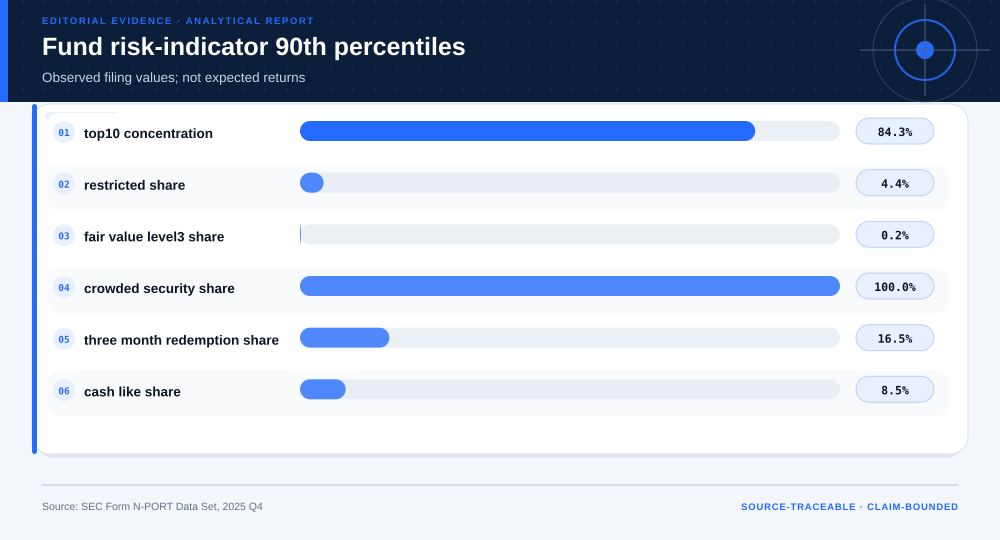
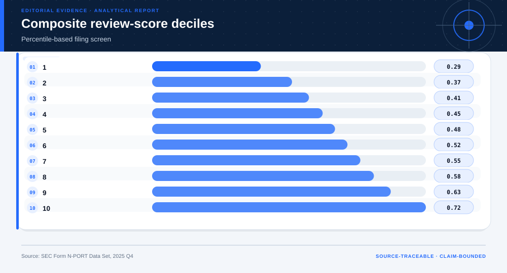
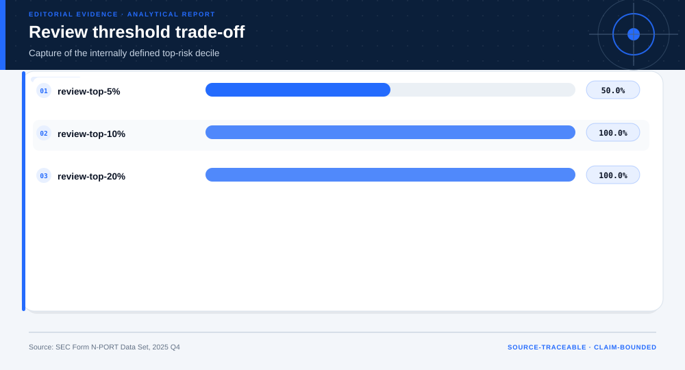
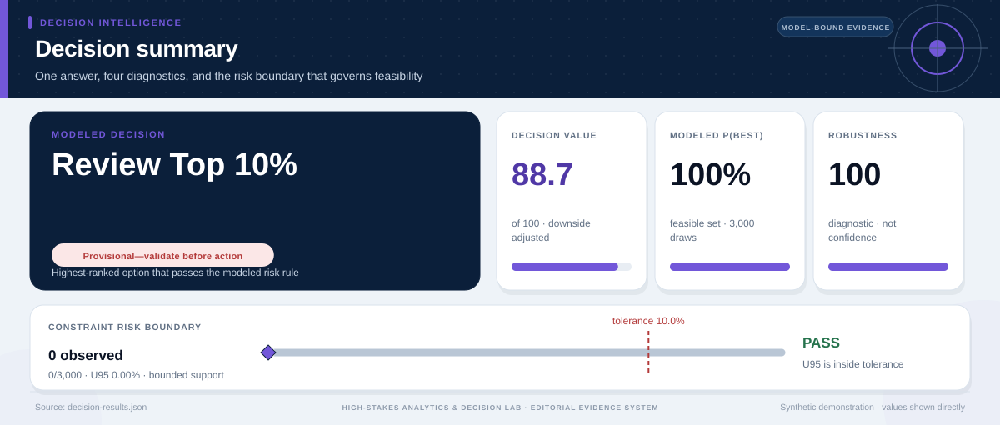

# SEC N-PORT Liquidity and Crowding Filing Review: analytical project

> **Bottom line:** SEC N-PORT indicators support a transparent filing-review queue, not a return forecast, fund ranking, or investment recommendation.

## Executive Summary

This source-backed project connects the decision question to its data, validation design, visual evidence, and explicit claim boundary. The report structure follows this case rather than a fixed universal template.

### Evidence at a glance

| Signal | Observed result |
|---|---|
| Reviewed fund filings | 11,747 |
| Median top-10 holding concentration | 34.5% |
| 90th-percentile Level-3 share | 0.2% |
| Terminal use | targeted filing review only |

## Key findings with visual evidence

The visual sequence is interleaved with source, design, and limitation notes so each result stays adjacent to the evidence that supports it.

### N-PORT indicator tails

Observed filing distributions define review signals.

> **Interpretation boundary:** Indicators are not expected returns.

## Scope, source, and metric definitions

| Evidence contract | Recorded value |
|---|---|
| Source | U.S. Securities and Exchange Commission. Form N-PORT Data Set 2025 Q4, minimized to fund-level review indicators. |
| Version | Form N-PORT Data Set 2025 Q4, minimized to fund-level review indicators |
| Accessed | 2026-08-10 |
| License | [U.S. Government public data](https://www.sec.gov/os/accessing-edgar-data) |
| Analytical grain | one fund filing snapshot |
| Expected rows | 11,747 |
| Results | [`results.json`](results.json) |
| Definitions | [`../data/data-dictionary.json`](../data/data-dictionary.json) |
| Quality | [`../data/quality-report.json`](../data/quality-report.json) |

### Transparent score deciles

Every score component is percentile-based.

> **Interpretation boundary:** The composite is analyst-defined.

## Research design and data quality

### Design and estimand

| Design element | Project definition |
|---|---|
| Design | cross-sectional regulatory filing screen |
| Unit | fund filing |
| Decision Use | targeted filing review only |
| Forbidden Use | investment recommendation or expected-return claim |

### Data-quality gate

| Check | Result |
|---|---|
| Prepared shape | 11,747 rows × 13 columns |
| Duplicate primary keys | 0 |
| Missing values under declared tokens | 696 |
| Privacy review | approved_for_public_minimized_analysis |
| Quality disposition | **ready_with_documented_limitations** |

### Review capacity trade-off

Thresholds determine workload and internal high-score capture.

> **Interpretation boundary:** Selection triggers filing review only.

## Methodology

Official filing extraction, concentration/liquidity/redemption indicators, percentile ranks, capacity thresholds, and explicit filing-review-only governance.

All shipped metrics are regenerated by `prepare_data.py` and `analyze.py`. Random procedures use fixed seeds, and committed raw files are checked against the SHA-256 values in `source-manifest.json`.

## Parameter provenance and review

4 configured or derived parameters are recorded with their source, uncertainty class, provisional approval, reviewer status, and use boundary.

<strong>Open the complete parameter-level source and review register</strong>

| Parameter path | Value or distribution | Uncertainty | Source | Approval | Reviewer | Boundary |
|---|---|---|---|---|---|---|
| config.analysis_seed | 20260810 | none | analysis-protocol | provisional_self_review | not_assigned | Computational setting; it does not increase evidence quality. |
| config.parameters.review_shares | [0.05, 0.1, 0.2] | none | case-specific-analysis-protocol | provisional_self_review | not_assigned | Filing review only; no expected-return, suitability, fund-quality, or investment recommendation. |
| config.parameters.high_risk_reference_share | 0.1 | none | case-specific-analysis-protocol | provisional_self_review | not_assigned | Filing review only; no expected-return, suitability, fund-quality, or investment recommendation. |
| config.parameters.score_rule | equal_weight_percentile_mean | none | case-specific-analysis-protocol | provisional_self_review | not_assigned | Filing review only; no expected-return, suitability, fund-quality, or investment recommendation. |

## Limitations, uncertainty, and robustness

N-PORT fields are reported snapshots and may be amended; the composite is an analyst screen, not SEC risk classification, investor suitability, or expected performance.

Bootstrap or scenario stability remains conditional on the observed sample and declared assumptions; it does not upgrade exploratory evidence into operational authorization.

## What this study cannot establish

| Boundary | Not established by this project |
|---|---|
| Causality | A causal effect unless the stated design and identification assumptions support it |
| Transport | Performance or effects in an unobserved population, institution, or future regime |
| Authorization | Permission for a clinical, policy, financial, engineering, marketing, or automated action |

## Decision implications and reversal conditions

The analysis can prioritize validation, diligence, or a bounded pilot; it is not itself permission to act. Reconsider the interpretation when:

- A filing amendment changes a fund's reported holdings or flows.
- A domain reviewer rejects the percentile-based composite score.
- A different filing population changes the risk-indicator distribution.

## Conditional downstream decision layer

The Evidence Intelligence Report remains the primary record. The separate Decision Intelligence Brief applies case-specific gates and may end in a pilot, evidence request, non-deployment, or stop.

[Open the complete Decision Intelligence Brief](decision/report/decision-report.md).

## Recommended next steps

| Step | Action |
|---:|---|
| 1 | Re-run on a newly reviewed source version and compare the source hash, schema, and headline metrics. |
| 2 | Obtain domain-owner review of definitions, thresholds, exclusions, and action constraints. |
| 3 | Pre-register the next prospective or experimental validation before using any decision rule. |

## Further questions

- Which missing local variable could reverse the current ranking or interpretation?
- What prospective evidence would be required before operational use?
- Which subgroup, period, or spatial unit is least well represented?

<strong>Reproducibility receipt</strong>

- Project ID: `sec-nport-filing-review`
- Source manifest: [`../source-manifest.json`](../source-manifest.json)
- Result SHA-256: `eea4c0939afc9ee823ad46d7fccd245eeb5b98492ffe7558cbcd307ff21fc94c`

