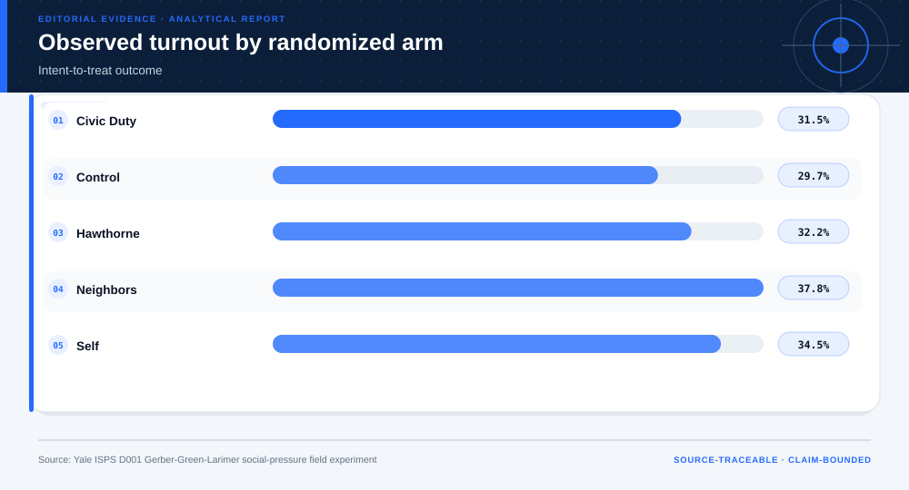
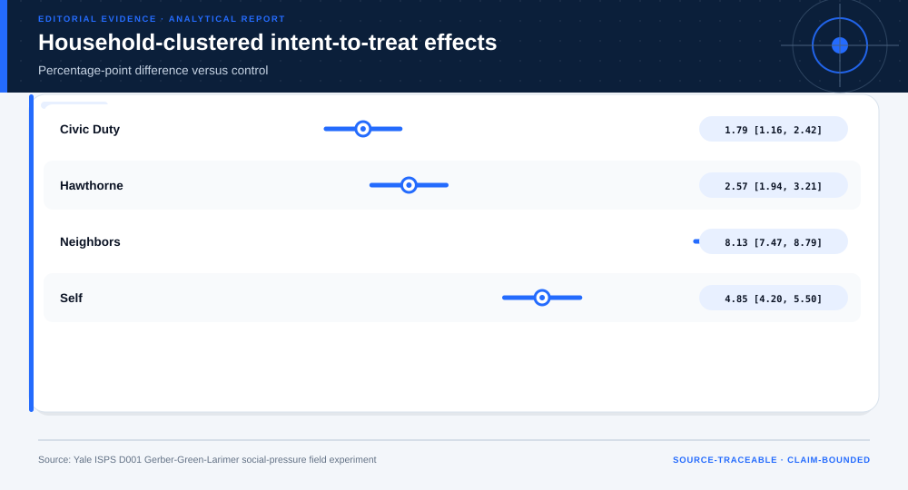
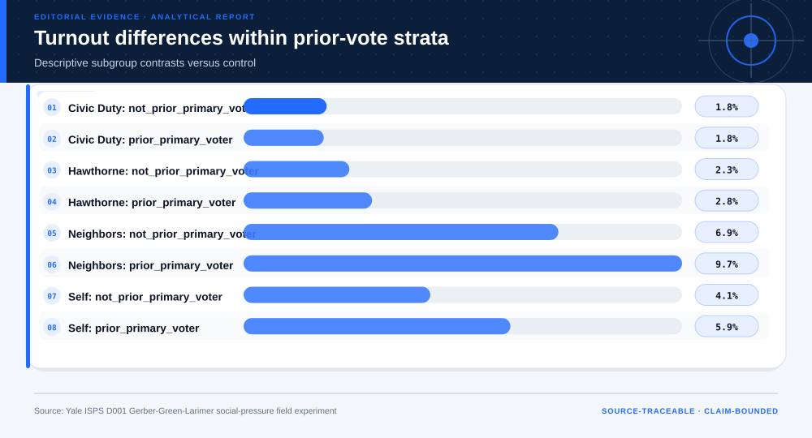

# Social-Norm Field Experiment with Household-Clustered Inference: analytical project

> **Bottom line:** The household-randomized field experiment identifies intent-to-treat turnout differences in its study population; public artifacts retain clustered inference without redistributing participant rows.

## Executive Summary

This source-backed project connects the decision question to its data, validation design, visual evidence, and explicit claim boundary. The report structure follows this case rather than a fixed universal template.

### Evidence at a glance

| Signal | Observed result |
|---|---|
| Source individuals analyzed | 344,084 |
| Largest observed ITT | Neighbors 8.1% |
| Household-clustered 95% interval | 7.5% to 8.8% |
| Causal scope | the randomized experiment only |

## Key findings with visual evidence

The visual sequence is interleaved with source, design, and limitation notes so each result stays adjacent to the evidence that supports it.

### Randomized-arm turnout

Observed treatment rates come from the full replication file.

> **Interpretation boundary:** The causal scope is the experiment.

## Scope, source, and metric definitions

| Evidence contract | Recorded value |
|---|---|
| Source | Yale Institution for Social and Policy Studies. Gerber-Green-Larimer 2008 replication file; non-identifying aggregate and locally computed clustered inference. |
| Version | Gerber-Green-Larimer 2008 replication file; non-identifying aggregate and locally computed clustered inference |
| Accessed | 2026-08-10 |
| License | [CC0 1.0 (Yale Dataverse dataset)](https://creativecommons.org/publicdomain/zero/1.0/) |
| Analytical grain | one treatment by prior-turnout aggregate |
| Expected rows | 10 |
| Results | [`results.json`](results.json) |
| Definitions | [`../data/data-dictionary.json`](../data/data-dictionary.json) |
| Quality | [`../data/quality-report.json`](../data/quality-report.json) |

### Clustered treatment effects

Standard errors account for household assignment.

> **Interpretation boundary:** Intervals do not establish transport.

## Research design and data quality

### Design and estimand

| Design element | Project definition |
|---|---|
| Design | household-randomized field experiment |
| Estimand | individual-level intent-to-treat difference in turnout |
| Variance | OLS sandwich variance clustered by household |
| Repository Storage | non-identifying aggregates only |

### Data-quality gate

| Check | Result |
|---|---|
| Prepared shape | 10 rows × 6 columns |
| Duplicate primary keys | 0 |
| Missing values under declared tokens | 0 |
| Privacy review | approved_for_public_minimized_analysis |
| Quality disposition | **usable_with_documented_limitations** |

### Prior-turnout strata

Subgroup contrasts expose heterogeneity.

> **Interpretation boundary:** These strata comparisons are descriptive.

## Methodology

Randomized-arm turnout rates, household-clustered sandwich standard errors, 95% intervals, and descriptive prior-turnout-stratum contrasts.

All shipped metrics are regenerated by `prepare_data.py` and `analyze.py`. Random procedures use fixed seeds, and committed raw files are checked against the SHA-256 values in `source-manifest.json`.

## Parameter provenance and review

4 configured or derived parameters are recorded with their source, uncertainty class, provisional approval, reviewer status, and use boundary.

<strong>Open the complete parameter-level source and review register</strong>

| Parameter path | Value or distribution | Uncertainty | Source | Approval | Reviewer | Boundary |
|---|---|---|---|---|---|---|
| config.analysis_seed | 20260810 | none | analysis-protocol | provisional_self_review | not_assigned | Computational setting; it does not increase evidence quality. |
| config.parameters.confidence_level | 0.95 | none | case-specific-analysis-protocol | provisional_self_review | not_assigned | Causal scope is the historical randomized experiment; no new campaign authorization. |
| config.parameters.cluster_unit | household | none | case-specific-analysis-protocol | provisional_self_review | not_assigned | Causal scope is the historical randomized experiment; no new campaign authorization. |
| config.parameters.primary_outcome | voted | none | case-specific-analysis-protocol | provisional_self_review | not_assigned | Causal scope is the historical randomized experiment; no new campaign authorization. |

## Limitations, uncertainty, and robustness

The historical election setting, intervention wording, interference, ethics, and population transport limit any new campaign use.

Bootstrap or scenario stability remains conditional on the observed sample and declared assumptions; it does not upgrade exploratory evidence into operational authorization.

## What this study cannot establish

| Boundary | Not established by this project |
|---|---|
| Causality | A causal effect unless the stated design and identification assumptions support it |
| Transport | Performance or effects in an unobserved population, institution, or future regime |
| Authorization | Permission for a clinical, policy, financial, engineering, marketing, or automated action |

## Decision implications and reversal conditions

The analysis can prioritize validation, diligence, or a bounded pilot; it is not itself permission to act. Reconsider the interpretation when:

- A replication in the intended population fails to reproduce the effect.
- Ethics or legal review rejects the intervention content.
- Household clustering or interference assumptions require a different estimand.

## Recommended next steps

| Step | Action |
|---:|---|
| 1 | Re-run on a newly reviewed source version and compare the source hash, schema, and headline metrics. |
| 2 | Obtain domain-owner review of definitions, thresholds, exclusions, and action constraints. |
| 3 | Pre-register the next prospective or experimental validation before using any decision rule. |

## Further questions

- Which missing local variable could reverse the current ranking or interpretation?
- What prospective evidence would be required before operational use?
- Which subgroup, period, or spatial unit is least well represented?

<strong>Reproducibility receipt</strong>

- Project ID: `social-norm-field-experiment`
- Source manifest: [`../source-manifest.json`](../source-manifest.json)
- Result SHA-256: `c0e0e4041c3bbf3b0165e20548d2b42f65fa6fafa3589581d2a1f4b2d0d3af15`

