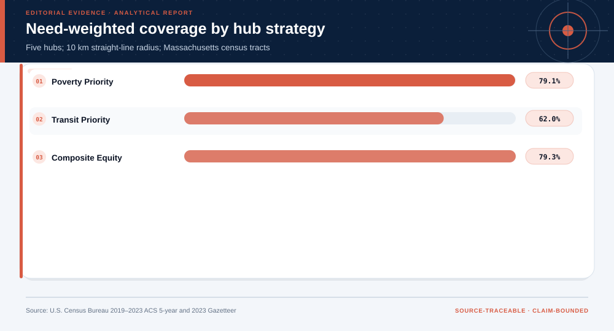
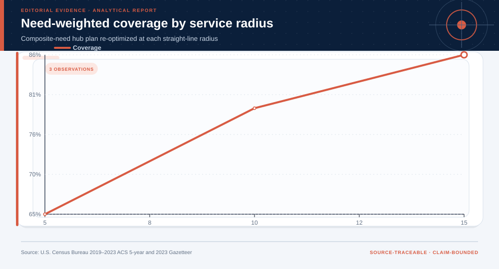
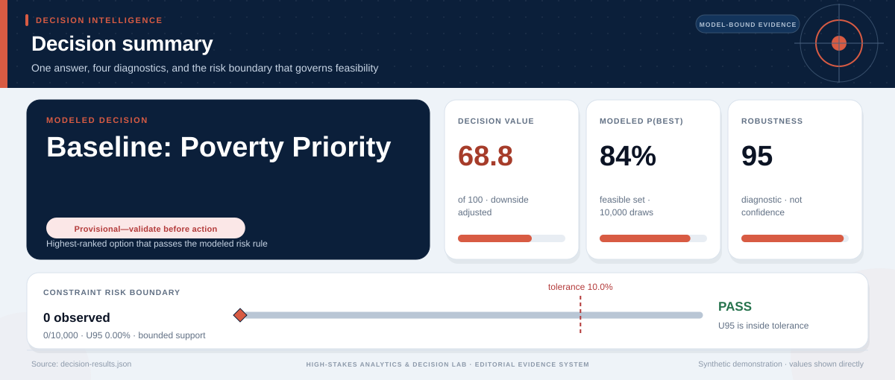

# 2019-2023 American Community Survey 5-Year Estimates and 2023 Census Gazetteer: analytical project

> **Bottom line:** Need is spatially clustered, and composite location allocation balances poverty, transit dependence, and housing pressure better than a single-indicator rule.

## Executive Summary

This source-backed project connects the decision question to its data, validation design, visual evidence, and explicit claim boundary. The report structure follows this case rather than a fixed universal template.

### Evidence at a glance

| Signal | Observed result |
|---|---|
| Analyzed tracts | 1,597 |
| Poverty-rate Moran's I | 0.491 |
| Composite-plan need coverage | 78.1% |
| High-poverty population coverage | 65.6% |

## Key findings with visual evidence

The visual sequence is interleaved with source, design, and limitation notes so each result stays adjacent to the evidence that supports it.

### Need is spatially clustered rather than randomly scattered

The tract map and Moran’s I place candidate hubs inside the observed geography of composite need.

> **Interpretation boundary:** Tract centroids and straight-line distance are planning-screen approximations.

## Scope, source, and metric definitions

| Evidence contract | Recorded value |
|---|---|
| Source | U.S. Census Bureau. 2019-2023 ACS 5-Year Estimates and 2023 Gazetteer Files. |
| Version | 2019-2023 ACS 5-year estimates; 2023 Gazetteer |
| Accessed | 2026-07-27 |
| License | [U.S. Government work / Census open data](https://www.census.gov/topics/research/research-transparency-public-access/open-data.html) |
| Analytical grain | one Massachusetts 2020-vintage census tract |
| Expected rows | 1,620 |
| Results | [`results.json`](results.json) |
| Definitions | [`../data/data-dictionary.json`](../data/data-dictionary.json) |
| Quality | [`../data/quality-report.json`](../data/quality-report.json) |

### Composite allocation balances multiple dimensions of need

Every strategy uses the same hub count and radius before population and need coverage are compared.

> **Interpretation boundary:** Weights encode a planning priority and require local stakeholder review.

## Research design and data quality

### Design and estimand

| Design element | Project definition |
|---|---|
| Claim class | Unit, time split, target, constraints, and claim class are defined in `results.json`; no causal estimand is claimed unless the design explicitly supports one. |

### Data-quality gate

| Check | Result |
|---|---|
| Prepared shape | 1,620 rows × 14 columns |
| Duplicate primary keys | 0 |
| Missing values under declared tokens | 157 |
| Privacy review | approved_for_public_aggregate_analysis |
| Quality disposition | **usable_with_documented_limitations** |

### Service assumptions can reverse the apparent advantage

Radius, need-weight, and coarse-grid sensitivity reveal dependence on spatial scale and access assumptions.

> **Interpretation boundary:** Travel networks, capacity, ACS margins of error, and local site feasibility remain outside the screen.

## Methodology

ACS rate construction, z-score composite, five-nearest-neighbor Moran’s I, greedy maximum coverage, and tract bootstrap.

All shipped metrics are regenerated by `prepare_data.py` and `analyze.py`. Random procedures use fixed seeds, and committed raw files are checked against the SHA-256 values in `source-manifest.json`.

## Parameter provenance and review

6 configured or derived parameters are recorded with their source, uncertainty class, provisional approval, reviewer status, and use boundary.

<strong>Open the complete parameter-level source and review register</strong>

| Parameter path | Value or distribution | Uncertainty | Source | Approval | Reviewer | Boundary |
|---|---|---|---|---|---|---|
| config.analysis_seed | 20260727 | none | analysis-protocol | provisional_self_review | not_assigned | Computational setting; it does not increase evidence quality. |
| config.parameters.composite_need_weights | {'poverty': 0.5, 'transit': 0.3, 'rent_to_income_proxy': 0.2} | scenario | analyst-planning-priorities | provisional_self_review | not_assigned | Requires stakeholder elicitation before planning use. |
| config.parameters.morans_i_neighbors | 5 | none | spatial-analysis-protocol | provisional_self_review | not_assigned | Five nearest tract centroids; no contiguity weights. |
| config.parameters.hub_count | 5 | scenario | analyst-capacity-scenario | provisional_self_review | not_assigned | Common constraint for strategy comparison. |
| config.parameters.coverage_radius_km | 10.0 | scenario | analyst-access-scenario | provisional_self_review | not_assigned | Straight-line centroid distance, not travel time. |
| config.parameters.bootstrap_repetitions | 300 | none | analysis-protocol | provisional_self_review | not_assigned | Tract resampling does not model ACS margins of error. |

## Limitations, uncertainty, and robustness

Straight-line distance and tract centroids are planning-screen approximations; ACS margins of error and service capacity require local review.

Bootstrap or scenario stability remains conditional on the observed sample and declared assumptions; it does not upgrade exploratory evidence into operational authorization.

## What this study cannot establish

| Boundary | Not established by this project |
|---|---|
| Causality | A causal effect unless the stated design and identification assumptions support it |
| Transport | Performance or effects in an unobserved population, institution, or future regime |
| Authorization | Permission for a clinical, policy, financial, engineering, marketing, or automated action |

## Decision implications and reversal conditions

The analysis can prioritize validation, diligence, or a bounded pilot; it is not itself permission to act. Reconsider the interpretation when:

- Network travel times reverse straight-line accessibility rankings.
- Local land-use or ownership makes selected hubs infeasible.
- Alternative weights or geographic aggregation materially change priorities.

## Conditional downstream decision layer

The Evidence Intelligence Report remains the primary record. The separate Decision Intelligence Brief applies case-specific gates and may end in a pilot, evidence request, non-deployment, or stop.

[Open the complete Decision Intelligence Brief](decision/report/decision-report.md).

## Recommended next steps

| Step | Action |
|---:|---|
| 1 | Re-run on a newly reviewed source version and compare the source hash, schema, and headline metrics. |
| 2 | Obtain domain-owner review of definitions, thresholds, exclusions, and action constraints. |
| 3 | Pre-register the next prospective or experimental validation before using any decision rule. |

## Further questions

- Which missing local variable could reverse the current ranking or interpretation?
- What prospective evidence would be required before operational use?
- Which subgroup, period, or spatial unit is least well represented?

<strong>Reproducibility receipt</strong>

- Project ID: `spatial-equity-planning`
- Source manifest: [`../source-manifest.json`](../source-manifest.json)
- Result SHA-256: `a94b808b2c98e01abab6185fcc11d6a70fc3118b99757d4772b2c50aff97e470`

