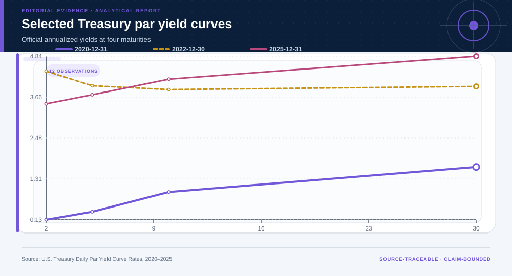
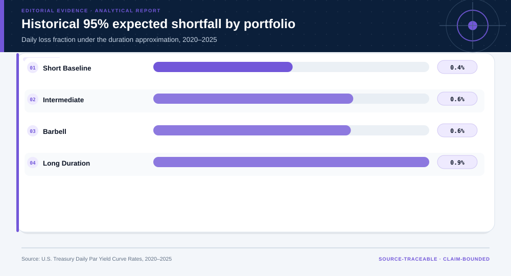
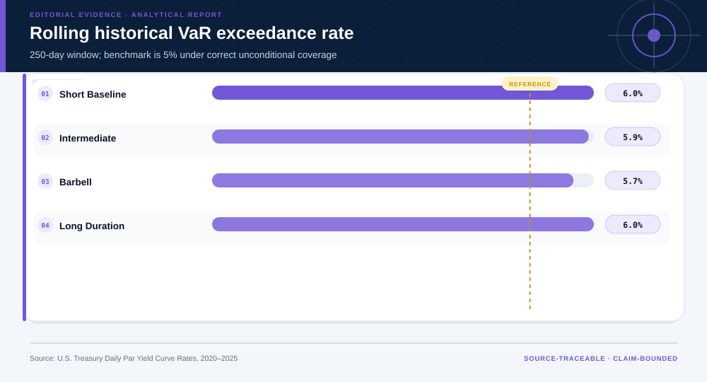
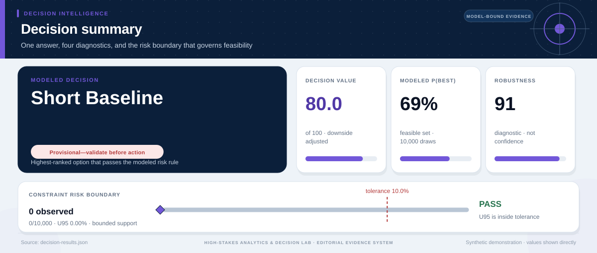

# Daily Treasury Par Yield Curve Rates: analytical project

> **Bottom line:** Longer-duration allocations offer different carry/risk trade-offs and materially larger historical tail losses; the short portfolio remains the risk reference.

## Executive Summary

This source-backed project connects the decision question to its data, validation design, visual evidence, and explicit claim boundary. The report structure follows this case rather than a fixed universal template.

### Evidence at a glance

| Signal | Observed result |
|---|---|
| Short-baseline historical ES95 loss | 0.4% |
| Short-baseline rolling VaR exceedance rate | 6.0% |
| Kupiec coverage p approximation | 0.114 |
| Return model | daily carry plus first-order duration response |

## Key findings with visual evidence

The visual sequence is interleaved with source, design, and limitation notes so each result stays adjacent to the evidence that supports it.

### Common market regimes anchor the portfolio comparison

Observed Treasury curves provide the shared daily shocks used by every hypothetical duration allocation.

> **Interpretation boundary:** The portfolios are approximations and omit convexity, security selection, costs, taxes, and financing.

## Scope, source, and metric definitions

| Evidence contract | Recorded value |
|---|---|
| Source | U.S. Department of the Treasury. Daily Treasury Par Yield Curve Rates. Accessed 2026-07-27. |
| Version | Official daily par yields, 2020-01-02 through 2025-12-31 |
| Accessed | 2026-07-27 |
| License | [U.S. Government work](https://www.usa.gov/government-copyright) |
| Analytical grain | one U.S. Treasury business-day yield curve |
| Expected rows | 1,500 |
| Results | [`results.json`](results.json) |
| Definitions | [`../data/data-dictionary.json`](../data/data-dictionary.json) |
| Quality | [`../data/quality-report.json`](../data/quality-report.json) |

### Longer duration increases historical tail loss

Empirical VaR and expected shortfall are reported together so the severity beyond the quantile remains visible.

> **Interpretation boundary:** Historical tail loss is scenario evidence, not a guarantee about a future regime.

## Research design and data quality

### Design and estimand

| Design element | Project definition |
|---|---|
| Claim class | Unit, time split, target, constraints, and claim class are defined in `results.json`; no causal estimand is claimed unless the design explicitly supports one. |

### Data-quality gate

| Check | Result |
|---|---|
| Prepared shape | 1,500 rows × 13 columns |
| Duplicate primary keys | 0 |
| Missing values under declared tokens | 0 |
| Privacy review | approved_for_public_analysis |
| Quality disposition | **usable_with_documented_limitations** |

### Coverage and breach dependence are separate diagnostics

Rolling exceedances, Kupiec coverage, and Christoffersen independence test different failure modes.

> **Interpretation boundary:** Passing one backtest does not validate the full return model or authorize investment use.

## Methodology

Yield-curve changes, first-order duration returns, empirical VaR/ES, drawdown, rolling Kupiec coverage, Christoffersen independence, regime stress, and block-length sensitivity.

All shipped metrics are regenerated by `prepare_data.py` and `analyze.py`. Random procedures use fixed seeds, and committed raw files are checked against the SHA-256 values in `source-manifest.json`.

## Parameter provenance and review

5 configured or derived parameters are recorded with their source, uncertainty class, provisional approval, reviewer status, and use boundary.

<strong>Open the complete parameter-level source and review register</strong>

| Parameter path | Value or distribution | Uncertainty | Source | Approval | Reviewer | Boundary |
|---|---|---|---|---|---|---|
| config.analysis_seed | 20260727 | none | analysis-protocol | provisional_self_review | not_assigned | Computational setting; it does not increase evidence quality. |
| config.parameters.trading_days_per_year | 252 | none | analysis-protocol | provisional_self_review | not_assigned | Used only for scaling summary moments. |
| config.parameters.historical_var_confidence | 0.95 | none | analysis-protocol | provisional_self_review | not_assigned | Historical loss quantile, not a forecast. |
| config.parameters.block_bootstrap_length | 20 | none | analysis-protocol | provisional_self_review | not_assigned | Sensitivity assumption, not an estimated dependence law. |
| config.parameters.duration_years | {'2 Yr': 1.9, '5 Yr': 4.5, '10 Yr': 8.0} | scenario | analyst-duration-approximation | provisional_self_review | not_assigned | Not security-level effective duration. |

## Limitations, uncertainty, and robustness

Approximate hypothetical portfolios omit convexity, security selection, bid–ask costs, taxes, financing, and investability.

Bootstrap or scenario stability remains conditional on the observed sample and declared assumptions; it does not upgrade exploratory evidence into operational authorization.

## What this study cannot establish

| Boundary | Not established by this project |
|---|---|
| Causality | A causal effect unless the stated design and identification assumptions support it |
| Transport | Performance or effects in an unobserved population, institution, or future regime |
| Authorization | Permission for a clinical, policy, financial, engineering, marketing, or automated action |

## Decision implications and reversal conditions

The analysis can prioritize validation, diligence, or a bounded pilot; it is not itself permission to act. Reconsider the interpretation when:

- Coverage or independence tests reject the historical model.
- Portfolio instruments have material convexity or basis risk.
- Trading costs or liquidity erase the apparent carry advantage.

## Conditional downstream decision layer

The Evidence Intelligence Report remains the primary record. The separate Decision Intelligence Brief applies case-specific gates and may end in a pilot, evidence request, non-deployment, or stop.

[Open the complete Decision Intelligence Brief](decision/report/decision-report.md).

## Recommended next steps

| Step | Action |
|---:|---|
| 1 | Re-run on a newly reviewed source version and compare the source hash, schema, and headline metrics. |
| 2 | Obtain domain-owner review of definitions, thresholds, exclusions, and action constraints. |
| 3 | Pre-register the next prospective or experimental validation before using any decision rule. |

## Further questions

- Which missing local variable could reverse the current ranking or interpretation?
- What prospective evidence would be required before operational use?
- Which subgroup, period, or spatial unit is least well represented?

<strong>Reproducibility receipt</strong>

- Project ID: `treasury-risk-engineering`
- Source manifest: [`../source-manifest.json`](../source-manifest.json)
- Result SHA-256: `a395dd35002b7f2bb46d5c6f8aca874a3f9eb7498d32ea568a8e8a08f0b65eb6`

