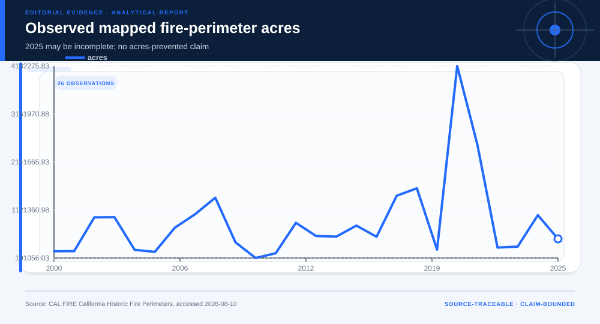
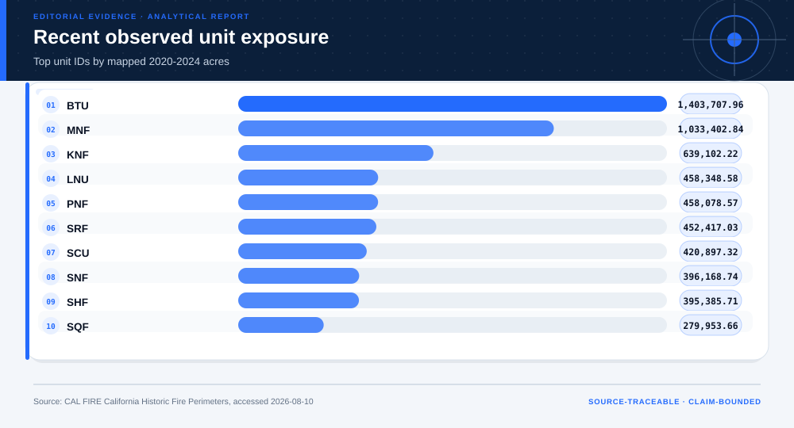

# Wildfire Mitigation Evidence Allocation Under Uncertainty: analytical project

> **Bottom line:** Historical perimeter data can stress-test where evidence collection should focus, but it cannot estimate fires or acres prevented; mitigation allocation remains blocked pending effectiveness and feasibility evidence.

## Executive Summary

This source-backed project connects the decision question to its data, validation design, visual evidence, and explicit claim boundary. The report structure follows this case rather than a fixed universal template.

### Evidence at a glance

| Signal | Observed result |
|---|---|
| Valid mapped perimeters | 8,892 |
| 90th-percentile perimeter size | 1,648 acres |
| Lowest-regret proxy allocation | recent acres |
| Terminal status | request effectiveness and feasibility evidence |

## Key findings with visual evidence

The visual sequence is interleaved with source, design, and limitation notes so each result stays adjacent to the evidence that supports it.

### Observed mapped acres

The historical sequence includes an explicitly partial 2025.

> **Interpretation boundary:** Mapped acres are not damages or preventable acres.

## Scope, source, and metric definitions

| Evidence contract | Recorded value |
|---|---|
| Source | California Department of Forestry and Fire Protection. California Historic Fire Perimeters feature service, filtered to 2000-2025. |
| Version | California Historic Fire Perimeters feature service, filtered to 2000-2025 |
| Accessed | 2026-08-10 |
| License | [California open data / public information](https://www.fire.ca.gov/what-we-do/fire-resource-assessment-program/gis-mapping-and-data-analytics) |
| Analytical grain | one fire-perimeter record |
| Expected rows | 8,892 |
| Results | [`results.json`](results.json) |
| Definitions | [`../data/data-dictionary.json`](../data/data-dictionary.json) |
| Quality | [`../data/quality-report.json`](../data/quality-report.json) |

### Recent unit exposure

Unit IDs are ranked by observed 2020-2024 acres.

> **Interpretation boundary:** Exposure is not mitigation effectiveness.

## Research design and data quality

### Design and estimand

| Design element | Project definition |
|---|---|
| Design | robust allocation stress test over observed exposure scenarios |
| Outcome | alignment with mapped historical exposure |
| Not Estimated | fires or acres prevented |

### Data-quality gate

| Check | Result |
|---|---|
| Prepared shape | 8,892 rows × 10 columns |
| Duplicate primary keys | 0 |
| Missing values under declared tokens | 238 |
| Privacy review | approved_for_public_minimized_analysis |
| Quality disposition | **ready_with_documented_limitations** |

### Allocation regret

Strategies are stressed across three observed-exposure scenarios.

> **Interpretation boundary:** Regret is a modeled alignment proxy.

## Methodology

Historical, recent, and tail-acre exposure scenarios; allocation-share alignment; minimax regret; and an explicit evidence-request terminal state.

All shipped metrics are regenerated by `prepare_data.py` and `analyze.py`. Random procedures use fixed seeds, and committed raw files are checked against the SHA-256 values in `source-manifest.json`.

## Parameter provenance and review

5 configured or derived parameters are recorded with their source, uncertainty class, provisional approval, reviewer status, and use boundary.

<strong>Open the complete parameter-level source and review register</strong>

| Parameter path | Value or distribution | Uncertainty | Source | Approval | Reviewer | Boundary |
|---|---|---|---|---|---|---|
| config.analysis_seed | 20260810 | none | analysis-protocol | provisional_self_review | not_assigned | Computational setting; it does not increase evidence quality. |
| config.parameters.history_start | 2000 | none | case-specific-analysis-protocol | provisional_self_review | not_assigned | No fires-prevented or acres-prevented estimate; mitigation action blocked pending effectiveness and feasibility evidence. |
| config.parameters.recent_start | 2020 | none | case-specific-analysis-protocol | provisional_self_review | not_assigned | No fires-prevented or acres-prevented estimate; mitigation action blocked pending effectiveness and feasibility evidence. |
| config.parameters.recent_end | 2024 | none | case-specific-analysis-protocol | provisional_self_review | not_assigned | No fires-prevented or acres-prevented estimate; mitigation action blocked pending effectiveness and feasibility evidence. |
| config.parameters.tail_quantile | 0.9 | none | case-specific-analysis-protocol | provisional_self_review | not_assigned | No fires-prevented or acres-prevented estimate; mitigation action blocked pending effectiveness and feasibility evidence. |

## Limitations, uncertainty, and robustness

Perimeter completeness, unit coding, suppression effectiveness, ecology, community priorities, costs, and 2025 completeness are not established by this dataset.

Bootstrap or scenario stability remains conditional on the observed sample and declared assumptions; it does not upgrade exploratory evidence into operational authorization.

## What this study cannot establish

| Boundary | Not established by this project |
|---|---|
| Causality | A causal effect unless the stated design and identification assumptions support it |
| Transport | Performance or effects in an unobserved population, institution, or future regime |
| Authorization | Permission for a clinical, policy, financial, engineering, marketing, or automated action |

## Decision implications and reversal conditions

The analysis can prioritize validation, diligence, or a bounded pilot; it is not itself permission to act. Reconsider the interpretation when:

- Local prevention effectiveness estimates become available.
- Unit boundaries or 2025 perimeter records are materially revised.
- Feasibility, ecology, or community constraints rule out the modeled allocation.

## Recommended next steps

| Step | Action |
|---:|---|
| 1 | Re-run on a newly reviewed source version and compare the source hash, schema, and headline metrics. |
| 2 | Obtain domain-owner review of definitions, thresholds, exclusions, and action constraints. |
| 3 | Pre-register the next prospective or experimental validation before using any decision rule. |

## Further questions

- Which missing local variable could reverse the current ranking or interpretation?
- What prospective evidence would be required before operational use?
- Which subgroup, period, or spatial unit is least well represented?

<strong>Reproducibility receipt</strong>

- Project ID: `wildfire-mitigation-under-uncertainty`
- Source manifest: [`../source-manifest.json`](../source-manifest.json)
- Result SHA-256: `9821284e98122861e4a574cbd69aec70569e6effb505c1b63a02eb2f18038d65`

