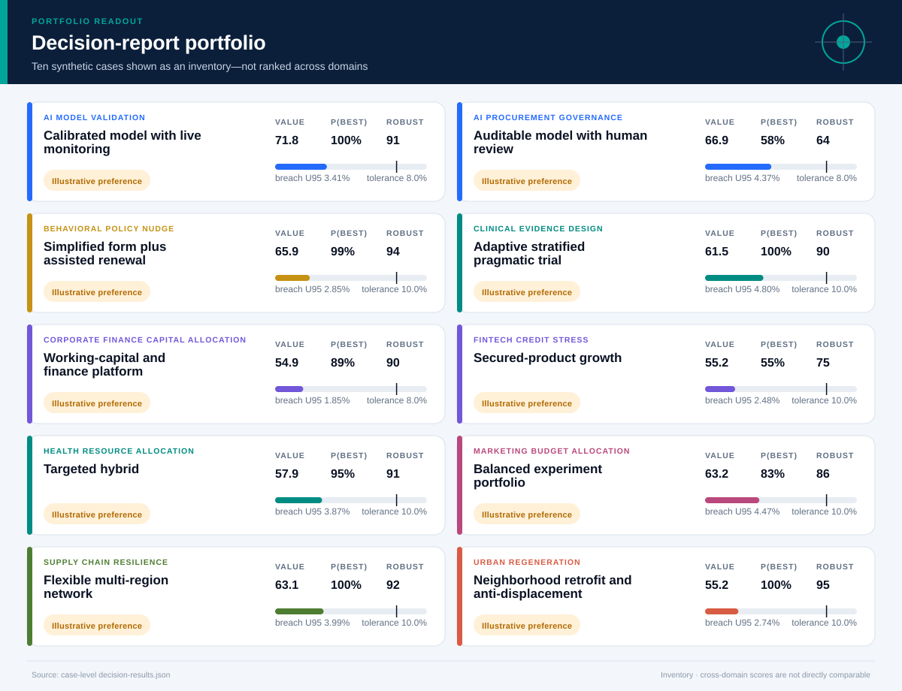
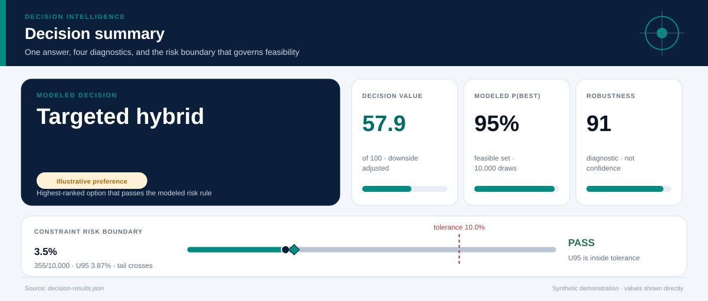
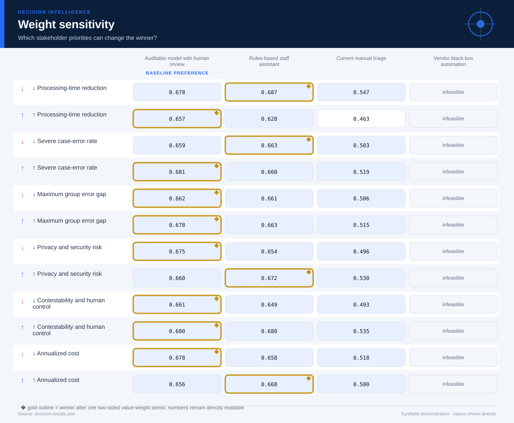

# Demonstration Results

## Question routing before calculation

[Open the question-to-analysis blueprint](question-routing/analysis-blueprint.md)

A single natural-language question is routed through descriptive, predictive,
and prescriptive analytics. With no dataset supplied, the router produces
required data, methods, validity checks, visual choices, and handoff conditions
instead of manufacturing a result.

## Decision-analysis portfolio

Ten synthetic decision environments were analyzed with **10,000 Monte Carlo
simulations each** and random seed `20260726`. Every linked report opens with
the decision, then explains the ranking through risk, criteria, scenarios,
stakeholder priorities, and group impacts.

The visual is an inventory, not a cross-domain ranking. Value scores use each
case's declared reference scales, so they should not be compared as though a
health, finance, AI, and urban-planning decision shared one outcome model.

  

### Portfolio readout

| Case | Illustrative preference | Value score | P(best feasible) | Breach estimate | Robustness |
|---|---|---:|---:|---:|---:|
| [AI model validation](ai-model-validation/decision-report.md) | Calibrated model with live monitoring | 72.5 | 100.0% | 3.06% · U95 3.36% | **92** |
| [AI procurement](ai-procurement-governance/decision-report.md) | Auditable model with human review | 67.5 | 56.2% | 3.92% · U95 4.25% | **64** |
| [Behavioral policy](behavioral-policy-nudge/decision-report.md) | Simplified form + assisted renewal | 66.3 | 98.2% | 2.46% · U95 2.73% | **94** |
| [Clinical evidence design](clinical-evidence-design/decision-report.md) | Adaptive stratified pragmatic trial | 62.1 | 100.0% | 4.60% · U95 4.96% | **90** |
| [Corporate finance](corporate-finance-capital-allocation/decision-report.md) | Working-capital and finance platform | 55.6 | 87.3% | 1.48% · U95 1.69% | **92** |
| [FinTech credit](fintech-credit-stress/decision-report.md) | Secured-product growth | 55.6 | 54.9% | 2.42% · U95 2.69% | **75** |
| [Health allocation](health-resource-allocation/decision-report.md) | Targeted hybrid | 58.1 | 99.1% | 3.66% · U95 3.98% | **92** |
| [Marketing allocation](marketing-budget-allocation/decision-report.md) | Balanced experiment portfolio | 63.6 | 80.3% | 4.00% · U95 4.33% | **85** |
| [Supply-chain design](supply-chain-resilience/decision-report.md) | Flexible multi-region network | 63.5 | 100.0% | 3.58% · U95 3.90% | **92** |
| [Urban regeneration](urban-regeneration/decision-report.md) | Neighborhood retrofit + anti-displacement | 56.0 | 100.0% | 2.54% · U95 2.81% | **94** |

`P(best feasible)` is a modeled comparison frequency among alternatives that
pass the ex-ante feasibility rule—not a posterior probability that the
real-world decision is correct. `U95` is the one-sided 95% upper bound on the
simulated breach frequency and is the value used for feasibility. A zero event
count would still be shown with its upper bound and declared-support status,
never as “zero risk.” Robustness combines P(best),
two-sided weight stability, probability-weighted scenario stability, and
constraint headroom; it is not a confidence score.

<table>
  <tr>
    <td width="50%">
      
       <strong>Value-sensitive decision.</strong> AI procurement retains its
      baseline winner under only half of the local weight stresses.
    </td>
    <td width="50%">
      
       <strong>Downside-aware finance.</strong> Expected utility is shown
      beside the P05–P95 range and the worst-decile average.
    </td>
  </tr>
  <tr>
    <td width="50%">
      
       <strong>Visible public-value trade-offs.</strong> Access, housing,
      displacement, cost, and implementation risk remain separable.
    </td>
    <td width="50%">
      
       <strong>Distributional scrutiny.</strong> Parity diagnostics direct
      attention to differences without claiming to settle fairness.
    </td>
  </tr>
</table>

### What the portfolio reveals

- **Numerical robustness and evidence status are separate.** A strong modeled
  score remains an illustrative preference because every underlying input is
  synthetic.
- **AI procurement is a disagreement map, not a single technology score.**
  Processing speed can favor automation while privacy, severe-error,
  contestability, and human-control priorities favor conservative assistance.
- **Feasibility and desirability remain distinct.** A high-scoring option may
  still be screened out when its one-sided 95% constraint-breach upper bound
  exceeds the declared tolerance.
- **The same report grammar travels across domains.** The inputs and stakes
  change; the audit trail—evidence, uncertainty, values, risk, distribution,
  and next evidence—remains consistent.

All values and sources inside the cases are synthetic. They demonstrate
workflow behavior only and are not operational recommendations.

## Method-module outputs

| Module | Visual report |
|---|---|
| Two-group evidence analysis | [Effect estimates, intervals, continuous outcome, and survival](methods/evidence-analysis/evidence-report.md) |
| Prediction validation | [Calibration, discrimination, subgroup errors, and drift](methods/prediction-validation/prediction-report.md) |
| Resource optimization | [Exact constrained allocation search under scenarios](methods/resource-optimization/optimization-report.md) |
