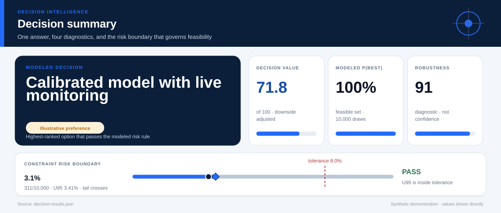
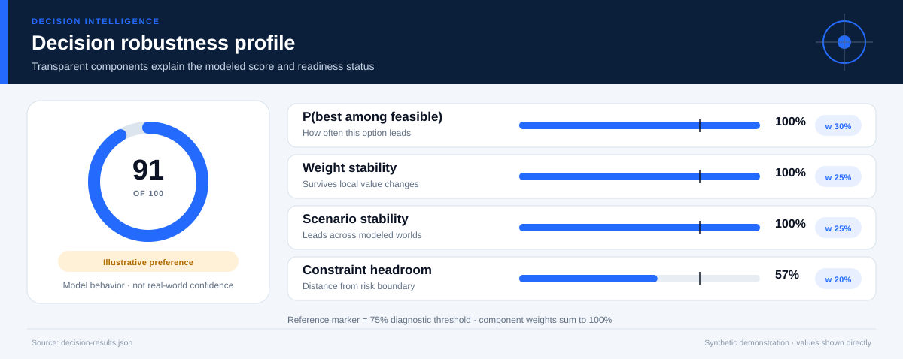
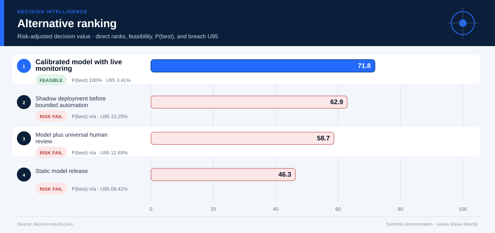
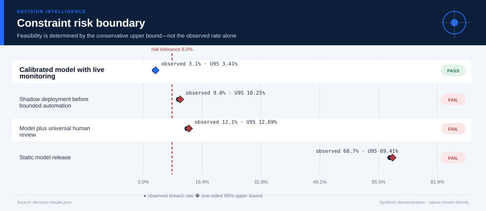
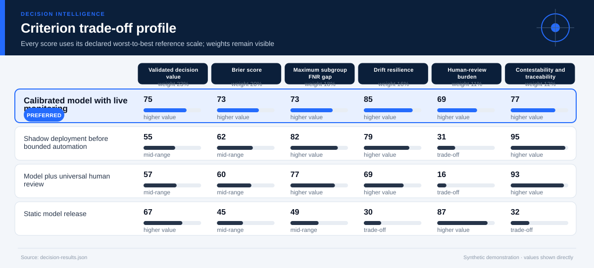
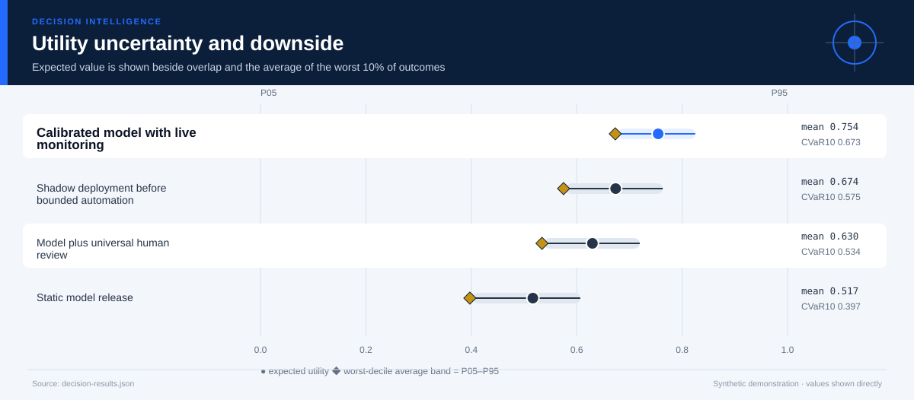
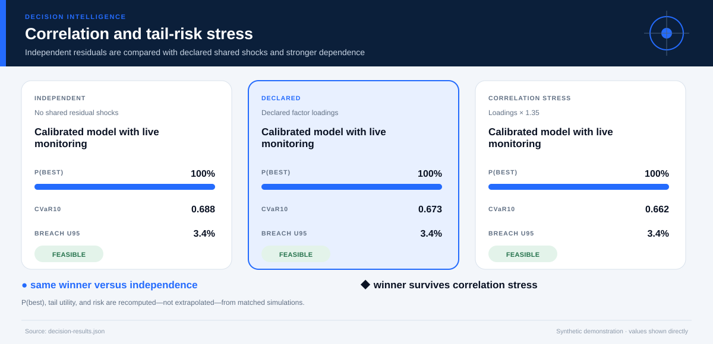
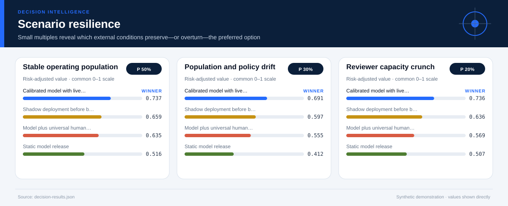
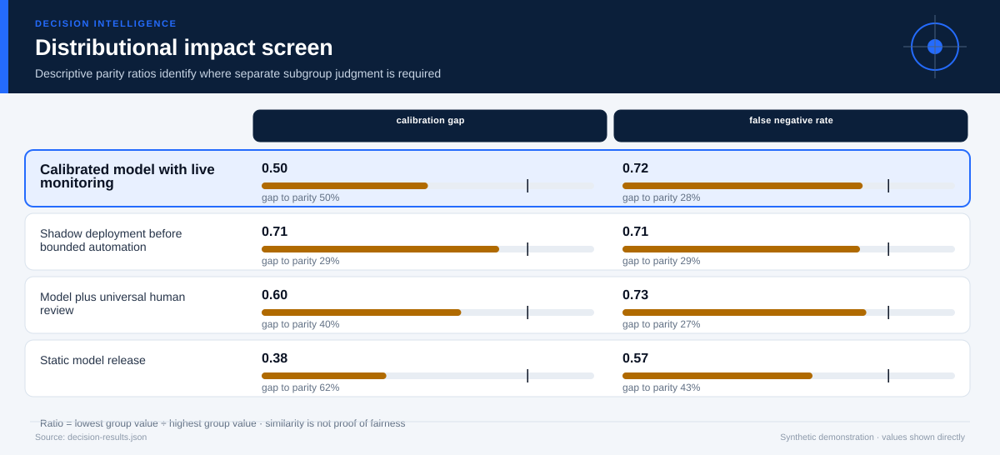
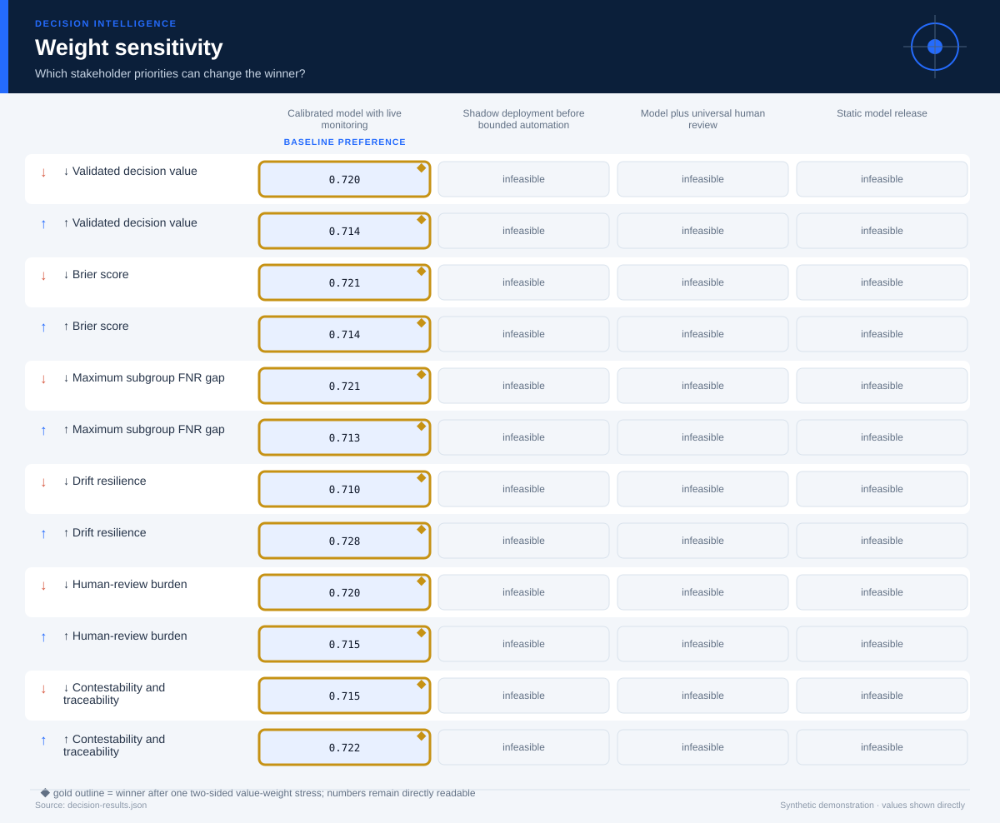

# AI Model Deployment and Validation Strategy

*Artificial intelligence, statistics, model risk, and responsible deployment · 18 months · 10,000 modeled simulations*

## Executive Summary

- **Illustrative preference — Calibrated model with live monitoring.** It is the highest-ranked feasible option, with decision value score **71.8/100** and a modeled **100% probability of being best among decision-feasible alternatives**.
- **The lead is meaningful rather than absolute.** It leads the next feasible option, Shadow deployment before bounded automation, by **0.718 utility points**.
- **Modeled robustness is 91/100.** The option remains preferred in **100%** of two-sided weight stresses and **100%** of probability-weighted scenario comparisons.
- **Shared-shock sensitivity is explicit.** Relative to independent residuals, the declared factor model changes this option's P(best) by **+0.0%** and CVaR10 by **-0.015**; the ×1.35 loading stress does not change the modeled winner.
- **Constraint-breach evidence — 3.1% (311/10,000); U95 3.4%.** Feasibility uses the one-sided 95% upper bound against the **8.0% tolerance**; a zero event count is never presented as proof of zero real-world risk.
- **Decision status — Illustrative preference.** The current blockers are: evidence is not labeled for operational use.
- **Evidence boundary.** No causal claim; predictive performance does not establish the effect of acting on a score.
- **Parameter lineage.** 132/132 governed parameters have a resolved source and approval-chain reference.

**Decision owner:** Model risk and product governance committee  
**Decision question:** Choose a deployment strategy for a high-impact prediction model under calibration, subgroup-error, drift, capacity, and contestability constraints.

## Decision status and modeled robustness

**Status: Illustrative preference.** 7 of 8 configured readiness checks pass. The robustness score summarizes model behavior; it is not a posterior probability that the real-world decision is correct and cannot upgrade illustrative evidence into operational evidence.

## Calibrated model with live monitoring leads on balanced value, not every dimension

**The preferred option earns its position through Human-review burden, Validated decision value.** The comparison still exposes a trade-off on **Contestability and traceability**, so the decision should be presented as a transparent compromise rather than a universal optimum.

The ranking combines expected value with downside performance and excludes options whose one-sided 95% breach-frequency upper bound exceeds **8%**. Probability-best remains visible because a lower-ranked option may still win in a material share of simulations.

## The conservative risk boundary determines feasibility

**The decision rule compares the one-sided 95% breach-frequency upper bound—not only the observed simulation rate—with the 8.0% tolerance.** This makes finite-sample uncertainty visible and prevents a zero event count from being presented as proof of zero risk.

The dark circle is the observed breach rate; the diamond is its conservative upper bound. An option fails the modeled feasibility rule when that diamond crosses the red tolerance line. The test is conditional on the declared distributions and cannot cover omitted real-world hazards.

## The criterion profile reveals where the preferred option earns—and gives up—value

Each cell below places an outcome on its declared worst-to-best reference scale. This avoids recalibrating the chart around whichever alternatives happen to be present.

**The decision is therefore driven by an explicit value model.** A stakeholder who places substantially more weight on Contestability and traceability may reasonably prefer another option; the two-sided weight-sensitivity section tests that possibility directly. The preferred option clips **0.5%** of criterion draws at the declared reference-scale bounds.

## Downside risk remains visible behind the average

**Calibrated model with live monitoring has expected utility 0.754, but its worst-decile average falls to 0.673.** The widest criterion-level uncertainty for this option is associated with **Maximum subgroup FNR gap**, making it a priority for further evidence collection.

The interval chart prevents a precise-looking average from obscuring overlap among alternatives. A close overlap means the practical decision may depend more on constraints, reversibility, and the cost of learning than on a small utility difference.

## Shared shocks change the uncertainty question

**The declared factor model gives Calibrated model with live monitoring P(best) 100%, versus 100% under independent residuals and 100% under the stronger correlation stress.** Its CVaR10 moves from 0.688 independently to 0.673 under declared dependence and 0.662 under stress.

The three states use matched seeds, stratified scenario counts, and the same marginal distributions. Differences therefore isolate the declared dependence structure as closely as this simulation design allows. The Gaussian copula remains an approximation: factor definitions, signs, and loadings must be replaced or approved using domain evidence.

## Scenario tests show when the preferred option is most exposed

**The weakest modeled environment is Population and policy drift, where the preferred option's risk-adjusted utility is 0.691.** The same feasible alternative remains ahead in every modeled scenario.

The preferred option leads in **100%** of the probability-weighted scenario comparison. Scenario probabilities are assumptions, not forecasts with guaranteed calibration. They are useful because they reveal which external conditions deserve monitoring and which contingency plans should be prepared before implementation.

## Distributional effects require a separate judgment

**Average utility does not establish equitable impact.** The weakest descriptive parity ratio is **0.50** for **calibration gap**, between Group A and Group C. The ratios below are descriptive diagnostics; they cannot resolve questions about rights, need, historical disadvantage, or acceptable error asymmetry.

Use the visual to locate disparities that require subgroup analysis and stakeholder review. Do not optimize the ratios mechanically or treat similarity as proof of fairness.

## The result is stable to stakeholder priorities

**The baseline choice survives 100% of local weight stresses.** No single criterion emphasis changes the preferred feasible alternative.

This test both increases and decreases each criterion weight while preserving risk adjustment. It remains a local stress test rather than a substitute for formal stakeholder elicitation. If the winner changes under a plausible emphasis, the next step is deliberation and better evidence—not hiding the sensitivity.

## Recommended next steps

1. **Replace every synthetic input before any pilot or operational use.** Re-estimate outcomes from traceable descriptive, predictive, causal, financial, policy, or engineering evidence.
2. **Reduce uncertainty in Maximum subgroup FNR gap.** Replace the widest synthetic or elicited input with experimental, quasi-experimental, observational, or engineering evidence appropriate to the domain.
3. **Monitor the Population and policy drift trigger.** Specify leading indicators and a contingency response before rollout.
4. **Review distributional impacts with affected stakeholders.** Examine absolute group outcomes alongside disparity measures and document unresolved normative choices.

## Further questions

- Which empirical or elicited evidence would best validate the declared factor loadings?
- Which omitted externality or stakeholder could materially alter the criterion set?
- What evidence would justify replacing the current scenario probabilities?
- Is the preferred option reversible if early monitoring contradicts the model?

## Caveats and assumptions

- **Evidence type:** Synthetic out-of-time validation, subgroup, latency, and drift estimates
- **Evidence as of:** Synthetic demonstration; no production as-of date
- **Permitted decision use:** illustrative
- **Causal status:** No causal claim; predictive performance does not establish the effect of acting on a score.
- **Dependence model:** latent_factor_gaussian_copula with 1 declared shared factor(s); the loading stress is ×1.35. Copula choice and loadings remain assumptions.
- **Parameter provenance:** 100% source coverage and 100% approval coverage for the declared decision use. Approval for illustrative use is not operational approval.
- **Zero-breach interpretation:** zero simulated events means either no event was observed in the finite run or the declared bounded input support excludes a breach. Neither statement establishes zero real-world risk.
- The score data are synthetic and do not demonstrate production generalization.
- Group error gaps depend on a single illustrative threshold.
- Human-review quality and feedback loops are simplified.
- The Gaussian copula and factor loadings are synthetic assumptions; tail dependence may differ in real data and requires domain approval.
- **Validation warning:** No obvious status-quo or baseline alternative was found.

<strong>Detailed numerical appendix and reproducibility</strong>

### Ranked alternatives

| Rank | Alternative | Feasible | Value score | Expected utility | CVaR10 | P(best feasible) | P(best all) | Breach evidence | Feasible Pareto |
|---:|---|:---:|---:|---:|---:|---:|---:|---|:---:|
| 1 | Calibrated model with live monitoring | Yes | 71.8 | 0.754 | 0.673 | 100.0% | 97.1% | 3.1% (311/10,000); U95 3.4% | Yes |
| 2 | Shadow deployment before bounded automation | No | 62.9 | 0.674 | 0.575 | n/a | 2.8% | 9.8% (975/10,000); U95 10.2% | No |
| 3 | Model plus universal human review | No | 58.7 | 0.630 | 0.534 | n/a | 0.1% | 12.1% (1,214/10,000); U95 12.7% | No |
| 4 | Static model release | No | 46.3 | 0.517 | 0.397 | n/a | 0.0% | 68.7% (6,865/10,000); U95 69.4% | No |

### Readiness checks

| Check | Result |
|---|:---:|
| Feasible Alternative | Pass |
| Probability Best | Pass |
| Weight Stability | Pass |
| Scenario Stability | Pass |
| Scale Clipping | Pass |
| Parameter Provenance | Pass |
| Approval Scope | Pass |
| Operational Evidence | Fail |

### Constraint diagnostics

| Alternative | Constraint | Events | Observed | U95 | Declared support | Mean signed margin | P05–P95 margin |
|---|---|---:|---:|---:|---|---:|---:|
| Calibrated model with live monitoring | Calibration and accuracy tolerance | 0/10,000 | 0.0% | 0.03% | 0.1–0.193; excludes breach | 0.060 | 0.029–0.087 |
| Calibrated model with live monitoring | Subgroup error-gap tolerance | 311/10,000 | 3.1% | 3.41% | 0.04–0.182; tail crosses threshold | 0.056 | 0.009–0.093 |
| Shadow deployment before bounded automation | Calibration and accuracy tolerance | 975/10,000 | 9.8% | 10.25% | 0.11–0.25; tail crosses threshold | 0.037 | -0.014–0.076 |
| Shadow deployment before bounded automation | Subgroup error-gap tolerance | 0/10,000 | 0.0% | 0.03% | 0.025–0.128; excludes breach | 0.080 | 0.045–0.112 |
| Model plus universal human review | Calibration and accuracy tolerance | 1,174/10,000 | 11.7% | 12.28% | 0.12–0.25; tail crosses threshold | 0.031 | -0.017–0.067 |
| Model plus universal human review | Subgroup error-gap tolerance | 98/10,000 | 1.0% | 1.16% | 0.03–0.169; tail crosses threshold | 0.066 | 0.021–0.104 |
| Static model release | Calibration and accuracy tolerance | 4,385/10,000 | 43.9% | 44.67% | 0.15–0.288; tail crosses threshold | -0.001 | -0.056–0.037 |
| Static model release | Subgroup error-gap tolerance | 5,952/10,000 | 59.5% | 60.32% | 0.09–0.286; tail crosses threshold | -0.013 | -0.080–0.039 |

### Criterion outcomes

#### Calibrated model with live monitoring

| Criterion | Weight | Mean | P05–P95 | Normalized score | Scale clipping |
|---|---:|---:|---:|---:|---:|
| Validated decision value | 23.0% | 72.3 index points | 61.5 index points–82.4 index points | 0.747 | 0.0% |
| Brier score | 20.0% | 0.14 score | 0.113 score–0.171 score | 0.728 | 0.0% |
| Maximum subgroup FNR gap | 18.0% | 0.094 probability points | 0.057 probability points–0.141 probability points | 0.734 | 0.0% |
| Drift resilience | 16.0% | 0.837 score | 0.745 score–0.934 score | 0.848 | 3.0% |
| Human-review burden | 11.0% | 271.0 cases per 1,000 | 201.2 cases per 1,000–351.1 cases per 1,000 | 0.692 | 0.0% |
| Contestability and traceability | 12.0% | 0.82 score | 0.82 score–0.82 score | 0.775 | 0.0% |

#### Shadow deployment before bounded automation

| Criterion | Weight | Mean | P05–P95 | Normalized score | Scale clipping |
|---|---:|---:|---:|---:|---:|
| Validated decision value | 23.0% | 58.5 index points | 45.3 index points–71.9 index points | 0.549 | 0.0% |
| Brier score | 20.0% | 0.163 score | 0.124 score–0.214 score | 0.623 | 0.0% |
| Maximum subgroup FNR gap | 18.0% | 0.07 probability points | 0.038 probability points–0.105 probability points | 0.823 | 0.0% |
| Drift resilience | 16.0% | 0.793 score | 0.703 score–0.88 score | 0.791 | 0.0% |
| Human-review burden | 11.0% | 507.2 cases per 1,000 | 402.3 cases per 1,000–648.3 cases per 1,000 | 0.312 | 1.6% |
| Contestability and traceability | 12.0% | 0.96 score | 0.96 score–0.96 score | 0.950 | 0.0% |

#### Model plus universal human review

| Criterion | Weight | Mean | P05–P95 | Normalized score | Scale clipping |
|---|---:|---:|---:|---:|---:|
| Validated decision value | 23.0% | 60.2 index points | 47.7 index points–72.5 index points | 0.574 | 0.0% |
| Brier score | 20.0% | 0.169 score | 0.133 score–0.217 score | 0.598 | 0.0% |
| Maximum subgroup FNR gap | 18.0% | 0.084 probability points | 0.046 probability points–0.129 probability points | 0.773 | 0.0% |
| Drift resilience | 16.0% | 0.719 score | 0.623 score–0.816 score | 0.692 | 0.0% |
| Human-review burden | 11.0% | 641.9 cases per 1,000 | 513.8 cases per 1,000–944.7 cases per 1,000 | 0.159 | 20.0% |
| Contestability and traceability | 12.0% | 0.94 score | 0.94 score–0.94 score | 0.925 | 0.0% |

#### Static model release

| Criterion | Weight | Mean | P05–P95 | Normalized score | Scale clipping |
|---|---:|---:|---:|---:|---:|
| Validated decision value | 23.0% | 67.1 index points | 57.0 index points–76.8 index points | 0.674 | 0.0% |
| Brier score | 20.0% | 0.201 score | 0.163 score–0.256 score | 0.452 | 0.0% |
| Maximum subgroup FNR gap | 18.0% | 0.163 probability points | 0.111 probability points–0.23 probability points | 0.489 | 0.0% |
| Drift resilience | 16.0% | 0.426 score | 0.325 score–0.529 score | 0.302 | 0.0% |
| Human-review burden | 11.0% | 157.9 cases per 1,000 | 110.5 cases per 1,000–214.3 cases per 1,000 | 0.874 | 0.0% |
| Contestability and traceability | 12.0% | 0.46 score | 0.46 score–0.46 score | 0.325 | 0.0% |

### Correlation sensitivity

| Dependence state | Modeled winner | Recommended option P(best) | CVaR10 | Breach U95 |
|---|---|---:|---:|---:|
| Independent residuals | Calibrated model with live monitoring | 100.0% | 0.688 | 3.39% |
| Declared factor model | Calibrated model with live monitoring | 100.0% | 0.673 | 3.41% |
| Loading stress ×1.35 | Calibrated model with live monitoring | 100.0% | 0.662 | 3.43% |

### Parameter provenance and approval

Coverage: **132/132 parameters sourced** and **132/132 approved for the declared use**. Every expanded JSON path is recorded in `decision-results.json` under `parameter_provenance.records`.

| Source ID | Source type | Owner | Approved uses | Approval chain |
|---|---|---|---|---|
| `ai-model-validation-synthetic-parameter-register` | synthetic_demonstration_register | Repository maintainer (synthetic example) | illustrative | 1. case_author (approved) → 2. independent_domain_reviewer (not_obtained) |
### Sources and reproducibility

- Bundled synthetic prediction-score dataset
- Illustrative calibration and threshold analysis
- Synthetic distribution-shift and reviewer-capacity scenarios
- Engine version: `5.0.0`
- Samples: `10000`
- Random seed: `20260726`
- Sampling design: Stratified scenario allocation with a declared latent-factor Gaussian copula, shared shocks across alternatives, marginal-preserving inverse transforms, and matched independent/correlation-stress counterfactuals.
- Case SHA-256: `4d7c3044b1acee0636cc5e0a115076329bf684b800664443ab5da422700d5afe`

### Decision notes

- A production decision requires time-separated external validation, leakage review, documented threshold costs, and post-deployment incident governance.
- Subgroup diagnostics should include uncertainty and sample size, not just point estimates.

> Synthetic demonstration only. This report is not medical, financial, legal, engineering-safety, or public-policy advice.
