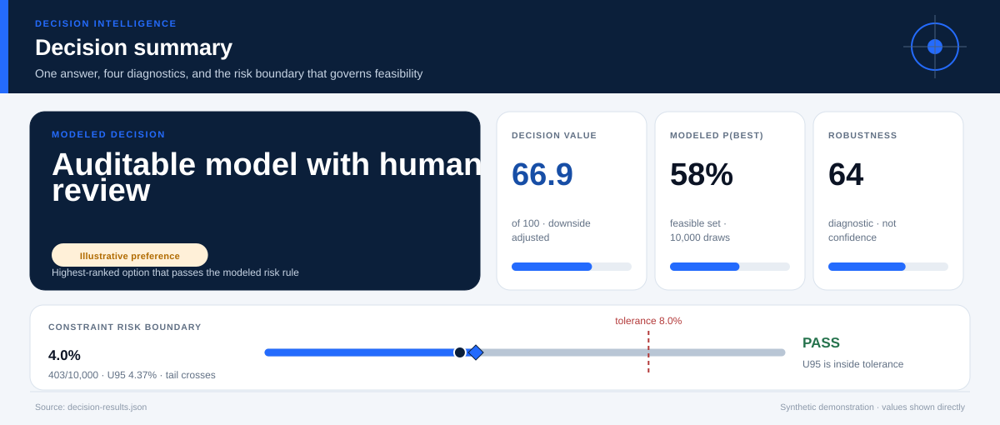
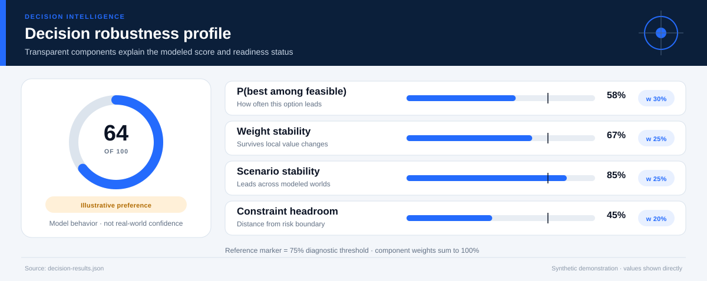
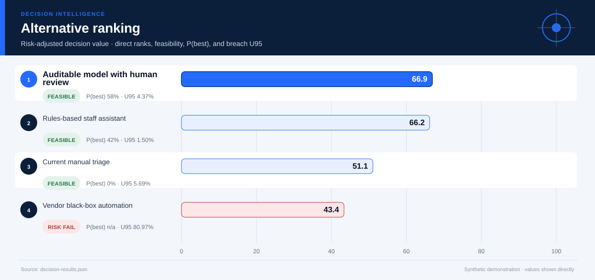
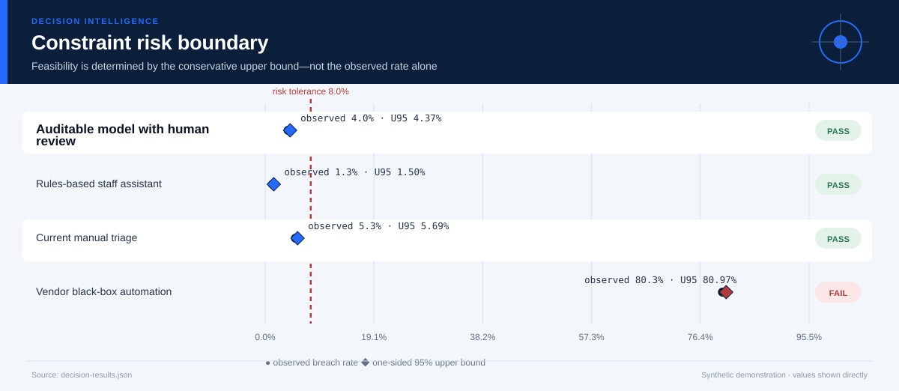
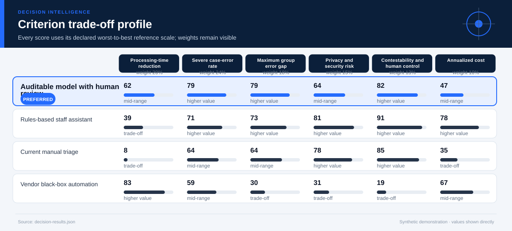
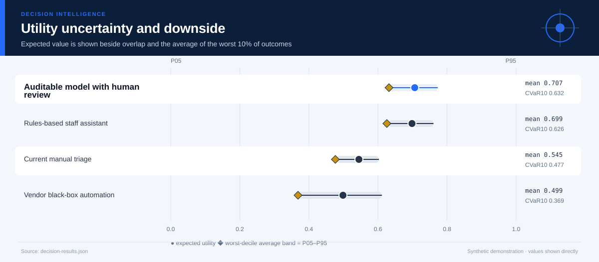
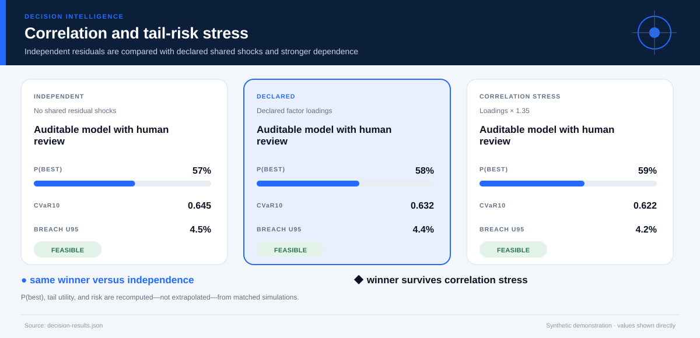
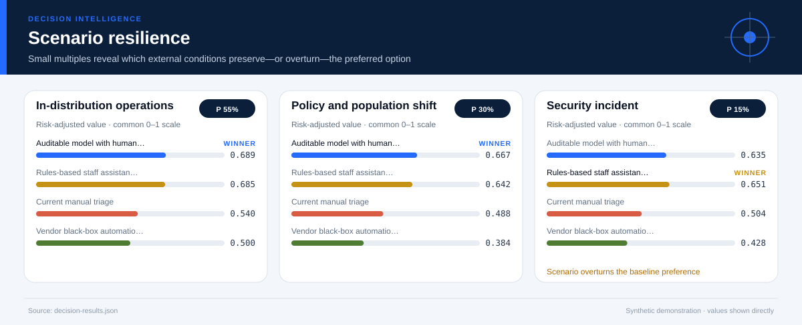
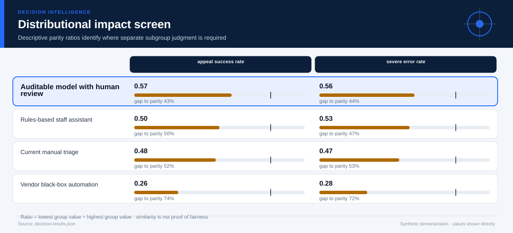

# AI-Assisted Case Triage Procurement

*Artificial intelligence, AI ethics, technology policy, and public-sector governance · 24 months · 10,000 modeled simulations*

## Executive Summary

- **Illustrative preference — Auditable model with human review.** It is the highest-ranked feasible option, with decision value score **66.9/100** and a modeled **58% probability of being best among decision-feasible alternatives**.
- **The lead is narrow rather than absolute.** It leads the next feasible option, Rules-based staff assistant, by **0.007 utility points**.
- **Modeled robustness is 64/100.** The option remains preferred in **67%** of two-sided weight stresses and **85%** of probability-weighted scenario comparisons.
- **Shared-shock sensitivity is explicit.** Relative to independent residuals, the declared factor model changes this option's P(best) by **+0.8%** and CVaR10 by **-0.013**; the ×1.35 loading stress does not change the modeled winner.
- **Constraint-breach evidence — 4.0% (403/10,000); U95 4.4%.** Feasibility uses the one-sided 95% upper bound against the **8.0% tolerance**; a zero event count is never presented as proof of zero real-world risk.
- **Decision status — Illustrative preference.** The current blockers are: the winner is sensitive to criterion weights; evidence is not labeled for operational use.
- **Evidence boundary.** No causal claim; task-benefit and harm inputs are prospective scenario estimates.
- **Parameter lineage.** 133/133 governed parameters have a resolved source and approval-chain reference.

**Decision owner:** Public-service technology and ethics board  
**Decision question:** Choose whether and how to use AI for benefit-case triage while preserving accuracy, privacy, group equity, contestability, and fiscal feasibility.

## Decision status and modeled robustness

**Status: Illustrative preference.** 6 of 8 configured readiness checks pass. The robustness score summarizes model behavior; it is not a posterior probability that the real-world decision is correct and cannot upgrade illustrative evidence into operational evidence.

## Auditable model with human review leads on balanced value, not every dimension

**The preferred option earns its position through Processing-time reduction, Severe case-error rate.** The comparison still exposes a trade-off on **Annualized cost**, so the decision should be presented as a transparent compromise rather than a universal optimum.

The ranking combines expected value with downside performance and excludes options whose one-sided 95% breach-frequency upper bound exceeds **8%**. Probability-best remains visible because a lower-ranked option may still win in a material share of simulations.

## The conservative risk boundary determines feasibility

**The decision rule compares the one-sided 95% breach-frequency upper bound—not only the observed simulation rate—with the 8.0% tolerance.** This makes finite-sample uncertainty visible and prevents a zero event count from being presented as proof of zero risk.

The dark circle is the observed breach rate; the diamond is its conservative upper bound. An option fails the modeled feasibility rule when that diamond crosses the red tolerance line. The test is conditional on the declared distributions and cannot cover omitted real-world hazards.

## The criterion profile reveals where the preferred option earns—and gives up—value

Each cell below places an outcome on its declared worst-to-best reference scale. This avoids recalibrating the chart around whichever alternatives happen to be present.

**The decision is therefore driven by an explicit value model.** A stakeholder who places substantially more weight on Annualized cost may reasonably prefer another option; the two-sided weight-sensitivity section tests that possibility directly. The preferred option clips **0.0%** of criterion draws at the declared reference-scale bounds.

## Downside risk remains visible behind the average

**Auditable model with human review has expected utility 0.707, but its worst-decile average falls to 0.632.** The widest criterion-level uncertainty for this option is associated with **Privacy and security risk**, making it a priority for further evidence collection.

The interval chart prevents a precise-looking average from obscuring overlap among alternatives. A close overlap means the practical decision may depend more on constraints, reversibility, and the cost of learning than on a small utility difference.

## Shared shocks change the uncertainty question

**The declared factor model gives Auditable model with human review P(best) 58%, versus 57% under independent residuals and 59% under the stronger correlation stress.** Its CVaR10 moves from 0.645 independently to 0.632 under declared dependence and 0.622 under stress.

The three states use matched seeds, stratified scenario counts, and the same marginal distributions. Differences therefore isolate the declared dependence structure as closely as this simulation design allows. The Gaussian copula remains an approximation: factor definitions, signs, and loadings must be replaced or approved using domain evidence.

## Scenario tests show when the preferred option is most exposed

**The weakest modeled environment is Security incident, where the preferred option's risk-adjusted utility is 0.635.** At least one scenario changes the leading feasible alternative: Security incident favors Rules-based staff assistant.

The preferred option leads in **85%** of the probability-weighted scenario comparison. Scenario probabilities are assumptions, not forecasts with guaranteed calibration. They are useful because they reveal which external conditions deserve monitoring and which contingency plans should be prepared before implementation.

## Distributional effects require a separate judgment

**Average utility does not establish equitable impact.** The weakest descriptive parity ratio is **0.56** for **severe error rate**, between Standard-documentation claimants and Limited-local-language claimants. The ratios below are descriptive diagnostics; they cannot resolve questions about rights, need, historical disadvantage, or acceptable error asymmetry.

Use the visual to locate disparities that require subgroup analysis and stakeholder review. Do not optimize the ratios mechanically or treat similarity as proof of fairness.

## The result is sensitive to stakeholder priorities

**The baseline choice survives 67% of local weight stresses.** The following weight perturbation changes the winner: ↓ Processing-time reduction → Rules-based staff assistant; ↓ Severe case-error rate → Rules-based staff assistant; ↑ Privacy and security risk → Rules-based staff assistant; ↑ Annualized cost → Rules-based staff assistant.

This test both increases and decreases each criterion weight while preserving risk adjustment. It remains a local stress test rather than a substitute for formal stakeholder elicitation. If the winner changes under a plausible emphasis, the next step is deliberation and better evidence—not hiding the sensitivity.

## Recommended next steps

1. **Replace every synthetic input before any pilot or operational use.** Re-estimate outcomes from traceable descriptive, predictive, causal, financial, policy, or engineering evidence.
2. **Reduce uncertainty in Privacy and security risk.** Replace the widest synthetic or elicited input with experimental, quasi-experimental, observational, or engineering evidence appropriate to the domain.
3. **Monitor the Security incident trigger.** Specify leading indicators and a contingency response before rollout.
4. **Review distributional impacts with affected stakeholders.** Examine absolute group outcomes alongside disparity measures and document unresolved normative choices.

## Further questions

- Which empirical or elicited evidence would best validate the declared factor loadings?
- Which omitted externality or stakeholder could materially alter the criterion set?
- What evidence would justify replacing the current scenario probabilities?
- Is the preferred option reversible if early monitoring contradicts the model?

## Caveats and assumptions

- **Evidence type:** Synthetic benchmark, red-team, and service-design estimates
- **Evidence as of:** Synthetic demonstration; no production as-of date
- **Permitted decision use:** illustrative
- **Causal status:** No causal claim; task-benefit and harm inputs are prospective scenario estimates.
- **Dependence model:** latent_factor_gaussian_copula with 1 declared shared factor(s); the loading stress is ×1.35. Copula choice and loadings remain assumptions.
- **Parameter provenance:** 100% source coverage and 100% approval coverage for the declared decision use. Approval for illustrative use is not operational approval.
- **Zero-breach interpretation:** zero simulated events means either no event was observed in the finite run or the declared bounded input support excludes a breach. Neither statement establishes zero real-world risk.
- Offline error rates may not predict outcomes after staff adapt to the system.
- Contestability and dignity are represented imperfectly by numerical scores.
- Security threats and vendor lock-in are simplified.
- The Gaussian copula and factor loadings are synthetic assumptions; tail dependence may differ in real data and requires domain approval.

<strong>Detailed numerical appendix and reproducibility</strong>

### Ranked alternatives

| Rank | Alternative | Feasible | Value score | Expected utility | CVaR10 | P(best feasible) | P(best all) | Breach evidence | Feasible Pareto |
|---:|---|:---:|---:|---:|---:|---:|---:|---|:---:|
| 1 | Auditable model with human review | Yes | 66.9 | 0.707 | 0.632 | 57.9% | 57.9% | 4.0% (403/10,000); U95 4.4% | Yes |
| 2 | Rules-based staff assistant | Yes | 66.2 | 0.699 | 0.626 | 42.1% | 42.1% | 1.3% (130/10,000); U95 1.5% | Yes |
| 3 | Current manual triage | Yes | 51.1 | 0.545 | 0.477 | 0.0% | 0.0% | 5.3% (531/10,000); U95 5.7% | No |
| 4 | Vendor black-box automation | No | 43.4 | 0.499 | 0.369 | n/a | 0.0% | 80.3% (8,032/10,000); U95 81.0% | No |

### Readiness checks

| Check | Result |
|---|:---:|
| Feasible Alternative | Pass |
| Probability Best | Pass |
| Weight Stability | Fail |
| Scenario Stability | Pass |
| Scale Clipping | Pass |
| Parameter Provenance | Pass |
| Approval Scope | Pass |
| Operational Evidence | Fail |

### Constraint diagnostics

| Alternative | Constraint | Events | Observed | U95 | Declared support | Mean signed margin | P05–P95 margin |
|---|---|---:|---:|---:|---|---:|---:|
| Auditable model with human review | Maximum severe-error rate | 0/10,000 | 0.0% | 0.03% | 2.2–6.16; excludes breach | 4.089 | 2.741–5.256 |
| Auditable model with human review | Privacy and security tolerance | 403/10,000 | 4.0% | 4.37% | 20–66; tail crosses threshold | 19.069 | 1.419–30.663 |
| Rules-based staff assistant | Maximum severe-error rate | 130/10,000 | 1.3% | 1.50% | 2.8–9; tail crosses threshold | 2.950 | 0.864–4.589 |
| Rules-based staff assistant | Privacy and security tolerance | 0/10,000 | 0.0% | 0.03% | 10–41; excludes breach | 34.237 | 22.331–41.916 |
| Current manual triage | Maximum severe-error rate | 531/10,000 | 5.3% | 5.69% | 4–9.38; tail crosses threshold | 1.915 | -0.044–3.388 |
| Current manual triage | Privacy and security tolerance | 0/10,000 | 0.0% | 0.03% | 12–50; excludes breach | 31.009 | 13.914–39.910 |
| Vendor black-box automation | Maximum severe-error rate | 2,188/10,000 | 21.9% | 22.57% | 3.5–13.3; tail crosses threshold | 1.288 | -2.684–3.719 |
| Vendor black-box automation | Privacy and security tolerance | 7,511/10,000 | 75.1% | 75.81% | 42–108; tail crosses threshold | -8.905 | -37.826–7.237 |

### Criterion outcomes

#### Auditable model with human review

| Criterion | Weight | Mean | P05–P95 | Normalized score | Scale clipping |
|---|---:|---:|---:|---:|---:|
| Processing-time reduction | 20.0% | 34.1 percent | 25.2 percent–42.8 percent | 0.620 | 0.0% |
| Severe case-error rate | 24.0% | 3.911 percent | 2.744 percent–5.259 percent | 0.792 | 0.0% |
| Maximum group error gap | 18.0% | 2.877 percentage points | 1.707 percentage points–4.445 percentage points | 0.793 | 0.0% |
| Privacy and security risk | 15.0% | 35.9 index points | 24.3 index points–53.6 index points | 0.636 | 0.0% |
| Contestability and human control | 13.0% | 0.86 score | 0.86 score–0.86 score | 0.825 | 0.0% |
| Annualized cost | 10.0% | 9.84 USD millions | 8.556 USD millions–11.3 USD millions | 0.469 | 0.0% |

#### Rules-based staff assistant

| Criterion | Weight | Mean | P05–P95 | Normalized score | Scale clipping |
|---|---:|---:|---:|---:|---:|
| Processing-time reduction | 20.0% | 21.4 percent | 14.6 percent–28.2 percent | 0.389 | 0.0% |
| Severe case-error rate | 24.0% | 5.05 percent | 3.411 percent–7.136 percent | 0.711 | 0.0% |
| Maximum group error gap | 18.0% | 3.604 percentage points | 2.301 percentage points–5.363 percentage points | 0.730 | 0.0% |
| Privacy and security risk | 15.0% | 20.8 index points | 13.1 index points–32.7 index points | 0.815 | 0.0% |
| Contestability and human control | 13.0% | 0.93 score | 0.93 score–0.93 score | 0.913 | 0.0% |
| Annualized cost | 10.0% | 6.427 USD millions | 5.431 USD millions–7.501 USD millions | 0.779 | 0.0% |

#### Current manual triage

| Criterion | Weight | Mean | P05–P95 | Normalized score | Scale clipping |
|---|---:|---:|---:|---:|---:|
| Processing-time reduction | 20.0% | 4.214 percent | 1.258 percent–7.359 percent | 0.077 | 0.0% |
| Severe case-error rate | 24.0% | 6.085 percent | 4.612 percent–8.044 percent | 0.637 | 0.0% |
| Maximum group error gap | 18.0% | 4.665 percentage points | 3.124 percentage points–6.735 percentage points | 0.638 | 0.0% |
| Privacy and security risk | 15.0% | 24.0 index points | 15.1 index points–41.1 index points | 0.777 | 0.0% |
| Contestability and human control | 13.0% | 0.88 score | 0.88 score–0.88 score | 0.850 | 0.0% |
| Annualized cost | 10.0% | 11.2 USD millions | 10.0 USD millions–12.4 USD millions | 0.349 | 0.0% |

#### Vendor black-box automation

| Criterion | Weight | Mean | P05–P95 | Normalized score | Scale clipping |
|---|---:|---:|---:|---:|---:|
| Processing-time reduction | 20.0% | 45.7 percent | 34.7 percent–56.6 percent | 0.828 | 8.1% |
| Severe case-error rate | 24.0% | 6.712 percent | 4.281 percent–10.7 percent | 0.592 | 0.0% |
| Maximum group error gap | 18.0% | 8.895 percentage points | 5.589 percentage points–14.5 percentage points | 0.296 | 15.4% |
| Privacy and security risk | 15.0% | 63.9 index points | 47.8 index points–92.8 index points | 0.312 | 7.1% |
| Contestability and human control | 13.0% | 0.35 score | 0.35 score–0.35 score | 0.187 | 0.0% |
| Annualized cost | 10.0% | 7.67 USD millions | 6.532 USD millions–8.898 USD millions | 0.666 | 0.0% |

### Correlation sensitivity

| Dependence state | Modeled winner | Recommended option P(best) | CVaR10 | Breach U95 |
|---|---|---:|---:|---:|
| Independent residuals | Auditable model with human review | 57.1% | 0.645 | 4.49% |
| Declared factor model | Auditable model with human review | 57.9% | 0.632 | 4.37% |
| Loading stress ×1.35 | Auditable model with human review | 59.2% | 0.622 | 4.18% |

### Parameter provenance and approval

Coverage: **133/133 parameters sourced** and **133/133 approved for the declared use**. Every expanded JSON path is recorded in `decision-results.json` under `parameter_provenance.records`.

| Source ID | Source type | Owner | Approved uses | Approval chain |
|---|---|---|---|---|
| `ai-procurement-governance-synthetic-parameter-register` | synthetic_demonstration_register | Repository maintainer (synthetic example) | illustrative | 1. case_author (approved) → 2. independent_domain_reviewer (not_obtained) |
### Sources and reproducibility

- Illustrative offline benchmark by claimant group
- Synthetic distribution-shift and security scenarios
- Hypothetical human-factors review
- Engine version: `5.0.0`
- Samples: `10000`
- Random seed: `20260726`
- Sampling design: Stratified scenario allocation with a declared latent-factor Gaussian copula, shared shocks across alternatives, marginal-preserving inverse transforms, and matched independent/correlation-stress counterfactuals.
- Case SHA-256: `8bdccf5d1d8a9f7acfe966223e2b5e9f4f27446be7ff1a2133895d53e6f7c4a5`

### Decision notes

- A real procurement should include participatory impact assessment, security testing, accessibility review, and a non-AI alternative.
- Automation must not remove meaningful notice, explanation, or appeal.

> Synthetic demonstration only. This report is not medical, financial, legal, engineering-safety, or public-policy advice.
