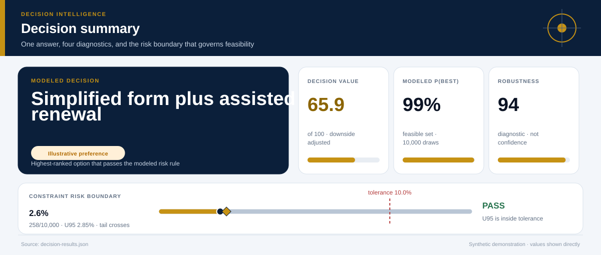
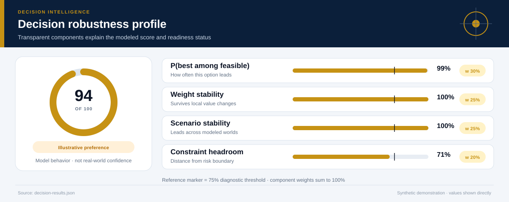
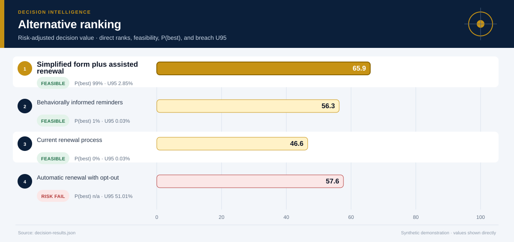
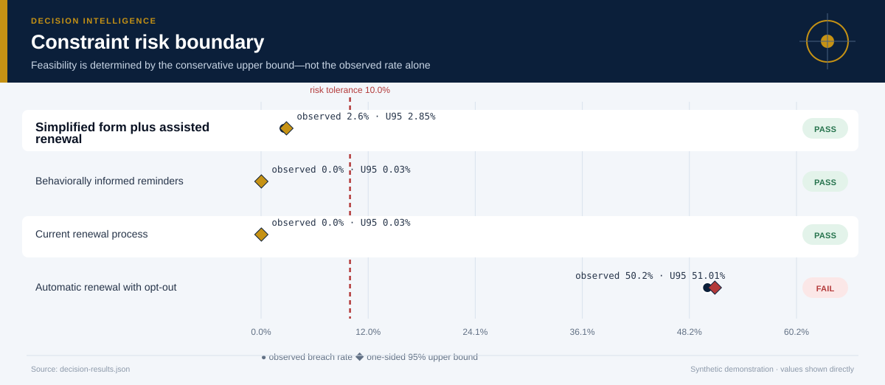
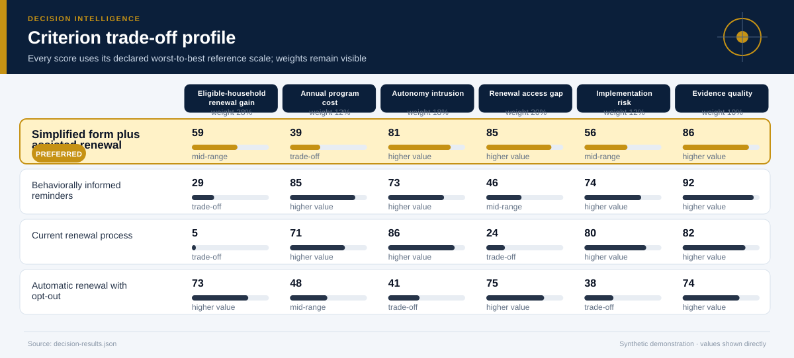
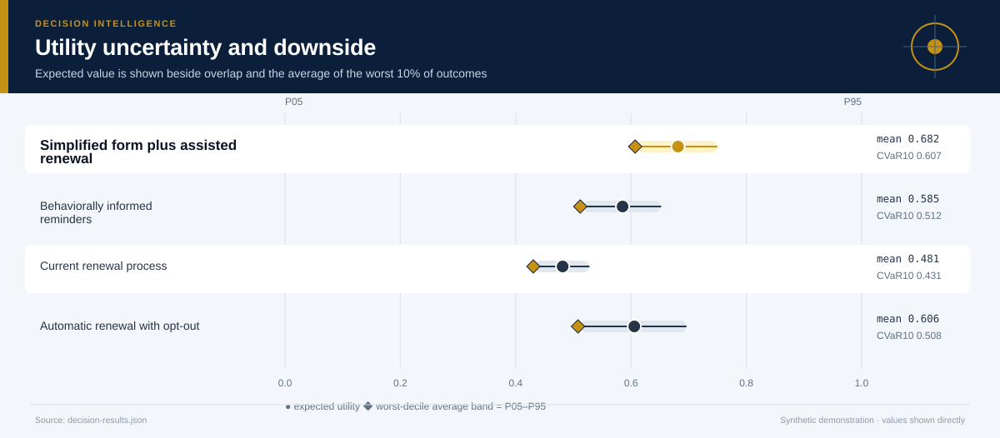
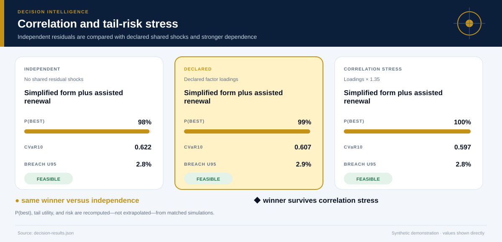
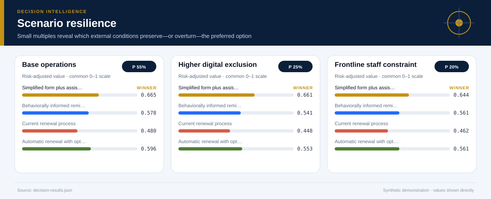
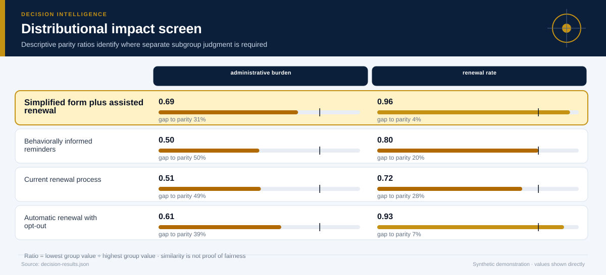
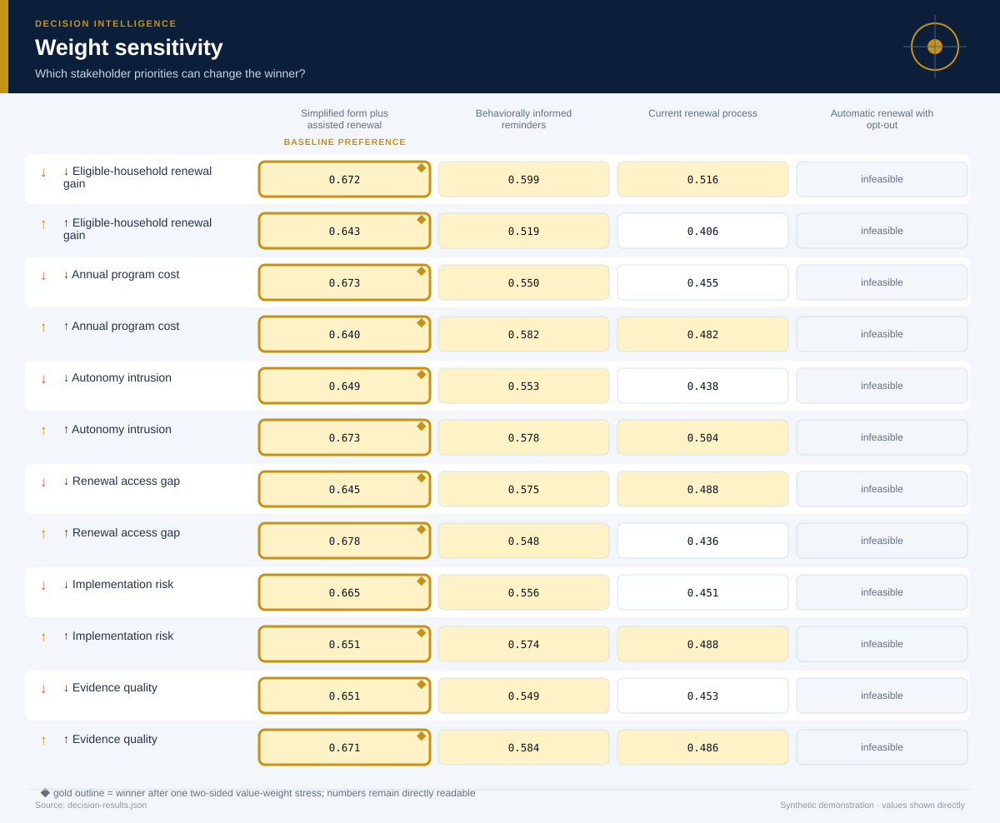

# Benefits-Renewal Service Design

*Behavioral and decision science, causal inference, and public policy · 18 months · 10,000 modeled simulations*

## Executive Summary

- **Illustrative preference — Simplified form plus assisted renewal.** It is the highest-ranked feasible option, with decision value score **65.9/100** and a modeled **99% probability of being best among decision-feasible alternatives**.
- **The lead is meaningful rather than absolute.** It leads the next feasible option, Behaviorally informed reminders, by **0.096 utility points**.
- **Modeled robustness is 94/100.** The option remains preferred in **100%** of two-sided weight stresses and **100%** of probability-weighted scenario comparisons.
- **Shared-shock sensitivity is explicit.** Relative to independent residuals, the declared factor model changes this option's P(best) by **+0.8%** and CVaR10 by **-0.014**; the ×1.35 loading stress does not change the modeled winner.
- **Constraint-breach evidence — 2.6% (258/10,000); U95 2.9%.** Feasibility uses the one-sided 95% upper bound against the **10.0% tolerance**; a zero event count is never presented as proof of zero real-world risk.
- **Decision status — Illustrative preference.** The current blockers are: evidence is not labeled for operational use.
- **Evidence boundary.** Intervention effects are framed as hypothetical randomized-pilot estimates; no real program effect is claimed.
- **Parameter lineage.** 131/131 governed parameters have a resolved source and approval-chain reference.

**Decision owner:** State benefits administration  
**Decision question:** Choose a renewal intervention that improves eligible-household completion while limiting cost, autonomy intrusion, access gaps, and implementation risk.

## Decision status and modeled robustness

**Status: Illustrative preference.** 7 of 8 configured readiness checks pass. The robustness score summarizes model behavior; it is not a posterior probability that the real-world decision is correct and cannot upgrade illustrative evidence into operational evidence.

## Simplified form plus assisted renewal leads on balanced value, not every dimension

**The preferred option earns its position through Renewal access gap, Eligible-household renewal gain.** The comparison still exposes a trade-off on **Annual program cost**, so the decision should be presented as a transparent compromise rather than a universal optimum.

The ranking combines expected value with downside performance and excludes options whose one-sided 95% breach-frequency upper bound exceeds **10%**. Probability-best remains visible because a lower-ranked option may still win in a material share of simulations.

## The conservative risk boundary determines feasibility

**The decision rule compares the one-sided 95% breach-frequency upper bound—not only the observed simulation rate—with the 10.0% tolerance.** This makes finite-sample uncertainty visible and prevents a zero event count from being presented as proof of zero risk.

The dark circle is the observed breach rate; the diamond is its conservative upper bound. An option fails the modeled feasibility rule when that diamond crosses the red tolerance line. The test is conditional on the declared distributions and cannot cover omitted real-world hazards.

## The criterion profile reveals where the preferred option earns—and gives up—value

Each cell below places an outcome on its declared worst-to-best reference scale. This avoids recalibrating the chart around whichever alternatives happen to be present.

**The decision is therefore driven by an explicit value model.** A stakeholder who places substantially more weight on Annual program cost may reasonably prefer another option; the two-sided weight-sensitivity section tests that possibility directly. The preferred option clips **0.0%** of criterion draws at the declared reference-scale bounds.

## Downside risk remains visible behind the average

**Simplified form plus assisted renewal has expected utility 0.682, but its worst-decile average falls to 0.607.** The widest criterion-level uncertainty for this option is associated with **Eligible-household renewal gain**, making it a priority for further evidence collection.

The interval chart prevents a precise-looking average from obscuring overlap among alternatives. A close overlap means the practical decision may depend more on constraints, reversibility, and the cost of learning than on a small utility difference.

## Shared shocks change the uncertainty question

**The declared factor model gives Simplified form plus assisted renewal P(best) 99%, versus 98% under independent residuals and 100% under the stronger correlation stress.** Its CVaR10 moves from 0.622 independently to 0.607 under declared dependence and 0.597 under stress.

The three states use matched seeds, stratified scenario counts, and the same marginal distributions. Differences therefore isolate the declared dependence structure as closely as this simulation design allows. The Gaussian copula remains an approximation: factor definitions, signs, and loadings must be replaced or approved using domain evidence.

## Scenario tests show when the preferred option is most exposed

**The weakest modeled environment is Frontline staff constraint, where the preferred option's risk-adjusted utility is 0.644.** The same feasible alternative remains ahead in every modeled scenario.

The preferred option leads in **100%** of the probability-weighted scenario comparison. Scenario probabilities are assumptions, not forecasts with guaranteed calibration. They are useful because they reveal which external conditions deserve monitoring and which contingency plans should be prepared before implementation.

## Distributional effects require a separate judgment

**Average utility does not establish equitable impact.** The weakest descriptive parity ratio is **0.69** for **administrative burden**, between Digitally ready households and Limited-local-language households. The ratios below are descriptive diagnostics; they cannot resolve questions about rights, need, historical disadvantage, or acceptable error asymmetry.

Use the visual to locate disparities that require subgroup analysis and stakeholder review. Do not optimize the ratios mechanically or treat similarity as proof of fairness.

## The result is stable to stakeholder priorities

**The baseline choice survives 100% of local weight stresses.** No single criterion emphasis changes the preferred feasible alternative.

This test both increases and decreases each criterion weight while preserving risk adjustment. It remains a local stress test rather than a substitute for formal stakeholder elicitation. If the winner changes under a plausible emphasis, the next step is deliberation and better evidence—not hiding the sensitivity.

## Recommended next steps

1. **Replace every synthetic input before any pilot or operational use.** Re-estimate outcomes from traceable descriptive, predictive, causal, financial, policy, or engineering evidence.
2. **Reduce uncertainty in Eligible-household renewal gain.** Replace the widest synthetic or elicited input with experimental, quasi-experimental, observational, or engineering evidence appropriate to the domain.
3. **Monitor the Frontline staff constraint trigger.** Specify leading indicators and a contingency response before rollout.
4. **Review distributional impacts with affected stakeholders.** Examine absolute group outcomes alongside disparity measures and document unresolved normative choices.

## Further questions

- Which empirical or elicited evidence would best validate the declared factor loadings?
- Which omitted externality or stakeholder could materially alter the criterion set?
- What evidence would justify replacing the current scenario probabilities?
- Is the preferred option reversible if early monitoring contradicts the model?

## Caveats and assumptions

- **Evidence type:** Synthetic randomized-pilot estimates and implementation scenarios
- **Evidence as of:** Synthetic demonstration; no production as-of date
- **Permitted decision use:** illustrative
- **Causal status:** Intervention effects are framed as hypothetical randomized-pilot estimates; no real program effect is claimed.
- **Dependence model:** latent_factor_gaussian_copula with 1 declared shared factor(s); the loading stress is ×1.35. Copula choice and loadings remain assumptions.
- **Parameter provenance:** 100% source coverage and 100% approval coverage for the declared decision use. Approval for illustrative use is not operational approval.
- **Zero-breach interpretation:** zero simulated events means either no event was observed in the finite run or the declared bounded input support excludes a breach. Neither statement establishes zero real-world risk.
- Welfare effects are not equivalent to observed completion behavior.
- Digital access and language needs are represented with coarse groups.
- Long-run administrative learning is not modeled.
- The Gaussian copula and factor loadings are synthetic assumptions; tail dependence may differ in real data and requires domain approval.

<strong>Detailed numerical appendix and reproducibility</strong>

### Ranked alternatives

| Rank | Alternative | Feasible | Value score | Expected utility | CVaR10 | P(best feasible) | P(best all) | Breach evidence | Feasible Pareto |
|---:|---|:---:|---:|---:|---:|---:|---:|---|:---:|
| 1 | Simplified form plus assisted renewal | Yes | 65.9 | 0.682 | 0.607 | 99.2% | 93.4% | 2.6% (258/10,000); U95 2.9% | Yes |
| 2 | Behaviorally informed reminders | Yes | 56.3 | 0.585 | 0.512 | 0.8% | 0.6% | 0/10,000 observed; U95 0.03%; declared support excludes breach | Yes |
| 3 | Current renewal process | Yes | 46.6 | 0.481 | 0.431 | 0.0% | 0.0% | 0/10,000 observed; U95 0.03%; declared support excludes breach | Yes |
| 4 | Automatic renewal with opt-out | No | 57.6 | 0.606 | 0.508 | n/a | 6.0% | 50.2% (5,019/10,000); U95 51.0% | No |

### Readiness checks

| Check | Result |
|---|:---:|
| Feasible Alternative | Pass |
| Probability Best | Pass |
| Weight Stability | Pass |
| Scenario Stability | Pass |
| Scale Clipping | Pass |
| Parameter Provenance | Pass |
| Approval Scope | Pass |
| Operational Evidence | Fail |

### Constraint diagnostics

| Alternative | Constraint | Events | Observed | U95 | Declared support | Mean signed margin | P05–P95 margin |
|---|---|---:|---:|---:|---|---:|---:|
| Simplified form plus assisted renewal | Administrative budget | 258/10,000 | 2.6% | 2.85% | 2.8–4.97; tail crosses threshold | 0.776 | 0.107–1.409 |
| Simplified form plus assisted renewal | Ethics-board autonomy threshold | 0/10,000 | 0.0% | 0.03% | 12–31; excludes breach | 34.035 | 27.333–40.317 |
| Behaviorally informed reminders | Administrative budget | 0/10,000 | 0.0% | 0.03% | 0.7–1.62; excludes breach | 3.415 | 3.112–3.679 |
| Behaviorally informed reminders | Ethics-board autonomy threshold | 0/10,000 | 0.0% | 0.03% | 18–40; excludes breach | 26.684 | 18.870–33.856 |
| Current renewal process | Administrative budget | 0/10,000 | 0.0% | 0.03% | 1.4–2.48; excludes breach | 2.639 | 2.305–2.952 |
| Current renewal process | Ethics-board autonomy threshold | 0/10,000 | 0.0% | 0.03% | 10–24; excludes breach | 38.374 | 33.354–42.992 |
| Automatic renewal with opt-out | Administrative budget | 0/10,000 | 0.0% | 0.03% | 2.2–4.54; tail crosses threshold | 1.313 | 0.570–1.982 |
| Automatic renewal with opt-out | Ethics-board autonomy threshold | 5,019/10,000 | 50.2% | 51.01% | 40–72; tail crosses threshold | -0.355 | -11.596–10.323 |

### Criterion outcomes

#### Simplified form plus assisted renewal

| Criterion | Weight | Mean | P05–P95 | Normalized score | Scale clipping |
|---|---:|---:|---:|---:|---:|
| Eligible-household renewal gain | 28.0% | 14.8 percentage points | 10.7 percentage points–18.9 percentage points | 0.592 | 0.0% |
| Annual program cost | 12.0% | 3.724 USD millions | 3.091 USD millions–4.393 USD millions | 0.392 | 0.0% |
| Autonomy intrusion | 18.0% | 21.0 index points | 14.7 index points–27.7 index points | 0.812 | 0.0% |
| Renewal access gap | 20.0% | 4.701 percentage points | 2.793 percentage points–6.793 percentage points | 0.846 | 0.0% |
| Implementation risk | 12.0% | 38.1 index points | 28.2 index points–49.0 index points | 0.559 | 0.0% |
| Evidence quality | 10.0% | 0.86 score | 0.86 score–0.86 score | 0.862 | 0.0% |

#### Behaviorally informed reminders

| Criterion | Weight | Mean | P05–P95 | Normalized score | Scale clipping |
|---|---:|---:|---:|---:|---:|
| Eligible-household renewal gain | 28.0% | 7.228 percentage points | 3.938 percentage points–10.6 percentage points | 0.289 | 0.0% |
| Annual program cost | 12.0% | 1.085 USD millions | 0.821 USD millions–1.388 USD millions | 0.847 | 0.0% |
| Autonomy intrusion | 18.0% | 28.3 index points | 21.1 index points–36.1 index points | 0.726 | 0.0% |
| Renewal access gap | 20.0% | 14.0 percentage points | 10.5 percentage points–18.0 percentage points | 0.458 | 0.0% |
| Implementation risk | 12.0% | 24.8 index points | 15.9 index points–35.1 index points | 0.736 | 0.0% |
| Evidence quality | 10.0% | 0.9 score | 0.9 score–0.9 score | 0.923 | 0.0% |

#### Current renewal process

| Criterion | Weight | Mean | P05–P95 | Normalized score | Scale clipping |
|---|---:|---:|---:|---:|---:|
| Eligible-household renewal gain | 28.0% | 1.283 percentage points | 0.357 percentage points–2.382 percentage points | 0.051 | 0.0% |
| Annual program cost | 12.0% | 1.861 USD millions | 1.548 USD millions–2.195 USD millions | 0.714 | 0.0% |
| Autonomy intrusion | 18.0% | 16.6 index points | 12.0 index points–21.6 index points | 0.863 | 0.0% |
| Renewal access gap | 20.0% | 19.2 percentage points | 15.5 percentage points–23.9 percentage points | 0.241 | 2.7% |
| Implementation risk | 12.0% | 19.8 index points | 12.8 index points–29.6 index points | 0.802 | 0.0% |
| Evidence quality | 10.0% | 0.83 score | 0.83 score–0.83 score | 0.815 | 0.0% |

#### Automatic renewal with opt-out

| Criterion | Weight | Mean | P05–P95 | Normalized score | Scale clipping |
|---|---:|---:|---:|---:|---:|
| Eligible-household renewal gain | 28.0% | 18.3 percentage points | 13.3 percentage points–23.5 percentage points | 0.732 | 1.7% |
| Annual program cost | 12.0% | 3.187 USD millions | 2.518 USD millions–3.93 USD millions | 0.485 | 0.0% |
| Autonomy intrusion | 18.0% | 55.4 index points | 44.7 index points–66.6 index points | 0.408 | 0.0% |
| Renewal access gap | 20.0% | 6.97 percentage points | 4.198 percentage points–10.2 percentage points | 0.751 | 0.0% |
| Implementation risk | 12.0% | 51.8 index points | 37.7 index points–70.1 index points | 0.376 | 0.3% |
| Evidence quality | 10.0% | 0.78 score | 0.78 score–0.78 score | 0.738 | 0.0% |

### Correlation sensitivity

| Dependence state | Modeled winner | Recommended option P(best) | CVaR10 | Breach U95 |
|---|---|---:|---:|---:|
| Independent residuals | Simplified form plus assisted renewal | 98.4% | 0.622 | 2.82% |
| Declared factor model | Simplified form plus assisted renewal | 99.2% | 0.607 | 2.85% |
| Loading stress ×1.35 | Simplified form plus assisted renewal | 99.7% | 0.597 | 2.83% |

### Parameter provenance and approval

Coverage: **131/131 parameters sourced** and **131/131 approved for the declared use**. Every expanded JSON path is recorded in `decision-results.json` under `parameter_provenance.records`.

| Source ID | Source type | Owner | Approved uses | Approval chain |
|---|---|---|---|---|
| `behavioral-policy-nudge-synthetic-parameter-register` | synthetic_demonstration_register | Repository maintainer (synthetic example) | illustrative | 1. case_author (approved) → 2. independent_domain_reviewer (not_obtained) |
### Sources and reproducibility

- Illustrative renewal reminder experiment
- Synthetic administrative burden survey
- Hypothetical operations estimates
- Engine version: `5.0.0`
- Samples: `10000`
- Random seed: `20260726`
- Sampling design: Stratified scenario allocation with a declared latent-factor Gaussian copula, shared shocks across alternatives, marginal-preserving inverse transforms, and matched independent/correlation-stress counterfactuals.
- Case SHA-256: `632977a0bb59106417524f01ff8a4217dd9de3da10b20b8668926eb549340ac1`

### Decision notes

- A real evaluation should pre-specify the eligible population, estimand, primary outcome, subgroup analysis, and spillover checks.
- Completion is not automatically welfare-improving; eligibility accuracy, consent, and appeal rights remain central.

> Synthetic demonstration only. This report is not medical, financial, legal, engineering-safety, or public-policy advice.
