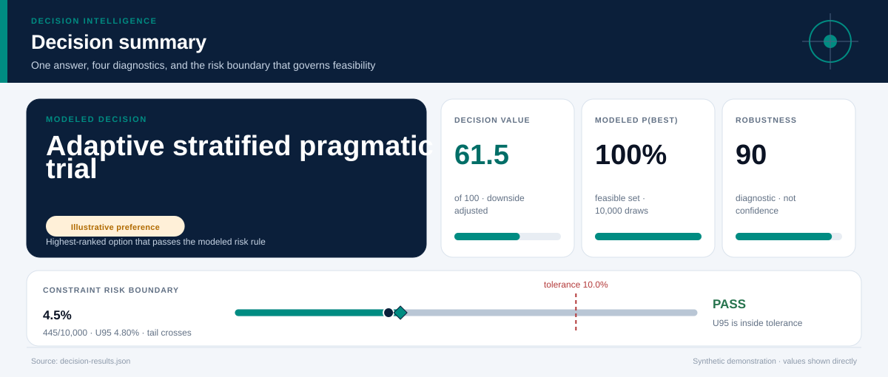
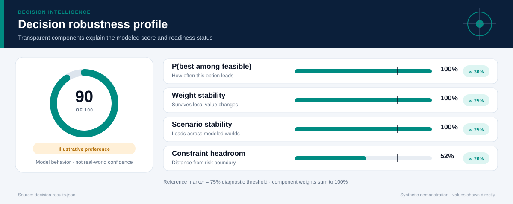
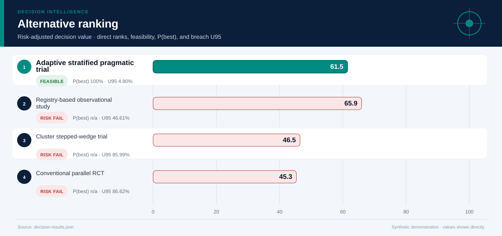
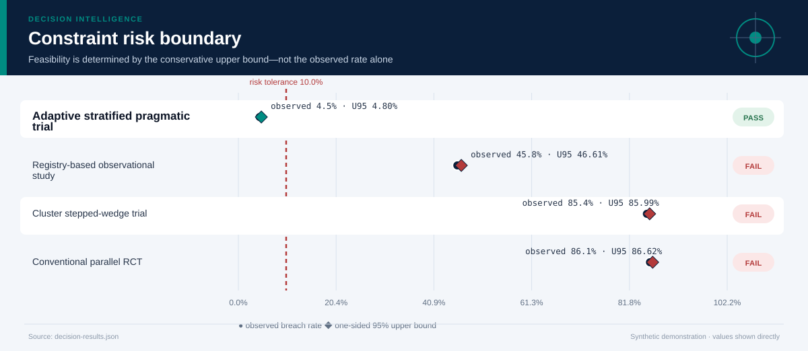
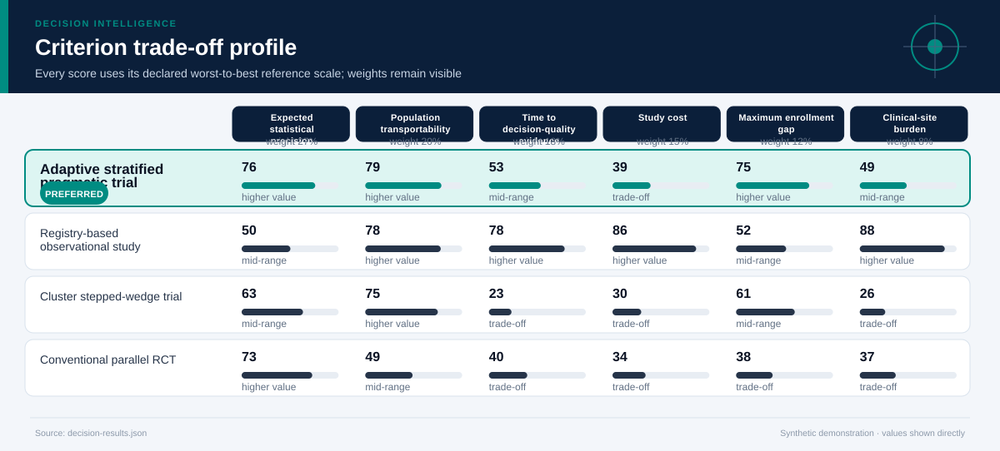
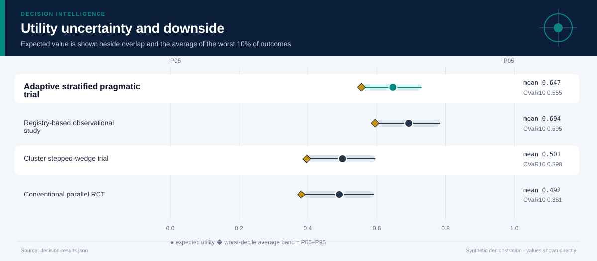
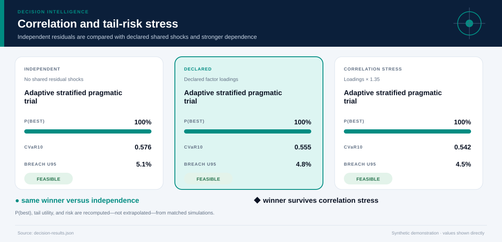
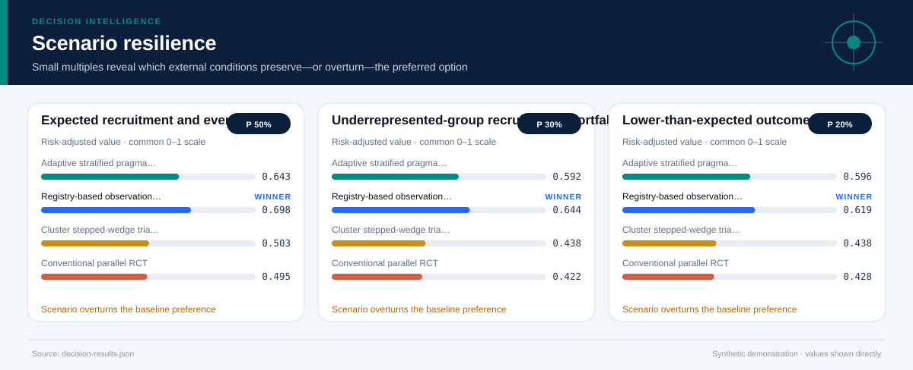
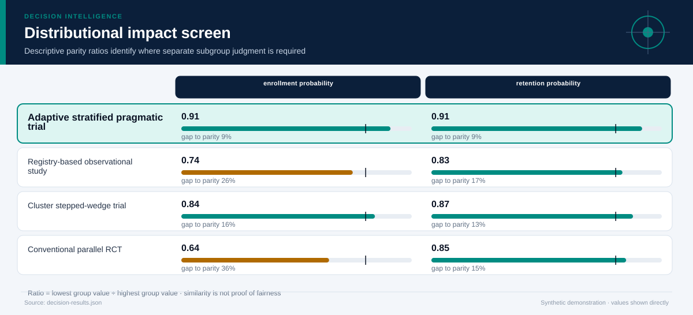
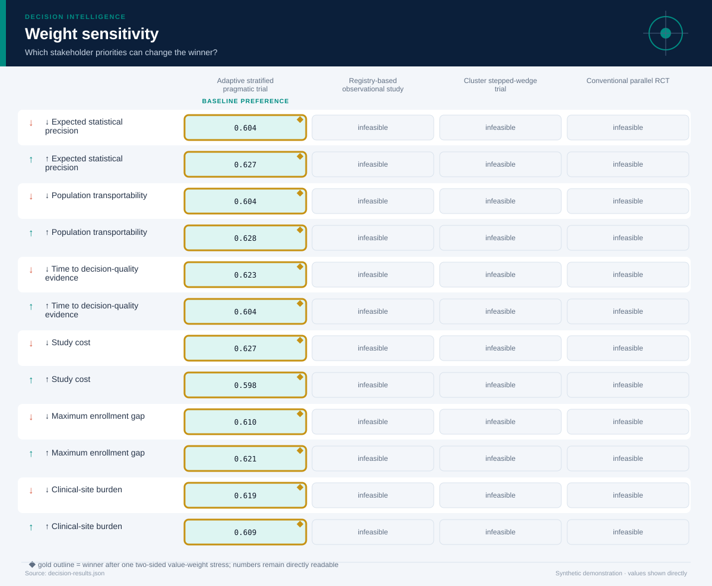

# Population Health Evidence Design

*Biostatistics, clinical research, health data science, and population health · 30 months · 10,000 modeled simulations*

## Executive Summary

- **Illustrative preference — Adaptive stratified pragmatic trial.** It is the highest-ranked feasible option, with decision value score **61.5/100** and a modeled **100% probability of being best among decision-feasible alternatives**.
- **The lead is meaningful rather than absolute.** It leads the next feasible option, Registry-based observational study, by **0.615 utility points**.
- **Modeled robustness is 90/100.** The option remains preferred in **100%** of two-sided weight stresses and **100%** of probability-weighted scenario comparisons.
- **Shared-shock sensitivity is explicit.** Relative to independent residuals, the declared factor model changes this option's P(best) by **+0.0%** and CVaR10 by **-0.020**; the ×1.35 loading stress does not change the modeled winner.
- **Constraint-breach evidence — 4.5% (445/10,000); U95 4.8%.** Feasibility uses the one-sided 95% upper bound against the **10.0% tolerance**; a zero event count is never presented as proof of zero real-world risk.
- **Decision status — Illustrative preference.** The current blockers are: evidence is not labeled for operational use.
- **Evidence boundary.** No causal conclusion; the case compares study designs, while the companion evidence module reports descriptive effect estimates and uncertainty.
- **Parameter lineage.** 139/139 governed parameters have a resolved source and approval-chain reference.

**Decision owner:** Population health research steering committee  
**Decision question:** Choose an evaluation design for a community prevention program that balances statistical precision, representativeness, time, cost, and operational burden.

## Decision status and modeled robustness

**Status: Illustrative preference.** 7 of 8 configured readiness checks pass. The robustness score summarizes model behavior; it is not a posterior probability that the real-world decision is correct and cannot upgrade illustrative evidence into operational evidence.

## Adaptive stratified pragmatic trial leads on balanced value, not every dimension

**The preferred option earns its position through Expected statistical precision, Maximum enrollment gap.** The comparison still exposes a trade-off on **Study cost**, so the decision should be presented as a transparent compromise rather than a universal optimum.

The ranking combines expected value with downside performance and excludes options whose one-sided 95% breach-frequency upper bound exceeds **10%**. Probability-best remains visible because a lower-ranked option may still win in a material share of simulations.

## The conservative risk boundary determines feasibility

**The decision rule compares the one-sided 95% breach-frequency upper bound—not only the observed simulation rate—with the 10.0% tolerance.** This makes finite-sample uncertainty visible and prevents a zero event count from being presented as proof of zero risk.

The dark circle is the observed breach rate; the diamond is its conservative upper bound. An option fails the modeled feasibility rule when that diamond crosses the red tolerance line. The test is conditional on the declared distributions and cannot cover omitted real-world hazards.

## The criterion profile reveals where the preferred option earns—and gives up—value

Each cell below places an outcome on its declared worst-to-best reference scale. This avoids recalibrating the chart around whichever alternatives happen to be present.

**The decision is therefore driven by an explicit value model.** A stakeholder who places substantially more weight on Study cost may reasonably prefer another option; the two-sided weight-sensitivity section tests that possibility directly. The preferred option clips **0.0%** of criterion draws at the declared reference-scale bounds.

## Downside risk remains visible behind the average

**Adaptive stratified pragmatic trial has expected utility 0.647, but its worst-decile average falls to 0.555.** The widest criterion-level uncertainty for this option is associated with **Time to decision-quality evidence**, making it a priority for further evidence collection.

The interval chart prevents a precise-looking average from obscuring overlap among alternatives. A close overlap means the practical decision may depend more on constraints, reversibility, and the cost of learning than on a small utility difference.

## Shared shocks change the uncertainty question

**The declared factor model gives Adaptive stratified pragmatic trial P(best) 100%, versus 100% under independent residuals and 100% under the stronger correlation stress.** Its CVaR10 moves from 0.576 independently to 0.555 under declared dependence and 0.542 under stress.

The three states use matched seeds, stratified scenario counts, and the same marginal distributions. Differences therefore isolate the declared dependence structure as closely as this simulation design allows. The Gaussian copula remains an approximation: factor definitions, signs, and loadings must be replaced or approved using domain evidence.

## Scenario tests show when the preferred option is most exposed

**The weakest modeled environment is Underrepresented-group recruitment shortfall, where the preferred option's risk-adjusted utility is 0.592.** The same feasible alternative remains ahead in every modeled scenario.

The preferred option leads in **100%** of the probability-weighted scenario comparison. Scenario probabilities are assumptions, not forecasts with guaranteed calibration. They are useful because they reveal which external conditions deserve monitoring and which contingency plans should be prepared before implementation.

## Distributional effects require a separate judgment

**Average utility does not establish equitable impact.** The weakest descriptive parity ratio is **0.91** for **enrollment probability**, between Limited-access participants and Urban participants. The ratios below are descriptive diagnostics; they cannot resolve questions about rights, need, historical disadvantage, or acceptable error asymmetry.

Use the visual to locate disparities that require subgroup analysis and stakeholder review. Do not optimize the ratios mechanically or treat similarity as proof of fairness.

## The result is stable to stakeholder priorities

**The baseline choice survives 100% of local weight stresses.** No single criterion emphasis changes the preferred feasible alternative.

This test both increases and decreases each criterion weight while preserving risk adjustment. It remains a local stress test rather than a substitute for formal stakeholder elicitation. If the winner changes under a plausible emphasis, the next step is deliberation and better evidence—not hiding the sensitivity.

## Recommended next steps

1. **Replace every synthetic input before any pilot or operational use.** Re-estimate outcomes from traceable descriptive, predictive, causal, financial, policy, or engineering evidence.
2. **Reduce uncertainty in Time to decision-quality evidence.** Replace the widest synthetic or elicited input with experimental, quasi-experimental, observational, or engineering evidence appropriate to the domain.
3. **Monitor the Underrepresented-group recruitment shortfall trigger.** Specify leading indicators and a contingency response before rollout.
4. **Review distributional impacts with affected stakeholders.** Examine absolute group outcomes alongside disparity measures and document unresolved normative choices.

## Further questions

- Which empirical or elicited evidence would best validate the declared factor loadings?
- Which omitted externality or stakeholder could materially alter the criterion set?
- What evidence would justify replacing the current scenario probabilities?
- Is the preferred option reversible if early monitoring contradicts the model?

## Caveats and assumptions

- **Evidence type:** Synthetic pilot, recruitment, outcome-rate, and study-operations assumptions
- **Evidence as of:** Synthetic demonstration; no production as-of date
- **Permitted decision use:** illustrative
- **Causal status:** No causal conclusion; the case compares study designs, while the companion evidence module reports descriptive effect estimates and uncertainty.
- **Dependence model:** latent_factor_gaussian_copula with 1 declared shared factor(s); the loading stress is ×1.35. Copula choice and loadings remain assumptions.
- **Parameter provenance:** 100% source coverage and 100% approval coverage for the declared decision use. Approval for illustrative use is not operational approval.
- **Zero-breach interpretation:** zero simulated events means either no event was observed in the finite run or the declared bounded input support excludes a breach. Neither statement establishes zero real-world risk.
- Power is represented by a precision score rather than a full design-specific simulation.
- Site and participant outcomes may be correlated.
- The bundled individual-level dataset is synthetic and too small for clinical inference.
- The Gaussian copula and factor loadings are synthetic assumptions; tail dependence may differ in real data and requires domain approval.
- **Validation warning:** No obvious status-quo or baseline alternative was found.

<strong>Detailed numerical appendix and reproducibility</strong>

### Ranked alternatives

| Rank | Alternative | Feasible | Value score | Expected utility | CVaR10 | P(best feasible) | P(best all) | Breach evidence | Feasible Pareto |
|---:|---|:---:|---:|---:|---:|---:|---:|---|:---:|
| 1 | Adaptive stratified pragmatic trial | Yes | 61.5 | 0.647 | 0.555 | 100.0% | 13.4% | 4.5% (445/10,000); U95 4.8% | Yes |
| 2 | Registry-based observational study | No | 65.9 | 0.694 | 0.595 | n/a | 86.6% | 45.8% (4,579/10,000); U95 46.6% | No |
| 3 | Cluster stepped-wedge trial | No | 46.5 | 0.501 | 0.398 | n/a | 0.0% | 85.4% (8,542/10,000); U95 86.0% | No |
| 4 | Conventional parallel RCT | No | 45.3 | 0.492 | 0.381 | n/a | 0.0% | 86.1% (8,606/10,000); U95 86.6% | No |

### Readiness checks

| Check | Result |
|---|:---:|
| Feasible Alternative | Pass |
| Probability Best | Pass |
| Weight Stability | Pass |
| Scenario Stability | Pass |
| Scale Clipping | Pass |
| Parameter Provenance | Pass |
| Approval Scope | Pass |
| Operational Evidence | Fail |

### Constraint diagnostics

| Alternative | Constraint | Events | Observed | U95 | Declared support | Mean signed margin | P05–P95 margin |
|---|---|---:|---:|---:|---|---:|---:|
| Adaptive stratified pragmatic trial | Research budget ceiling | 195/10,000 | 1.9% | 2.19% | 5.5–8.3; tail crosses threshold | 1.144 | 0.164–2.086 |
| Adaptive stratified pragmatic trial | Representativeness tolerance | 0/10,000 | 0.0% | 0.03% | 0.04–0.174; excludes breach | 0.079 | 0.032–0.121 |
| Adaptive stratified pragmatic trial | Evidence deadline | 261/10,000 | 2.6% | 2.89% | 19–34.7; tail crosses threshold | 6.040 | 0.826–10.638 |
| Registry-based observational study | Research budget ceiling | 0/10,000 | 0.0% | 0.03% | 2.1–4.2; excludes breach | 4.905 | 4.158–5.597 |
| Registry-based observational study | Representativeness tolerance | 4,579/10,000 | 45.8% | 46.61% | 0.1–0.3; tail crosses threshold | 0.000 | -0.067–0.055 |
| Registry-based observational study | Evidence deadline | 0/10,000 | 0.0% | 0.03% | 12–26.9; excludes breach | 13.452 | 8.660–17.714 |
| Cluster stepped-wedge trial | Research budget ceiling | 2,787/10,000 | 27.9% | 28.61% | 6.2–9.2; tail crosses threshold | 0.372 | -0.676–1.349 |
| Cluster stepped-wedge trial | Representativeness tolerance | 2,101/10,000 | 21.0% | 21.69% | 0.07–0.275; tail crosses threshold | 0.030 | -0.035–0.084 |
| Cluster stepped-wedge trial | Evidence deadline | 8,104/10,000 | 81.0% | 81.68% | 27–44.8; tail crosses threshold | -3.041 | -8.929–2.309 |
| Conventional parallel RCT | Research budget ceiling | 1,364/10,000 | 13.6% | 14.21% | 5.8–8.8; tail crosses threshold | 0.727 | -0.318–1.754 |
| Conventional parallel RCT | Representativeness tolerance | 8,253/10,000 | 82.5% | 83.15% | 0.12–0.388; tail crosses threshold | -0.045 | -0.133–0.026 |
| Conventional parallel RCT | Evidence deadline | 2,938/10,000 | 29.4% | 30.13% | 22–40.3; tail crosses threshold | 1.851 | -4.088–7.138 |

### Criterion outcomes

#### Adaptive stratified pragmatic trial

| Criterion | Weight | Mean | P05–P95 | Normalized score | Scale clipping |
|---|---:|---:|---:|---:|---:|
| Expected statistical precision | 27.0% | 0.805 score | 0.717 score–0.899 score | 0.759 | 0.0% |
| Population transportability | 20.0% | 0.811 score | 0.737 score–0.879 score | 0.785 | 0.0% |
| Time to decision-quality evidence | 18.0% | 26.0 months | 21.4 months–31.2 months | 0.535 | 0.0% |
| Study cost | 15.0% | 6.856 USD millions | 5.914 USD millions–7.836 USD millions | 0.393 | 0.0% |
| Maximum enrollment gap | 12.0% | 0.101 probability points | 0.059 probability points–0.148 probability points | 0.755 | 0.0% |
| Clinical-site burden | 8.0% | 51.0 index points | 42.0 index points–61.0 index points | 0.485 | 0.0% |

#### Registry-based observational study

| Criterion | Weight | Mean | P05–P95 | Normalized score | Scale clipping |
|---|---:|---:|---:|---:|---:|
| Expected statistical precision | 27.0% | 0.651 score | 0.514 score–0.766 score | 0.502 | 0.0% |
| Population transportability | 20.0% | 0.806 score | 0.734 score–0.871 score | 0.779 | 0.0% |
| Time to decision-quality evidence | 18.0% | 18.5 months | 14.3 months–23.3 months | 0.782 | 0.0% |
| Study cost | 15.0% | 3.095 USD millions | 2.403 USD millions–3.842 USD millions | 0.863 | 0.0% |
| Maximum enrollment gap | 12.0% | 0.18 probability points | 0.125 probability points–0.247 probability points | 0.516 | 0.0% |
| Clinical-site burden | 8.0% | 23.6 index points | 16.9 index points–31.2 index points | 0.877 | 0.6% |

#### Cluster stepped-wedge trial

| Criterion | Weight | Mean | P05–P95 | Normalized score | Scale clipping |
|---|---:|---:|---:|---:|---:|
| Expected statistical precision | 27.0% | 0.73 score | 0.626 score–0.831 score | 0.633 | 0.0% |
| Population transportability | 20.0% | 0.787 score | 0.714 score–0.858 score | 0.749 | 0.0% |
| Time to decision-quality evidence | 18.0% | 35.0 months | 29.7 months–40.9 months | 0.233 | 2.3% |
| Study cost | 15.0% | 7.628 USD millions | 6.651 USD millions–8.676 USD millions | 0.297 | 0.0% |
| Maximum enrollment gap | 12.0% | 0.15 probability points | 0.096 probability points–0.215 probability points | 0.605 | 0.0% |
| Clinical-site burden | 8.0% | 66.6 index points | 56.5 index points–77.2 index points | 0.263 | 0.0% |

#### Conventional parallel RCT

| Criterion | Weight | Mean | P05–P95 | Normalized score | Scale clipping |
|---|---:|---:|---:|---:|---:|
| Expected statistical precision | 27.0% | 0.787 score | 0.688 score–0.882 score | 0.728 | 0.0% |
| Population transportability | 20.0% | 0.617 score | 0.524 score–0.708 score | 0.488 | 0.0% |
| Time to decision-quality evidence | 18.0% | 30.1 months | 24.9 months–36.1 months | 0.395 | 0.0% |
| Study cost | 15.0% | 7.273 USD millions | 6.246 USD millions–8.318 USD millions | 0.341 | 0.0% |
| Maximum enrollment gap | 12.0% | 0.225 probability points | 0.154 probability points–0.313 probability points | 0.378 | 1.2% |
| Clinical-site burden | 8.0% | 59.0 index points | 49.5 index points–69.1 index points | 0.371 | 0.0% |

### Correlation sensitivity

| Dependence state | Modeled winner | Recommended option P(best) | CVaR10 | Breach U95 |
|---|---|---:|---:|---:|
| Independent residuals | Adaptive stratified pragmatic trial | 100.0% | 0.576 | 5.09% |
| Declared factor model | Adaptive stratified pragmatic trial | 100.0% | 0.555 | 4.80% |
| Loading stress ×1.35 | Adaptive stratified pragmatic trial | 100.0% | 0.542 | 4.52% |

### Parameter provenance and approval

Coverage: **139/139 parameters sourced** and **139/139 approved for the declared use**. Every expanded JSON path is recorded in `decision-results.json` under `parameter_provenance.records`.

| Source ID | Source type | Owner | Approved uses | Approval chain |
|---|---|---|---|---|
| `clinical-evidence-design-synthetic-parameter-register` | synthetic_demonstration_register | Repository maintainer (synthetic example) | illustrative | 1. case_author (approved) → 2. independent_domain_reviewer (not_obtained) |
### Sources and reproducibility

- Illustrative two-group pilot dataset bundled with the case
- Synthetic recruitment and event-rate scenarios
- Hypothetical site-capacity elicitation
- Engine version: `5.0.0`
- Samples: `10000`
- Random seed: `20260726`
- Sampling design: Stratified scenario allocation with a declared latent-factor Gaussian copula, shared shocks across alternatives, marginal-preserving inverse transforms, and matched independent/correlation-stress counterfactuals.
- Case SHA-256: `53f723ffc267602a2612c42e07f81a21bf27c4e1eaadeb84936c7e7fbc13b27b`

### Decision notes

- A real protocol requires a statistician-approved estimand, power simulation, multiplicity plan, missing-data strategy, and data-monitoring plan.
- The adaptive design must pre-specify adaptation rules and preserve type-I error control.

> Synthetic demonstration only. This report is not medical, financial, legal, engineering-safety, or public-policy advice.
