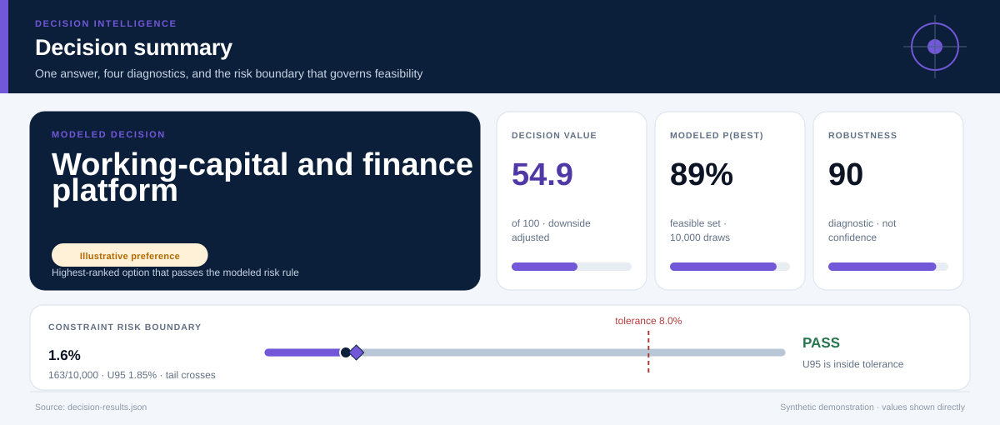
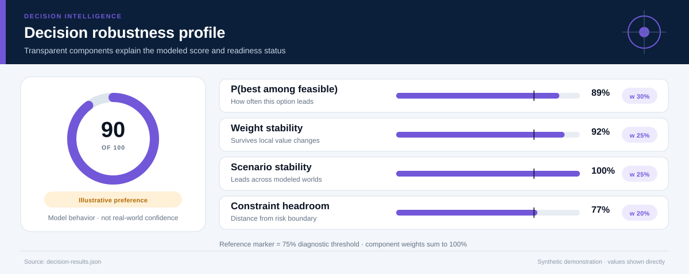
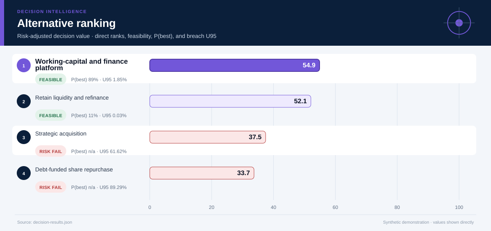
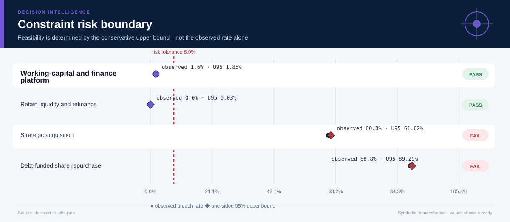
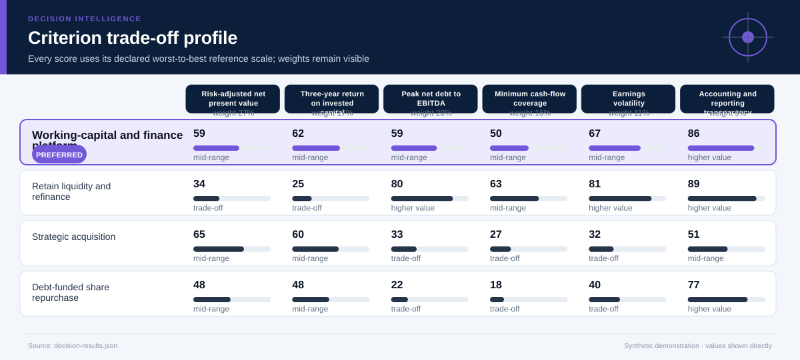
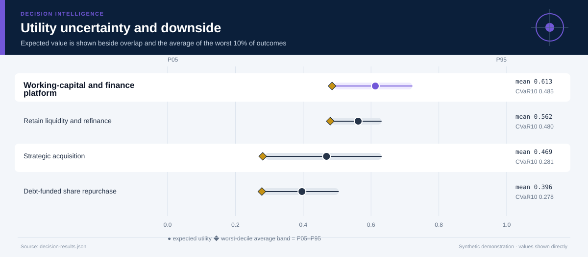
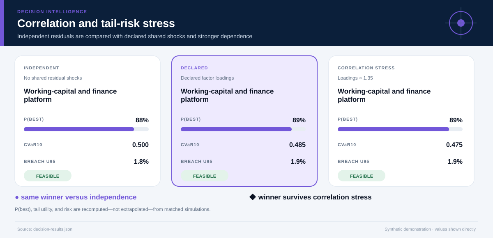
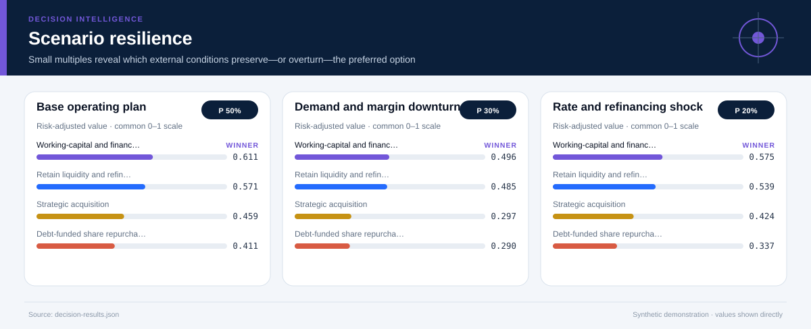
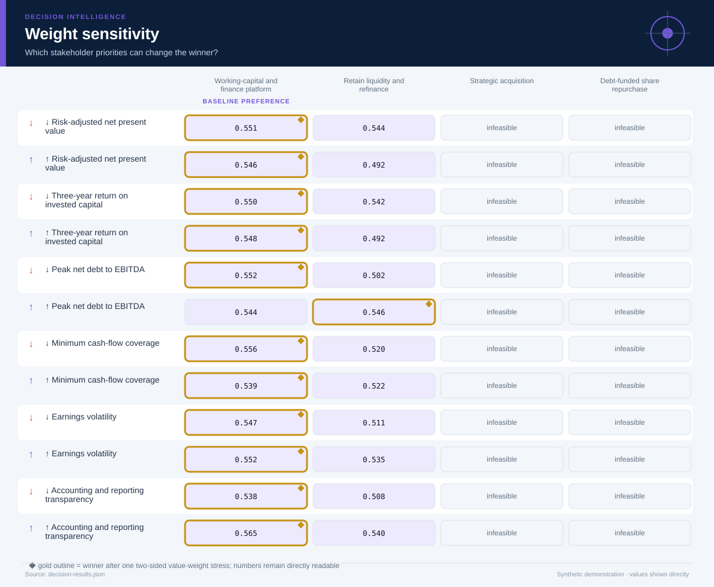

# Corporate Finance Capital Allocation

*Finance, accounting, valuation, risk management, and capital allocation · 36 months · 10,000 modeled simulations*

## Executive Summary

- **Illustrative preference — Working-capital and finance platform.** It is the highest-ranked feasible option, with decision value score **54.9/100** and a modeled **89% probability of being best among decision-feasible alternatives**.
- **The lead is narrow rather than absolute.** It leads the next feasible option, Retain liquidity and refinance, by **0.028 utility points**.
- **Modeled robustness is 90/100.** The option remains preferred in **92%** of two-sided weight stresses and **100%** of probability-weighted scenario comparisons.
- **Shared-shock sensitivity is explicit.** Relative to independent residuals, the declared factor model changes this option's P(best) by **+0.5%** and CVaR10 by **-0.015**; the ×1.35 loading stress does not change the modeled winner.
- **Constraint-breach evidence — 1.6% (163/10,000); U95 1.9%.** Feasibility uses the one-sided 95% upper bound against the **8.0% tolerance**; a zero event count is never presented as proof of zero real-world risk.
- **Decision status — Illustrative preference.** The current blockers are: evidence is not labeled for operational use.
- **Evidence boundary.** No causal claim; returns, synergies, working-capital effects, and financing costs are scenario assumptions.
- **Parameter lineage.** 135/135 governed parameters have a resolved source and approval-chain reference.

**Decision owner:** Chief financial officer and board finance committee  
**Decision question:** Allocate excess balance-sheet capacity across liquidity, operating investment, acquisition, and shareholder distribution under earnings and credit stress.

## Decision status and modeled robustness

**Status: Illustrative preference.** 7 of 8 configured readiness checks pass. The robustness score summarizes model behavior; it is not a posterior probability that the real-world decision is correct and cannot upgrade illustrative evidence into operational evidence.

## Working-capital and finance platform leads on balanced value, not every dimension

**The preferred option earns its position through Three-year return on invested capital, Risk-adjusted net present value.** The comparison still exposes a trade-off on **Peak net debt to EBITDA**, so the decision should be presented as a transparent compromise rather than a universal optimum.

The ranking combines expected value with downside performance and excludes options whose one-sided 95% breach-frequency upper bound exceeds **8%**. Probability-best remains visible because a lower-ranked option may still win in a material share of simulations.

## The conservative risk boundary determines feasibility

**The decision rule compares the one-sided 95% breach-frequency upper bound—not only the observed simulation rate—with the 8.0% tolerance.** This makes finite-sample uncertainty visible and prevents a zero event count from being presented as proof of zero risk.

The dark circle is the observed breach rate; the diamond is its conservative upper bound. An option fails the modeled feasibility rule when that diamond crosses the red tolerance line. The test is conditional on the declared distributions and cannot cover omitted real-world hazards.

## The criterion profile reveals where the preferred option earns—and gives up—value

Each cell below places an outcome on its declared worst-to-best reference scale. This avoids recalibrating the chart around whichever alternatives happen to be present.

**The decision is therefore driven by an explicit value model.** A stakeholder who places substantially more weight on Peak net debt to EBITDA may reasonably prefer another option; the two-sided weight-sensitivity section tests that possibility directly. The preferred option clips **0.0%** of criterion draws at the declared reference-scale bounds.

## Downside risk remains visible behind the average

**Working-capital and finance platform has expected utility 0.613, but its worst-decile average falls to 0.485.** The widest criterion-level uncertainty for this option is associated with **Three-year return on invested capital**, making it a priority for further evidence collection.

The interval chart prevents a precise-looking average from obscuring overlap among alternatives. A close overlap means the practical decision may depend more on constraints, reversibility, and the cost of learning than on a small utility difference.

## Shared shocks change the uncertainty question

**The declared factor model gives Working-capital and finance platform P(best) 89%, versus 88% under independent residuals and 89% under the stronger correlation stress.** Its CVaR10 moves from 0.500 independently to 0.485 under declared dependence and 0.475 under stress.

The three states use matched seeds, stratified scenario counts, and the same marginal distributions. Differences therefore isolate the declared dependence structure as closely as this simulation design allows. The Gaussian copula remains an approximation: factor definitions, signs, and loadings must be replaced or approved using domain evidence.

## Scenario tests show when the preferred option is most exposed

**The weakest modeled environment is Demand and margin downturn, where the preferred option's risk-adjusted utility is 0.496.** The same feasible alternative remains ahead in every modeled scenario.

The preferred option leads in **100%** of the probability-weighted scenario comparison. Scenario probabilities are assumptions, not forecasts with guaranteed calibration. They are useful because they reveal which external conditions deserve monitoring and which contingency plans should be prepared before implementation.

## Distributional effects remain an evidence gap

**No group-level outcomes were supplied for this case.** Before operational use, the analysis should add affected groups, absolute outcomes, disparity measures, and a qualitative review of harms that cannot be reduced to a numeric parity ratio.

## The result is sensitive to stakeholder priorities

**The baseline choice survives 92% of local weight stresses.** The following weight perturbation changes the winner: ↑ Peak net debt to EBITDA → Retain liquidity and refinance.

This test both increases and decreases each criterion weight while preserving risk adjustment. It remains a local stress test rather than a substitute for formal stakeholder elicitation. If the winner changes under a plausible emphasis, the next step is deliberation and better evidence—not hiding the sensitivity.

## Recommended next steps

1. **Replace every synthetic input before any pilot or operational use.** Re-estimate outcomes from traceable descriptive, predictive, causal, financial, policy, or engineering evidence.
2. **Reduce uncertainty in Three-year return on invested capital.** Replace the widest synthetic or elicited input with experimental, quasi-experimental, observational, or engineering evidence appropriate to the domain.
3. **Monitor the Demand and margin downturn trigger.** Specify leading indicators and a contingency response before rollout.
4. **Review distributional impacts with affected stakeholders.** Examine absolute group outcomes alongside disparity measures and document unresolved normative choices.

## Further questions

- Which empirical or elicited evidence would best validate the declared factor loadings?
- Which omitted externality or stakeholder could materially alter the criterion set?
- What evidence would justify replacing the current scenario probabilities?
- Is the preferred option reversible if early monitoring contradicts the model?

## Caveats and assumptions

- **Evidence type:** Synthetic financial statements, discounted cash-flow estimates, and stress scenarios
- **Evidence as of:** Synthetic demonstration; no production as-of date
- **Permitted decision use:** illustrative
- **Causal status:** No causal claim; returns, synergies, working-capital effects, and financing costs are scenario assumptions.
- **Dependence model:** latent_factor_gaussian_copula with 1 declared shared factor(s); the loading stress is ×1.35. Copula choice and loadings remain assumptions.
- **Parameter provenance:** 100% source coverage and 100% approval coverage for the declared decision use. Approval for illustrative use is not operational approval.
- **Zero-breach interpretation:** zero simulated events means either no event was observed in the finite run or the declared bounded input support excludes a breach. Neither statement establishes zero real-world risk.
- Tax, accounting-policy, and covenant interactions are simplified.
- Valuation ranges do not include a full comparable-company or transaction analysis.
- The Gaussian copula and factor loadings are synthetic assumptions; tail dependence may differ in real data and requires domain approval.
- **Validation warning:** No obvious status-quo or baseline alternative was found.

<strong>Detailed numerical appendix and reproducibility</strong>

### Ranked alternatives

| Rank | Alternative | Feasible | Value score | Expected utility | CVaR10 | P(best feasible) | P(best all) | Breach evidence | Feasible Pareto |
|---:|---|:---:|---:|---:|---:|---:|---:|---|:---:|
| 1 | Working-capital and finance platform | Yes | 54.9 | 0.613 | 0.485 | 88.8% | 87.7% | 1.6% (163/10,000); U95 1.9% | Yes |
| 2 | Retain liquidity and refinance | Yes | 52.1 | 0.562 | 0.480 | 11.2% | 11.0% | 0/10,000 observed; U95 0.03%; declared support excludes breach | Yes |
| 3 | Strategic acquisition | No | 37.5 | 0.469 | 0.281 | n/a | 1.3% | 60.8% (6,082/10,000); U95 61.6% | No |
| 4 | Debt-funded share repurchase | No | 33.7 | 0.396 | 0.278 | n/a | 0.0% | 88.8% (8,878/10,000); U95 89.3% | No |

### Readiness checks

| Check | Result |
|---|:---:|
| Feasible Alternative | Pass |
| Probability Best | Pass |
| Weight Stability | Pass |
| Scenario Stability | Pass |
| Scale Clipping | Pass |
| Parameter Provenance | Pass |
| Approval Scope | Pass |
| Operational Evidence | Fail |

### Constraint diagnostics

| Alternative | Constraint | Events | Observed | U95 | Declared support | Mean signed margin | P05–P95 margin |
|---|---|---:|---:|---:|---|---:|---:|
| Working-capital and finance platform | Leverage tolerance | 154/10,000 | 1.5% | 1.76% | 1.4–3.9; tail crosses threshold | 1.156 | 0.326–1.819 |
| Working-capital and finance platform | Minimum cash-flow coverage | 9/10,000 | 0.1% | 0.15% | 1.16–2.4; tail crosses threshold | 0.546 | 0.171–0.959 |
| Retain liquidity and refinance | Leverage tolerance | 0/10,000 | 0.0% | 0.03% | 0.9–2.2; excludes breach | 2.082 | 1.652–2.443 |
| Retain liquidity and refinance | Minimum cash-flow coverage | 0/10,000 | 0.0% | 0.03% | 1.4–2.7; excludes breach | 0.822 | 0.389–1.289 |
| Strategic acquisition | Leverage tolerance | 4,701/10,000 | 47.0% | 47.83% | 2.4–5.25; tail crosses threshold | -0.020 | -1.053–0.770 |
| Strategic acquisition | Minimum cash-flow coverage | 4,160/10,000 | 41.6% | 42.41% | 0.741–1.9; tail crosses threshold | 0.066 | -0.283–0.471 |
| Debt-funded share repurchase | Leverage tolerance | 8,255/10,000 | 82.5% | 83.17% | 2.8–5.61; tail crosses threshold | -0.537 | -1.537–0.329 |
| Debt-funded share repurchase | Minimum cash-flow coverage | 7,092/10,000 | 70.9% | 71.66% | 0.599–1.65; tail crosses threshold | -0.122 | -0.444–0.257 |

### Criterion outcomes

#### Working-capital and finance platform

| Criterion | Weight | Mean | P05–P95 | Normalized score | Scale clipping |
|---|---:|---:|---:|---:|---:|
| Risk-adjusted net present value | 27.0% | 78.3 USD millions | 47.2 USD millions–112.7 USD millions | 0.591 | 0.0% |
| Three-year return on invested capital | 17.0% | 13.1 percent | 9.615 percent–16.5 percent | 0.616 | 0.0% |
| Peak net debt to EBITDA | 20.0% | 2.344 multiple | 1.681 multiple–3.174 multiple | 0.590 | 0.0% |
| Minimum cash-flow coverage | 16.0% | 1.746 multiple | 1.371 multiple–2.159 multiple | 0.498 | 0.0% |
| Earnings volatility | 11.0% | 38.3 index points | 28.3 index points–51.3 index points | 0.667 | 0.0% |
| Accounting and reporting transparency | 9.0% | 0.9 score | 0.9 score–0.9 score | 0.857 | 0.0% |

#### Retain liquidity and refinance

| Criterion | Weight | Mean | P05–P95 | Normalized score | Scale clipping |
|---|---:|---:|---:|---:|---:|
| Risk-adjusted net present value | 27.0% | 27.2 USD millions | 15.9 USD millions–40.3 USD millions | 0.336 | 0.0% |
| Three-year return on invested capital | 17.0% | 6.532 percent | 4.815 percent–8.225 percent | 0.252 | 0.0% |
| Peak net debt to EBITDA | 20.0% | 1.418 multiple | 1.057 multiple–1.848 multiple | 0.796 | 0.0% |
| Minimum cash-flow coverage | 16.0% | 2.022 multiple | 1.589 multiple–2.489 multiple | 0.630 | 0.0% |
| Earnings volatility | 11.0% | 28.4 index points | 21.1 index points–37.9 index points | 0.809 | 0.0% |
| Accounting and reporting transparency | 9.0% | 0.92 score | 0.92 score–0.92 score | 0.886 | 0.0% |

#### Strategic acquisition

| Criterion | Weight | Mean | P05–P95 | Normalized score | Scale clipping |
|---|---:|---:|---:|---:|---:|
| Risk-adjusted net present value | 27.0% | 91.3 USD millions | 27.4 USD millions–160.8 USD millions | 0.653 | 5.2% |
| Three-year return on invested capital | 17.0% | 12.8 percent | 8.071 percent–18.1 percent | 0.600 | 0.6% |
| Peak net debt to EBITDA | 20.0% | 3.52 multiple | 2.73 multiple–4.553 multiple | 0.329 | 0.5% |
| Minimum cash-flow coverage | 16.0% | 1.266 multiple | 0.917 multiple–1.671 multiple | 0.269 | 0.0% |
| Earnings volatility | 11.0% | 62.8 index points | 46.9 index points–83.1 index points | 0.320 | 3.7% |
| Accounting and reporting transparency | 9.0% | 0.66 score | 0.66 score–0.66 score | 0.514 | 0.0% |

#### Debt-funded share repurchase

| Criterion | Weight | Mean | P05–P95 | Normalized score | Scale clipping |
|---|---:|---:|---:|---:|---:|
| Risk-adjusted net present value | 27.0% | 55.9 USD millions | 34.2 USD millions–80.1 USD millions | 0.479 | 0.0% |
| Three-year return on invested capital | 17.0% | 10.6 percent | 7.674 percent–13.6 percent | 0.477 | 0.0% |
| Peak net debt to EBITDA | 20.0% | 4.037 multiple | 3.171 multiple–5.037 multiple | 0.216 | 5.8% |
| Minimum cash-flow coverage | 16.0% | 1.078 multiple | 0.756 multiple–1.457 multiple | 0.180 | 1.6% |
| Earnings volatility | 11.0% | 56.9 index points | 42.4 index points–75.7 index points | 0.401 | 0.5% |
| Accounting and reporting transparency | 9.0% | 0.84 score | 0.84 score–0.84 score | 0.771 | 0.0% |

### Correlation sensitivity

| Dependence state | Modeled winner | Recommended option P(best) | CVaR10 | Breach U95 |
|---|---|---:|---:|---:|
| Independent residuals | Working-capital and finance platform | 88.3% | 0.500 | 1.81% |
| Declared factor model | Working-capital and finance platform | 88.8% | 0.485 | 1.85% |
| Loading stress ×1.35 | Working-capital and finance platform | 89.2% | 0.475 | 1.85% |

### Parameter provenance and approval

Coverage: **135/135 parameters sourced** and **135/135 approved for the declared use**. Every expanded JSON path is recorded in `decision-results.json` under `parameter_provenance.records`.

| Source ID | Source type | Owner | Approved uses | Approval chain |
|---|---|---|---|---|
| `corporate-finance-capital-allocation-synthetic-parameter-register` | synthetic_demonstration_register | Repository maintainer (synthetic example) | illustrative | 1. case_author (approved) → 2. independent_domain_reviewer (not_obtained) |
### Sources and reproducibility

- Illustrative income statement, cash-flow, and balance-sheet forecasts
- Synthetic cost-of-capital and covenant stress assumptions
- Hypothetical investment and acquisition cases
- Engine version: `5.0.0`
- Samples: `10000`
- Random seed: `20260726`
- Sampling design: Stratified scenario allocation with a declared latent-factor Gaussian copula, shared shocks across alternatives, marginal-preserving inverse transforms, and matched independent/correlation-stress counterfactuals.
- Case SHA-256: `295a19f6b86f1724cca04d705884a843dac06979881253bc87de38c993d92a90`

### Decision notes

- A real board paper should reconcile accounting earnings, free cash flow, covenant definitions, tax effects, and valuation assumptions.
- Scenario probabilities are planning inputs rather than market forecasts.

> Synthetic demonstration only. This report is not medical, financial, legal, engineering-safety, or public-policy advice.
