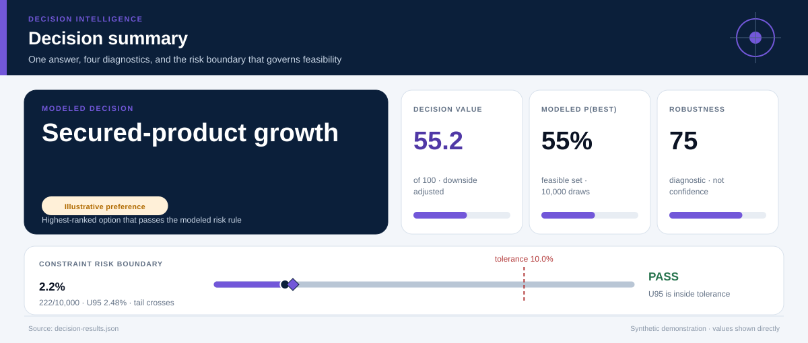
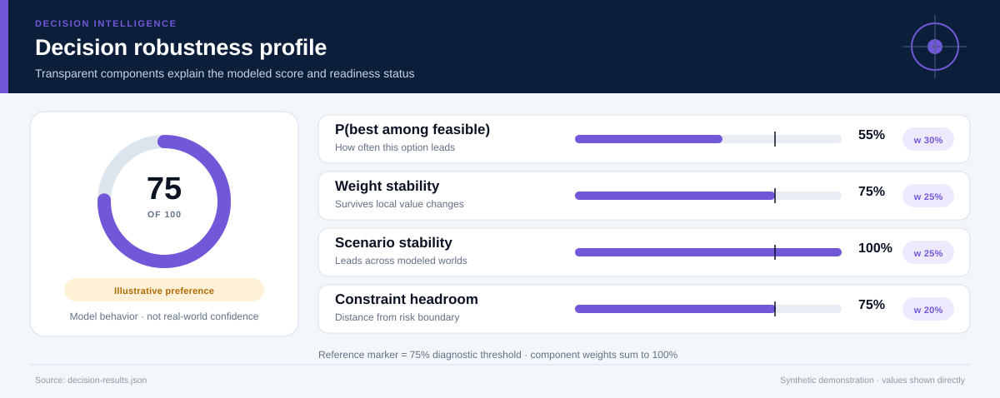
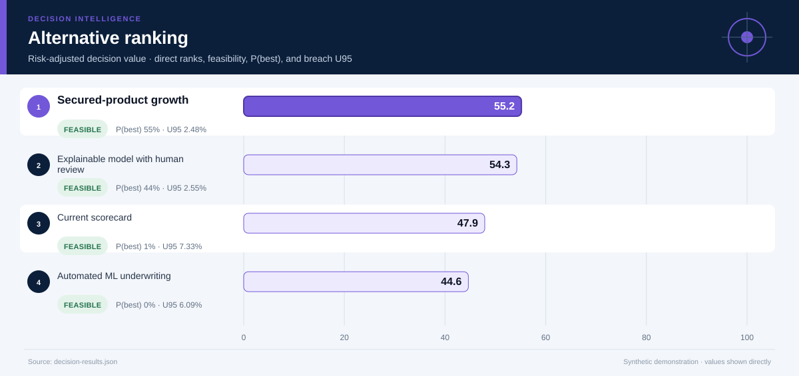
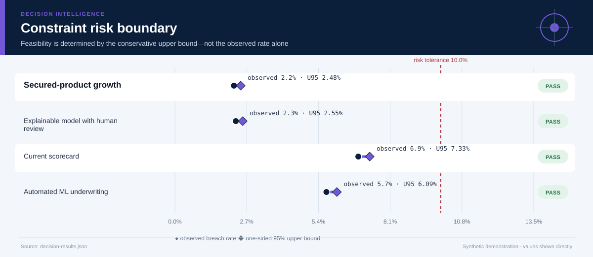
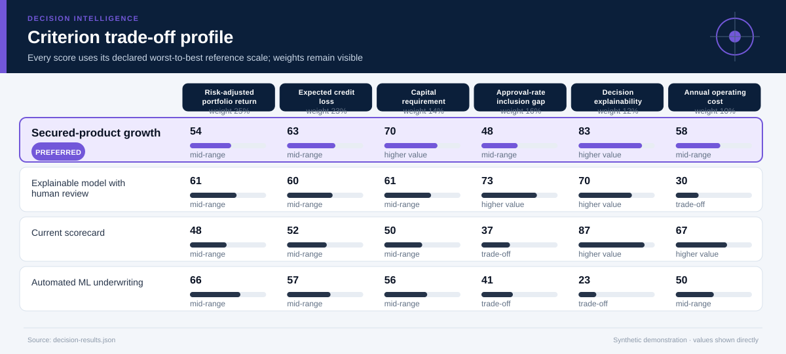
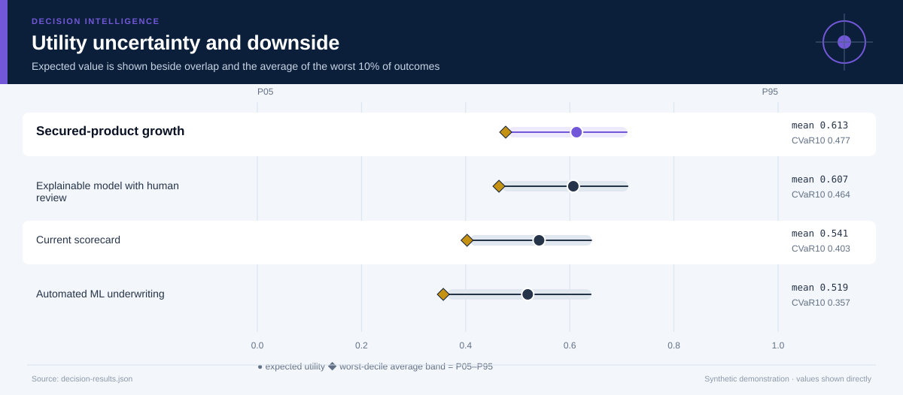
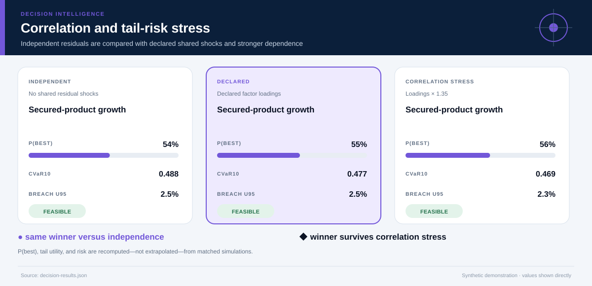
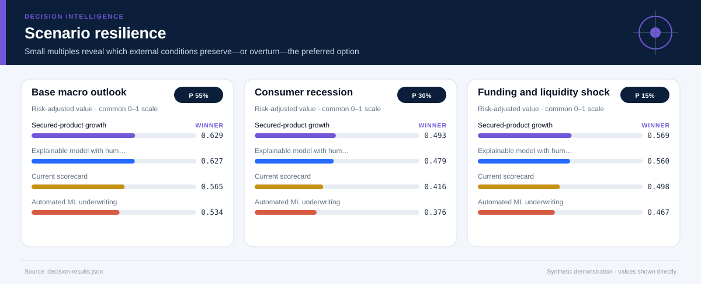
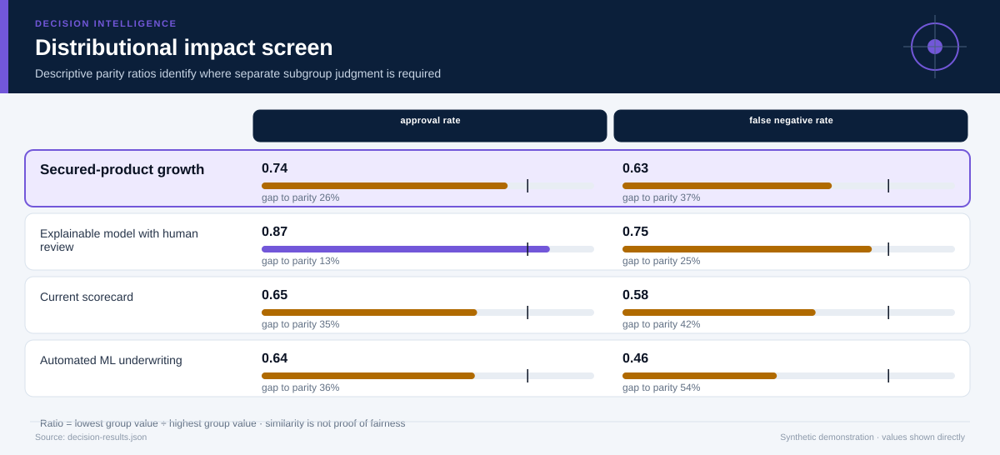
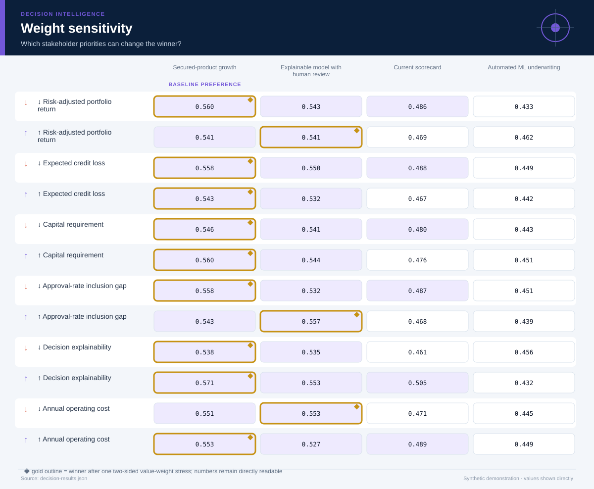

# FinTech Credit Strategy Under Stress

*Financial analytics, FinTech, risk management, and responsible AI · 24 months · 10,000 modeled simulations*

## Executive Summary

- **Illustrative preference — Secured-product growth.** It is the highest-ranked feasible option, with decision value score **55.2/100** and a modeled **55% probability of being best among decision-feasible alternatives**.
- **The lead is narrow rather than absolute.** It leads the next feasible option, Explainable model with human review, by **0.009 utility points**.
- **Modeled robustness is 75/100.** The option remains preferred in **75%** of two-sided weight stresses and **100%** of probability-weighted scenario comparisons.
- **Shared-shock sensitivity is explicit.** Relative to independent residuals, the declared factor model changes this option's P(best) by **+1.1%** and CVaR10 by **-0.011**; the ×1.35 loading stress does not change the modeled winner.
- **Constraint-breach evidence — 2.2% (222/10,000); U95 2.5%.** Feasibility uses the one-sided 95% upper bound against the **10.0% tolerance**; a zero event count is never presented as proof of zero real-world risk.
- **Decision status — Illustrative preference.** The current blockers are: evidence is not labeled for operational use.
- **Evidence boundary.** No causal claim; approval and loss estimates are predictive scenario inputs.
- **Parameter lineage.** 133/133 governed parameters have a resolved source and approval-chain reference.

**Decision owner:** Retail lender model-risk committee  
**Decision question:** Select a credit-underwriting strategy that balances risk-adjusted return, loss, capital, inclusion, explainability, and operating cost across macroeconomic stress scenarios.

## Decision status and modeled robustness

**Status: Illustrative preference.** 7 of 8 configured readiness checks pass. The robustness score summarizes model behavior; it is not a posterior probability that the real-world decision is correct and cannot upgrade illustrative evidence into operational evidence.

## Secured-product growth leads on balanced value, not every dimension

**The preferred option earns its position through Annual operating cost, Decision explainability.** The comparison still exposes a trade-off on **Approval-rate inclusion gap**, so the decision should be presented as a transparent compromise rather than a universal optimum.

The ranking combines expected value with downside performance and excludes options whose one-sided 95% breach-frequency upper bound exceeds **10%**. Probability-best remains visible because a lower-ranked option may still win in a material share of simulations.

## The conservative risk boundary determines feasibility

**The decision rule compares the one-sided 95% breach-frequency upper bound—not only the observed simulation rate—with the 10.0% tolerance.** This makes finite-sample uncertainty visible and prevents a zero event count from being presented as proof of zero risk.

The dark circle is the observed breach rate; the diamond is its conservative upper bound. An option fails the modeled feasibility rule when that diamond crosses the red tolerance line. The test is conditional on the declared distributions and cannot cover omitted real-world hazards.

## The criterion profile reveals where the preferred option earns—and gives up—value

Each cell below places an outcome on its declared worst-to-best reference scale. This avoids recalibrating the chart around whichever alternatives happen to be present.

**The decision is therefore driven by an explicit value model.** A stakeholder who places substantially more weight on Approval-rate inclusion gap may reasonably prefer another option; the two-sided weight-sensitivity section tests that possibility directly. The preferred option clips **0.0%** of criterion draws at the declared reference-scale bounds.

## Downside risk remains visible behind the average

**Secured-product growth has expected utility 0.613, but its worst-decile average falls to 0.477.** The widest criterion-level uncertainty for this option is associated with **Expected credit loss**, making it a priority for further evidence collection.

The interval chart prevents a precise-looking average from obscuring overlap among alternatives. A close overlap means the practical decision may depend more on constraints, reversibility, and the cost of learning than on a small utility difference.

## Shared shocks change the uncertainty question

**The declared factor model gives Secured-product growth P(best) 55%, versus 54% under independent residuals and 56% under the stronger correlation stress.** Its CVaR10 moves from 0.488 independently to 0.477 under declared dependence and 0.469 under stress.

The three states use matched seeds, stratified scenario counts, and the same marginal distributions. Differences therefore isolate the declared dependence structure as closely as this simulation design allows. The Gaussian copula remains an approximation: factor definitions, signs, and loadings must be replaced or approved using domain evidence.

## Scenario tests show when the preferred option is most exposed

**The weakest modeled environment is Consumer recession, where the preferred option's risk-adjusted utility is 0.493.** The same feasible alternative remains ahead in every modeled scenario.

The preferred option leads in **100%** of the probability-weighted scenario comparison. Scenario probabilities are assumptions, not forecasts with guaranteed calibration. They are useful because they reveal which external conditions deserve monitoring and which contingency plans should be prepared before implementation.

## Distributional effects require a separate judgment

**Average utility does not establish equitable impact.** The weakest descriptive parity ratio is **0.63** for **false negative rate**, between Established-credit applicants and Thin-file applicants. The ratios below are descriptive diagnostics; they cannot resolve questions about rights, need, historical disadvantage, or acceptable error asymmetry.

Use the visual to locate disparities that require subgroup analysis and stakeholder review. Do not optimize the ratios mechanically or treat similarity as proof of fairness.

## The result is sensitive to stakeholder priorities

**The baseline choice survives 75% of local weight stresses.** The following weight perturbation changes the winner: ↑ Risk-adjusted portfolio return → Explainable model with human review; ↑ Approval-rate inclusion gap → Explainable model with human review; ↓ Annual operating cost → Explainable model with human review.

This test both increases and decreases each criterion weight while preserving risk adjustment. It remains a local stress test rather than a substitute for formal stakeholder elicitation. If the winner changes under a plausible emphasis, the next step is deliberation and better evidence—not hiding the sensitivity.

## Recommended next steps

1. **Replace every synthetic input before any pilot or operational use.** Re-estimate outcomes from traceable descriptive, predictive, causal, financial, policy, or engineering evidence.
2. **Reduce uncertainty in Expected credit loss.** Replace the widest synthetic or elicited input with experimental, quasi-experimental, observational, or engineering evidence appropriate to the domain.
3. **Monitor the Consumer recession trigger.** Specify leading indicators and a contingency response before rollout.
4. **Review distributional impacts with affected stakeholders.** Examine absolute group outcomes alongside disparity measures and document unresolved normative choices.

## Further questions

- Which empirical or elicited evidence would best validate the declared factor loadings?
- Which omitted externality or stakeholder could materially alter the criterion set?
- What evidence would justify replacing the current scenario probabilities?
- Is the preferred option reversible if early monitoring contradicts the model?

## Caveats and assumptions

- **Evidence type:** Synthetic portfolio estimates and expert stress assumptions
- **Evidence as of:** Synthetic demonstration; no production as-of date
- **Permitted decision use:** illustrative
- **Causal status:** No causal claim; approval and loss estimates are predictive scenario inputs.
- **Dependence model:** latent_factor_gaussian_copula with 1 declared shared factor(s); the loading stress is ×1.35. Copula choice and loadings remain assumptions.
- **Parameter provenance:** 100% source coverage and 100% approval coverage for the declared decision use. Approval for illustrative use is not operational approval.
- **Zero-breach interpretation:** zero simulated events means either no event was observed in the finite run or the declared bounded input support excludes a breach. Neither statement establishes zero real-world risk.
- Group metrics are illustrative and do not establish legal compliance.
- Profit estimates omit strategic competitor response.
- The Gaussian copula and factor loadings are synthetic assumptions; tail dependence may differ in real data and requires domain approval.

<strong>Detailed numerical appendix and reproducibility</strong>

### Ranked alternatives

| Rank | Alternative | Feasible | Value score | Expected utility | CVaR10 | P(best feasible) | P(best all) | Breach evidence | Feasible Pareto |
|---:|---|:---:|---:|---:|---:|---:|---:|---|:---:|
| 1 | Secured-product growth | Yes | 55.2 | 0.613 | 0.477 | 55.3% | 55.3% | 2.2% (222/10,000); U95 2.5% | Yes |
| 2 | Explainable model with human review | Yes | 54.3 | 0.607 | 0.464 | 43.7% | 43.7% | 2.3% (229/10,000); U95 2.5% | Yes |
| 3 | Current scorecard | Yes | 47.9 | 0.541 | 0.403 | 0.5% | 0.5% | 6.9% (690/10,000); U95 7.3% | Yes |
| 4 | Automated ML underwriting | Yes | 44.6 | 0.519 | 0.357 | 0.5% | 0.5% | 5.7% (570/10,000); U95 6.1% | Yes |

### Readiness checks

| Check | Result |
|---|:---:|
| Feasible Alternative | Pass |
| Probability Best | Pass |
| Weight Stability | Pass |
| Scenario Stability | Pass |
| Scale Clipping | Pass |
| Parameter Provenance | Pass |
| Approval Scope | Pass |
| Operational Evidence | Fail |

### Constraint diagnostics

| Alternative | Constraint | Events | Observed | U95 | Declared support | Mean signed margin | P05–P95 margin |
|---|---|---:|---:|---:|---|---:|---:|
| Secured-product growth | Board loss tolerance | 222/10,000 | 2.2% | 2.48% | 3.1–11.6; tail crosses threshold | 4.331 | 0.834–6.392 |
| Secured-product growth | Capital capacity | 0/10,000 | 0.0% | 0.03% | 7.5–12.8; excludes breach | 5.375 | 3.483–6.918 |
| Explainable model with human review | Board loss tolerance | 229/10,000 | 2.3% | 2.55% | 3.6–11.3; tail crosses threshold | 3.975 | 0.677–5.873 |
| Explainable model with human review | Capital capacity | 0/10,000 | 0.0% | 0.03% | 8.2–14.4; excludes breach | 4.361 | 2.237–6.124 |
| Current scorecard | Board loss tolerance | 571/10,000 | 5.7% | 6.10% | 4.5–11.6; tail crosses threshold | 3.209 | -0.097–5.037 |
| Current scorecard | Capital capacity | 119/10,000 | 1.2% | 1.38% | 9.5–15.9; tail crosses threshold | 2.973 | 0.713–4.806 |
| Automated ML underwriting | Board loss tolerance | 539/10,000 | 5.4% | 5.77% | 3.7–12.1; tail crosses threshold | 3.700 | -0.068–5.774 |
| Automated ML underwriting | Capital capacity | 31/10,000 | 0.3% | 0.42% | 8.5–15.6; tail crosses threshold | 3.756 | 1.317–5.717 |

### Criterion outcomes

#### Secured-product growth

| Criterion | Weight | Mean | P05–P95 | Normalized score | Scale clipping |
|---|---:|---:|---:|---:|---:|
| Risk-adjusted portfolio return | 25.0% | 5.821 percent | 2.187 percent–8.975 percent | 0.541 | 0.0% |
| Expected credit loss | 23.0% | 5.669 percent | 3.608 percent–9.166 percent | 0.633 | 0.0% |
| Capital requirement | 14.0% | 9.625 percent of exposure | 8.082 percent of exposure–11.5 percent of exposure | 0.698 | 0.0% |
| Approval-rate inclusion gap | 16.0% | 0.193 probability points | 0.157 probability points–0.231 probability points | 0.475 | 0.0% |
| Decision explainability | 12.0% | 0.9 score | 0.9 score–0.9 score | 0.833 | 0.0% |
| Annual operating cost | 10.0% | 5.327 USD millions | 4.743 USD millions–5.998 USD millions | 0.584 | 0.0% |

#### Explainable model with human review

| Criterion | Weight | Mean | P05–P95 | Normalized score | Scale clipping |
|---|---:|---:|---:|---:|---:|
| Risk-adjusted portfolio return | 25.0% | 7.241 percent | 3.311 percent–10.8 percent | 0.612 | 0.0% |
| Expected credit loss | 23.0% | 6.025 percent | 4.127 percent–9.323 percent | 0.597 | 0.0% |
| Capital requirement | 14.0% | 10.6 percent of exposure | 8.876 percent of exposure–12.8 percent of exposure | 0.613 | 0.0% |
| Approval-rate inclusion gap | 16.0% | 0.11 probability points | 0.074 probability points–0.15 probability points | 0.728 | 0.0% |
| Decision explainability | 12.0% | 0.82 score | 0.82 score–0.82 score | 0.700 | 0.0% |
| Annual operating cost | 10.0% | 7.601 USD millions | 6.545 USD millions–8.722 USD millions | 0.300 | 0.0% |

#### Current scorecard

| Criterion | Weight | Mean | P05–P95 | Normalized score | Scale clipping |
|---|---:|---:|---:|---:|---:|
| Risk-adjusted portfolio return | 25.0% | 4.623 percent | 0.792 percent–8.084 percent | 0.481 | 0.0% |
| Expected credit loss | 23.0% | 6.791 percent | 4.963 percent–10.1 percent | 0.521 | 0.0% |
| Capital requirement | 14.0% | 12.0 percent of exposure | 10.2 percent of exposure–14.3 percent of exposure | 0.498 | 0.0% |
| Approval-rate inclusion gap | 16.0% | 0.226 probability points | 0.187 probability points–0.269 probability points | 0.375 | 0.0% |
| Decision explainability | 12.0% | 0.92 score | 0.92 score–0.92 score | 0.867 | 0.0% |
| Annual operating cost | 10.0% | 4.618 USD millions | 4.057 USD millions–5.218 USD millions | 0.673 | 0.0% |

#### Automated ML underwriting

| Criterion | Weight | Mean | P05–P95 | Normalized score | Scale clipping |
|---|---:|---:|---:|---:|---:|
| Risk-adjusted portfolio return | 25.0% | 8.229 percent | 3.681 percent–12.6 percent | 0.661 | 0.0% |
| Expected credit loss | 23.0% | 6.3 percent | 4.226 percent–10.1 percent | 0.570 | 0.0% |
| Capital requirement | 14.0% | 11.2 percent of exposure | 9.283 percent of exposure–13.7 percent of exposure | 0.563 | 0.0% |
| Approval-rate inclusion gap | 16.0% | 0.214 probability points | 0.148 probability points–0.286 probability points | 0.413 | 0.0% |
| Decision explainability | 12.0% | 0.54 score | 0.54 score–0.54 score | 0.233 | 0.0% |
| Annual operating cost | 10.0% | 6.007 USD millions | 5.183 USD millions–6.912 USD millions | 0.499 | 0.0% |

### Correlation sensitivity

| Dependence state | Modeled winner | Recommended option P(best) | CVaR10 | Breach U95 |
|---|---|---:|---:|---:|
| Independent residuals | Secured-product growth | 54.2% | 0.488 | 2.47% |
| Declared factor model | Secured-product growth | 55.3% | 0.477 | 2.48% |
| Loading stress ×1.35 | Secured-product growth | 56.4% | 0.469 | 2.31% |

### Parameter provenance and approval

Coverage: **133/133 parameters sourced** and **133/133 approved for the declared use**. Every expanded JSON path is recorded in `decision-results.json` under `parameter_provenance.records`.

| Source ID | Source type | Owner | Approved uses | Approval chain |
|---|---|---|---|---|
| `fintech-credit-stress-synthetic-parameter-register` | synthetic_demonstration_register | Repository maintainer (synthetic example) | illustrative | 1. case_author (approved) → 2. independent_domain_reviewer (not_obtained) |
### Sources and reproducibility

- Illustrative historical portfolio summary
- Synthetic macroeconomic stress scenarios
- Hypothetical model-validation estimates
- Engine version: `5.0.0`
- Samples: `10000`
- Random seed: `20260726`
- Sampling design: Stratified scenario allocation with a declared latent-factor Gaussian copula, shared shocks across alternatives, marginal-preserving inverse transforms, and matched independent/correlation-stress counterfactuals.
- Case SHA-256: `09e1ed873233d62c3bd73f10d38242b1b6b2afab72e481d1b0305d50e1323341`

### Decision notes

- A production stress test should model correlated defaults, funding costs, and capital dynamics.
- Legal, compliance, and adverse-action review remain mandatory.

> Synthetic demonstration only. This report is not medical, financial, legal, engineering-safety, or public-policy advice.
