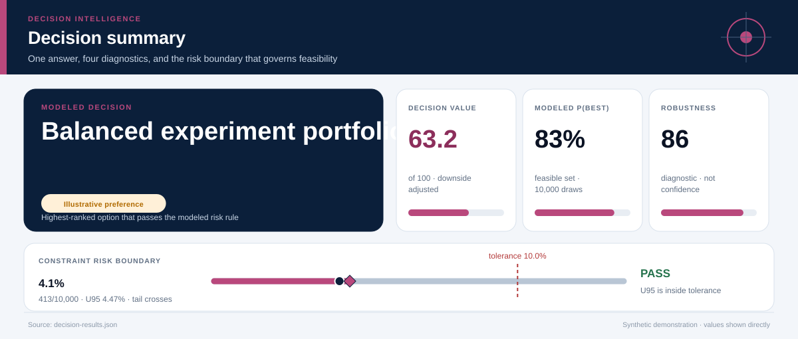
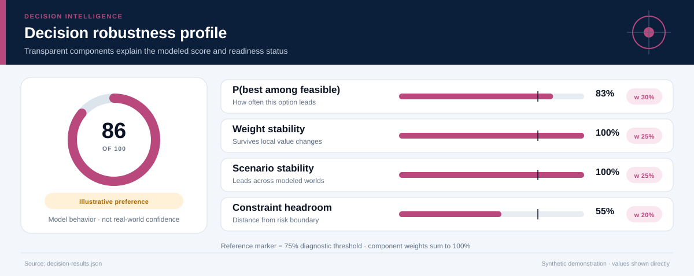
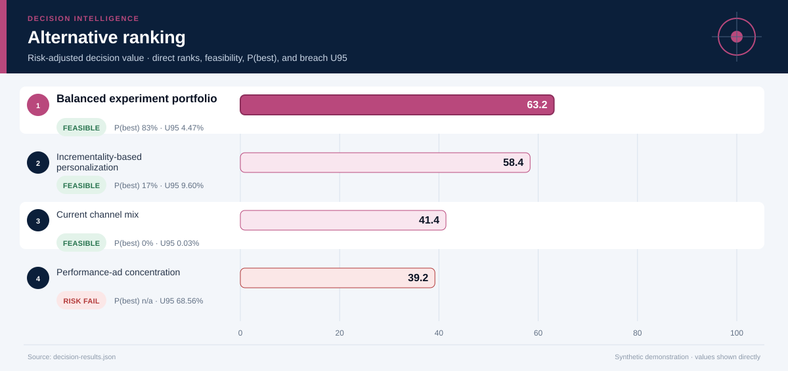
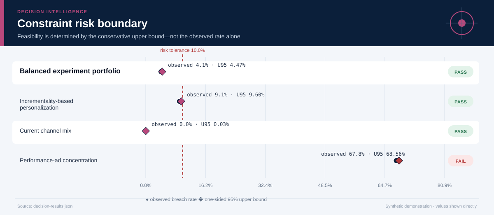
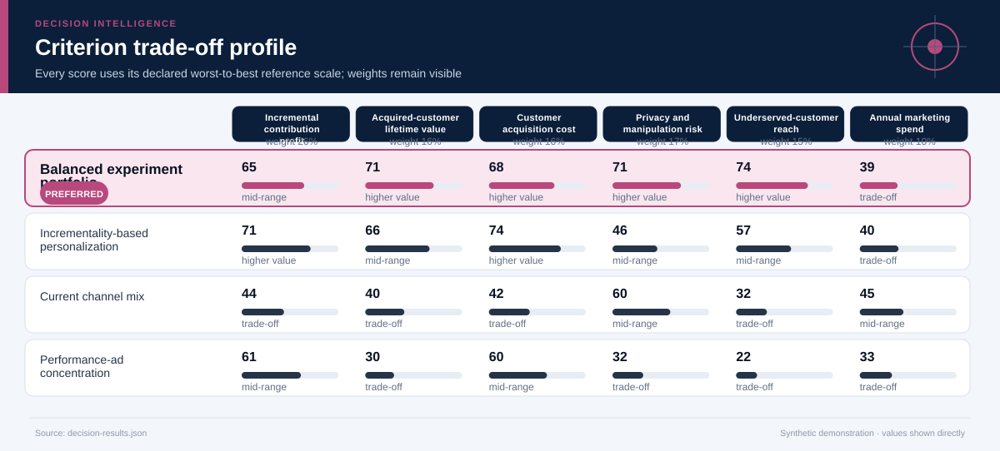
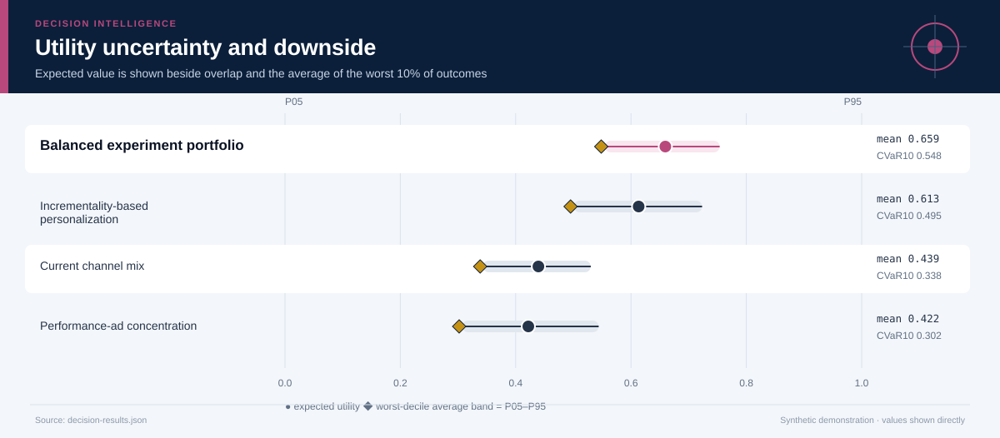
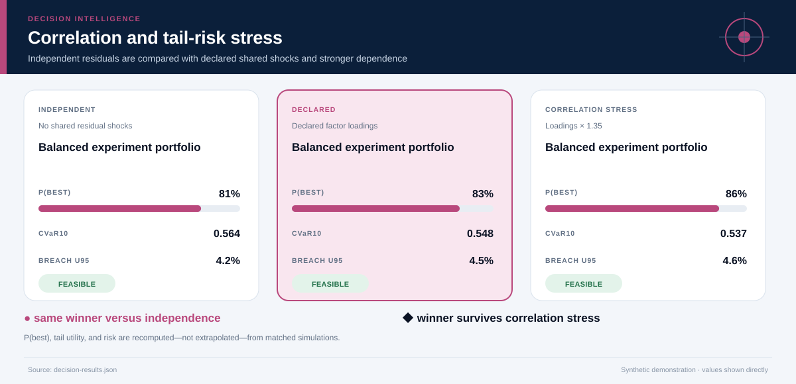
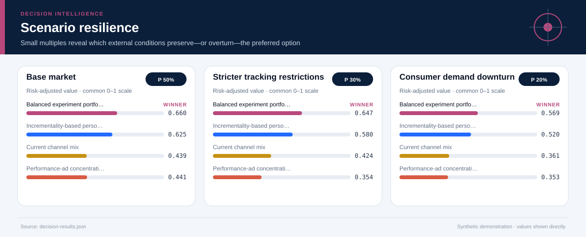
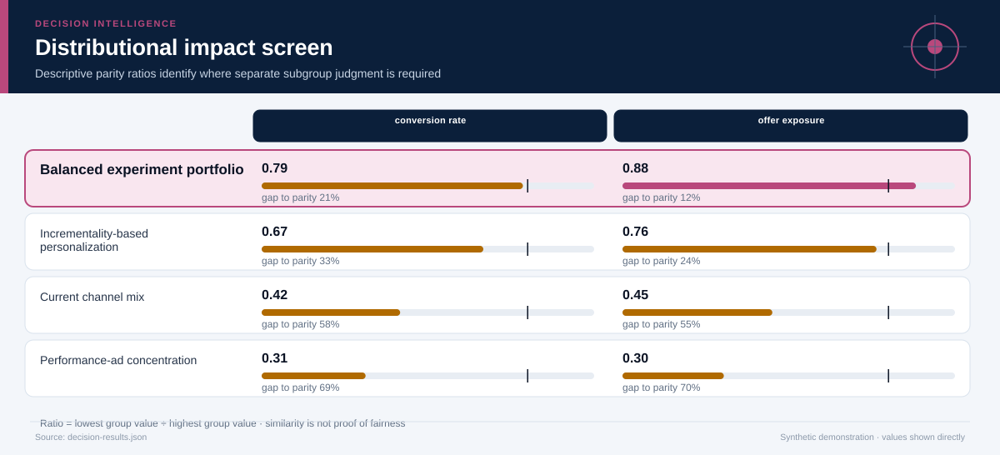
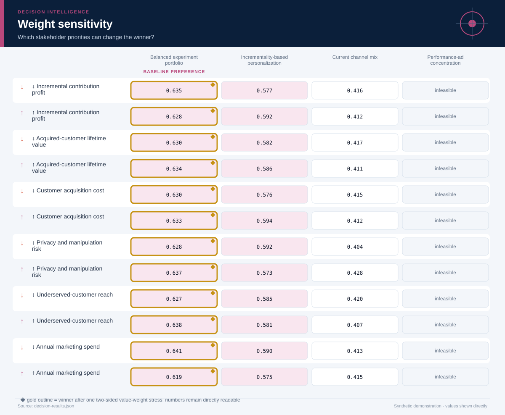

# Privacy-Conscious Marketing Budget Allocation

*Business analytics, marketing analytics, causal experimentation, and behavioral decision-making · 12 months · 10,000 modeled simulations*

## Executive Summary

- **Illustrative preference — Balanced experiment portfolio.** It is the highest-ranked feasible option, with decision value score **63.2/100** and a modeled **83% probability of being best among decision-feasible alternatives**.
- **The lead is meaningful rather than absolute.** It leads the next feasible option, Incrementality-based personalization, by **0.048 utility points**.
- **Modeled robustness is 86/100.** The option remains preferred in **100%** of two-sided weight stresses and **100%** of probability-weighted scenario comparisons.
- **Shared-shock sensitivity is explicit.** Relative to independent residuals, the declared factor model changes this option's P(best) by **+2.6%** and CVaR10 by **-0.016**; the ×1.35 loading stress does not change the modeled winner.
- **Constraint-breach evidence — 4.1% (413/10,000); U95 4.5%.** Feasibility uses the one-sided 95% upper bound against the **10.0% tolerance**; a zero event count is never presented as proof of zero real-world risk.
- **Decision status — Illustrative preference.** The current blockers are: evidence is not labeled for operational use.
- **Evidence boundary.** Incremental-profit inputs are framed as hypothetical randomized-test estimates; no real causal result is claimed.
- **Parameter lineage.** 142/142 governed parameters have a resolved source and approval-chain reference.

**Decision owner:** Consumer-platform growth committee  
**Decision question:** Allocate the annual acquisition budget across strategies while protecting incremental profit, customer value, privacy, and underserved-customer reach.

## Decision status and modeled robustness

**Status: Illustrative preference.** 7 of 8 configured readiness checks pass. The robustness score summarizes model behavior; it is not a posterior probability that the real-world decision is correct and cannot upgrade illustrative evidence into operational evidence.

## Balanced experiment portfolio leads on balanced value, not every dimension

**The preferred option earns its position through Privacy and manipulation risk, Underserved-customer reach.** The comparison still exposes a trade-off on **Incremental contribution profit**, so the decision should be presented as a transparent compromise rather than a universal optimum.

The ranking combines expected value with downside performance and excludes options whose one-sided 95% breach-frequency upper bound exceeds **10%**. Probability-best remains visible because a lower-ranked option may still win in a material share of simulations.

## The conservative risk boundary determines feasibility

**The decision rule compares the one-sided 95% breach-frequency upper bound—not only the observed simulation rate—with the 10.0% tolerance.** This makes finite-sample uncertainty visible and prevents a zero event count from being presented as proof of zero risk.

The dark circle is the observed breach rate; the diamond is its conservative upper bound. An option fails the modeled feasibility rule when that diamond crosses the red tolerance line. The test is conditional on the declared distributions and cannot cover omitted real-world hazards.

## The criterion profile reveals where the preferred option earns—and gives up—value

Each cell below places an outcome on its declared worst-to-best reference scale. This avoids recalibrating the chart around whichever alternatives happen to be present.

**The decision is therefore driven by an explicit value model.** A stakeholder who places substantially more weight on Incremental contribution profit may reasonably prefer another option; the two-sided weight-sensitivity section tests that possibility directly. The preferred option clips **0.0%** of criterion draws at the declared reference-scale bounds.

## Downside risk remains visible behind the average

**Balanced experiment portfolio has expected utility 0.659, but its worst-decile average falls to 0.548.** The widest criterion-level uncertainty for this option is associated with **Acquired-customer lifetime value**, making it a priority for further evidence collection.

The interval chart prevents a precise-looking average from obscuring overlap among alternatives. A close overlap means the practical decision may depend more on constraints, reversibility, and the cost of learning than on a small utility difference.

## Shared shocks change the uncertainty question

**The declared factor model gives Balanced experiment portfolio P(best) 83%, versus 81% under independent residuals and 86% under the stronger correlation stress.** Its CVaR10 moves from 0.564 independently to 0.548 under declared dependence and 0.537 under stress.

The three states use matched seeds, stratified scenario counts, and the same marginal distributions. Differences therefore isolate the declared dependence structure as closely as this simulation design allows. The Gaussian copula remains an approximation: factor definitions, signs, and loadings must be replaced or approved using domain evidence.

## Scenario tests show when the preferred option is most exposed

**The weakest modeled environment is Consumer demand downturn, where the preferred option's risk-adjusted utility is 0.569.** The same feasible alternative remains ahead in every modeled scenario.

The preferred option leads in **100%** of the probability-weighted scenario comparison. Scenario probabilities are assumptions, not forecasts with guaranteed calibration. They are useful because they reveal which external conditions deserve monitoring and which contingency plans should be prepared before implementation.

## Distributional effects require a separate judgment

**Average utility does not establish equitable impact.** The weakest descriptive parity ratio is **0.79** for **conversion rate**, between Underserved customers and Established customers. The ratios below are descriptive diagnostics; they cannot resolve questions about rights, need, historical disadvantage, or acceptable error asymmetry.

Use the visual to locate disparities that require subgroup analysis and stakeholder review. Do not optimize the ratios mechanically or treat similarity as proof of fairness.

## The result is stable to stakeholder priorities

**The baseline choice survives 100% of local weight stresses.** No single criterion emphasis changes the preferred feasible alternative.

This test both increases and decreases each criterion weight while preserving risk adjustment. It remains a local stress test rather than a substitute for formal stakeholder elicitation. If the winner changes under a plausible emphasis, the next step is deliberation and better evidence—not hiding the sensitivity.

## Recommended next steps

1. **Replace every synthetic input before any pilot or operational use.** Re-estimate outcomes from traceable descriptive, predictive, causal, financial, policy, or engineering evidence.
2. **Reduce uncertainty in Acquired-customer lifetime value.** Replace the widest synthetic or elicited input with experimental, quasi-experimental, observational, or engineering evidence appropriate to the domain.
3. **Monitor the Consumer demand downturn trigger.** Specify leading indicators and a contingency response before rollout.
4. **Review distributional impacts with affected stakeholders.** Examine absolute group outcomes alongside disparity measures and document unresolved normative choices.

## Further questions

- Which empirical or elicited evidence would best validate the declared factor loadings?
- Which omitted externality or stakeholder could materially alter the criterion set?
- What evidence would justify replacing the current scenario probabilities?
- Is the preferred option reversible if early monitoring contradicts the model?

## Caveats and assumptions

- **Evidence type:** Synthetic experiment summaries and market scenarios
- **Evidence as of:** Synthetic demonstration; no production as-of date
- **Permitted decision use:** illustrative
- **Causal status:** Incremental-profit inputs are framed as hypothetical randomized-test estimates; no real causal result is claimed.
- **Dependence model:** latent_factor_gaussian_copula with 1 declared shared factor(s); the loading stress is ×1.35. Copula choice and loadings remain assumptions.
- **Parameter provenance:** 100% source coverage and 100% approval coverage for the declared decision use. Approval for illustrative use is not operational approval.
- **Zero-breach interpretation:** zero simulated events means either no event was observed in the finite run or the declared bounded input support excludes a breach. Neither statement establishes zero real-world risk.
- Cross-channel interference and competitor response are simplified.
- Long-term brand effects are represented by a proxy score.
- Customer groups are aggregated and may conceal intersectional effects.
- The Gaussian copula and factor loadings are synthetic assumptions; tail dependence may differ in real data and requires domain approval.

<strong>Detailed numerical appendix and reproducibility</strong>

### Ranked alternatives

| Rank | Alternative | Feasible | Value score | Expected utility | CVaR10 | P(best feasible) | P(best all) | Breach evidence | Feasible Pareto |
|---:|---|:---:|---:|---:|---:|---:|---:|---|:---:|
| 1 | Balanced experiment portfolio | Yes | 63.2 | 0.659 | 0.548 | 83.2% | 83.2% | 4.1% (413/10,000); U95 4.5% | Yes |
| 2 | Incrementality-based personalization | Yes | 58.4 | 0.613 | 0.495 | 16.8% | 16.8% | 9.1% (912/10,000); U95 9.6% | Yes |
| 3 | Current channel mix | Yes | 41.4 | 0.439 | 0.338 | 0.0% | 0.0% | 0/10,000 observed; U95 0.03%; declared support excludes breach | Yes |
| 4 | Performance-ad concentration | No | 39.2 | 0.422 | 0.302 | n/a | 0.0% | 67.8% (6,780/10,000); U95 68.6% | No |

### Readiness checks

| Check | Result |
|---|:---:|
| Feasible Alternative | Pass |
| Probability Best | Pass |
| Weight Stability | Pass |
| Scenario Stability | Pass |
| Scale Clipping | Pass |
| Parameter Provenance | Pass |
| Approval Scope | Pass |
| Operational Evidence | Fail |

### Constraint diagnostics

| Alternative | Constraint | Events | Observed | U95 | Declared support | Mean signed margin | P05–P95 margin |
|---|---|---:|---:|---:|---|---:|---:|
| Balanced experiment portfolio | Privacy-risk tolerance | 0/10,000 | 0.0% | 0.03% | 19–42; excludes breach | 30.044 | 22.009–37.534 |
| Balanced experiment portfolio | Marketing budget | 413/10,000 | 4.1% | 4.47% | 14–18.8; tail crosses threshold | 1.909 | 0.080–3.415 |
| Incrementality-based personalization | Privacy-risk tolerance | 912/10,000 | 9.1% | 9.60% | 35–70; tail crosses threshold | 9.277 | -1.946–19.883 |
| Incrementality-based personalization | Marketing budget | 0/10,000 | 0.0% | 0.03% | 14.5–17.5; excludes breach | 1.995 | 0.983–3.019 |
| Current channel mix | Privacy-risk tolerance | 0/10,000 | 0.0% | 0.03% | 28–52; excludes breach | 20.718 | 12.136–28.585 |
| Current channel mix | Marketing budget | 0/10,000 | 0.0% | 0.03% | 14–17; excludes breach | 2.506 | 1.483–3.519 |
| Performance-ad concentration | Privacy-risk tolerance | 6,729/10,000 | 67.3% | 68.06% | 48–79; tail crosses threshold | -3.061 | -13.945–7.463 |
| Performance-ad concentration | Marketing budget | 348/10,000 | 3.5% | 3.79% | 15–18.5; tail crosses threshold | 1.330 | 0.102–2.468 |

### Criterion outcomes

#### Balanced experiment portfolio

| Criterion | Weight | Mean | P05–P95 | Normalized score | Scale clipping |
|---|---:|---:|---:|---:|---:|
| Incremental contribution profit | 26.0% | 18.1 USD millions | 12.6 USD millions–23.3 USD millions | 0.645 | 0.0% |
| Acquired-customer lifetime value | 16.0% | 207.2 USD | 166.5 USD–241.3 USD | 0.707 | 0.0% |
| Customer acquisition cost | 16.0% | 62.5 USD | 52.8 USD–73.3 USD | 0.677 | 0.0% |
| Privacy and manipulation risk | 17.0% | 30.0 index points | 22.5 index points–38.0 index points | 0.706 | 0.0% |
| Underserved-customer reach | 15.0% | 34.7 percent | 29.4 percent–40.3 percent | 0.741 | 0.0% |
| Annual marketing spend | 10.0% | 16.1 USD millions | 14.6 USD millions–17.9 USD millions | 0.391 | 0.0% |

#### Incrementality-based personalization

| Criterion | Weight | Mean | P05–P95 | Normalized score | Scale clipping |
|---|---:|---:|---:|---:|---:|
| Incremental contribution profit | 26.0% | 19.9 USD millions | 13.4 USD millions–26.4 USD millions | 0.711 | 2.2% |
| Acquired-customer lifetime value | 16.0% | 199.4 USD | 159.7 USD–234.2 USD | 0.663 | 0.0% |
| Customer acquisition cost | 16.0% | 56.9 USD | 47.0 USD–68.4 USD | 0.742 | 0.0% |
| Privacy and manipulation risk | 17.0% | 50.7 index points | 40.1 index points–61.9 index points | 0.462 | 0.0% |
| Underserved-customer reach | 15.0% | 27.7 percent | 21.8 percent–34.0 percent | 0.568 | 0.0% |
| Annual marketing spend | 10.0% | 16.0 USD millions | 15.0 USD millions–17.0 USD millions | 0.400 | 0.0% |

#### Current channel mix

| Criterion | Weight | Mean | P05–P95 | Normalized score | Scale clipping |
|---|---:|---:|---:|---:|---:|
| Incremental contribution profit | 26.0% | 12.2 USD millions | 6.989 USD millions–17.5 USD millions | 0.436 | 0.0% |
| Acquired-customer lifetime value | 16.0% | 152.5 USD | 121.1 USD–181.4 USD | 0.403 | 0.0% |
| Customer acquisition cost | 16.0% | 84.2 USD | 72.0 USD–98.1 USD | 0.421 | 0.0% |
| Privacy and manipulation risk | 17.0% | 39.3 index points | 31.4 index points–47.9 index points | 0.597 | 0.0% |
| Underserved-customer reach | 15.0% | 17.7 percent | 13.7 percent–22.0 percent | 0.318 | 0.0% |
| Annual marketing spend | 10.0% | 15.5 USD millions | 14.5 USD millions–16.5 USD millions | 0.451 | 0.0% |

#### Performance-ad concentration

| Criterion | Weight | Mean | P05–P95 | Normalized score | Scale clipping |
|---|---:|---:|---:|---:|---:|
| Incremental contribution profit | 26.0% | 17.1 USD millions | 10.2 USD millions–25.5 USD millions | 0.611 | 1.5% |
| Acquired-customer lifetime value | 16.0% | 133.5 USD | 105.3 USD–162.0 USD | 0.297 | 0.0% |
| Customer acquisition cost | 16.0% | 69.1 USD | 53.8 USD–90.1 USD | 0.599 | 0.0% |
| Privacy and manipulation risk | 17.0% | 63.1 index points | 52.5 index points–73.9 index points | 0.317 | 0.0% |
| Underserved-customer reach | 15.0% | 13.7 percent | 9.754 percent–17.9 percent | 0.216 | 0.0% |
| Annual marketing spend | 10.0% | 16.7 USD millions | 15.5 USD millions–17.9 USD millions | 0.333 | 0.0% |

### Correlation sensitivity

| Dependence state | Modeled winner | Recommended option P(best) | CVaR10 | Breach U95 |
|---|---|---:|---:|---:|
| Independent residuals | Balanced experiment portfolio | 80.6% | 0.564 | 4.20% |
| Declared factor model | Balanced experiment portfolio | 83.2% | 0.548 | 4.47% |
| Loading stress ×1.35 | Balanced experiment portfolio | 86.2% | 0.537 | 4.55% |

### Parameter provenance and approval

Coverage: **142/142 parameters sourced** and **142/142 approved for the declared use**. Every expanded JSON path is recorded in `decision-results.json` under `parameter_provenance.records`.

| Source ID | Source type | Owner | Approved uses | Approval chain |
|---|---|---|---|---|
| `marketing-budget-allocation-synthetic-parameter-register` | synthetic_demonstration_register | Repository maintainer (synthetic example) | illustrative | 1. case_author (approved) → 2. independent_domain_reviewer (not_obtained) |
### Sources and reproducibility

- Illustrative randomized campaign lift estimates
- Synthetic customer-lifetime-value model
- Hypothetical privacy and brand-risk review
- Engine version: `5.0.0`
- Samples: `10000`
- Random seed: `20260726`
- Sampling design: Stratified scenario allocation with a declared latent-factor Gaussian copula, shared shocks across alternatives, marginal-preserving inverse transforms, and matched independent/correlation-stress counterfactuals.
- Case SHA-256: `4f51d466de799a0e7bf1ef266ee02231107f7856035fa6999754913dee3274f1`

### Decision notes

- A real campaign portfolio should estimate incremental lift using randomized or defensible quasi-experimental designs.
- Privacy and manipulation risk require qualitative review in addition to scoring.

> Synthetic demonstration only. This report is not medical, financial, legal, engineering-safety, or public-policy advice.
