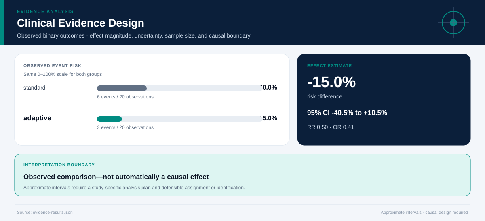

# Clinical Evidence Design

## Executive Summary

Observed **adverse_event_180d** risk was **15.0%** in adaptive and **30.0%** in standard. The risk difference was **-15.0%** (approximate 95% CI -40.5% to +10.5%).

## Key findings

| Estimand | Estimate | Approximate 95% CI |
|---|---:|---:|
| Risk difference | -0.150 | -0.405 to +0.105 |
| Risk ratio | 0.500 | 0.145 to 1.727 |
| Odds ratio | 0.412 | 0.087 to 1.952 |

## Continuous outcome

The mean difference in **health_score_change** was **+2.49** (95% CI +1.70 to +3.28).

## Time-to-event summary

| Group | Horizon | Survival | 95% CI |
|---|---:|---:|---:|
| standard | 180 | 70.0% | 49.9%–90.1% |
| adaptive | 180 | 85.0% | 69.4%–100.0% |

## Recommended next steps

1. Confirm whether assignment and identification support a causal estimand.
2. Reconcile missingness, follow-up, protocol deviations, and outcome definitions.
3. Pre-specify the study-specific model, multiplicity approach, and sensitivity analyses.

## Further questions

- Are the comparison groups exchangeable at baseline?
- Could censoring, missing outcomes, or measurement error change the effect estimate?
- Which subgroup effects are decision-relevant and sufficiently powered?

## Caveats and assumptions

- Rows received: 40
- Rows outside comparison groups: 0
- Missingness: {"followup_days": 0, "health_score_change": 0, "event": 0, "arm": 0, "adverse_event_180d": 0}
- Effect estimates are descriptive unless assignment and identification justify causal interpretation. Approximate intervals do not replace a study-specific analysis plan.
