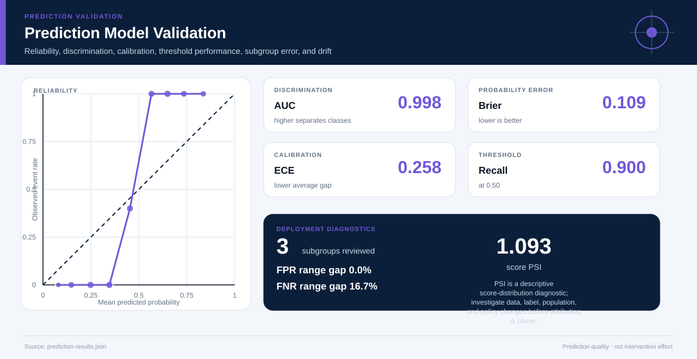

# Prediction Model Validation

## Executive Summary

The model's AUC is **0.998**, Brier score is **0.109**, and expected calibration error is **0.258** on **40 reviewed observations**.

## Key findings

| Threshold | Accuracy | Precision | Recall | Specificity | FPR | FNR |
|---:|---:|---:|---:|---:|---:|---:|
| 0.50 | 95.0% | 1.000 | 0.900 | 1.000 | 0.000 | 0.100 |

## Subgroup diagnostics

| Group | n | Prevalence | AUC | Brier | FPR | FNR |
|---|---:|---:|---:|---:|---:|---:|
| A | 14 | 42.9% | 1.000 | 0.077 | 0.000 | 0.000 |
| B | 12 | 50.0% | 1.000 | 0.111 | 0.000 | 0.167 |
| C | 14 | 57.1% | 1.000 | 0.141 | 0.000 | 0.125 |

## Drift diagnostic

Score-distribution PSI from **baseline** to **current** is **1.093**. Periods were ordered using `declared_lifecycle_order`. PSI is a descriptive score-distribution diagnostic; investigate data, label, population, and policy changes before attributing a cause.

## Recommended next steps

1. Select the operating threshold from explicit error costs, capacity, and contestability.
2. Investigate calibration, subgroup error, and drift before any deployment change.
3. Revalidate on a time- or source-separated dataset and define monitoring triggers.

## Further questions

- Is the validation sample independent of model development and threshold selection?
- Which subgroup error asymmetries are materially harmful in the decision context?
- What action follows a high score, and is that action itself causally beneficial?

## Caveats and assumptions

- This evaluates predictions, not intervention effects. Threshold choice must reflect error costs, capacity, subgroup impacts, and contestability.
- Missing label/score rows: 0
- Threshold validation: finite_closed_unit_interval
- Calibration bins: 10
- Period ordering: declared_lifecycle_order
- Validate on data separated in time or source from model development; this script does not certify independence or detect leakage automatically.
