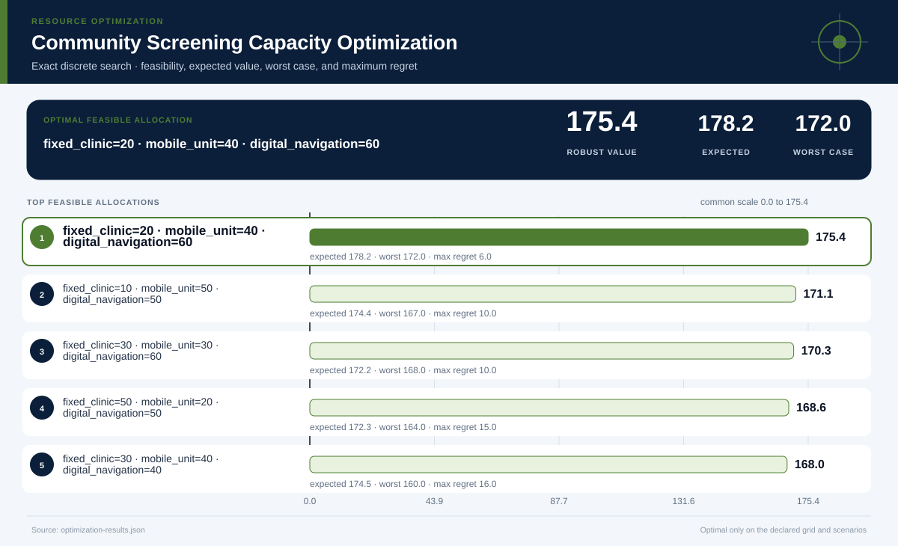

# Community Screening Capacity Optimization

## Executive Summary

The best allocation on the declared grid is **fixed_clinic=20 · mobile_unit=40 · digital_navigation=60**. It has robust value **175.4**, expected value **178.2**, and worst-case value **172.0**.

## Key findings

| Rank | Allocation | Robust value | Expected | Worst case | Maximum regret |
|---:|---|---:|---:|---:|---:|
| 1 | fixed_clinic=20 · mobile_unit=40 · digital_navigation=60 | 175.41 | 178.20 | 172.00 | 6.00 |
| 2 | fixed_clinic=10 · mobile_unit=50 · digital_navigation=50 | 171.07 | 174.40 | 167.00 | 10.00 |
| 3 | fixed_clinic=30 · mobile_unit=30 · digital_navigation=60 | 170.31 | 172.20 | 168.00 | 10.00 |
| 4 | fixed_clinic=50 · mobile_unit=20 · digital_navigation=50 | 168.56 | 172.30 | 164.00 | 15.00 |
| 5 | fixed_clinic=30 · mobile_unit=40 · digital_navigation=40 | 167.97 | 174.50 | 160.00 | 16.00 |
| 6 | fixed_clinic=20 · mobile_unit=40 · digital_navigation=50 | 165.52 | 168.40 | 162.00 | 14.00 |
| 7 | fixed_clinic=40 · mobile_unit=20 · digital_navigation=60 | 165.21 | 166.20 | 164.00 | 20.00 |
| 8 | fixed_clinic=40 · mobile_unit=30 · digital_navigation=40 | 162.43 | 168.50 | 155.00 | 21.00 |

## Recommended next steps

1. Validate resource coefficients and scenario values with domain owners.
2. Stress-test budgets, access rules, and the worst-case scenario before implementation.
3. Re-solve with a production optimizer if the decision becomes larger, nonlinear, or dynamic.

## Further questions

- Which omitted constraint could make the top allocation operationally infeasible?
- How sensitive is the result to scenario probabilities and risk aversion?
- Which affected group bears the largest opportunity cost?

## Caveats and assumptions

- Grid points evaluated: 294
- Feasible grid points: 84
- Optimality holds only on the declared discrete grid, linear coefficients, constraints, and scenarios. Validate coefficients and use a production solver for larger or nonlinear problems.
