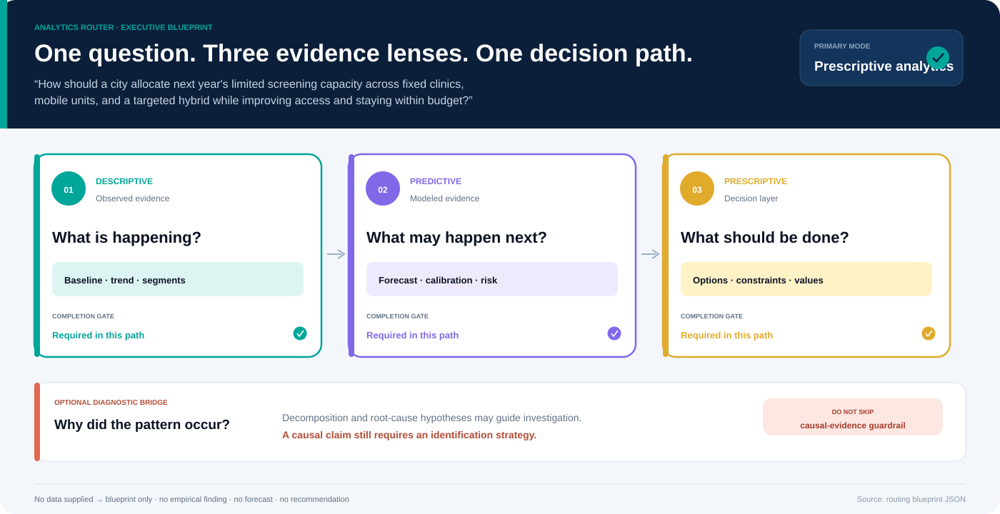

# Question-to-Analysis Blueprint

> **Question:** How should a city allocate next year's limited screening capacity across fixed clinics, mobile units, and a targeted hybrid while improving access and staying within budget?

## Routing decision

- **Primary mode:** Prescriptive analytics
- **Routing confidence:** high (clear cue lead)
- **Execution scope:** full
- **Execution order:** Descriptive analytics → Predictive analytics → Prescriptive analytics
- **Why:** Detected prescriptive analytics cues: “should”, “allocate”, “how should”.

> No dataset was supplied. This document is an analysis blueprint, not an empirical finding, forecast, or recommendation.

## 1. Descriptive analytics: What is happening, to whom, where, and over time?

**Role:** Establish a trustworthy baseline before modeling the future or recommending action.

| Component | Blueprint |
|---|---|
| Methods | Metric and denominator definition; Trend, cohort, segment, and distribution analysis; Missingness, representativeness, and outlier review; Observed group-gap and process-funnel description |
| Minimum data | Unit of analysis and population; Timestamp or period; Outcome, exposure, and denominator fields; Relevant segment or affected-group fields |
| Recommended visuals | KPI scorecard; Time trend; Distribution or funnel; Segment heatmap |
| Validity checks | Stable metric definitions and comparable periods; Complete denominators and explicit exclusions; No causal language from descriptive differences |

**Handoff:** Produces the baseline, segments, and evidence-quality constraints needed downstream.

## 2. Predictive analytics: What is likely to happen next, and how uncertain is it?

**Role:** Estimate future outcomes or scenario consequences without converting prediction into causation.

| Component | Blueprint |
|---|---|
| Methods | Naive and domain-relevant baseline comparison; Time-aware train, validation, and test design; Forecasting, risk modeling, or scenario simulation; Calibration and uncertainty-interval assessment |
| Minimum data | Defined target outcome and forecast horizon; Historical outcomes at the intended prediction grain; Predictors available at decision time; Intervention, policy, or external-scenario assumptions |
| Recommended visuals | Forecast with uncertainty band; Calibration or residual diagnostic; Error by segment; Scenario fan or risk distribution |
| Validity checks | Out-of-sample evaluation against a simple baseline; Leakage, drift, and temporal-order checks; Calibration and subgroup error review |

**Handoff:** Supplies outcome distributions and uncertainty for each feasible alternative or scenario.

## 3. Prescriptive analytics: What should be done—and how—under the stated objectives and constraints?

**Role:** Compare actions by combining evidence with explicit values, feasibility, risk, and distributional effects.

| Component | Blueprint |
|---|---|
| Methods | Alternative and status-quo definition; Multi-criteria value and hard-constraint modeling; Monte Carlo, scenario, tail-risk, and Pareto analysis; Weight sensitivity and affected-group review |
| Minimum data | Decision owner, alternatives, and time horizon; Objectives, weights, and fixed value scales; Budget, safety, legal, or operational constraints; Predicted or causal outcome distributions by alternative |
| Recommended visuals | Decision scorecard and ranking; Risk and uncertainty intervals; Scenario and sensitivity views; Group-impact diagnostics |
| Validity checks | Feasibility before ranking; Expected value shown beside tail risk; Prediction, causal evidence, and value judgments kept separate |

**Handoff:** Produces a recommendation, conditions for reversal, monitoring triggers, and next evidence.

## Optional diagnostic bridge: why did the pattern occur?

An optional bridge between description and prediction.

- Segment decomposition and contribution analysis
- Process or funnel diagnostics
- Hypothesis-driven root-cause checks
- Causal design only when intervention effects are claimed

**Guardrail:** A correlated driver is not automatically a cause. State the identification strategy before using causal language.

## Minimum input checklist

- [ ] Decision owner or intended reader
- [ ] Population, unit of analysis, geography, and time window
- [ ] Outcome definitions, denominators, and source provenance
- [ ] Prediction target and horizon, if forecasting is required
- [ ] Alternatives, constraints, and objectives, if a recommendation is required
- [ ] Affected groups and harms that averages may hide

## Evidence-to-decision contract

| Decision-model input | Required definition |
|---|---|
| Alternatives | At least a status quo and one actionable alternative |
| Criteria | Benefits, costs, risks, implementation, evidence quality, and material distributional outcomes |
| Constraints | Hard budget, safety, legal, capacity, or service thresholds |
| Scenarios | Plausible external states with transparent probabilities or non-probabilistic stress cases |
| Uncertainty | Outcome distributions or intervals, with dependence assumptions disclosed |
| Values | Stakeholder weights and fixed worst-to-best reference scales |

## Guardrails

- With no data, deliver a blueprint—not fabricated findings.
- Treat keyword routing as an auditable planning aid, not proof of user intent; revise the route when context contradicts it.
- A prediction estimates likely outcomes; it does not identify the effect of an intervention.
- Use causal language only with a defensible identification strategy.
- A prescriptive recommendation combines empirical evidence with explicit values and constraints.
- If required inputs are missing or every alternative is infeasible, state that no decision-ready recommendation exists.

*Generated by question router 1.1.1.*
