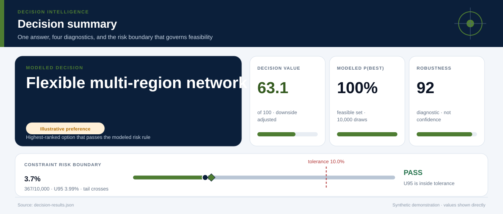
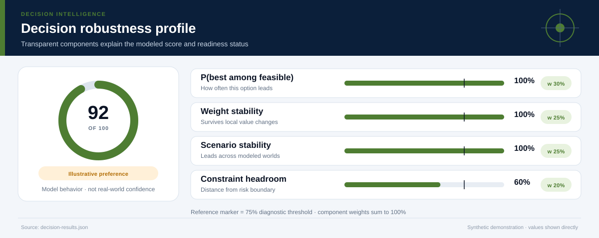
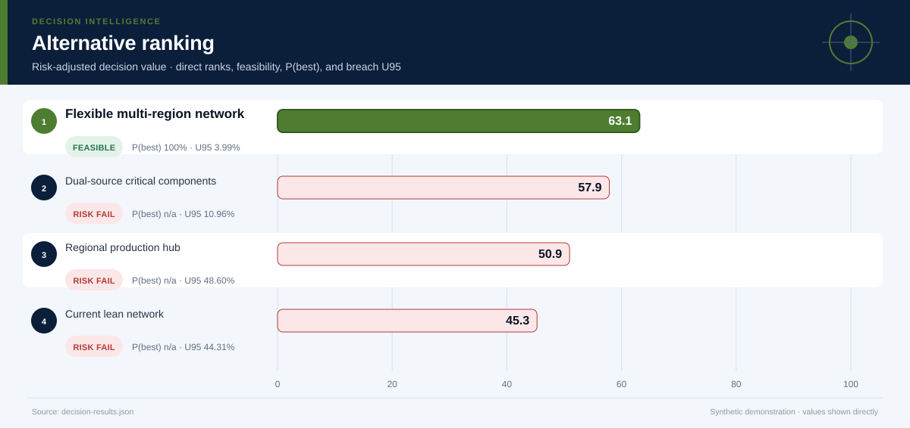
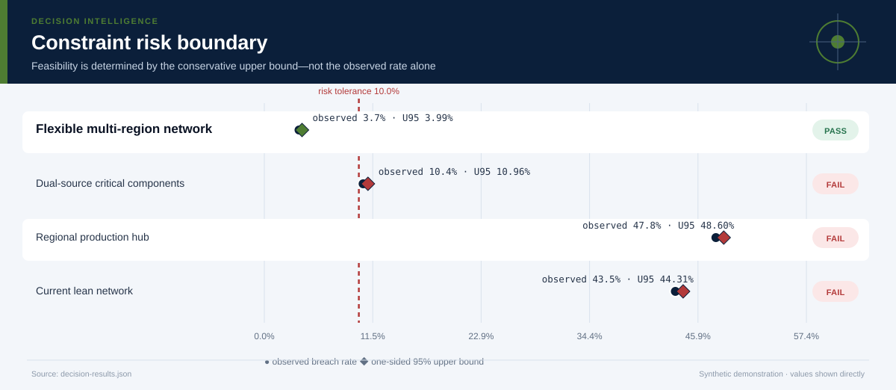
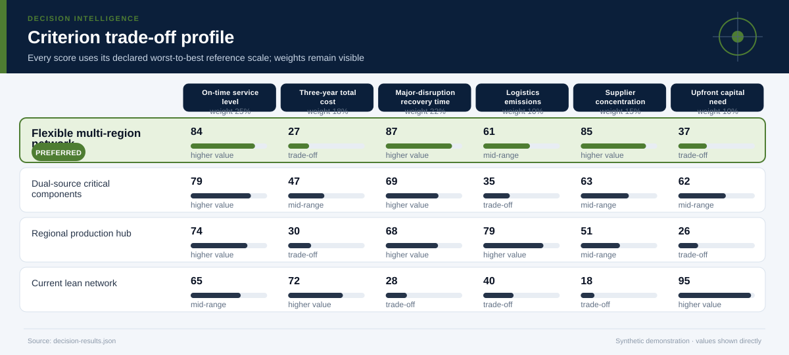
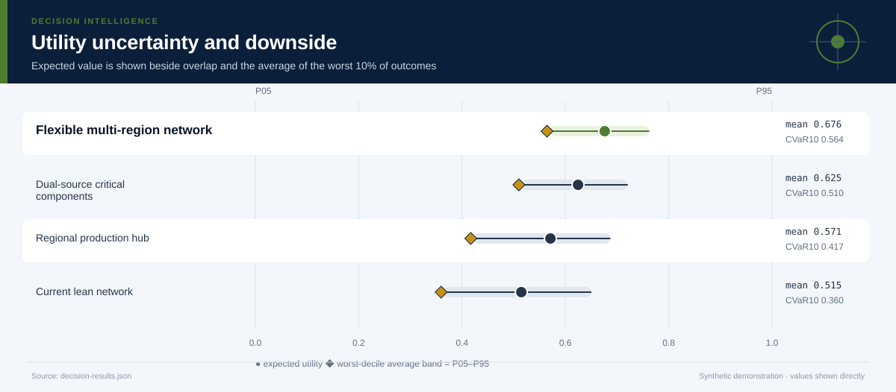
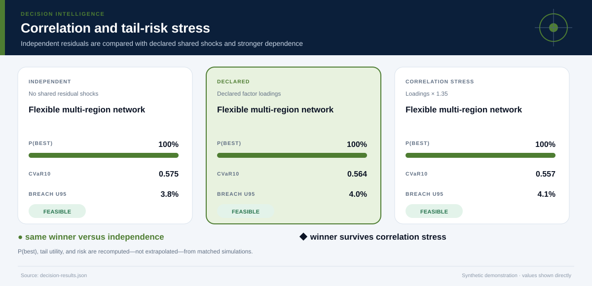
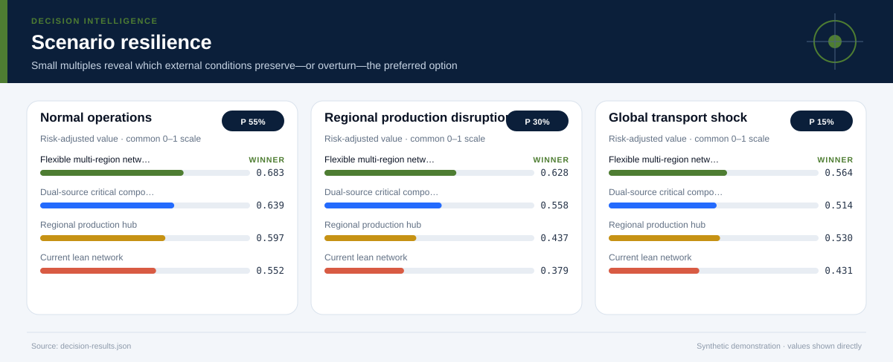
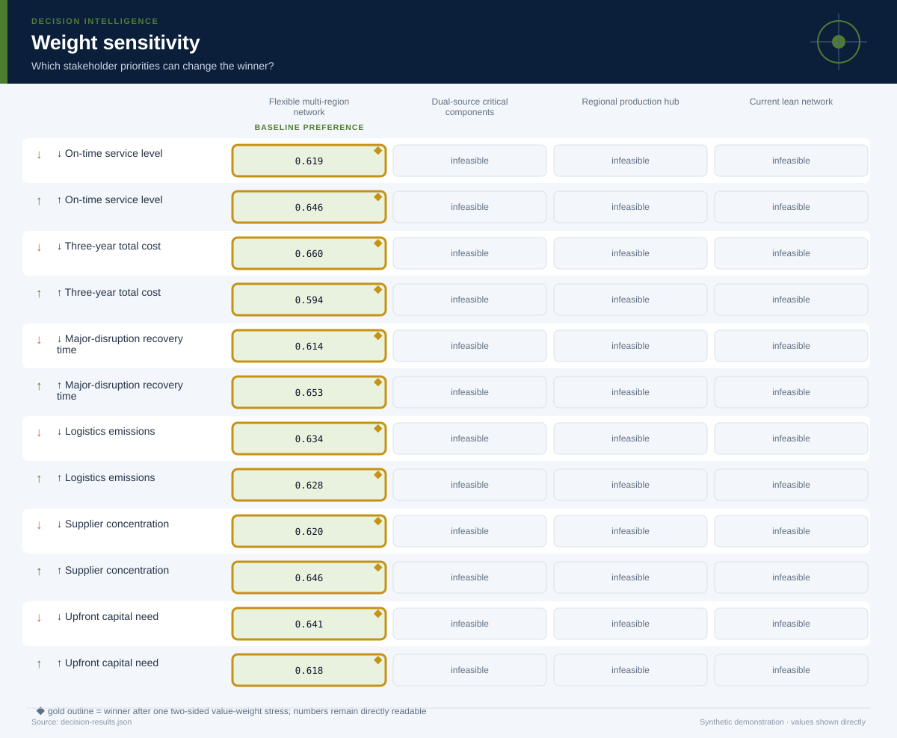

# Resilient Supply-Network Design

*Supply-chain operations research, systems engineering, risk analysis, and sustainable operations · 3 years · 10,000 modeled simulations*

## Executive Summary

- **Illustrative preference — Flexible multi-region network.** It is the highest-ranked feasible option, with decision value score **63.1/100** and a modeled **100% probability of being best among decision-feasible alternatives**.
- **The lead is meaningful rather than absolute.** It leads the next feasible option, Dual-source critical components, by **0.631 utility points**.
- **Modeled robustness is 92/100.** The option remains preferred in **100%** of two-sided weight stresses and **100%** of probability-weighted scenario comparisons.
- **Shared-shock sensitivity is explicit.** Relative to independent residuals, the declared factor model changes this option's P(best) by **+0.0%** and CVaR10 by **-0.010**; the ×1.35 loading stress does not change the modeled winner.
- **Constraint-breach evidence — 3.7% (367/10,000); U95 4.0%.** Feasibility uses the one-sided 95% upper bound against the **10.0% tolerance**; a zero event count is never presented as proof of zero real-world risk.
- **Decision status — Illustrative preference.** The current blockers are: evidence is not labeled for operational use.
- **Evidence boundary.** No causal claim; outcomes are scenario-based engineering estimates.
- **Parameter lineage.** 145/145 governed parameters have a resolved source and approval-chain reference.

**Decision owner:** Manufacturing network steering committee  
**Decision question:** Choose a three-year supply-network design that meets service and capital constraints while reducing disruption recovery time and concentration risk.

## Decision status and modeled robustness

**Status: Illustrative preference.** 7 of 8 configured readiness checks pass. The robustness score summarizes model behavior; it is not a posterior probability that the real-world decision is correct and cannot upgrade illustrative evidence into operational evidence.

## Flexible multi-region network leads on balanced value, not every dimension

**The preferred option earns its position through Logistics emissions, Supplier concentration.** The comparison still exposes a trade-off on **Upfront capital need**, so the decision should be presented as a transparent compromise rather than a universal optimum.

The ranking combines expected value with downside performance and excludes options whose one-sided 95% breach-frequency upper bound exceeds **10%**. Probability-best remains visible because a lower-ranked option may still win in a material share of simulations.

## The conservative risk boundary determines feasibility

**The decision rule compares the one-sided 95% breach-frequency upper bound—not only the observed simulation rate—with the 10.0% tolerance.** This makes finite-sample uncertainty visible and prevents a zero event count from being presented as proof of zero risk.

The dark circle is the observed breach rate; the diamond is its conservative upper bound. An option fails the modeled feasibility rule when that diamond crosses the red tolerance line. The test is conditional on the declared distributions and cannot cover omitted real-world hazards.

## The criterion profile reveals where the preferred option earns—and gives up—value

Each cell below places an outcome on its declared worst-to-best reference scale. This avoids recalibrating the chart around whichever alternatives happen to be present.

**The decision is therefore driven by an explicit value model.** A stakeholder who places substantially more weight on Upfront capital need may reasonably prefer another option; the two-sided weight-sensitivity section tests that possibility directly. The preferred option clips **1.2%** of criterion draws at the declared reference-scale bounds.

## Downside risk remains visible behind the average

**Flexible multi-region network has expected utility 0.676, but its worst-decile average falls to 0.564.** The widest criterion-level uncertainty for this option is associated with **Three-year total cost**, making it a priority for further evidence collection.

The interval chart prevents a precise-looking average from obscuring overlap among alternatives. A close overlap means the practical decision may depend more on constraints, reversibility, and the cost of learning than on a small utility difference.

## Shared shocks change the uncertainty question

**The declared factor model gives Flexible multi-region network P(best) 100%, versus 100% under independent residuals and 100% under the stronger correlation stress.** Its CVaR10 moves from 0.575 independently to 0.564 under declared dependence and 0.557 under stress.

The three states use matched seeds, stratified scenario counts, and the same marginal distributions. Differences therefore isolate the declared dependence structure as closely as this simulation design allows. The Gaussian copula remains an approximation: factor definitions, signs, and loadings must be replaced or approved using domain evidence.

## Scenario tests show when the preferred option is most exposed

**The weakest modeled environment is Global transport shock, where the preferred option's risk-adjusted utility is 0.564.** The same feasible alternative remains ahead in every modeled scenario.

The preferred option leads in **100%** of the probability-weighted scenario comparison. Scenario probabilities are assumptions, not forecasts with guaranteed calibration. They are useful because they reveal which external conditions deserve monitoring and which contingency plans should be prepared before implementation.

## Distributional effects remain an evidence gap

**No group-level outcomes were supplied for this case.** Before operational use, the analysis should add affected groups, absolute outcomes, disparity measures, and a qualitative review of harms that cannot be reduced to a numeric parity ratio.

## The result is stable to stakeholder priorities

**The baseline choice survives 100% of local weight stresses.** No single criterion emphasis changes the preferred feasible alternative.

This test both increases and decreases each criterion weight while preserving risk adjustment. It remains a local stress test rather than a substitute for formal stakeholder elicitation. If the winner changes under a plausible emphasis, the next step is deliberation and better evidence—not hiding the sensitivity.

## Recommended next steps

1. **Replace every synthetic input before any pilot or operational use.** Re-estimate outcomes from traceable descriptive, predictive, causal, financial, policy, or engineering evidence.
2. **Reduce uncertainty in Three-year total cost.** Replace the widest synthetic or elicited input with experimental, quasi-experimental, observational, or engineering evidence appropriate to the domain.
3. **Monitor the Global transport shock trigger.** Specify leading indicators and a contingency response before rollout.
4. **Review distributional impacts with affected stakeholders.** Examine absolute group outcomes alongside disparity measures and document unresolved normative choices.

## Further questions

- Which empirical or elicited evidence would best validate the declared factor loadings?
- Which omitted externality or stakeholder could materially alter the criterion set?
- What evidence would justify replacing the current scenario probabilities?
- Is the preferred option reversible if early monitoring contradicts the model?

## Caveats and assumptions

- **Evidence type:** Synthetic network simulation summaries and engineering estimates
- **Evidence as of:** Synthetic demonstration; no production as-of date
- **Permitted decision use:** illustrative
- **Causal status:** No causal claim; outcomes are scenario-based engineering estimates.
- **Dependence model:** latent_factor_gaussian_copula with 1 declared shared factor(s); the loading stress is ×1.35. Copula choice and loadings remain assumptions.
- **Parameter provenance:** 100% source coverage and 100% approval coverage for the declared decision use. Approval for illustrative use is not operational approval.
- **Zero-breach interpretation:** zero simulated events means either no event was observed in the finite run or the declared bounded input support excludes a breach. Neither statement establishes zero real-world risk.
- Supplier failures are not modeled with an explicit dependency network.
- Inventory policies are summarized inside each alternative.
- Emissions estimates omit supplier-capital construction.
- The Gaussian copula and factor loadings are synthetic assumptions; tail dependence may differ in real data and requires domain approval.

<strong>Detailed numerical appendix and reproducibility</strong>

### Ranked alternatives

| Rank | Alternative | Feasible | Value score | Expected utility | CVaR10 | P(best feasible) | P(best all) | Breach evidence | Feasible Pareto |
|---:|---|:---:|---:|---:|---:|---:|---:|---|:---:|
| 1 | Flexible multi-region network | Yes | 63.1 | 0.676 | 0.564 | 100.0% | 89.5% | 3.7% (367/10,000); U95 4.0% | Yes |
| 2 | Dual-source critical components | No | 57.9 | 0.625 | 0.510 | n/a | 7.2% | 10.4% (1,045/10,000); U95 11.0% | No |
| 3 | Regional production hub | No | 50.9 | 0.571 | 0.417 | n/a | 3.2% | 47.8% (4,778/10,000); U95 48.6% | No |
| 4 | Current lean network | No | 45.3 | 0.515 | 0.360 | n/a | 0.0% | 43.5% (4,349/10,000); U95 44.3% | No |

### Readiness checks

| Check | Result |
|---|:---:|
| Feasible Alternative | Pass |
| Probability Best | Pass |
| Weight Stability | Pass |
| Scenario Stability | Pass |
| Scale Clipping | Pass |
| Parameter Provenance | Pass |
| Approval Scope | Pass |
| Operational Evidence | Fail |

### Constraint diagnostics

| Alternative | Constraint | Events | Observed | U95 | Declared support | Mean signed margin | P05–P95 margin |
|---|---|---:|---:|---:|---|---:|---:|
| Flexible multi-region network | Customer-service requirement | 318/10,000 | 3.2% | 3.48% | 76–99.5; tail crosses threshold | 5.189 | 0.495–8.575 |
| Flexible multi-region network | Capital appropriation | 53/10,000 | 0.5% | 0.66% | 48–82; tail crosses threshold | 15.402 | 3.469–26.913 |
| Dual-source critical components | Customer-service requirement | 1,045/10,000 | 10.4% | 10.96% | 74–99; tail crosses threshold | 3.892 | -0.870–8.075 |
| Dual-source critical components | Capital appropriation | 0/10,000 | 0.0% | 0.03% | 28–55; excludes breach | 38.971 | 29.577–47.823 |
| Regional production hub | Customer-service requirement | 2,817/10,000 | 28.2% | 28.92% | 72–99; tail crosses threshold | 2.803 | -4.168–7.934 |
| Regional production hub | Capital appropriation | 2,763/10,000 | 27.6% | 28.37% | 58–94; tail crosses threshold | 4.609 | -7.884–16.553 |
| Current lean network | Customer-service requirement | 4,349/10,000 | 43.5% | 44.31% | 67–99; tail crosses threshold | 0.693 | -6.015–6.687 |
| Current lean network | Capital appropriation | 0/10,000 | 0.0% | 0.03% | 5–15; excludes breach | 70.355 | 66.763–73.566 |

### Criterion outcomes

#### Flexible multi-region network

| Criterion | Weight | Mean | P05–P95 | Normalized score | Scale clipping |
|---|---:|---:|---:|---:|---:|
| On-time service level | 25.0% | 95.2 percent | 90.5 percent–98.6 percent | 0.841 | 2.7% |
| Three-year total cost | 18.0% | 381.3 USD millions | 341.0 USD millions–428.6 USD millions | 0.273 | 4.5% |
| Major-disruption recovery time | 22.0% | 16.4 days | 10.1 days–23.6 days | 0.866 | 0.0% |
| Logistics emissions | 10.0% | 60.4 index points | 51.9 index points–70.0 index points | 0.610 | 0.0% |
| Supplier concentration | 15.0% | 2,565 HHI points | 2,107 HHI points–3,060 HHI points | 0.853 | 0.0% |
| Upfront capital need | 10.0% | 64.6 USD millions | 53.1 USD millions–76.5 USD millions | 0.373 | 0.0% |

#### Dual-source critical components

| Criterion | Weight | Mean | P05–P95 | Normalized score | Scale clipping |
|---|---:|---:|---:|---:|---:|
| On-time service level | 25.0% | 93.9 percent | 89.1 percent–98.1 percent | 0.787 | 0.0% |
| Three-year total cost | 18.0% | 344.9 USD millions | 311.9 USD millions–385.4 USD millions | 0.473 | 0.0% |
| Major-disruption recovery time | 22.0% | 31.4 days | 22.2 days–41.9 days | 0.689 | 0.0% |
| Logistics emissions | 10.0% | 77.4 index points | 68.6 index points–87.6 index points | 0.347 | 0.0% |
| Supplier concentration | 15.0% | 3,731 HHI points | 3,235 HHI points–4,246 HHI points | 0.629 | 0.0% |
| Upfront capital need | 10.0% | 41.0 USD millions | 32.2 USD millions–50.4 USD millions | 0.621 | 0.0% |

#### Regional production hub

| Criterion | Weight | Mean | P05–P95 | Normalized score | Scale clipping |
|---|---:|---:|---:|---:|---:|
| On-time service level | 25.0% | 92.8 percent | 85.8 percent–97.9 percent | 0.742 | 0.0% |
| Three-year total cost | 18.0% | 376.4 USD millions | 336.6 USD millions–424.3 USD millions | 0.300 | 3.0% |
| Major-disruption recovery time | 22.0% | 31.9 days | 19.9 days–52.1 days | 0.683 | 0.0% |
| Logistics emissions | 10.0% | 48.9 index points | 40.9 index points–57.5 index points | 0.786 | 0.0% |
| Supplier concentration | 15.0% | 4,335 HHI points | 3,835 HHI points–4,855 HHI points | 0.512 | 0.0% |
| Upfront capital need | 10.0% | 75.4 USD millions | 63.4 USD millions–87.9 USD millions | 0.259 | 0.0% |

#### Current lean network

| Criterion | Weight | Mean | P05–P95 | Normalized score | Scale clipping |
|---|---:|---:|---:|---:|---:|
| On-time service level | 25.0% | 90.7 percent | 84.0 percent–96.7 percent | 0.654 | 0.0% |
| Three-year total cost | 18.0% | 301.2 USD millions | 271.5 USD millions–337.3 USD millions | 0.716 | 0.0% |
| Major-disruption recovery time | 22.0% | 68.7 days | 45.2 days–107.8 days | 0.277 | 16.6% |
| Logistics emissions | 10.0% | 74.3 index points | 65.7 index points–84.3 index points | 0.396 | 0.0% |
| Supplier concentration | 15.0% | 6,072 HHI points | 5,484 HHI points–6,647 HHI points | 0.179 | 0.0% |
| Upfront capital need | 10.0% | 9.645 USD millions | 6.434 USD millions–13.2 USD millions | 0.951 | 0.0% |

### Correlation sensitivity

| Dependence state | Modeled winner | Recommended option P(best) | CVaR10 | Breach U95 |
|---|---|---:|---:|---:|
| Independent residuals | Flexible multi-region network | 100.0% | 0.575 | 3.79% |
| Declared factor model | Flexible multi-region network | 100.0% | 0.564 | 3.99% |
| Loading stress ×1.35 | Flexible multi-region network | 100.0% | 0.557 | 4.08% |

### Parameter provenance and approval

Coverage: **145/145 parameters sourced** and **145/145 approved for the declared use**. Every expanded JSON path is recorded in `decision-results.json` under `parameter_provenance.records`.

| Source ID | Source type | Owner | Approved uses | Approval chain |
|---|---|---|---|---|
| `supply-chain-resilience-synthetic-parameter-register` | synthetic_demonstration_register | Repository maintainer (synthetic example) | illustrative | 1. case_author (approved) → 2. independent_domain_reviewer (not_obtained) |
### Sources and reproducibility

- Illustrative supplier lead-time history
- Synthetic disruption scenarios
- Hypothetical lifecycle-cost and emissions estimates
- Engine version: `5.0.0`
- Samples: `10000`
- Random seed: `20260726`
- Sampling design: Stratified scenario allocation with a declared latent-factor Gaussian copula, shared shocks across alternatives, marginal-preserving inverse transforms, and matched independent/correlation-stress counterfactuals.
- Case SHA-256: `6bc6d540463a45ba49148ee99aa245f376dd4611eda9aabbd1ca524795c19bfc`

### Decision notes

- A production model should include network topology, correlated failures, inventory optimization, and recovery policies.
- Worker and supplier-community impacts should be added before deployment.

> Synthetic demonstration only. This report is not medical, financial, legal, engineering-safety, or public-policy advice.
