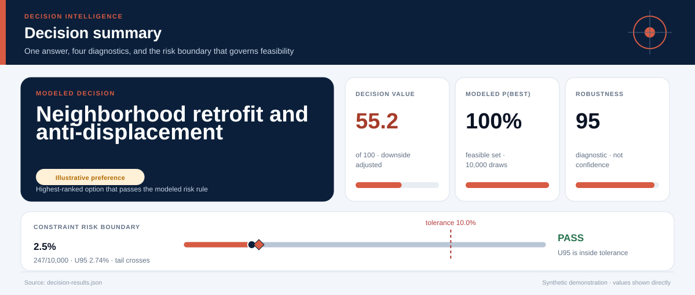
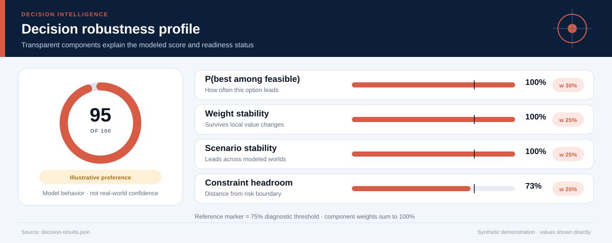
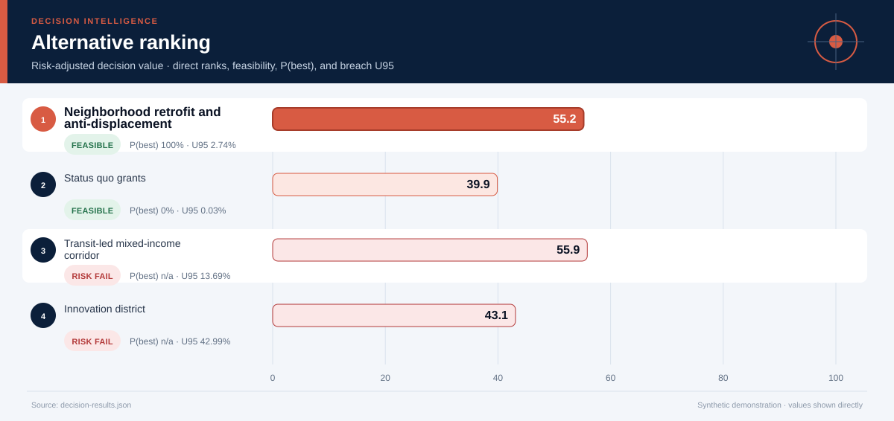
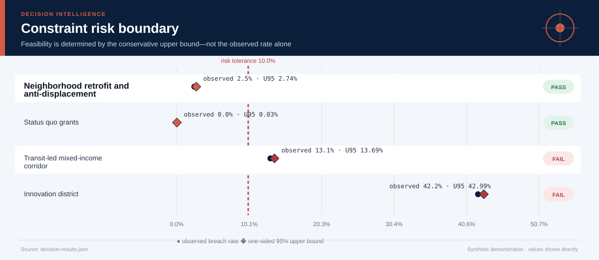
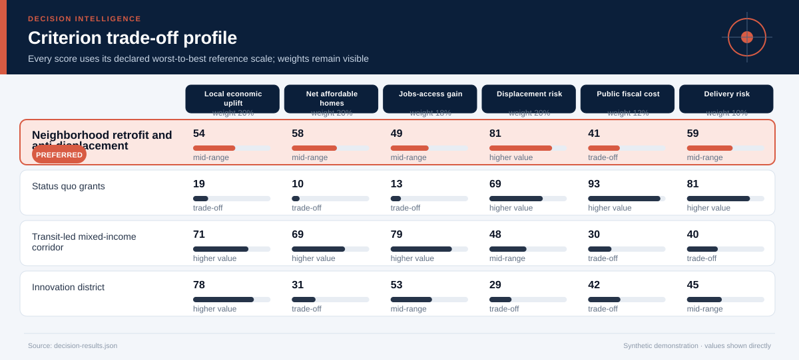
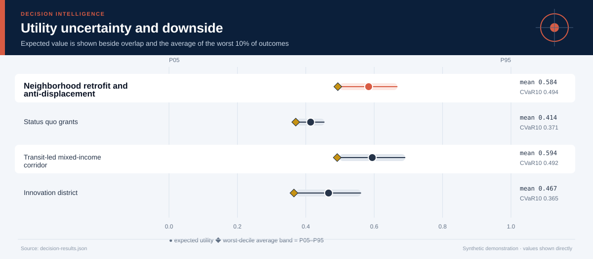
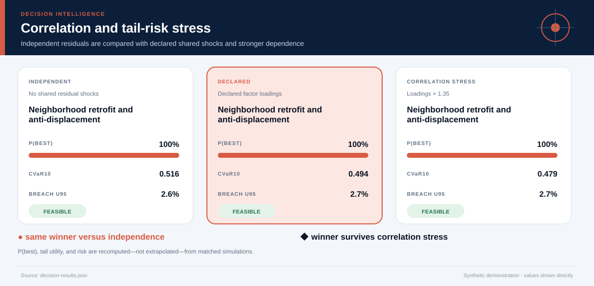
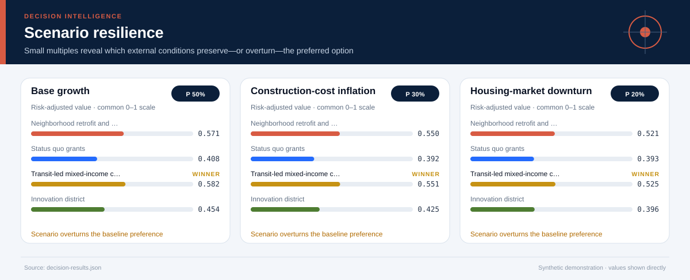
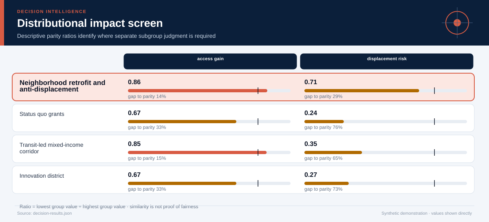
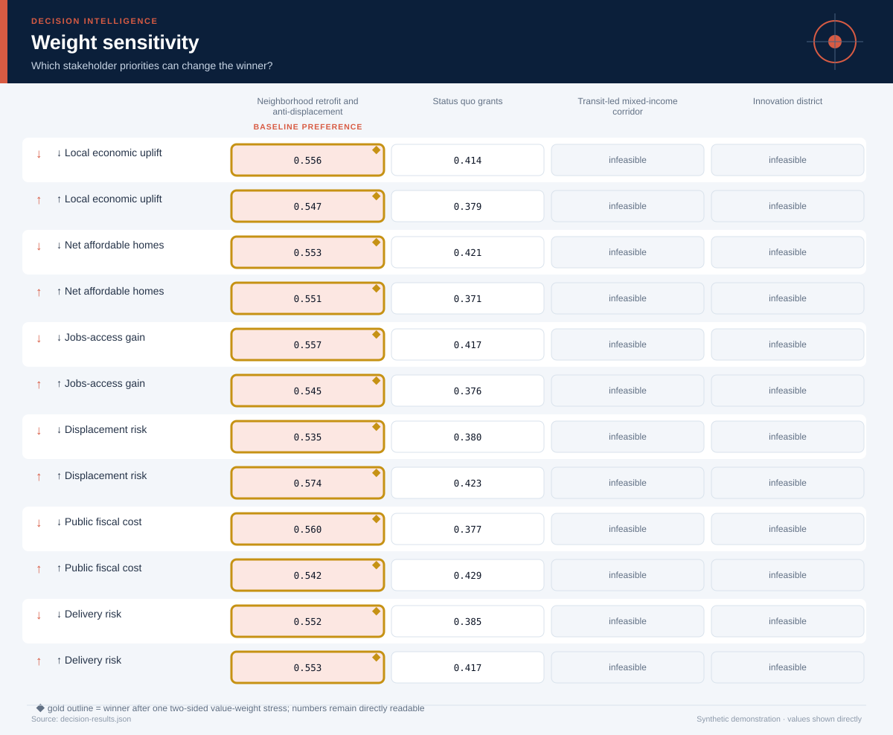

# Inclusive Urban Regeneration Strategy

*Urban planning, place-based policy, systems analysis, and public finance · 5 years · 10,000 modeled simulations*

## Executive Summary

- **Illustrative preference — Neighborhood retrofit and anti-displacement.** It is the highest-ranked feasible option, with decision value score **55.2/100** and a modeled **100% probability of being best among decision-feasible alternatives**.
- **The lead is meaningful rather than absolute.** It leads the next feasible option, Status quo grants, by **0.153 utility points**.
- **Modeled robustness is 95/100.** The option remains preferred in **100%** of two-sided weight stresses and **100%** of probability-weighted scenario comparisons.
- **Shared-shock sensitivity is explicit.** Relative to independent residuals, the declared factor model changes this option's P(best) by **+0.0%** and CVaR10 by **-0.022**; the ×1.35 loading stress does not change the modeled winner.
- **Constraint-breach evidence — 2.5% (247/10,000); U95 2.7%.** Feasibility uses the one-sided 95% upper bound against the **10.0% tolerance**; a zero event count is never presented as proof of zero real-world risk.
- **Decision status — Illustrative preference.** The current blockers are: evidence is not labeled for operational use.
- **Evidence boundary.** No causal claim; economic and displacement effects are modeled planning assumptions.
- **Parameter lineage.** 138/138 governed parameters have a resolved source and approval-chain reference.

**Decision owner:** Metropolitan regeneration authority  
**Decision question:** Choose a five-year regeneration strategy that improves access and economic opportunity without exceeding fiscal or displacement-risk tolerances.

## Decision status and modeled robustness

**Status: Illustrative preference.** 7 of 8 configured readiness checks pass. The robustness score summarizes model behavior; it is not a posterior probability that the real-world decision is correct and cannot upgrade illustrative evidence into operational evidence.

## Neighborhood retrofit and anti-displacement leads on balanced value, not every dimension

**The preferred option earns its position through Net affordable homes, Jobs-access gain.** The comparison still exposes a trade-off on **Public fiscal cost**, so the decision should be presented as a transparent compromise rather than a universal optimum.

The ranking combines expected value with downside performance and excludes options whose one-sided 95% breach-frequency upper bound exceeds **10%**. Probability-best remains visible because a lower-ranked option may still win in a material share of simulations.

## The conservative risk boundary determines feasibility

**The decision rule compares the one-sided 95% breach-frequency upper bound—not only the observed simulation rate—with the 10.0% tolerance.** This makes finite-sample uncertainty visible and prevents a zero event count from being presented as proof of zero risk.

The dark circle is the observed breach rate; the diamond is its conservative upper bound. An option fails the modeled feasibility rule when that diamond crosses the red tolerance line. The test is conditional on the declared distributions and cannot cover omitted real-world hazards.

## The criterion profile reveals where the preferred option earns—and gives up—value

Each cell below places an outcome on its declared worst-to-best reference scale. This avoids recalibrating the chart around whichever alternatives happen to be present.

**The decision is therefore driven by an explicit value model.** A stakeholder who places substantially more weight on Public fiscal cost may reasonably prefer another option; the two-sided weight-sensitivity section tests that possibility directly. The preferred option clips **0.0%** of criterion draws at the declared reference-scale bounds.

## Downside risk remains visible behind the average

**Neighborhood retrofit and anti-displacement has expected utility 0.584, but its worst-decile average falls to 0.494.** The widest criterion-level uncertainty for this option is associated with **Local economic uplift**, making it a priority for further evidence collection.

The interval chart prevents a precise-looking average from obscuring overlap among alternatives. A close overlap means the practical decision may depend more on constraints, reversibility, and the cost of learning than on a small utility difference.

## Shared shocks change the uncertainty question

**The declared factor model gives Neighborhood retrofit and anti-displacement P(best) 100%, versus 100% under independent residuals and 100% under the stronger correlation stress.** Its CVaR10 moves from 0.516 independently to 0.494 under declared dependence and 0.479 under stress.

The three states use matched seeds, stratified scenario counts, and the same marginal distributions. Differences therefore isolate the declared dependence structure as closely as this simulation design allows. The Gaussian copula remains an approximation: factor definitions, signs, and loadings must be replaced or approved using domain evidence.

## Scenario tests show when the preferred option is most exposed

**The weakest modeled environment is Housing-market downturn, where the preferred option's risk-adjusted utility is 0.521.** The same feasible alternative remains ahead in every modeled scenario.

The preferred option leads in **100%** of the probability-weighted scenario comparison. Scenario probabilities are assumptions, not forecasts with guaranteed calibration. They are useful because they reveal which external conditions deserve monitoring and which contingency plans should be prepared before implementation.

## Distributional effects require a separate judgment

**Average utility does not establish equitable impact.** The weakest descriptive parity ratio is **0.71** for **displacement risk**, between New residents and Long-term renters. The ratios below are descriptive diagnostics; they cannot resolve questions about rights, need, historical disadvantage, or acceptable error asymmetry.

Use the visual to locate disparities that require subgroup analysis and stakeholder review. Do not optimize the ratios mechanically or treat similarity as proof of fairness.

## The result is stable to stakeholder priorities

**The baseline choice survives 100% of local weight stresses.** No single criterion emphasis changes the preferred feasible alternative.

This test both increases and decreases each criterion weight while preserving risk adjustment. It remains a local stress test rather than a substitute for formal stakeholder elicitation. If the winner changes under a plausible emphasis, the next step is deliberation and better evidence—not hiding the sensitivity.

## Recommended next steps

1. **Replace every synthetic input before any pilot or operational use.** Re-estimate outcomes from traceable descriptive, predictive, causal, financial, policy, or engineering evidence.
2. **Reduce uncertainty in Local economic uplift.** Replace the widest synthetic or elicited input with experimental, quasi-experimental, observational, or engineering evidence appropriate to the domain.
3. **Monitor the Housing-market downturn trigger.** Specify leading indicators and a contingency response before rollout.
4. **Review distributional impacts with affected stakeholders.** Examine absolute group outcomes alongside disparity measures and document unresolved normative choices.

## Further questions

- Which empirical or elicited evidence would best validate the declared factor loadings?
- Which omitted externality or stakeholder could materially alter the criterion set?
- What evidence would justify replacing the current scenario probabilities?
- Is the preferred option reversible if early monitoring contradicts the model?

## Caveats and assumptions

- **Evidence type:** Synthetic spatial-policy appraisal and scenario assumptions
- **Evidence as of:** Synthetic demonstration; no production as-of date
- **Permitted decision use:** illustrative
- **Causal status:** No causal claim; economic and displacement effects are modeled planning assumptions.
- **Dependence model:** latent_factor_gaussian_copula with 1 declared shared factor(s); the loading stress is ×1.35. Copula choice and loadings remain assumptions.
- **Parameter provenance:** 100% source coverage and 100% approval coverage for the declared decision use. Approval for illustrative use is not operational approval.
- **Zero-breach interpretation:** zero simulated events means either no event was observed in the finite run or the declared bounded input support excludes a breach. Neither statement establishes zero real-world risk.
- Spatial spillovers across neighboring districts are simplified.
- Distributional outcomes are represented with three community groups.
- Delivery timelines do not include litigation or permitting appeals.
- The Gaussian copula and factor loadings are synthetic assumptions; tail dependence may differ in real data and requires domain approval.

<strong>Detailed numerical appendix and reproducibility</strong>

### Ranked alternatives

| Rank | Alternative | Feasible | Value score | Expected utility | CVaR10 | P(best feasible) | P(best all) | Breach evidence | Feasible Pareto |
|---:|---|:---:|---:|---:|---:|---:|---:|---|:---:|
| 1 | Neighborhood retrofit and anti-displacement | Yes | 55.2 | 0.584 | 0.494 | 100.0% | 40.8% | 2.5% (247/10,000); U95 2.7% | Yes |
| 2 | Status quo grants | Yes | 39.9 | 0.414 | 0.371 | 0.0% | 0.0% | 0/10,000 observed; U95 0.03%; declared support excludes breach | Yes |
| 3 | Transit-led mixed-income corridor | No | 55.9 | 0.594 | 0.492 | n/a | 59.1% | 13.1% (1,312/10,000); U95 13.7% | No |
| 4 | Innovation district | No | 43.1 | 0.467 | 0.365 | n/a | 0.0% | 42.2% (4,218/10,000); U95 43.0% | No |

### Readiness checks

| Check | Result |
|---|:---:|
| Feasible Alternative | Pass |
| Probability Best | Pass |
| Weight Stability | Pass |
| Scenario Stability | Pass |
| Scale Clipping | Pass |
| Parameter Provenance | Pass |
| Approval Scope | Pass |
| Operational Evidence | Fail |

### Constraint diagnostics

| Alternative | Constraint | Events | Observed | U95 | Declared support | Mean signed margin | P05–P95 margin |
|---|---|---:|---:|---:|---|---:|---:|
| Neighborhood retrofit and anti-displacement | Five-year public funding envelope | 247/10,000 | 2.5% | 2.74% | 180–397; tail crosses threshold | 85.548 | 12.608–144.460 |
| Neighborhood retrofit and anti-displacement | Community displacement tolerance | 0/10,000 | 0.0% | 0.03% | 10–30; excludes breach | 40.706 | 33.592–47.109 |
| Status quo grants | Five-year public funding envelope | 0/10,000 | 0.0% | 0.03% | 45–96; excludes breach | 284.526 | 266.834–298.726 |
| Status quo grants | Community displacement tolerance | 0/10,000 | 0.0% | 0.03% | 18–40; excludes breach | 31.714 | 23.815–38.898 |
| Transit-led mixed-income corridor | Five-year public funding envelope | 1,304/10,000 | 13.0% | 13.60% | 230–420; tail crosses threshold | 44.530 | -26.401–97.775 |
| Transit-led mixed-income corridor | Community displacement tolerance | 11/10,000 | 0.1% | 0.18% | 29–61; tail crosses threshold | 15.934 | 4.429–26.558 |
| Innovation district | Five-year public funding envelope | 304/10,000 | 3.0% | 3.34% | 170–396; tail crosses threshold | 88.320 | 12.527–151.451 |
| Innovation district | Community displacement tolerance | 4,093/10,000 | 40.9% | 41.74% | 43–75; tail crosses threshold | 1.452 | -9.724–12.248 |

### Criterion outcomes

#### Neighborhood retrofit and anti-displacement

| Criterion | Weight | Mean | P05–P95 | Normalized score | Scale clipping |
|---|---:|---:|---:|---:|---:|
| Local economic uplift | 20.0% | 54.5 index points | 35.7 index points–71.7 index points | 0.545 | 0.0% |
| Net affordable homes | 20.0% | 1,455 homes | 1,061 homes–1,891 homes | 0.582 | 0.0% |
| Jobs-access gain | 18.0% | 19.6 index points | 15.0 index points–24.6 index points | 0.491 | 0.0% |
| Displacement risk | 20.0% | 19.3 index points | 12.9 index points–26.4 index points | 0.809 | 0.0% |
| Public fiscal cost | 12.0% | 264.5 USD millions | 205.5 USD millions–337.4 USD millions | 0.409 | 0.0% |
| Delivery risk | 10.0% | 38.7 index points | 28.5 index points–49.9 index points | 0.590 | 0.0% |

#### Status quo grants

| Criterion | Weight | Mean | P05–P95 | Normalized score | Scale clipping |
|---|---:|---:|---:|---:|---:|
| Local economic uplift | 20.0% | 19.4 index points | 12.5 index points–26.6 index points | 0.194 | 0.0% |
| Net affordable homes | 20.0% | 251.7 homes | 154.4 homes–360.1 homes | 0.101 | 0.0% |
| Jobs-access gain | 18.0% | 5.32 index points | 3.013 index points–7.812 index points | 0.133 | 0.0% |
| Displacement risk | 20.0% | 28.3 index points | 21.1 index points–36.2 index points | 0.690 | 0.0% |
| Public fiscal cost | 12.0% | 65.5 USD millions | 51.3 USD millions–83.2 USD millions | 0.933 | 0.0% |
| Delivery risk | 10.0% | 23.0 index points | 15.3 index points–32.6 index points | 0.814 | 0.0% |

#### Transit-led mixed-income corridor

| Criterion | Weight | Mean | P05–P95 | Normalized score | Scale clipping |
|---|---:|---:|---:|---:|---:|
| Local economic uplift | 20.0% | 71.4 index points | 47.8 index points–93.2 index points | 0.714 | 0.0% |
| Net affordable homes | 20.0% | 1,716 homes | 1,309 homes–2,146 homes | 0.687 | 0.0% |
| Jobs-access gain | 18.0% | 31.6 index points | 26.5 index points–37.0 index points | 0.791 | 0.1% |
| Displacement risk | 20.0% | 44.1 index points | 33.4 index points–55.6 index points | 0.479 | 0.0% |
| Public fiscal cost | 12.0% | 305.5 USD millions | 252.2 USD millions–376.4 USD millions | 0.301 | 0.0% |
| Delivery risk | 10.0% | 52.1 index points | 39.9 index points–64.9 index points | 0.399 | 0.0% |

#### Innovation district

| Criterion | Weight | Mean | P05–P95 | Normalized score | Scale clipping |
|---|---:|---:|---:|---:|---:|
| Local economic uplift | 20.0% | 78.5 index points | 51.7 index points–100.0 index points | 0.785 | 0.0% |
| Net affordable homes | 20.0% | 764.6 homes | 533.1 homes–1,017 homes | 0.306 | 0.0% |
| Jobs-access gain | 18.0% | 21.4 index points | 15.5 index points–27.2 index points | 0.534 | 0.0% |
| Displacement risk | 20.0% | 58.5 index points | 47.8 index points–69.7 index points | 0.286 | 0.0% |
| Public fiscal cost | 12.0% | 261.7 USD millions | 198.5 USD millions–337.5 USD millions | 0.417 | 0.0% |
| Delivery risk | 10.0% | 48.5 index points | 35.9 index points–61.7 index points | 0.451 | 0.0% |

### Correlation sensitivity

| Dependence state | Modeled winner | Recommended option P(best) | CVaR10 | Breach U95 |
|---|---|---:|---:|---:|
| Independent residuals | Neighborhood retrofit and anti-displacement | 100.0% | 0.516 | 2.63% |
| Declared factor model | Neighborhood retrofit and anti-displacement | 100.0% | 0.494 | 2.74% |
| Loading stress ×1.35 | Neighborhood retrofit and anti-displacement | 100.0% | 0.479 | 2.71% |

### Parameter provenance and approval

Coverage: **138/138 parameters sourced** and **138/138 approved for the declared use**. Every expanded JSON path is recorded in `decision-results.json` under `parameter_provenance.records`.

| Source ID | Source type | Owner | Approved uses | Approval chain |
|---|---|---|---|---|
| `urban-regeneration-synthetic-parameter-register` | synthetic_demonstration_register | Repository maintainer (synthetic example) | illustrative | 1. case_author (approved) → 2. independent_domain_reviewer (not_obtained) |
### Sources and reproducibility

- Illustrative parcel and transit accessibility summaries
- Synthetic housing-market forecast
- Hypothetical community consultation priorities
- Engine version: `5.0.0`
- Samples: `10000`
- Random seed: `20260726`
- Sampling design: Stratified scenario allocation with a declared latent-factor Gaussian copula, shared shocks across alternatives, marginal-preserving inverse transforms, and matched independent/correlation-stress counterfactuals.
- Case SHA-256: `4b3c0015fa1a93c1e437f80bf16716007c1a4719fe8f5ed997f52afd99745b7f`

### Decision notes

- A real plan should use parcel-level and travel-time analysis and publish neighborhood distributional results.
- Community preferences should influence weights through a documented deliberative process.

> Synthetic demonstration only. This report is not medical, financial, legal, engineering-safety, or public-policy advice.
